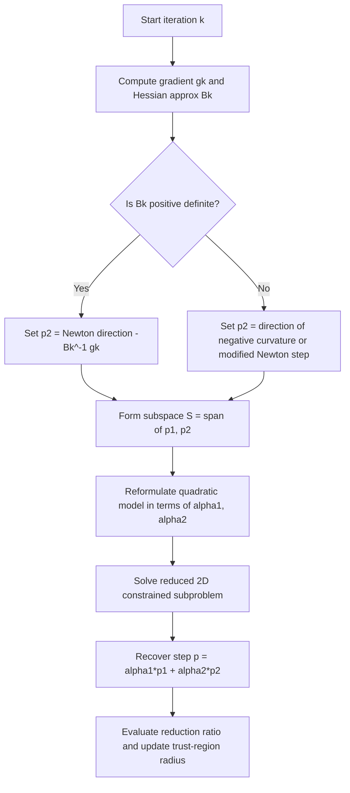

## Two-Dimensional Subspace Minimization

### Overview

Two-dimensional subspace minimization is a trust-region strategy that approximates the solution to the trust-region subproblem by restricting the search to a two-dimensional subspace spanned by the steepest descent direction and an approximate Newton direction. It sits between the computational cheapness of the Cauchy point method and the full accuracy of an exact trust-region solve, offering a practical middle ground for constrained quadratic model minimization.

### The Trust-Region Subproblem

At each iteration, the algorithm minimizes a quadratic model $m_k(p)$ of the objective function within a bounded region:

$$\min_{p} ; m_k(p) = f_k + g_k^T p + \frac{1}{2} p^T B_k p \quad \text{subject to} \quad |p| \leq \Delta_k$$

where $g_k$ is the gradient, $B_k$ is a Hessian approximation, and $\Delta_k$ is the trust-region radius. Solving this exactly requires iterative procedures on a secular equation, which can be expensive when repeated at every iteration. Two-dimensional subspace minimization avoids this cost by narrowing the search space.

### Construction of the Subspace

The method restricts $p$ to lie in the subspace spanned by:

- $p_1 = -g_k$ (the steepest descent direction)
- $p_2 = -B_k^{-1} g_k$ (the Newton direction, when $B_k$ is positive definite)

When $B_k$ is not positive definite, the Newton direction is replaced with a direction of negative curvature or a modified Newton step, since $B_k^{-1}$ may not exist or may not produce a descent direction.

The subspace is written as:

$$S = \text{span}{p_1, p_2}$$

**Key Points**

- The subspace is at most two-dimensional, so the constrained subproblem reduces to a small, cheap optimization.
- This subspace always contains the steepest descent direction, guaranteeing at least Cauchy-point-level progress.
- When $B_k$ is positive definite and the unconstrained (full) Newton step lies inside the trust region, the method recovers the full Newton step exactly.

### Reformulating the Subproblem

Any point in the subspace can be written as:

$$p = \alpha_1 p_1 + \alpha_2 p_2$$

Substituting into $m_k(p)$ produces a two-variable quadratic in $(\alpha_1, \alpha_2)$, and the constraint $|p| \leq \Delta_k$ becomes an ellipse or circle (depending on basis orthogonality) in the $(\alpha_1, \alpha_2)$ plane. The reduced problem is:

$$\min_{\alpha_1, \alpha_2} ; \tilde{m}_k(\alpha_1, \alpha_2) \quad \text{subject to} \quad |\alpha_1 p_1 + \alpha_2 p_2| \leq \Delta_k$$

This low-dimensional problem can be solved essentially exactly using closed-form or simple numerical techniques, since it involves only two scalar unknowns rather than the full dimensionality of the original problem.

### Geometric Interpretation

<svg viewBox="0 0 640 460" xmlns="http://www.w3.org/2000/svg" font-family="sans-serif"> <text x="320" y="30" text-anchor="middle" font-size="18" font-weight="bold" fill="#1a1a1a">Two-Dimensional Subspace Minimization (svg_diagram)</text> <!-- Trust region circle --> <circle cx="320" cy="250" r="150" fill="#eef4fb" stroke="#4a6fa5" stroke-width="2"/> <text x="320" y="90" text-anchor="middle" font-size="13" fill="#4a6fa5">Trust Region Boundary (‖p‖ = Δk)</text> <!-- Center point --> <circle cx="320" cy="250" r="4" fill="#1a1a1a"/> <text x="332" y="245" font-size="12" fill="#1a1a1a">xk</text> <!-- Steepest descent direction --> <line x1="320" y1="250" x2="200" y2="150" stroke="#d9534f" stroke-width="3" marker-end="url(#arrow1)"/> <text x="165" y="135" font-size="13" fill="#d9534f" font-weight="bold">p1 (steepest descent)</text> <!-- Newton direction --> <line x1="320" y1="250" x2="450" y2="330" stroke="#5cb85c" stroke-width="3" marker-end="url(#arrow2)"/> <text x="455" y="350" font-size="13" fill="#5cb85c" font-weight="bold">p2 (Newton direction)</text> <!-- Subspace shading --> <polygon points="320,250 200,150 450,330" fill="#f4d35e" fill-opacity="0.25" stroke="none"/> <text x="330" y="200" font-size="12" fill="#8a6d1a" font-style="italic">2D subspace S</text> <!-- Optimal point in subspace --> <circle cx="260" cy="200" r="6" fill="#3a3a3a"/> <text x="200" y="195" font-size="12" fill="#3a3a3a">p* (constrained minimizer in S)</text> <!-- Arrow defs --> <defs> <marker id="arrow1" markerWidth="10" markerHeight="10" refX="6" refY="3" orient="auto" markerUnits="strokeWidth"> <path d="M0,0 L0,6 L9,3 z" fill="#d9534f"/> </marker> <marker id="arrow2" markerWidth="10" markerHeight="10" refX="6" refY="3" orient="auto" markerUnits="strokeWidth"> <path d="M0,0 L0,6 L9,3 z" fill="#5cb85c"/> </marker> </defs> </svg>

### Algorithmic Procedure

### Solving the Reduced Problem

Because the reduced problem has only two decision variables, several tractable approaches apply:

- **Direct enumeration of cases**: Check whether the unconstrained minimizer within the subspace already satisfies $|p| \leq \Delta_k$; if so, that is the answer. If not, the solution lies on the boundary and a 1-D root-finding problem (analogous to the secular equation, but restricted to two dimensions) is solved.
- **Parametrization by angle**: Since the constraint set is an ellipse, the boundary can be parametrized and the objective minimized over the parameter numerically.
- **Small linear algebra**: The reduced Hessian is a $2\times 2$ matrix, so eigen-decomposition or direct formulas can be applied cheaply.

**Example**

Suppose $g_k = \begin{bmatrix} 2 \ 0 \end{bmatrix}$, $B_k = \begin{bmatrix} 2 & 0 \ 0 & 8 \end{bmatrix}$, and $\Delta_k = 1$.

The steepest descent direction is $p_1 = -g_k = \begin{bmatrix} -2 \ 0 \end{bmatrix}$.

The Newton direction is $p_2 = -B_k^{-1} g_k = \begin{bmatrix} -1 \ 0 \end{bmatrix}$.

In this case $p_1$ and $p_2$ are parallel (both along the first coordinate axis), so the "two-dimensional" subspace degenerates to a line. This is a known edge case: when the gradient is already an eigenvector direction of $B_k$, the subspace method must augment the basis (e.g., adding an eigenvector of $B_k$ corresponding to a different eigenvalue) to maintain two genuinely independent directions.

For a non-degenerate case, suppose instead $g_k = \begin{bmatrix} 2 \ 3 \end{bmatrix}$ with the same $B_k$. Then:

$$p_1 = \begin{bmatrix} -2 \ -3 \end{bmatrix}, \qquad p_2 = -B_k^{-1} g_k = \begin{bmatrix} -1 \ -0.375 \end{bmatrix}$$

These two vectors are linearly independent, so they span a genuine 2-D subspace, and the reduced subproblem is solved within it.

### Relationship to the Cauchy Point and Dogleg Methods

- The **Cauchy point** method uses only $p_1$ (a 1-D subspace), making two-dimensional subspace minimization a strict generalization that includes more curvature information.
- The **dogleg method** also uses both $p_1$ and $p_2$ but restricts the path to a specific piecewise-linear trajectory connecting the origin, the Cauchy point, and the Newton point. Two-dimensional subspace minimization instead searches the _entire_ 2-D subspace, not just the dogleg path, so it can achieve a lower model value for the same trust-region radius.
- [Unverified] The precise magnitude of improvement over the dogleg path depends on problem conditioning and is not guaranteed to be significant in all cases; some implementations report negligible practical difference despite the theoretical advantage.

### Handling Indefinite Hessians

When $B_k$ has negative eigenvalues, the model $m_k(p)$ is unbounded below along certain directions. In this setting:

- $p_2$ is chosen instead as a direction of negative curvature, i.e., a vector $d$ satisfying $d^T B_k d < 0$, which drives the model value down as $|p|$ increases toward $\Delta_k$.
- This ensures the method makes use of negative curvature information rather than being restricted to positive-definite assumptions, which is particularly relevant in nonconvex optimization landscapes such as those in neural network training.

### Convergence Properties

- Two-dimensional subspace minimization satisfies a **sufficient decrease condition** analogous to the Cauchy point, since the subspace always contains the steepest descent direction. This guarantees global convergence to a stationary point under standard trust-region assumptions (bounded Hessian approximations, appropriate radius update rules).
- Near a strict local minimizer where $B_k$ becomes positive definite and accurately approximates the true Hessian, the method transitions to full Newton steps, yielding local superlinear or quadratic convergence, consistent with standard trust-region convergence theory.

### Computational Cost

- Requires one linear solve (or eigen-decomposition) to obtain $p_2$ per iteration when $B_k$ is factorized, plus a cheap 2-D constrained minimization.
- Substantially less expensive than solving the full secular equation exactly at every iteration, especially for large-scale problems where forming $B_k^{-1}$ explicitly is avoided in favor of factorization-based solves (e.g., Cholesky when positive definite).
- More expensive than the Cauchy point method, which requires no linear solve at all — only a scalar computation along the steepest descent direction.

### Practical Considerations

- The method requires a fallback when $p_1$ and $p_2$ are nearly parallel (as illustrated above), since the subspace basis becomes ill-conditioned. A common remedy is to test the angle between the two directions and substitute an alternative direction when they are too closely aligned.
- Implementations often normalize the basis vectors before forming the reduced quadratic model to improve numerical stability.
- This method is used in several trust-region implementations, including variants found in general-purpose nonlinear optimization solvers, though specific library defaults vary.

**Conclusion**

Two-dimensional subspace minimization provides a computationally efficient compromise between the simplicity of the Cauchy point method and the exactness of a full trust-region subproblem solve. By confining the search to the span of the steepest descent and (modified) Newton directions, it captures curvature information cheaply, degrades gracefully to the Cauchy point when necessary, and matches full Newton behavior when the trust region is inactive, making it a practical default in many trust-region-based optimization codes.

**Related Topics**

- Dogleg and double-dogleg methods
- Steihaug-Toint conjugate gradient method for large-scale trust regions
- Exact trust-region subproblem solution via the secular equation
- Negative curvature directions in nonconvex optimization
- Trust-region radius update strategies
- Levenberg-Marquardt method as an implicit trust-region approach

