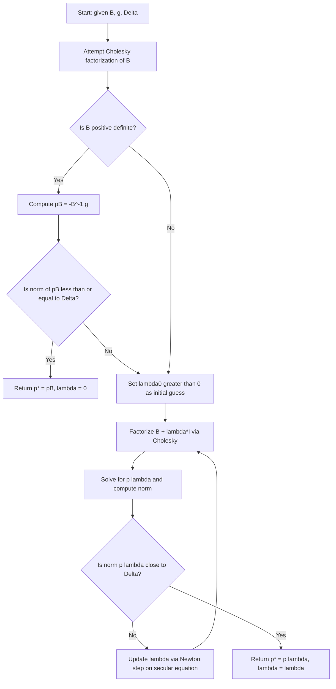

## Exact Trust-Region Subproblem Solution

### Overview

The exact trust-region subproblem solution refers to finding the true global minimizer of the quadratic model within the trust-region constraint, rather than an approximation such as the Cauchy point, dogleg path, or two-dimensional subspace minimization. This approach is grounded in a characterization theorem that reduces the constrained problem to a scalar root-finding procedure, at the cost of higher per-iteration computation than approximate methods.

### Problem Statement

The trust-region subproblem is:

$$\min_{p \in \mathbb{R}^n} ; m(p) = f + g^T p + \frac{1}{2} p^T B p \quad \text{subject to} \quad |p| \leq \Delta$$

where $g$ is the gradient, $B$ is a symmetric Hessian approximation, and $\Delta$ is the trust-region radius. An exact solution means finding $p^*$ that globally minimizes $m(p)$ over the entire ball $|p| \leq \Delta$, not merely over a restricted line or subspace.

### The Optimality Characterization Theorem

A vector $p^*$ is a global solution of the trust-region subproblem if and only if it is feasible and there exists a scalar $\lambda \geq 0$ such that the following conditions hold:

$$(B + \lambda I) p^* = -g$$

$$\lambda (\Delta - |p^*|) = 0$$

$$(B + \lambda I) \text{ is positive semidefinite}$$

**Key Points**

- The first equation shows that $p^*$ solves a shifted linear system, where $\lambda$ acts like a regularization parameter added to the diagonal of $B$.
- The second equation is a complementarity condition: either the constraint is inactive ($|p^_| < \Delta$ and $\lambda = 0$), or the constraint is active ($|p^_| = \Delta$ and $\lambda \geq 0$).
- The third condition ensures that $p^*$ is not just a stationary point of the Lagrangian but a genuine global minimizer, which distinguishes trust-region theory from generic KKT analysis.

### Two Cases

**Case 1: Interior Solution**

If $B$ is positive definite and the unconstrained minimizer $p_B = -B^{-1} g$ satisfies $|p_B| \leq \Delta$, then $p^* = p_B$ and $\lambda = 0$. This is the simplest case: the trust-region constraint is not active, and the exact solution coincides with the full Newton step.

**Case 2: Boundary Solution**

If $|p_B| > \Delta$, or if $B$ is not positive definite, the solution lies on the boundary, $|p^*| = \Delta$, and a positive $\lambda$ must be found such that $B + \lambda I$ is positive semidefinite and:

$$|(B + \lambda I)^{-1} g| = \Delta$$

This is known as the **secular equation**, and finding the correct $\lambda$ requires an iterative numerical procedure.

### The Secular Equation

Define:

$$\varphi(\lambda) = |p(\lambda)| - \Delta = |(B + \lambda I)^{-1} g| - \Delta$$

The goal is to find $\lambda^* \geq 0$ such that $\varphi(\lambda^_) = 0$, subject to $B + \lambda^_ I \succeq 0$.

Using the eigendecomposition $B = Q \Lambda Q^T$ with eigenvalues $\lambda_1 \leq \lambda_2 \leq \dots \leq \lambda_n$ and $Q^T g = \begin{bmatrix} \gamma_1 & \gamma_2 & \dots & \gamma_n \end{bmatrix}^T$, the norm can be written explicitly as:

$$|p(\lambda)|^2 = \sum_{i=1}^{n} \frac{\gamma_i^2}{(\lambda_i + \lambda)^2}$$

This expression makes clear that $|p(\lambda)|$ is a decreasing function of $\lambda$ for $\lambda > -\lambda_1$, which is the theoretical basis for applying a safeguarded root-finding method such as Newton's method on a reparametrized version of $\varphi$.

### Newton's Method on the Secular Equation

Direct Newton iteration on $\varphi(\lambda)$ converges slowly near $\lambda = -\lambda_1$ because $\varphi$ becomes highly nonlinear there. A standard remedy is to apply Newton's method to the reciprocal-type function:

$$\hat{\varphi}(\lambda) = \frac{1}{\Delta} - \frac{1}{|p(\lambda)|}$$

which behaves more linearly near the root and yields faster, more reliable convergence. The iteration is:

$$\lambda_{k+1} = \lambda_k - \frac{\hat{\varphi}(\lambda_k)}{\hat{\varphi}'(\lambda_k)}$$

At each step, $p(\lambda_k)$ is obtained by solving the linear system $(B + \lambda_k I) p = -g$, typically via a Cholesky factorization of $B + \lambda_k I$, which also serves to verify positive definiteness.

### The Hard Case

A special situation, known as the **hard case**, arises when $g$ is orthogonal (or nearly orthogonal) to the eigenvector(s) associated with the smallest eigenvalue $\lambda_1$ of $B$, and $\lambda = -\lambda_1$ does not by itself yield $|p(\lambda)| = \Delta$.

In this case, $\gamma_1 = 0$ (the component of $g$ along the smallest-eigenvalue eigenvector vanishes), so the formula for $|p(\lambda)|^2$ excludes that term, and it is possible that:

$$\lim_{\lambda \to -\lambda_1^+} |p(\lambda)| < \Delta$$

When this occurs, the solution is constructed as:

$$p^* = -\sum_{i: \lambda_i \neq \lambda_1} \frac{\gamma_i}{\lambda_i - \lambda_1} q_i + \tau z$$

where $z$ is any eigenvector corresponding to $\lambda_1$, $q_i$ are the eigenvectors of $B$, and $\tau$ is chosen so that $|p^*| = \Delta$. This adds a multiple of the null-space-like direction to reach the boundary exactly.

**Key Points**

- The hard case is called "hard" because the standard secular-equation root-finding procedure fails to converge to a valid $\lambda$ in the usual sense, requiring this separate construction.
- The hard case occurs relatively rarely in practice but must be detected explicitly (via near-orthogonality checks between $g$ and the eigenspace of $\lambda_1$) to avoid numerical failure.
- [Inference] The likelihood of encountering the hard case in a given application is problem-dependent and is generally considered rare in typical smooth nonlinear optimization, though it can arise more frequently in structured or degenerate problems.

### Geometric Interpretation

<svg viewBox="0 0 640 460" xmlns="http://www.w3.org/2000/svg" font-family="sans-serif"> <text x="320" y="30" text-anchor="middle" font-size="18" font-weight="bold" fill="#1a1a1a">Exact Trust-Region Subproblem Solution (svg_diagram)</text> <!-- Trust region circle --> <circle cx="320" cy="250" r="150" fill="#eef4fb" stroke="#4a6fa5" stroke-width="2"/> <text x="320" y="90" text-anchor="middle" font-size="13" fill="#4a6fa5">Trust Region Boundary (‖p‖ = Δ)</text> <!-- Center point --> <circle cx="320" cy="250" r="4" fill="#1a1a1a"/> <text x="332" y="245" font-size="12" fill="#1a1a1a">xk</text> <!-- Unconstrained Newton point outside region --> <circle cx="500" cy="150" r="5" fill="#d9534f"/> <text x="505" y="140" font-size="12" fill="#d9534f">pB (unconstrained Newton point, outside)</text> <line x1="320" y1="250" x2="500" y2="150" stroke="#d9534f" stroke-width="2" stroke-dasharray="5,4"/> <!-- Exact boundary solution --> <circle cx="437" cy="185" r="6" fill="#3a3a3a"/> <text x="445" y="180" font-size="12" fill="#3a3a3a" font-weight="bold">p* (exact solution, on boundary)</text> <line x1="320" y1="250" x2="437" y2="185" stroke="#5cb85c" stroke-width="3"/> <!-- Contour ellipses of quadratic model --> <ellipse cx="500" cy="150" rx="60" ry="35" fill="none" stroke="#f4d35e" stroke-width="1.5" transform="rotate(-20 500 150)"/> <ellipse cx="500" cy="150" rx="110" ry="65" fill="none" stroke="#f4d35e" stroke-width="1.5" transform="rotate(-20 500 150)"/> <text x="440" y="110" font-size="11" fill="#8a6d1a" font-style="italic">Model contours m(p)</text> </svg>

### Computational Cost

- Each candidate $\lambda$ requires a factorization of $B + \lambda I$, typically Cholesky at $O(n^3)$ cost for dense problems, making the exact method significantly more expensive per iteration than the Cauchy point or dogleg approaches.
- Multiple factorizations are generally needed across the Newton iterations on the secular equation, though the number required is usually small (often fewer than five) for well-behaved problems.
- [Unverified] Exact iteration counts for convergence of the secular-equation solve depend on problem conditioning and the chosen safeguarding scheme, and specific counts should not be treated as universal.
- For large, sparse problems, forming and factorizing $B + \lambda I$ repeatedly can be prohibitive, which motivates iterative alternatives such as the Steihaug-Toint conjugate gradient method that avoid explicit factorization.

### Safeguarding the Root-Finding Procedure

Because $\varphi(\lambda)$ has a pole at $\lambda = -\lambda_1$ and is only well-defined for $\lambda \geq -\lambda_1$, robust implementations maintain a bracket $[\lambda_{\text{lower}}, \lambda_{\text{upper}}]$ and use safeguarded Newton steps (falling back to bisection when a Newton step would leave the bracket) to guarantee convergence. This prevents the iteration from stepping into the infeasible region where $B + \lambda I$ is not positive semidefinite.

### Comparison with Approximate Methods

|Method|Accuracy|Per-Iteration Cost|Typical Use Case|
|---|---|---|---|
|Cauchy point|Low|Very low|Large-scale, cost-sensitive|
|Dogleg|Moderate|Low (one factorization)|Small-to-medium dense problems|
|Two-dimensional subspace minimization|Moderate-high|Low-moderate|Dense problems needing curvature|
|Exact solution|Highest|High (multiple factorizations)|Small dense problems, high-accuracy needs|

### Convergence Properties

- Because the exact solution achieves the true minimum of $m(p)$ subject to the constraint, it produces at least as much model reduction per iteration as any approximate method, which can translate into fewer outer iterations of the overall trust-region algorithm.
- [Unverified] Whether fewer outer iterations offset the higher per-iteration cost depends on the specific problem and the relative expense of function/gradient evaluations versus linear algebra, so overall wall-clock performance is not guaranteed to improve.
- Global convergence to a stationary point still relies on the same sufficient-decrease framework as approximate methods, since the exact solution trivially satisfies the same or better decrease bound as the Cauchy point.

### Practical Considerations

- Exact subproblem solution is most attractive for small-to-moderate dimensional problems where $O(n^3)$ factorization costs are affordable and high accuracy per step is valuable.
- Some implementations use the exact solution only occasionally (e.g., early iterations or when high precision is needed) and switch to cheaper approximations elsewhere, balancing cost and accuracy.
- The hard-case detection logic adds implementation complexity relative to approximate methods, which is a practical reason many general-purpose solvers default to dogleg or subspace methods unless high accuracy is specifically required.

**Conclusion**

The exact trust-region subproblem solution provides the theoretically optimal step within the trust-region constraint by reducing the problem to a scalar secular equation via an eigenvalue-based characterization. While it guarantees the best possible model reduction at each iteration, its reliance on repeated matrix factorizations makes it considerably more expensive than approximate alternatives, and careful handling of the hard case and safeguarded root-finding is required for a robust implementation.

**Related Topics**

- Two-dimensional subspace minimization
- Dogleg and double-dogleg methods
- Steihaug-Toint conjugate gradient method for large-scale trust regions
- The hard case in trust-region and eigenvalue problems
- Levenberg-Marquardt method and its connection to the secular equation
- Trust-region radius update strategies
