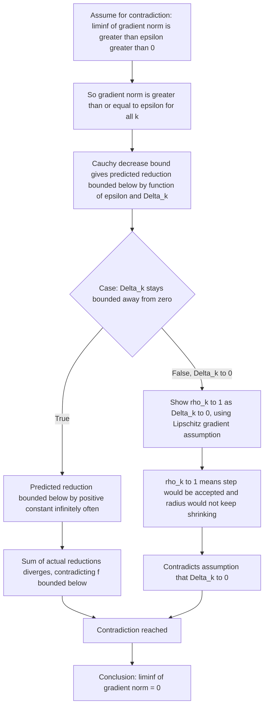

## Global Convergence Theory for Trust Region Methods

### Overview

Global convergence theory addresses whether a trust region algorithm, started from an arbitrary initial point $x_0$, is guaranteed to generate a sequence of iterates whose gradients approach zero — that is, convergence to a stationary point regardless of how far $x_0$ is from a solution. This is distinct from local convergence rate theory, which studies how fast iterates converge once they are already close to a minimizer.

### Setting and Assumptions

The standard analysis (following Nocedal and Wright's treatment) considers the trust region subproblem:

$$\min_{p} \; m_k(p) = f(x_k) + g_k^T p + \frac{1}{2} p^T B_k p, \quad \|p\| \leq \Delta_k$$

where $g_k = \nabla f(x_k)$ and $B_k$ is a symmetric matrix approximating the Hessian. The core global convergence results typically require:

**Key Points**

- $f$ is bounded below on the level set determined by $x_0$.
- $f$ is Lipschitz continuously differentiable (gradient is Lipschitz continuous) in a neighborhood of the level set.
- $\{B_k\}$ is uniformly bounded: there exists $\beta > 0$ such that $\|B_k\| \leq \beta$ for all $k$.
- The step $p_k$ satisfies a **sufficient decrease condition** relative to the Cauchy point (defined below).

### The Cauchy Point and Sufficient Decrease

The Cauchy point $p_k^C$ is the minimizer of $m_k$ along the steepest descent direction, restricted to the trust region:

$$p_k^C = -\tau_k \frac{\Delta_k}{\|g_k\|} g_k$$

where $\tau_k$ is chosen to minimize $m_k$ along that direction subject to the trust region constraint. The predicted reduction at the Cauchy point satisfies a key bound:

$$m_k(0) - m_k(p_k^C) \geq \frac{1}{2} \|g_k\| \min\left(\Delta_k, \frac{\|g_k\|}{\|B_k\|}\right)$$

This inequality — sometimes called the Cauchy decrease bound — does not depend on how the full step $p_k$ is computed; it only requires that whatever method is used to solve the subproblem (dogleg, truncated CG, exact solve) produces a step achieving **at least as much** predicted reduction as the Cauchy point:

$$m_k(0) - m_k(p_k) \geq c_1 \big(m_k(0) - m_k(p_k^C)\big)$$

for some fixed constant $c_1 \in (0, 1]$. This is the sufficient decrease condition, and it is the property that makes global convergence provable without requiring an exact subproblem solution.

### Why the Cauchy Point Bound Matters

**Key Points**

- It guarantees the predicted reduction is bounded below by a quantity proportional to $\|g_k\|$, tying model improvement directly to how far the current point is from stationarity.
- It holds regardless of the conditioning of $B_k$, since the $\min(\Delta_k, \|g_k\|/\|B_k\|)$ term automatically accounts for cases where $B_k$ is large (curvature dominates, so the bound reduces to $\|g_k\|^2/\|B_k\|$) versus cases where the trust region itself is the binding constraint (bound reduces to $\Delta_k \|g_k\|$).
- Because the bound is norm-based and does not require positive definiteness of $B_k$, it applies even when $B_k$ has negative eigenvalues, which is essential since Newton-type Hessian approximations are not guaranteed to be positive definite away from a minimizer.

### The Main Global Convergence Result

Under the assumptions above, together with the radius update rule (shrink when $\rho_k$ is small, allow growth only when $\rho_k$ is large and the step is boundary-active), the standard theorem states:

$$\liminf_{k \to \infty} \|g_k\| = 0$$

That is, at least a subsequence of gradients converges to zero. A stronger version of the theorem, obtained with a slightly stronger condition on how often unsuccessful steps can occur, gives:

$$\lim_{k \to \infty} \|g_k\| = 0$$

meaning the entire sequence of gradient norms converges to zero, not merely a subsequence. [Unverified] Which precise variant of the theorem (liminf vs full limit) is presented, and under exactly which auxiliary conditions, differs somewhat between standard references (e.g., Nocedal and Wright vs. Conn, Gould, and Toint), so the exact statement should be checked against the source being used for a course or proof.

### Proof Sketch (Liminf Result)

The proof proceeds by contradiction and is structured roughly as follows:

The key technical step is bounding $|\rho_k - 1|$ using the Lipschitz continuity of $\nabla f$ and the boundedness of $B_k$, which shows that once $\Delta_k$ is small enough, the quadratic model necessarily matches the true function well (Taylor's theorem with a Lipschitz remainder), forcing $\rho_k$ close to 1 and preventing further shrinkage — this is what rules out $\Delta_k \to 0$ while $\|g_k\|$ stays bounded away from zero.

### Geometric Intuition

<svg viewBox="0 0 700 380" xmlns="http://www.w3.org/2000/svg">
  <text x="350" y="28" text-anchor="middle" font-size="17" font-weight="bold" fill="#1a1a1a">Convergence Argument Structure (svg_diagram)</text>

  <rect x="30" y="55" width="300" height="130" fill="none" stroke="#1d4ed8" stroke-width="2" rx="8"/>
  <text x="180" y="80" text-anchor="middle" font-size="13" font-weight="bold" fill="#1d4ed8">If radius stays bounded away from 0</text>
  <text x="180" y="105" text-anchor="middle" font-size="11" fill="#1a1a1a">Cauchy bound forces predicted</text>
  <text x="180" y="122" text-anchor="middle" font-size="11" fill="#1a1a1a">reduction greater than or equal to</text>
  <text x="180" y="139" text-anchor="middle" font-size="11" fill="#1a1a1a">a fixed positive constant</text>
  <text x="180" y="163" text-anchor="middle" font-size="11" fill="#b91c1c">Infinite sum of f-decreases</text>

  <rect x="370" y="55" width="300" height="130" fill="none" stroke="#15803d" stroke-width="2" rx="8"/>
  <text x="520" y="80" text-anchor="middle" font-size="13" font-weight="bold" fill="#15803d">If radius shrinks to 0</text>
  <text x="520" y="105" text-anchor="middle" font-size="11" fill="#1a1a1a">Lipschitz gradient forces</text>
  <text x="520" y="122" text-anchor="middle" font-size="11" fill="#1a1a1a">model accuracy to improve</text>
  <text x="520" y="139" text-anchor="middle" font-size="11" fill="#1a1a1a">so rho_k approaches 1</text>
  <text x="520" y="163" text-anchor="middle" font-size="11" fill="#b91c1c">Radius would stop shrinking</text>

  <line x1="330" y1="120" x2="370" y2="120" stroke="#1a1a1a" stroke-width="2" marker-end="url(#arrow2)"/>
  <text x="350" y="110" text-anchor="middle" font-size="10" fill="#1a1a1a">OR</text>

  <path d="M 180 185 L 180 230 L 520 230 L 520 185" fill="none" stroke="#7c2d12" stroke-width="2"/>
  <rect x="150" y="235" width="400" height="70" fill="none" stroke="#7c2d12" stroke-width="2" rx="8"/>
  <text x="350" y="260" text-anchor="middle" font-size="13" font-weight="bold" fill="#7c2d12">Both branches contradict</text>
  <text x="350" y="280" text-anchor="middle" font-size="11" fill="#1a1a1a">the assumption that gradient norm stays bounded away from zero</text>

  <text x="350" y="340" text-anchor="middle" font-size="13" font-weight="bold" fill="#1a1a1a">Therefore: liminf ||g_k|| = 0</text>

  <defs>
    <marker id="arrow2" markerWidth="8" markerHeight="8" refX="6" refY="3" orient="auto">
      <path d="M0,0 L0,6 L7,3 z" fill="#1a1a1a"/>
    </marker>
  </defs>
</svg>

### Role of the Radius Update Rule in the Proof

**Key Points**

- The **shrink-on-poor-fit** behavior is what allows the proof to derive a contradiction in the second branch: if $\rho_k$ is forced close to 1 by small $\Delta_k$, the algorithm's own update rule guarantees the radius will not shrink further (and may even grow), preventing $\Delta_k \to 0$ from being sustained indefinitely under the contradiction hypothesis.
- The **expand-only-on-boundary-active-success** condition prevents the radius from being artificially inflated by steps that did not actually test the boundary, which keeps the growth behavior consistent with the accuracy assumptions used in the Lipschitz bound.
- The requirement $0 < \eta_1 \leq \eta_2 < 1$ ensures a clean separation between "reject and shrink," "accept and hold," and "accept and grow," which the proof relies on to case-split cleanly.

### Extensions and Related Results

- **Strong global convergence** ($\lim \|g_k\| = 0$ rather than $\liminf$): typically requires an additional assumption bounding how the ratio of successful to unsuccessful iterations behaves, or a slightly stronger sufficient decrease condition.
- **Second-order global convergence**: under additional assumptions (e.g., $B_k = \nabla^2 f(x_k)$ exactly, or a sufficiently accurate approximation, and the subproblem solved to a fraction of optimality that also captures negative curvature, as in the Steihaug-Toint or exact trust region subproblem solvers), stronger results show convergence to points satisfying second-order necessary conditions ($\nabla^2 f(x^*) \succeq 0$), not just first-order stationarity.
- **Convergence for nonconvex, non-Lipschitz-smooth settings**: [Speculation] extending these results to relax the Lipschitz gradient assumption (e.g., to Hölder continuous gradients) is an active area in parts of the modern nonconvex optimization literature, though the classical theorem as stated relies on the Lipschitz assumption directly.
- **Trust region methods for constrained optimization**: analogous global convergence theory exists for trust-region SQP (sequential quadratic programming) methods, though the merit function and ratio $\rho_k$ must be adapted to account for constraint violation, making the analysis substantially more involved.

### Distinction from Local Convergence Rate

Global convergence theory only guarantees eventual approach to stationarity — it says nothing about how fast. Local convergence rate results (e.g., superlinear or quadratic convergence near a minimizer satisfying second-order sufficient conditions) are a separate body of theory that typically assumes the iterates have already entered a neighborhood where the trust region constraint becomes inactive (i.e., $\Delta_k$ is no longer the binding constraint on the step), effectively reducing the method to an unconstrained Newton-type iteration.

### Related Topics

- Local (superlinear/quadratic) convergence rate analysis near a minimizer
- Cauchy point and its role beyond the convergence proof
- Second-order convergence and negative curvature exploitation
- Trust-region SQP for constrained optimization
- Comparison with line search global convergence theory (Wolfe/Armijo-based)
- Steihaug-Toint truncated conjugate gradient method
- Levenberg-Marquardt method and its convergence properties
