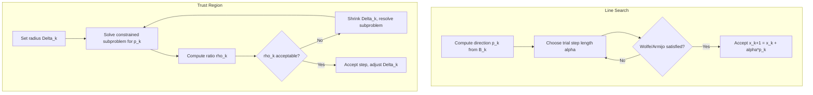

## Trust Region vs. Line Search Methods

### Overview

Trust region and line search methods are the two dominant strategies for globalizing Newton-type optimization algorithms — that is, ensuring convergence from starting points far from a solution. Both address the same underlying problem (how to turn a local model of the objective function into a safe, productive step) but they reverse the order of two fundamental decisions: choosing a direction and choosing a step length.

- **Line search**: fix a direction first, then find a step length along it.
- **Trust region**: fix a maximum step size (a region) first, then find the best direction and length within it, solving a constrained subproblem.

### Core Conceptual Distinction

At each iterate $x_k$, both families build a local quadratic (or otherwise tractable) model of the objective $f$, typically

$$m_k(p) = f(x_k) + \nabla f(x_k)^T p + \frac{1}{2} p^T B_k p$$

where $B_k$ approximates the Hessian $\nabla^2 f(x_k)$.

- **Line search methods** compute a search direction $p_k$ (e.g., by solving $B_k p_k = -\nabla f(x_k)$ exactly), then search along the ray $x_k + \alpha p_k$ for a scalar $\alpha_k > 0$ satisfying sufficient decrease conditions.
- **Trust region methods** pick a radius $\Delta_k$ and solve the constrained subproblem

$$\min_{p} \; m_k(p) \quad \text{subject to} \quad \|p\| \le \Delta_k$$

The step $p_k$ and its length are determined jointly by this constrained minimization, not chosen independently.

### Order of Operations

**Key Points**

- Line search: **direction → length**. The direction is usually fixed by the linear algebra of the model (e.g., a Newton or quasi-Newton solve); only the scalar step length is adaptively tuned.
- Trust region: **length constraint → direction and length jointly**. The radius $\Delta_k$ is adapted based on model reliability, and the direction that emerges depends on how tightly that radius constrains the model minimizer.
- This reversal matters most when $B_k$ is indefinite or the unconstrained model minimizer is a poor global step; trust region naturally interpolates between the Newton direction and the steepest-descent direction as $\Delta_k$ shrinks, while line search along a poor direction cannot fix a badly chosen direction by adjusting length alone.

### Handling Indefinite Curvature

This is one of the sharpest practical differences.

- **Line search** requires $B_k$ (or its approximation) to be positive definite to guarantee $p_k$ is a descent direction. If the true Hessian has negative eigenvalues (common near saddle points), line search methods must modify $B_k$ — e.g., via modified Cholesky factorization, adding a multiple of the identity, or switching to steepest descent — before a direction can even be computed.
- **Trust region** subproblems are well-posed even when $B_k$ is indefinite. The constraint $\|p\| \le \Delta_k$ bounds the model regardless of curvature sign, so the subproblem (often called the **trust region subproblem** or **TRS**) has a well-defined solution characterized by the optimality conditions

$$(B_k + \lambda I) p_k = -\nabla f(x_k), \quad \lambda \ge 0, \quad \lambda(\Delta_k - \|p_k\|) = 0, \quad (B_k + \lambda I) \succeq 0$$

This makes trust region methods a natural fit for problems where exploiting negative curvature (e.g., escaping saddle points) matters, without needing an ad hoc Hessian modification step.

### Step Acceptance and Adaptation Mechanics

**Key Points**

- **Line search**: acceptance is governed by conditions on $\alpha_k$ alone — most commonly the **Wolfe conditions** (sufficient decrease plus curvature condition) or the **Armijo condition** (sufficient decrease with backtracking). If a trial $\alpha$ fails, it is simply shrunk (backtracking) or a new candidate is generated via interpolation.
- **Trust region**: acceptance is governed by the ratio of actual to predicted reduction,

$$\rho_k = \frac{f(x_k) - f(x_k + p_k)}{m_k(0) - m_k(p_k)}$$

If $\rho_k$ is close to 1, the model is trustworthy and $\Delta_k$ is expanded; if $\rho_k$ is small or negative, the step is rejected and $\Delta_k$ is shrunk. This radius update is the trust region analog of line search's step-length backtracking, but it operates on the *constraint* rather than directly re-solving for a new $\alpha$.

A typical radius update rule:

$$
\Delta_{k+1} =
\begin{cases}
\tfrac{1}{4}\|p_k\| & \text{if } \rho_k < \tfrac{1}{4} \\
\min(2\Delta_k, \Delta_{\max}) & \text{if } \rho_k > \tfrac{3}{4} \text{ and } \|p_k\| = \Delta_k \\
\Delta_k & \text{otherwise}
\end{cases}
$$

[Unverified] — the specific thresholds (1/4, 3/4, doubling) are common textbook defaults (e.g., as presented in Nocedal & Wright), but implementations vary in exact constants.

### Computational Cost per Iteration

- **Line search** with an exact or quasi-Newton direction requires one linear solve (or update) per iteration for the direction, plus several cheap function/gradient evaluations for the line search loop. Each trial step is a 1-D problem, generally inexpensive.
- **Trust region** requires solving (or approximately solving) the constrained subproblem at every iteration, which is inherently more expensive than a 1-D search. Exact solution via the secular equation (root-finding on $\lambda$) requires repeated factorizations; practical methods instead use approximate solvers:
  - **Cauchy point** (steepest descent step scaled to the trust region boundary) — cheap but low quality.
  - **Dogleg method** — combines the steepest descent direction and the full Newton step along a piecewise-linear path; requires $B_k$ positive definite.
  - **Two-dimensional subspace minimization** — minimizes the model over the span of the steepest descent direction and the (possibly modified) Newton direction.
  - **Steihaug-Toint conjugate gradient method** — solves the subproblem approximately via CG, terminating early if negative curvature is encountered or the boundary is crossed; well-suited to large-scale problems since it avoids forming $B_k$ explicitly (matrix-vector products suffice).

### Global Convergence Guarantees

**Key Points**

- Both families guarantee global convergence (convergence to a stationary point from an arbitrary starting point) under standard assumptions (Lipschitz continuous gradient, bounded level sets), but the mechanisms differ:
  - Line search relies on the Wolfe/Armijo conditions ensuring sufficient decrease at every accepted step, combined with the Zoutendijk condition to establish $\|\nabla f(x_k)\| \to 0$.
  - Trust region relies on the fact that the Cauchy point alone guarantees a fraction of "sufficient decrease" relative to the gradient norm and radius, which is enough to prove global convergence even if the full subproblem is only solved approximately (as long as the approximate solution achieves at least the Cauchy decrease).
- [Inference] Trust region convergence proofs are often considered more robust to indefinite curvature "for free," since the Cauchy-point decrease bound holds regardless of the sign of curvature, whereas line search convergence proofs implicitly assume a descent direction was already secured.

### Local (Superlinear/Quadratic) Convergence

- Near a strict local minimizer with a well-conditioned Hessian, both methods can achieve **superlinear** convergence when using quasi-Newton updates (e.g., BFGS) and **quadratic** convergence when using exact Newton steps — provided the full Newton step is eventually accepted unmodified.
- For line search, this happens naturally once the step length $\alpha_k = 1$ satisfies the Wolfe conditions near the solution.
- For trust region, this requires the radius $\Delta_k$ to grow large enough that the unconstrained Newton step falls strictly inside the trust region ($\|p_k^{\text{Newton}}\| < \Delta_k$), after which the method effectively reduces to unconstrained Newton's method. Most well-designed trust region radius update rules achieve this automatically once the iterates enter a neighborhood of the solution.

### Comparison Table (Conceptual Summary)

| Aspect                                             | Line Search                               | Trust Region                                    |
| -------------------------------------------------- | ----------------------------------------- | ----------------------------------------------- |
| Order of decisions                                 | Direction, then length                    | Region, then direction+length jointly           |
| Requires $B_k \succ 0$?                            | Yes (or must modify $B_k$)                | No — handles indefinite $B_k$ natively          |
| Subproblem per iteration                           | 1-D search along fixed direction          | Constrained quadratic minimization              |
| Per-iteration cost                                 | Lower (cheap backtracking)                | Higher (subproblem solve)                       |
| Adaptivity mechanism                               | Step length $\alpha_k$                    | Region radius $\Delta_k$                        |
| Acceptance test                                    | Armijo / Wolfe conditions                 | Ratio $\rho_k$ of actual to predicted reduction |
| Natural fit for saddle points / negative curvature | Poor (needs Hessian modification)         | Good (handled by subproblem structure)          |
| Typical large-scale solver                         | Limited-memory quasi-Newton + line search | Steihaug-Toint CG trust region                  |

### Visual Comparison

<svg xmlns="http://www.w3.org/2000/svg" viewBox="0 0 800 420" font-family="Helvetica, Arial, sans-serif">
  <text x="400" y="28" text-anchor="middle" font-size="18" font-weight="bold" fill="#1a1a1a">Line Search vs. Trust Region — Step Selection (svg_diagram)</text>

  
  <text x="190" y="58" text-anchor="middle" font-size="15" font-weight="bold" fill="#2c3e50">Line Search</text>
  <line x1="60" y1="220" x2="330" y2="220" stroke="#888" stroke-width="1" />
  <circle cx="90" cy="220" r="5" fill="#c0392b" />
  <text x="90" y="240" text-anchor="middle" font-size="12" fill="#333">x_k</text>

  
  <line x1="90" y1="220" x2="300" y2="220" stroke="#2980b9" stroke-width="2.5" marker-end="url(#arrow1)" />
  <text x="200" y="205" text-anchor="middle" font-size="12" fill="#2980b9">fixed direction p_k</text>

  
  <circle cx="150" cy="220" r="4" fill="#7f8c8d" />
  <circle cx="200" cy="220" r="4" fill="#7f8c8d" />
  <circle cx="260" cy="220" r="5" fill="#27ae60" />
  <text x="260" y="240" text-anchor="middle" font-size="11" fill="#27ae60">accepted α_k</text>
  <text x="150" y="200" text-anchor="middle" font-size="10" fill="#999">try α</text>
  <text x="200" y="200" text-anchor="middle" font-size="10" fill="#999">try α</text>

  <line x1="400" y1="50" x2="400" y2="390" stroke="#ccc" stroke-width="1" stroke-dasharray="4,4" />

  
  <text x="610" y="58" text-anchor="middle" font-size="15" font-weight="bold" fill="#2c3e50">Trust Region</text>
  <circle cx="600" cy="220" r="80" fill="none" stroke="#8e44ad" stroke-width="2" stroke-dasharray="5,3" />
  <text x="600" y="130" text-anchor="middle" font-size="12" fill="#8e44ad">radius Δ_k</text>

  <circle cx="600" cy="220" r="5" fill="#c0392b" />
  <text x="600" y="242" text-anchor="middle" font-size="12" fill="#333">x_k</text>

  
  <circle cx="700" cy="150" r="4" fill="#999" />
  <text x="712" y="148" font-size="10" fill="#999">unconstrained min</text>
  <line x1="600" y1="220" x2="700" y2="150" stroke="#bbb" stroke-width="1.5" stroke-dasharray="3,3" />

  
  <line x1="600" y1="220" x2="665" y2="176" stroke="#8e44ad" stroke-width="2.5" marker-end="url(#arrow2)" />
  <circle cx="665" cy="176" r="5" fill="#27ae60" />
  <text x="665" y="160" text-anchor="middle" font-size="11" fill="#27ae60">p_k on boundary</text>

  <text x="400" y="410" text-anchor="middle" font-size="12" fill="#555">Line search fixes direction and tunes length; trust region fixes a region and solves for direction + length jointly</text>
</svg>

### Practical Decision Guidance

**Key Points**

- Prefer **line search with L-BFGS** for large, smooth, well-behaved problems where Hessian indefiniteness is rare and per-iteration cost must stay low (common in large-scale machine learning and smooth unconstrained optimization).
- Prefer **trust region with Steihaug-Toint CG** for problems where the Hessian is frequently indefinite (e.g., non-convex optimization, saddle-point-rich landscapes), where robustness to poor local models matters more than per-iteration cost, or where matrix-vector products with $B_k$ are cheap but explicit factorization is not.
- [Inference] In practice, the choice is often dictated by existing software ecosystems as much as by theory — e.g., `scipy.optimize.minimize` exposes both `'trust-ncg'`/`'trust-krylov'` (trust region) and `'BFGS'`/`'L-BFGS-B'` (line search) options, and empirical performance can be problem-dependent.

### Algorithmic Flow Comparison

### Common Pitfalls

- Assuming trust region methods are always "safer" without accounting for their higher per-iteration cost — for well-conditioned convex problems, this overhead is often unnecessary.
- Applying line search naively with an indefinite $B_k$ without a modification strategy, producing an ascent direction and stalling convergence.
- Using overly aggressive radius-growth rules in trust region methods, causing oscillation between rejected large steps and overly conservative shrinkage. [Inference] this failure mode is a known tuning issue in trust region implementations but its severity is problem-dependent.
- Conflating trust region radius $\Delta_k$ with a step length $\alpha_k$ — they are not interchangeable; $\Delta_k$ bounds a constrained subproblem's solution, not a scalar multiplier on a fixed direction.

**Next Steps**

- Dogleg and two-dimensional subspace trust region subproblem solvers (detailed mechanics)
- Steihaug-Toint conjugate gradient method for large-scale trust region subproblems
- Wolfe conditions and backtracking line search (detailed mechanics)
- Hessian modification strategies for line search (modified Cholesky, Levenberg-Marquardt-style damping)
- Convergence rate proofs: Zoutendijk's theorem vs. Cauchy-point decrease lemma
- Trust region methods for constrained optimization (e.g., SQP with trust regions)