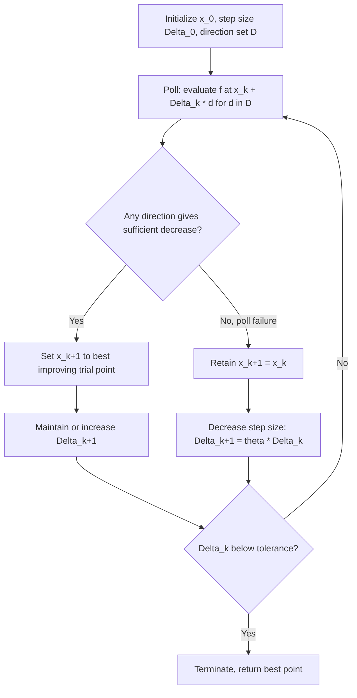

## Pattern Search and Generalized Pattern Search

### Overview

Pattern search methods are a family of derivative-free optimization algorithms that search along a fixed set of directions arranged in a **pattern**, evaluating the objective function at points generated from these directions and a current step size. Unlike Nelder-Mead's adaptively deforming simplex, pattern search maintains a rigid geometric structure of candidate directions and instead adapts a scalar **step length** parameter. Generalized Pattern Search (GPS) — and its further generalization, Generating Set Search (GSS) — formalize this idea into a rigorous framework with provable convergence guarantees, addressing one of the key theoretical weaknesses of Nelder-Mead.

### Historical Origin

- The original pattern search method is due to **Hooke and Jeeves (1961)**, predating Nelder-Mead by several years and developed for similar motivations: optimization of black-box, experimentally measured, or simulation-based objectives.
- **Torczon (1997)** formalized and generalized this into **Generalized Pattern Search (GPS)**, providing the first rigorous global convergence proofs for a broad class of pattern search algorithms.
- **Kolda, Lewis, and Torczon (2003)** further broadened the framework into **Generating Set Search (GSS)**, unifying pattern search, Hooke-Jeeves, and related methods under common convergence theory.

### Hooke-Jeeves Pattern Search

**Key Points**

Hooke-Jeeves alternates between two types of moves:

- **Exploratory move**: starting from a base point, perturb each coordinate direction in turn by $\pm \Delta$, keeping any improvement found. This produces a new point reflecting the best coordinate-wise perturbations.
- **Pattern move**: once an exploratory move succeeds, extrapolate further in the direction of overall progress:

$$x_{\text{pattern}} = x_{\text{base}} + (x_{\text{new}} - x_{\text{base}})$$

i.e., double the step taken so far, testing whether the successful direction continues to yield improvement.

- If the pattern move's subsequent exploratory move fails to improve, the algorithm reverts to the previous base point and shrinks the step size $\Delta$.
- If the step size $\Delta$ falls below a tolerance, the algorithm terminates.

### Generalized Pattern Search (GPS) Framework

**Key Points**

GPS formalizes the search using a **positive spanning set** of directions $D_k$ — a set of directions whose non-negative combinations span $\mathbb{R}^n$, guaranteeing that at least one direction in the set is a descent direction whenever the current point is not stationary (for smooth $f$).

At each iteration $k$, with current best point $x_k$ and step size $\Delta_k$:

1. **Poll step**: evaluate $f$ at trial points $x_k + \Delta_k d$ for each direction $d \in D_k$ (or a subset, depending on search strategy), until a sufficient decrease is found or all directions are exhausted.
2. If a trial point yields sufficient decrease, it becomes $x_{k+1}$, and the step size may be maintained or increased.
3. If no direction improves the objective (a "poll failure"), $x_k$ is retained, and the step size is decreased: $\Delta_{k+1} = \theta \Delta_k$ for some contraction factor $0 < \theta < 1$.

$$\text{Sufficient decrease (optional variant): } f(x_k + \Delta_k d) < f(x_k) - \rho(\Delta_k)$$

where $\rho(\Delta_k)$ is a forcing function satisfying $\rho(\Delta_k) \to 0$ as $\Delta_k \to 0$, used in some GPS variants to strengthen convergence guarantees beyond simple decrease.

### Positive Spanning Sets

- A minimal positive spanning set in $\mathbb{R}^n$ has $n+1$ directions (analogous to the Nelder-Mead simplex vertex count); a maximal, coordinate-based set commonly used has $2n$ directions: $\{+e_1, -e_1, \dots, +e_n, -e_n\}$.
- The coordinate direction set $\{\pm e_i\}$ is the most common choice in practice due to its simplicity and guaranteed descent-direction coverage, though it requires up to $2n$ function evaluations per poll step in the worst case.
- [Inference] more elaborate positive spanning sets (e.g., based on simplex geometry) can reduce the number of directions polled per iteration, which may matter when function evaluations are expensive, though this involves trade-offs against implementation simplicity.

### Algorithm Flow

### Geometric Illustration: Polling Pattern

<svg xmlns="http://www.w3.org/2000/svg" viewBox="0 0 800 400" font-family="Helvetica, Arial, sans-serif">
  <text x="400" y="28" text-anchor="middle" font-size="18" font-weight="bold" fill="#1a1a1a">Pattern Search Poll Step — Coordinate Directions (svg_diagram)</text>

  
  <line x1="400" y1="60" x2="400" y2="340" stroke="#ccc" stroke-width="1" />
  <line x1="220" y1="200" x2="580" y2="200" stroke="#ccc" stroke-width="1" />

  
  <circle cx="400" cy="200" r="6" fill="#c0392b" />
  <text x="400" y="225" text-anchor="middle" font-size="12" fill="#333">x_k</text>

  
  <circle cx="480" cy="200" r="5" fill="#2980b9" />
  <text x="480" y="190" text-anchor="middle" font-size="11" fill="#2980b9">+e1</text>

  <circle cx="320" cy="200" r="5" fill="#2980b9" />
  <text x="320" y="190" text-anchor="middle" font-size="11" fill="#2980b9">-e1</text>

  <circle cx="400" cy="120" r="5" fill="#27ae60" />
  <text x="425" y="120" font-size="11" fill="#27ae60">+e2 (improves)</text>

  <circle cx="400" cy="280" r="5" fill="#2980b9" />
  <text x="425" y="285" font-size="11" fill="#2980b9">-e2</text>

  
  <line x1="400" y1="200" x2="480" y2="200" stroke="#999" stroke-width="1.5" stroke-dasharray="3,2" />
  <text x="440" y="215" text-anchor="middle" font-size="10" fill="#999">Δ_k</text>

  
  <line x1="400" y1="200" x2="400" y2="120" stroke="#27ae60" stroke-width="2.5" marker-end="url(#arrowP)" />

  <text x="400" y="370" text-anchor="middle" font-size="12" fill="#555">Poll evaluates all directions in D; the improving direction (+e2) becomes x_k+1</text>
</svg>

### Generating Set Search (GSS): Further Generalization

**Key Points**

- GSS extends GPS by allowing the direction set $D_k$ to change from iteration to iteration, as long as it remains a positive spanning set (or positive basis) at every iteration and satisfies certain angle-boundedness conditions relative to the unit sphere.
- This generalization unifies Hooke-Jeeves, coordinate-direction GPS, and simplex-based direct search methods under a single convergence framework, since all of them can be expressed as generating set searches with different direction-set update rules.
- GSS separates the **search step** (an optional, flexible global exploration step — e.g., evaluating at randomly sampled points, or points from a surrogate model — that can improve efficiency but is not required for convergence) from the **poll step** (the rigorous, convergence-guaranteeing local step around the positive spanning set), a distinction that gives implementers freedom to add heuristics without sacrificing theoretical guarantees.

### Convergence Guarantees

**Key Points**

- Unlike Nelder-Mead, GPS/GSS methods have **rigorous global convergence guarantees**: under standard smoothness assumptions (continuously differentiable $f$ with bounded level sets), the sequence of step sizes $\Delta_k \to 0$, and any limit point of the iterates satisfies $\nabla f(x^*) = 0$ — even though the gradient is never computed or estimated by the algorithm itself.
- This guarantee stems directly from the positive spanning set property: since some direction in $D_k$ is guaranteed to make an angle less than $90°$ with $-\nabla f(x_k)$ whenever $\nabla f(x_k) \neq 0$, a sufficiently small step in that direction must decrease $f$, which the poll step is designed to detect.
- This convergence property is a key theoretical advantage of GPS/GSS over Nelder-Mead, whose simplex can degenerate without triggering any equivalent detection mechanism.

### Comparison: Pattern Search vs. Nelder-Mead

| Aspect | Pattern Search (GPS/GSS) | Nelder-Mead |
|---|---|---|
| Adapted quantity | Scalar step size $\Delta_k$ | Simplex geometry (all vertices) |
| Direction set | Fixed positive spanning set (rigid) | Implicit, deforms via reflection/expansion/contraction |
| Convergence guarantee | Yes, to a stationary point under standard assumptions | No general guarantee even for smooth convex functions |
| Function evaluations per iteration | Up to $\|D_k\|$ (e.g., $2n$ for coordinate directions) | Typically 1–2 (reflection, then possibly expansion or contraction) |
| Robustness to degeneracy | High (rigid pattern cannot collapse) | Lower (simplex can degenerate per McKinnon's counterexamples) |
| Flexibility for heuristic acceleration | Yes, via optional search step (GSS) | Limited — algorithm structure is fixed |

### Practical Considerations

- **Step size initialization and contraction factor**: a common contraction factor is $\theta = 0.5$; step size should be initialized relative to the expected scale of meaningful variation in each variable.
- **Opportunistic vs. complete polling**: some implementations stop polling as soon as one improving direction is found ("opportunistic" polling, faster per iteration); others evaluate the entire direction set before choosing the best improvement ("complete" polling, potentially better per-iteration progress at higher cost). [Inference] the relative advantage between these two polling strategies is implementation- and problem-dependent, with no universally superior choice.
- **Handling bound and linear constraints**: GPS/GSS extends naturally to bound-constrained and linearly constrained problems by restricting or adapting the direction set to remain within (or tangent to) the feasible region, without requiring a separate penalty or barrier formulation.
- **Parallelization**: because poll steps evaluate multiple independent directions, pattern search is naturally suited to parallel or distributed function evaluation, which can be a practical advantage when the objective is expensive and multiple evaluations can be run concurrently.

### Common Pitfalls

- Assuming pattern search converges quickly — like Nelder-Mead, its convergence is generally linear at best and can be slow relative to gradient-based methods, since it only guarantees eventual stationarity, not a fast rate.
- Using an inadequate or poorly angled direction set that technically satisfies the positive spanning condition but leads to slow practical progress; direction set quality affects efficiency even though it doesn't affect the convergence guarantee itself.
- Neglecting to rescale variables of very different magnitudes, which can distort the effectiveness of a fixed coordinate-direction pattern in the same way it affects Nelder-Mead's simplex.
- Confusing the flexible "search step" in GSS with the theoretically essential "poll step" — omitting or mishandling the poll step removes the convergence guarantee, even if the search step is retained.

**Related Topics**

- Hooke-Jeeves method (detailed exploratory/pattern move mechanics)
- Generating Set Search (GSS) and positive spanning set theory
- Mesh Adaptive Direct Search (MADS) as an extension for constrained and non-smooth problems
- Nelder-Mead simplex method (comparison of convergence guarantees)
- Model-based trust region DFO methods (BOBYQA, COBYLA)
- Convergence theory: positive spanning sets and Clarke stationarity