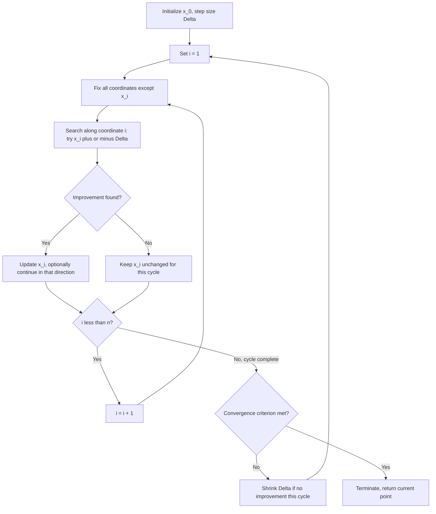

## Coordinate Search Methods

### Overview

Coordinate search (also called coordinate descent when adapted for smooth/differentiable settings, or the **cyclic coordinate method**) is one of the simplest derivative-free optimization strategies. It minimizes a function $f: \mathbb{R}^n \to \mathbb{R}$ by optimizing along one coordinate axis at a time, holding all other variables fixed, and cycling through the coordinates repeatedly until convergence. It can be viewed as a special case of pattern search restricted to the coordinate directions $\{\pm e_1, \dots, \pm e_n\}$, but it predates the generalized pattern search framework and is often treated as a distinct, foundational method in its own right.

### Basic Algorithm

**Key Points**

Given a starting point $x^{(0)} \in \mathbb{R}^n$, coordinate search cycles through coordinates $i = 1, 2, \dots, n$ and, at each step, solves a **one-dimensional subproblem**:

$$x_i^{(k+1)} = \arg\min_{t \in \mathbb{R}} f(x_1^{(k+1)}, \dots, x_{i-1}^{(k+1)}, t, x_{i+1}^{(k)}, \dots, x_n^{(k)})$$

i.e., minimize $f$ with respect to the $i$-th coordinate alone, using the most recently updated values for coordinates already processed in the current cycle.

- A full pass through all $n$ coordinates is called a **cycle** or **sweep**.
- The algorithm repeats cycles until a convergence criterion is met (e.g., the change in $x$ or $f$ across a full cycle falls below a tolerance).

### Derivative-Free Variant: Coordinate Search via Direct Sampling

When derivatives are unavailable, the 1-D subproblem itself is solved without gradient information, typically using:

- **Step-and-test with contraction**: try $x_i \pm \Delta$; if either improves $f$, accept it and optionally continue in that direction with the same or an increased step; if neither improves, shrink $\Delta$ and retry.
- **1-D derivative-free line search** (e.g., golden section search or a simple bisection-like bracketing method) applied along the $i$-th coordinate axis, if the 1-D subproblem is assumed unimodal along that axis.

This derivative-free variant is essentially a restricted form of pattern search using only the $2n$ coordinate directions, cycling through them one at a time rather than polling all of them simultaneously at each iteration.

### Algorithm Flow

### Geometric Illustration

<svg xmlns="http://www.w3.org/2000/svg" viewBox="0 0 800 400" font-family="Helvetica, Arial, sans-serif">
  <text x="400" y="28" text-anchor="middle" font-size="18" font-weight="bold" fill="#1a1a1a">Coordinate Search — Sequential Axis-Aligned Steps (svg_diagram)</text>

  
  <ellipse cx="450" cy="220" rx="220" ry="130" fill="none" stroke="#dfe6ec" stroke-width="1.5" />
  <ellipse cx="450" cy="220" rx="160" ry="95" fill="none" stroke="#dfe6ec" stroke-width="1.5" />
  <ellipse cx="450" cy="220" rx="100" ry="60" fill="none" stroke="#dfe6ec" stroke-width="1.5" />
  <ellipse cx="450" cy="220" rx="40" ry="24" fill="none" stroke="#dfe6ec" stroke-width="1.5" />

  
  <circle cx="650" cy="120" r="6" fill="#c0392b" />
  <text x="660" y="115" font-size="11" fill="#c0392b">x⁽⁰⁾</text>

  <line x1="650" y1="120" x2="450" y2="120" stroke="#2980b9" stroke-width="2.5" marker-end="url(#arrowC1)" />
  <circle cx="450" cy="120" r="5" fill="#2980b9" />
  <text x="455" y="110" font-size="10" fill="#2980b9">step along x1</text>

  <line x1="450" y1="120" x2="450" y2="230" stroke="#27ae60" stroke-width="2.5" marker-end="url(#arrowC2)" />
  <circle cx="450" cy="230" r="5" fill="#27ae60" />
  <text x="460" y="180" font-size="10" fill="#27ae60">step along x2</text>

  <line x1="450" y1="230" x2="470" y2="230" stroke="#2980b9" stroke-width="2.5" marker-end="url(#arrowC1)" />
  <circle cx="470" cy="230" r="5" fill="#2980b9" />

  <line x1="470" y1="230" x2="470" y2="222" stroke="#27ae60" stroke-width="2" marker-end="url(#arrowC2)" />
  <circle cx="470" cy="222" r="5" fill="#f39c12" />
  <text x="480" y="222" font-size="11" fill="#f39c12">converging near center</text>

  <text x="400" y="380" text-anchor="middle" font-size="12" fill="#555">Each move is axis-aligned; progress can slow sharply on elongated, ill-conditioned contours</text>
</svg>

### Key Weakness: Sensitivity to Variable Correlation and Scaling

**Key Points**

- Coordinate search performs well when the objective's contours are roughly axis-aligned and well-scaled (e.g., separable or near-separable functions), but degrades sharply on functions with strong correlation between variables (elongated, rotated contours).
- On such ill-conditioned or correlated problems, coordinate search can require a very large number of small zig-zagging steps to make progress, since no single coordinate direction aligns well with the direction of steepest local improvement.
- This is the same fundamental limitation observed in gradient-based coordinate descent methods and steepest descent on ill-conditioned quadratics — the axis-restricted (or gradient-restricted, in that case) direction set doesn't match the problem's natural geometry. [Inference] the practical severity of this slowdown scales with the degree of correlation/conditioning, though exact convergence rates depend on the specific function.
- A classic illustrative case: a rotated elongated quadratic bowl, where coordinate search can be arbitrarily slow (in the worst case, failing to converge to the true minimizer at all if $f$ is non-smooth along coordinate directions, or converging only asymptotically along a very long zig-zag path for smooth ill-conditioned quadratics).

### Convergence Properties

**Key Points**

- For **smooth, strictly convex** functions, cyclic coordinate search (using exact 1-D minimization along each coordinate) converges to the minimizer, but the guarantee and rate depend on the structure of $f$; convergence can be slow for highly correlated variables even though it eventually succeeds.
- For **general non-convex or non-smooth functions**, coordinate search — like Nelder-Mead — has **no general guarantee of convergence to a stationary point**. A well-known failure mode: if $f$ has "creases" or non-smooth ridges oriented diagonally relative to the coordinate axes, coordinate search can become permanently stuck at a non-stationary point where no single coordinate perturbation improves $f$, even though a combined diagonal move would.
- This failure mode is precisely what motivated the positive-spanning-set requirement in Generalized Pattern Search: coordinate directions alone (used sequentially, one at a time, rather than polled together as a full positive spanning set at every iteration) do not guarantee that some direction is a descent direction at a non-stationary point when $f$ is merely non-smooth (as opposed to continuously differentiable).
- [Inference] this distinction — GPS polls the full direction set at each iteration and only requires continuous differentiability for its guarantee, whereas naive sequential coordinate search can stall even on some smooth-adjacent pathological cases and more readily on genuinely non-smooth ones — is why coordinate search is generally regarded as theoretically weaker despite its similarity to GPS with coordinate directions.

### Coordinate Search vs. Full Pattern Search (GPS)

| Aspect | Coordinate Search | Generalized Pattern Search (coordinate directions) |
|---|---|---|
| Directions evaluated per iteration | One coordinate at a time (sequential) | All $2n$ directions polled together (or until improvement found) |
| Convergence guarantee (smooth $f$) | Generally weaker; can stall on some non-smooth or pathological cases | Rigorous convergence to a stationary point |
| Function evaluations per full cycle/iteration | Comparable in aggregate over a full sweep | Comparable, but structured as a formal poll step |
| Step size adaptation | Often per-coordinate or global, less formalized | Formalized single global step size $\Delta_k$ with rigorous update rule |
| Historical role | Early, simple baseline method | Formal generalization with modern convergence theory |

### Relationship to Gradient-Based Coordinate Descent

- When derivatives **are** available, "coordinate descent" typically refers to the gradient-based variant, where the 1-D subproblem is solved (or approximately solved via a single gradient step) using $\partial f / \partial x_i$ rather than direct sampling.
- Gradient-based coordinate descent is widely used in large-scale machine learning (e.g., for $\ell_1$-regularized regression, LASSO, and SVM training) precisely because it can exploit problem structure (e.g., separability, sparsity) that makes each 1-D subproblem cheap to solve in closed form.
- The derivative-free coordinate search discussed here shares the same axis-cycling structure but replaces the closed-form or gradient-based 1-D update with direct function sampling, making it strictly a black-box method suitable when even coordinate-wise derivatives are unavailable.

### Practical Considerations

- **Ordering of coordinates**: cycling in a fixed order (e.g., $1, 2, \dots, n, 1, 2, \dots$) is simplest, but some implementations randomize or adaptively reorder coordinates each cycle in an attempt to reduce zig-zagging on correlated problems. [Inference] the practical benefit of randomized or adaptive ordering is problem-dependent and is not a universal fix for the correlation-sensitivity issue.
- **Step size management**: similar to pattern search, a per-coordinate or global step size is typically shrunk when a full cycle produces no improvement, serving as the convergence-driving mechanism.
- **Preconditioning / rotation**: since the core weakness is misalignment between coordinate axes and the function's natural geometry, applying a linear change of variables (if approximate curvature information is available from any source) to better align axes with the problem can substantially improve performance — effectively turning coordinate search into a method operating in a transformed, better-conditioned space.
- **Use as a component within other methods**: coordinate search is sometimes used as a building block or initialization heuristic within more sophisticated DFO frameworks, rather than as a standalone method for difficult problems.

### Common Pitfalls

- Applying plain coordinate search to problems with strongly correlated variables without any preconditioning, leading to extremely slow zig-zagging progress.
- Assuming convergence based on small per-coordinate steps within a cycle, when the actual issue may be a non-smooth ridge causing the method to stall at a non-stationary point.
- Confusing derivative-free coordinate search with gradient-based coordinate descent (e.g., as used in LASSO solvers) — the convergence theory, applicable problem classes, and typical performance characteristics differ substantially between the two.
- Using a fixed coordinate cycling order indefinitely on a problem where adaptive or randomized ordering might reduce (though not eliminate) the correlation-sensitivity issue.

**Related Topics**

- Generalized Pattern Search (GPS) and positive spanning sets (formal generalization addressing coordinate search's stationarity weakness)
- Gradient-based coordinate descent for structured/separable problems (LASSO, SVM training)
- Preconditioning and variable transformation for ill-conditioned derivative-free optimization
- Nelder-Mead simplex method (comparison of adaptive geometry vs. fixed coordinate directions)
- Golden section search and other 1-D derivative-free line search techniques
- Block coordinate descent for large-scale structured optimization