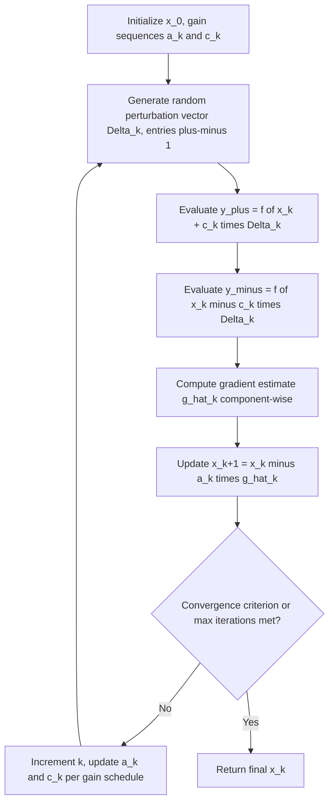

## Simultaneous Perturbation Stochastic Approximation

### Overview

Simultaneous Perturbation Stochastic Approximation (SPSA), introduced by **Spall (1992)**, is a stochastic gradient-estimation and optimization technique designed for settings where the objective function is expensive to evaluate, noisy, and high-dimensional. Its defining innovation is estimating the **entire gradient using only two function evaluations per iteration**, regardless of dimension $n$ — a dramatic reduction relative to the $n+1$ or $2n$ evaluations required by standard finite differences. This makes SPSA particularly attractive for high-dimensional black-box or simulation-based optimization problems where per-evaluation cost is high and per-coordinate finite differencing is computationally prohibitive.

### Core Idea: Simultaneous Random Perturbation

**Key Points**

- Standard central finite differences perturb **one coordinate at a time**, requiring $2n$ evaluations to build a full gradient estimate.
- SPSA instead perturbs **all coordinates simultaneously** in a single random direction, then uses the resulting two function values (one for each side of the perturbation) to estimate the *entire* gradient vector at once.
- The key insight: while the resulting per-coordinate gradient estimate is much noisier than a coordinate-wise finite difference, this noise averages out over many iterations of a stochastic approximation scheme, and the massive reduction in evaluations per iteration allows for many more iterations within a fixed evaluation budget.

### The SPSA Gradient Estimator

At each iteration $k$, generate a random perturbation vector $\Delta_k \in \mathbb{R}^n$ whose components are typically drawn independently from a symmetric Bernoulli $\pm 1$ distribution (i.e., each component is $+1$ or $-1$ with equal probability):

$$\Delta_k = (\Delta_{k,1}, \dots, \Delta_{k,n})^T, \quad \Delta_{k,i} \in \{-1, +1\}$$

Evaluate the (possibly noisy) objective at two perturbed points:

$$y_k^+ = f(x_k + c_k \Delta_k) + \epsilon_k^+, \qquad y_k^- = f(x_k - c_k \Delta_k) + \epsilon_k^-$$

where $c_k > 0$ is a small perturbation magnitude (analogous to the finite-difference step size $h$) and $\epsilon_k^\pm$ represents measurement noise, if present.

The **SPSA gradient estimate** for each component $i$ is:

$$\hat{g}_{k,i} = \frac{y_k^+ - y_k^-}{2 c_k \Delta_{k,i}}$$

or in vector form:

$$\hat{g}_k = \frac{y_k^+ - y_k^-}{2c_k} \begin{pmatrix} \Delta_{k,1}^{-1} \\ \vdots \\ \Delta_{k,n}^{-1} \end{pmatrix}$$

Since each $\Delta_{k,i} \in \{-1, +1\}$, note $\Delta_{k,i}^{-1} = \Delta_{k,i}$, so this simplifies to component-wise division being equivalent to component-wise multiplication in the Bernoulli case.

### Why This Works: Intuition

**Key Points**

- The scalar quantity $\frac{y_k^+ - y_k^-}{2c_k}$ approximates the directional derivative of $f$ along $\Delta_k$, scaled appropriately.
- Dividing by $\Delta_{k,i}$ (or equivalently multiplying, for $\pm 1$ perturbations) "distributes" this single directional-derivative estimate across all $n$ components simultaneously.
- Any individual component $\hat{g}_{k,i}$ is a poor (high-variance) estimate of $\partial f/\partial x_i$ on its own — it contains contributions from cross-terms with all other coordinates' partial derivatives, which are not actually canceled out in a single iteration.
- **Key Points**: What makes SPSA work is that, under the stochastic approximation framework (analogous to Robbins-Monro stochastic gradient descent), these per-iteration biases and cross-terms have **zero mean when averaged over the random distribution of $\Delta_k$**, so that the overall iterative process converges despite each individual gradient estimate being noisy and biased.

### The SPSA Optimization Algorithm

The gradient estimate is used within a stochastic-approximation-style update, analogous to stochastic gradient descent:

$$x_{k+1} = x_k - a_k \hat{g}_k$$

where $a_k > 0$ is a decreasing gain sequence (step size), typically:

$$a_k = \frac{a}{(k + 1 + A)^\alpha}, \qquad c_k = \frac{c}{(k+1)^\gamma}$$

with commonly recommended values $\alpha = 0.602$, $\gamma = 0.101$ (Spall's original suggested defaults, chosen to satisfy the stochastic approximation convergence conditions while balancing practical performance), $A$ a small "stability constant" (often $\approx 10\%$ of the expected total number of iterations), and $a, c$ tuned to the problem's scale. [Unverified] — while these coefficient values are widely cited in the SPSA literature as reasonable starting points, optimal tuning is problem-dependent and often requires empirical adjustment.

### Algorithm Flow

### Illustrative Comparison: SPSA vs. Coordinate-Wise Finite Differences

<svg xmlns="http://www.w3.org/2000/svg" viewBox="0 0 800 400" font-family="Helvetica, Arial, sans-serif">
  <text x="400" y="28" text-anchor="middle" font-size="18" font-weight="bold" fill="#1a1a1a">SPSA vs. Coordinate-Wise Finite Differences (svg_diagram)</text>

  
  <text x="200" y="60" text-anchor="middle" font-size="14" font-weight="bold" fill="#2980b9">Central Finite Differences</text>
  <circle cx="200" cy="220" r="6" fill="#c0392b" />
  <text x="200" y="245" text-anchor="middle" font-size="11" fill="#333">x_k</text>

  <line x1="200" y1="220" x2="280" y2="220" stroke="#2980b9" stroke-width="2" marker-end="url(#a1)" />
  <line x1="200" y1="220" x2="120" y2="220" stroke="#2980b9" stroke-width="2" marker-end="url(#a1)" />
  <text x="290" y="220" font-size="10" fill="#2980b9">+e1</text>
  <text x="80" y="220" font-size="10" fill="#2980b9">-e1</text>

  <line x1="200" y1="220" x2="200" y2="150" stroke="#2980b9" stroke-width="2" marker-end="url(#a1)" />
  <line x1="200" y1="220" x2="200" y2="290" stroke="#2980b9" stroke-width="2" marker-end="url(#a1)" />
  <text x="200" y="140" text-anchor="middle" font-size="10" fill="#2980b9">+e2</text>
  <text x="200" y="305" text-anchor="middle" font-size="10" fill="#2980b9">-e2</text>

  <text x="200" y="340" text-anchor="middle" font-size="11" fill="#333">2n = 4 evaluations for n = 2</text>
  <text x="200" y="358" text-anchor="middle" font-size="11" fill="#333">(scales linearly with n)</text>

  
  <text x="600" y="60" text-anchor="middle" font-size="14" font-weight="bold" fill="#8e44ad">SPSA</text>
  <circle cx="600" cy="220" r="6" fill="#c0392b" />
  <text x="600" y="245" text-anchor="middle" font-size="11" fill="#333">x_k</text>

  <line x1="600" y1="220" x2="660" y2="170" stroke="#8e44ad" stroke-width="2.5" marker-end="url(#a2)" />
  <line x1="600" y1="220" x2="540" y2="270" stroke="#8e44ad" stroke-width="2.5" marker-end="url(#a2)" />
  <text x="670" y="165" font-size="10" fill="#8e44ad">+c_k·Δ_k</text>
  <text x="470" y="280" font-size="10" fill="#8e44ad">-c_k·Δ_k</text>

  <text x="600" y="340" text-anchor="middle" font-size="11" fill="#333">2 evaluations regardless of n</text>
  <text x="600" y="358" text-anchor="middle" font-size="11" fill="#333">(single random simultaneous direction)</text>

  </svg>

### Comparison: SPSA vs. Finite Differences vs. Model-Based DFO

| Aspect | SPSA | Standard Finite Differences | Model-Based Trust Region DFO |
|---|---|---|---|
| Evaluations per gradient estimate | 2 (constant, independent of $n$) | $n+1$ (forward) or $2n$ (central) | Varies; amortized via reused interpolation history |
| Scaling with dimension $n$ | Excellent — constant cost per iteration | Poor — linear cost per iteration | Moderate — quadratic model cost grows with $n$ |
| Robustness to noisy $f$ | Designed for noisy settings; core motivating use case | Poor — differencing amplifies noise | Requires regression-based variants for noise robustness |
| Per-iteration gradient estimate quality | High variance, individually poor | Much more accurate (deterministic, given $h$) | Model gradient reflects fitted surface, generally more stable |
| Convergence rate | Generally slower per-iteration (stochastic approximation rate) | Faster once combined with a good optimizer, if $f$ is smooth/low-noise | Can approach superlinear in favorable, well-poised settings |
| Best suited for | High-dimensional, expensive, noisy black-box objectives | Low-to-moderate dimensional smooth problems | Low-to-moderate dimensional problems where sample efficiency matters most |

### Convergence Properties

**Key Points**

- SPSA convergence theory is grounded in the broader **stochastic approximation** framework (Robbins-Monro conditions): under suitable conditions on the gain sequences ($\sum a_k = \infty$, $\sum a_k^2 < \infty$, and analogous conditions on $c_k$), along with smoothness and boundedness assumptions on $f$, the iterates converge to a stationary point **almost surely**.
- Convergence is generally **asymptotic and probabilistic** in nature, distinct from the deterministic worst-case guarantees available for GPS/GSS pattern search or model-based trust region DFO — SPSA provides no deterministic per-iteration decrease guarantee, only long-run statistical convergence.
- The convergence rate is typically slower (in terms of function evaluations needed) than well-tuned deterministic DFO methods on smooth, low-dimensional, low-noise problems, but SPSA's relative advantage grows as dimension increases and/or noise levels increase, which is precisely its intended operating regime. [Inference] the crossover point at which SPSA becomes more efficient than deterministic alternatives is problem-dependent and not governed by a single universal threshold.

### Variants and Extensions

- **Second-order SPSA**: extends the same simultaneous-perturbation idea to estimate an approximate Hessian using additional perturbed evaluations, enabling a Newton-like update; this trades some of SPSA's evaluation-efficiency advantage for improved local convergence behavior.
- **One-measurement SPSA**: a further-reduced variant using only a single function evaluation per iteration (comparing against a running average or previous value rather than a paired $y^+, y^-$), at the cost of even higher gradient estimate variance.
- **Averaging / iterate averaging**: since SPSA gradient estimates are noisy, some implementations average recent iterates (Polyak-Ruppert-style averaging) to reduce the variance of the final reported solution relative to using the last raw iterate directly.

### Practical Considerations

- **Gain sequence tuning**: SPSA's practical performance is sensitive to the choice of $a$, $c$, $\alpha$, $\gamma$, and $A$; while Spall's suggested defaults for $\alpha$ and $\gamma$ are widely used starting points, $a$ and $c$ typically require problem-specific calibration (e.g., via a small number of pilot evaluations to estimate appropriate scales).
- **Perturbation distribution choice**: the symmetric Bernoulli $\pm 1$ distribution is standard and satisfies the theoretical requirements for unbiasedness (specifically, requiring finite inverse moments, which Bernoulli $\pm 1$ trivially satisfies since $|\Delta_{k,i}| = 1$ always); using a continuous distribution like Gaussian perturbations violates this requirement and is generally avoided in standard SPSA implementations.
- **Noisy objectives**: SPSA is often specifically chosen (over deterministic finite differences) precisely when $f$ includes genuine measurement or simulation noise, since coordinate-wise finite differences would otherwise require careful noise-aware step-size tuning per the trade-offs discussed previously, whereas SPSA's stochastic approximation framework is designed to average out such noise across iterations.
- **When SPSA is not the right tool**: for smooth, low-noise, low-to-moderate dimensional problems where deterministic methods (finite-difference gradients with BFGS, or model-based DFO) are applicable, those methods generally converge in fewer total function evaluations, since SPSA's per-iteration information content is deliberately minimal in exchange for dimension-independent cost.

### Common Pitfalls

- Applying SPSA to low-dimensional, smooth, noise-free problems where deterministic finite-difference or model-based DFO methods would converge in substantially fewer total evaluations.
- Using a non-Bernoulli (e.g., uniform or Gaussian) perturbation distribution without verifying it satisfies the theoretical moment conditions required for unbiased gradient estimation.
- Failing to tune the gain sequences ($a_k$, $c_k$) to the problem's scale, leading to either painfully slow convergence (steps too small) or divergence/instability (steps too large).
- Expecting a single SPSA gradient estimate at one iteration to resemble a true gradient — individual estimates are intentionally noisy, and only the aggregate stochastic approximation process is expected to converge.
- Treating SPSA's convergence guarantee as equivalent in strength to deterministic DFO methods' guarantees — SPSA's convergence is almost-sure/asymptotic under stochastic approximation conditions, not a deterministic per-iteration guarantee.

**Related Topics**

- Stochastic approximation theory and Robbins-Monro conditions
- Stochastic gradient descent and its relationship to SPSA's update structure
- Second-order SPSA for approximate Newton-type updates
- Noise-aware model-based DFO (DFO-LS) as a deterministic alternative for noisy objectives
- Polyak-Ruppert iterate averaging for variance reduction
- High-dimensional black-box optimization methods (comparison with evolutionary strategies, CMA-ES)