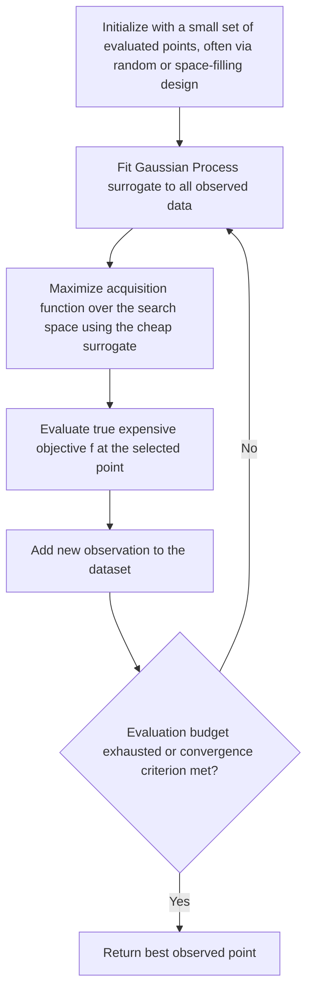

## Bayesian Optimization Fundamentals

### Overview

Bayesian optimization (BO) is a sample-efficient strategy for optimizing expensive-to-evaluate, black-box objective functions, typically in **low-to-moderate dimensions** (commonly cited practical ranges are roughly up to 20 dimensions, [Unverified] — exact practical limits vary by implementation and problem structure). Unlike the local, iterative refinement approach of model-based trust region DFO or direct search methods, Bayesian optimization maintains a **global probabilistic surrogate model** of the entire objective function, using it to reason about uncertainty and to decide *where* to sample next in a way that explicitly balances exploring unknown regions against exploiting regions already known to be promising.

### Core Idea: Surrogate Model + Acquisition Function

**Key Points**

Bayesian optimization consists of two interacting components repeated in a loop:

1. **Surrogate model**: a probabilistic model (most commonly a **Gaussian Process**, GP) fit to all function evaluations observed so far, providing both a predicted mean $\mu(x)$ and predictive uncertainty $\sigma(x)$ at every point $x$ in the search space — not just at previously evaluated points.
2. **Acquisition function**: a function $\alpha(x)$, computed cheaply from the surrogate model's mean and uncertainty, that scores candidate points by how promising they are to evaluate next. The next evaluation point is chosen by maximizing the acquisition function:

$$x_{k+1} = \arg\max_{x \in \mathcal{X}} \alpha(x)$$

- This inner maximization is itself an optimization problem, but crucially one performed on the **cheap surrogate model**, not on the expensive true objective — this is the central mechanism that makes Bayesian optimization sample-efficient for the true objective.

### Gaussian Process Surrogate Models

**Key Points**

A Gaussian Process defines a distribution over functions, fully specified by a mean function $m(x)$ (often taken as zero or a constant, by convention) and a covariance (kernel) function $k(x, x')$:

$$f(x) \sim \mathcal{GP}(m(x), k(x, x'))$$

- The kernel $k(x, x')$ encodes assumptions about the smoothness and structure of $f$ — a common choice is the **squared exponential (RBF) kernel**:

$$k(x, x') = \sigma_f^2 \exp\left(-\frac{\|x - x'\|^2}{2\ell^2}\right)$$

where $\ell$ (length scale) controls how quickly correlation decays with distance, and $\sigma_f^2$ controls output variance.

- Given observed data $\{(x_i, y_i)\}_{i=1}^{n}$, the GP posterior at a new point $x$ is Gaussian with closed-form mean and variance:

$$\mu(x) = k(x)^T (K + \sigma_n^2 I)^{-1} y, \qquad \sigma^2(x) = k(x,x) - k(x)^T (K + \sigma_n^2 I)^{-1} k(x)$$

where $K$ is the $n \times n$ matrix of kernel values between observed points, $k(x)$ is the vector of kernel values between $x$ and each observed point, and $\sigma_n^2$ accounts for observation noise.

- **Key Points**: This closed-form posterior is what makes GPs computationally convenient as a surrogate — both the predicted value and, critically, the **predictive uncertainty** $\sigma(x)$ are available everywhere in the search space without any additional function evaluations, including at points far from any observed data (where uncertainty is naturally high).

### Illustration: GP Posterior with Uncertainty Bands

<svg xmlns="http://www.w3.org/2000/svg" viewBox="0 0 800 400" font-family="Helvetica, Arial, sans-serif">
  <text x="400" y="28" text-anchor="middle" font-size="18" font-weight="bold" fill="#1a1a1a">Gaussian Process Posterior (svg_diagram)</text>

  <line x1="60" y1="330" x2="740" y2="330" stroke="#333" stroke-width="1.5" />
  <line x1="60" y1="330" x2="60" y2="60" stroke="#333" stroke-width="1.5" />
  <text x="400" y="365" text-anchor="middle" font-size="12" fill="#333">x</text>
  <text x="30" y="200" text-anchor="middle" font-size="12" fill="#333" transform="rotate(-90 30 200)">f(x)</text>

  
  <path d="M 80 200 Q 200 100 300 180 Q 400 250 500 150 Q 600 90 720 200            L 720 260 Q 600 200 500 250 Q 400 340 300 260 Q 200 190 80 280 Z" fill="#c9daf2" opacity="0.6" />

  
  <path d="M 80 240 Q 200 150 300 220 Q 400 295 500 200 Q 600 145 720 230" fill="none" stroke="#2980b9" stroke-width="2.5" />

  
  <circle cx="150" cy="170" r="6" fill="#c0392b" />
  <circle cx="300" cy="220" r="6" fill="#c0392b" />
  <circle cx="470" cy="205" r="6" fill="#c0392b" />
  <circle cx="620" cy="150" r="6" fill="#c0392b" />

  <text x="150" y="155" text-anchor="middle" font-size="10" fill="#c0392b">observed</text>

  <text x="230" y="120" font-size="11" fill="#2980b9">wide uncertainty band far from data</text>
  <line x1="220" y1="128" x2="220" y2="185" stroke="#2980b9" stroke-width="1" stroke-dasharray="2,2" />

  <text x="480" y="330" font-size="11" fill="#333" text-anchor="middle">tight uncertainty near observed points</text>

  <text x="400" y="390" text-anchor="middle" font-size="12" fill="#555">Shaded region: predictive uncertainty σ(x); solid line: posterior mean μ(x)</text>
</svg>

### Acquisition Functions

**Key Points**

Acquisition functions translate the surrogate's mean and uncertainty into a single score balancing **exploitation** (sampling where $\mu(x)$ is good) against **exploration** (sampling where $\sigma(x)$ is large, i.e., where the model is uncertain).

**Expected Improvement (EI)** — one of the most widely used acquisition functions:

$$\text{EI}(x) = \mathbb{E}\left[\max(f_{\min} - f(x), 0)\right] = (f_{\min} - \mu(x)) \, \Phi(Z) + \sigma(x) \, \phi(Z)$$

where $f_{\min}$ is the best objective value observed so far (for minimization), $Z = \frac{f_{\min} - \mu(x)}{\sigma(x)}$, and $\Phi$, $\phi$ are the standard normal CDF and PDF respectively. This has a closed form because the GP posterior at any point is Gaussian.

**Upper/Lower Confidence Bound (UCB/LCB)**:

$$\text{LCB}(x) = \mu(x) - \kappa \, \sigma(x)$$

(for minimization; the sign is flipped for maximization as UCB), where $\kappa > 0$ is a tunable parameter directly controlling the exploration-exploitation trade-off — larger $\kappa$ favors exploring uncertain regions more aggressively.

**Probability of Improvement (PI)**:

$$\text{PI}(x) = \Phi\left(\frac{f_{\min} - \mu(x)}{\sigma(x)}\right)$$

- **Key Points**: PI tends to favor exploitation more heavily than EI in practice, since it only considers the probability of *any* improvement rather than the *magnitude* of expected improvement, which is part of why EI is generally the more commonly recommended default. [Inference] the degree to which PI under-explores relative to EI in a given application is problem-dependent, though the qualitative tendency is a well-documented characteristic of the two acquisition functions.

### Algorithm Flow

### Exploration-Exploitation Trade-off

**Key Points**

- Pure exploitation (always sampling where $\mu(x)$ is best) risks premature convergence to a local optimum if the surrogate model is inaccurate in unexplored regions.
- Pure exploration (always sampling where $\sigma(x)$ is largest) wastes evaluations refining the model in regions unlikely to contain the optimum, ignoring known promising areas.
- All standard acquisition functions (EI, UCB, PI) are explicitly constructed to balance both terms mathematically, rather than requiring a separate heuristic scheduling mechanism — this built-in balance is a key structural feature distinguishing Bayesian optimization from simpler surrogate-based or greedy search strategies.
- The UCB/LCB parameter $\kappa$ offers the most direct and interpretable exploration-exploitation control among common acquisition functions, since it appears as an explicit linear weighting on the uncertainty term.

### Why Bayesian Optimization Is Sample-Efficient

- The GP surrogate model uses **all** past observations jointly (through the kernel-based covariance structure) to inform predictions everywhere in the search space, in contrast to purely local methods that primarily rely on nearby recent evaluations.
- Because the expensive step (evaluating true $f$) happens only once per outer iteration, while the acquisition function optimization (on the cheap surrogate) can be performed as thoroughly as needed, BO effectively shifts computational effort from expensive evaluations to cheap surrogate-based reasoning — a favorable trade when true function evaluations dominate total cost (e.g., hyperparameter tuning runs, physical experiments, expensive simulations).
- [Inference] This sample efficiency advantage is most pronounced when function evaluations are very expensive relative to the surrogate-fitting and acquisition-optimization overhead; for cheap-to-evaluate objectives, the overhead of maintaining and fitting a GP can make BO less attractive than simpler direct search or model-based DFO methods.

### Comparison: Bayesian Optimization vs. Other Derivative-Free Approaches

| Aspect | Bayesian Optimization | Model-Based Trust Region DFO | Direct Search (Nelder-Mead, Pattern Search) |
|---|---|---|---|
| Surrogate scope | Global (single model over entire search space) | Local (model valid only near current iterate) | None (no explicit surrogate) |
| Uncertainty quantification | Explicit, probabilistic (GP variance) | Not typically modeled explicitly | Not modeled |
| Typical evaluation budget | Very small (tens to low hundreds of evaluations) | Small to moderate | Moderate to large |
| Dimension scaling | Degrades notably beyond roughly 20 dimensions [Unverified] | Degrades as $n$ grows (quadratic model cost) | Degrades with $n$, though less surrogate-fitting overhead |
| Handles noisy objectives | Yes — GP naturally incorporates observation noise $\sigma_n^2$ | Requires regression-based variants | Comparatively tolerant, though noise still affects comparisons |
| Global vs. local optimization character | Explicitly designed with global exploration in mind | Primarily local/greedy, though radius resets can aid exploration somewhat | Primarily local, though some pattern search variants incorporate multi-start |

### Computational Cost Considerations

**Key Points**

- Standard GP regression requires inverting (or factorizing) the $n \times n$ kernel matrix $K$, an $O(n^3)$ operation in the number of observed points — this becomes a computational bottleneck as the number of evaluations grows, generally limiting standard GP-based BO to a few hundred to low thousands of total evaluations. [Unverified] — exact practical limits depend on implementation, available approximations, and computational resources.
- **Sparse GP approximations** and other scalable GP variants exist specifically to address this cubic scaling, extending BO's practical applicability to larger evaluation budgets, though at some cost to model fidelity or exact posterior correctness.
- The acquisition function optimization step, while performed on the cheap surrogate rather than the true objective, is itself a (typically low-dimensional, multimodal) optimization problem and is commonly solved using multi-start gradient-based optimization or a DFO method, since acquisition functions like EI can have multiple local maxima.

### Practical Considerations

- **Initial design**: Bayesian optimization typically begins with a small number of initial points selected via a space-filling design (e.g., Latin hypercube sampling) rather than a single starting point, to give the GP a reasonable initial fit across the search space before acquisition-driven sampling begins.
- **Kernel and hyperparameter selection**: GP kernel hyperparameters (length scale $\ell$, output variance $\sigma_f^2$, noise variance $\sigma_n^2$) are typically fit by maximizing the marginal likelihood of the observed data, and are usually re-fit as new observations are added.
- **Handling constraints**: constrained Bayesian optimization extends the framework by modeling constraint functions with additional GPs and incorporating feasibility probability into the acquisition function, rather than requiring a separate penalty or barrier approach.
- **Batch/parallel Bayesian optimization**: variants exist for selecting multiple points to evaluate in parallel per iteration (rather than strictly one at a time), which is relevant when multiple expensive evaluations can be run concurrently, analogous to the parallelization benefit noted for pattern search polling.

### Common Pitfalls

- Applying standard GP-based Bayesian optimization to high-dimensional problems (well beyond the practical range where GP surrogates remain reliable and computationally tractable) without dimensionality reduction or specialized high-dimensional BO variants.
- Using Bayesian optimization for cheap-to-evaluate objectives, where the overhead of GP fitting and acquisition optimization is unjustified relative to simpler, faster methods.
- Neglecting to account for observation noise in the GP model (assuming $\sigma_n^2 = 0$) when the true objective is genuinely noisy, which can cause the surrogate to overfit to noise rather than the underlying trend.
- Choosing an acquisition function (e.g., pure exploitation-heavy PI) without considering whether it matches the desired exploration-exploitation balance for the problem at hand.
- Ignoring the $O(n^3)$ scaling of standard GP regression when planning an evaluation budget, leading to unexpectedly severe slowdowns as the number of observations grows.

**Related Topics**

- Gaussian Process regression theory (kernel selection, hyperparameter marginal likelihood optimization)
- Sparse and scalable Gaussian Process approximations for large evaluation budgets
- Constrained and multi-objective Bayesian optimization
- Batch/parallel acquisition function strategies
- Hyperparameter optimization in machine learning as a primary Bayesian optimization application
- Comparison with evolutionary strategies and CMA-ES for black-box global optimization