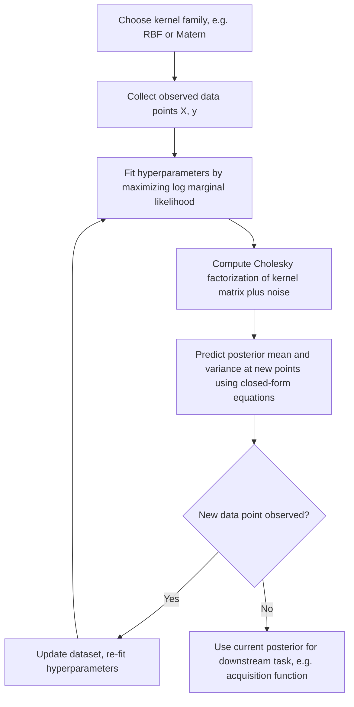

## Gaussian Process Surrogate Models

### Overview

Gaussian Processes (GPs) are the most widely used surrogate model in Bayesian optimization, and more broadly serve as a general-purpose probabilistic modeling tool for regression under uncertainty. This section examines GPs in depth as a standalone topic: their formal definition, the role of the kernel/covariance function in encoding modeling assumptions, hyperparameter estimation, and the practical considerations that determine how well a GP surrogate performs — extending the introductory treatment given in the Bayesian optimization overview.

### Formal Definition

**Key Points**

A Gaussian Process is formally defined as a collection of random variables, any finite subset of which has a joint multivariate Gaussian distribution. A GP is fully specified by:

$$f(x) \sim \mathcal{GP}(m(x), k(x, x'))$$

- **Mean function** $m(x) = \mathbb{E}[f(x)]$ — often set to zero (or a constant) by convention, since the kernel typically does the modeling work and the mean can be absorbed into the data via centering.
- **Covariance (kernel) function** $k(x, x') = \mathbb{E}[(f(x) - m(x))(f(x') - m(x'))]$ — encodes the assumed relationship between function values at different input points, and is the primary mechanism by which prior beliefs about the function's smoothness, periodicity, or other structure are introduced into the model.

For any finite set of input points $X = \{x_1, \dots, x_n\}$, the corresponding function values are jointly Gaussian:

$$f(X) \sim \mathcal{N}(m(X), K(X, X))$$

where $K(X,X)$ is the $n \times n$ matrix with entries $K_{ij} = k(x_i, x_j)$.

### Kernel (Covariance) Functions

**Key Points**

The kernel is the central modeling choice in a GP — it encodes what "similar" inputs mean for the purposes of predicting correlated outputs, and thus governs the entire character of functions the GP considers plausible.

**Squared Exponential (RBF) Kernel**:

$$k_{\text{SE}}(x, x') = \sigma_f^2 \exp\left(-\frac{\|x - x'\|^2}{2\ell^2}\right)$$

- Produces very smooth (infinitely differentiable) sample functions.
- $\ell$ (length scale) controls how quickly correlation decays with distance — small $\ell$ allows rapid variation, large $\ell$ enforces slowly varying, smoother functions.
- $\sigma_f^2$ (signal variance) controls the overall scale of function value variation.

**Matérn Kernel** (a generalization allowing rougher functions):

$$k_{\text{Matérn}}(x, x') = \sigma_f^2 \frac{2^{1-\nu}}{\Gamma(\nu)} \left(\frac{\sqrt{2\nu} \|x-x'\|}{\ell}\right)^\nu K_\nu\left(\frac{\sqrt{2\nu}\|x-x'\|}{\ell}\right)$$

where $K_\nu$ is the modified Bessel function and $\nu$ controls smoothness — as $\nu \to \infty$, the Matérn kernel converges to the squared exponential kernel; common practical choices are $\nu = 3/2$ or $\nu = 5/2$, which yield once- or twice-differentiable sample functions respectively, often considered more realistic than the infinitely smooth RBF assumption for many physical or engineering objectives. [Inference] whether Matérn's rougher smoothness assumption is more appropriate than RBF depends on the true underlying function's actual smoothness, which is generally unknown in practice.

**Periodic Kernel**:

$$k_{\text{periodic}}(x, x') = \sigma_f^2 \exp\left(-\frac{2\sin^2(\pi |x-x'|/p)}{\ell^2}\right)$$

used when the objective is known or suspected to have periodic structure, with $p$ controlling the period.

**Linear Kernel**:

$$k_{\text{linear}}(x, x') = \sigma_f^2 (x - c)^T (x' - c)$$

which produces GP samples equivalent to Bayesian linear regression, useful as a component when part of the underlying function is believed to be linear or near-linear.

### Kernel Composition

- Kernels can be **added** or **multiplied** to construct more expressive covariance structures while preserving validity as a positive semi-definite kernel: $k(x,x') = k_1(x,x') + k_2(x,x')$ or $k(x,x') = k_1(x,x') \cdot k_2(x,x')$.
- Example: a linear kernel plus a periodic kernel can model a function with both a long-term trend and periodic fluctuations.
- **Automatic Relevance Determination (ARD)**: using a separate length scale $\ell_i$ for each input dimension, $k(x,x') = \sigma_f^2 \exp\left(-\sum_i \frac{(x_i - x_i')^2}{2\ell_i^2}\right)$, allows the model to learn that some dimensions are more relevant (smaller $\ell_i$, sharper variation) than others (larger $\ell_i$, i.e. that dimension matters less), which can serve as an implicit feature-relevance diagnostic in addition to improving fit.

### Illustration: Effect of Length Scale on Sample Functions

<svg xmlns="http://www.w3.org/2000/svg" viewBox="0 0 800 420" font-family="Helvetica, Arial, sans-serif">
  <text x="400" y="28" text-anchor="middle" font-size="18" font-weight="bold" fill="#1a1a1a">Effect of Kernel Length Scale on GP Samples (svg_diagram)</text>

  
  <text x="180" y="60" text-anchor="middle" font-size="13" font-weight="bold" fill="#2980b9">Short ℓ (rapid variation)</text>
  <line x1="60" y1="200" x2="340" y2="200" stroke="#ccc" stroke-width="1" />
  <path d="M 60 200 Q 80 140 100 210 Q 120 260 140 170 Q 160 130 180 220 Q 200 250 220 160 Q 240 150 260 210 Q 280 240 300 175 Q 320 145 340 200" fill="none" stroke="#2980b9" stroke-width="2" />

  
  <text x="600" y="60" text-anchor="middle" font-size="13" font-weight="bold" fill="#8e44ad">Long ℓ (smooth variation)</text>
  <line x1="460" y1="200" x2="740" y2="200" stroke="#ccc" stroke-width="1" />
  <path d="M 460 200 Q 520 130 600 190 Q 680 250 740 170" fill="none" stroke="#8e44ad" stroke-width="2" />

  
  <text x="180" y="280" text-anchor="middle" font-size="12" fill="#333">Small ℓ → tight, localized correlation</text>
  <text x="600" y="280" text-anchor="middle" font-size="12" fill="#333">Large ℓ → broad, global correlation</text>

  <text x="400" y="380" text-anchor="middle" font-size="12" fill="#555">Length scale ℓ controls how far influence extends between input points</text>
</svg>

### Predictive Equations (Posterior Inference)

Given observed data $(X, y)$ with observation noise variance $\sigma_n^2$, the GP posterior predictive distribution at new points $X_*$ is Gaussian:

$$\mu_* = K(X_*, X) \left[K(X,X) + \sigma_n^2 I\right]^{-1} y$$

$$\Sigma_* = K(X_*, X_*) - K(X_*, X)\left[K(X,X) + \sigma_n^2 I\right]^{-1} K(X, X_*)$$

- **Key Points**: These closed-form expressions are the direct consequence of the joint-Gaussian assumption underlying the GP definition — conditioning a multivariate Gaussian on a subset of its variables yields another Gaussian, with the mean and covariance given by standard Gaussian conditioning formulas.
- The $\sigma_n^2 I$ term (the "nugget" or noise variance) is essential for numerical stability (preventing the matrix from being singular when observations coincide or nearly coincide) as well as for correctly modeling genuinely noisy observations; a common default when noise is believed negligible is still a small positive "jitter" term added purely for numerical conditioning.

### Hyperparameter Estimation: Marginal Likelihood Maximization

**Key Points**

Kernel hyperparameters $\theta = (\ell, \sigma_f^2, \sigma_n^2, \dots)$ are typically estimated by maximizing the **log marginal likelihood** of the observed data:

$$\log p(y \mid X, \theta) = -\frac{1}{2} y^T (K_\theta + \sigma_n^2 I)^{-1} y - \frac{1}{2} \log |K_\theta + \sigma_n^2 I| - \frac{n}{2}\log(2\pi)$$

- This objective automatically balances **data fit** (the first term, rewarding hyperparameters that explain observed values well) against **model complexity** (the second term, a form of automatic Occam's razor penalizing overly flexible fits) — a well-known property of the marginal likelihood that gives GP hyperparameter selection an in-built regularization effect without needing a separate held-out validation set.
- Maximization is typically performed via gradient-based optimization (since analytic gradients of the marginal likelihood with respect to $\theta$ are available), though the marginal likelihood surface can be multimodal, particularly when data is sparse, motivating multi-start optimization for hyperparameter fitting.
- **Key Points**: Because the number of observations $n$ in Bayesian optimization is typically very small (tens to low hundreds), hyperparameter estimation is often statistically underdetermined in early iterations — with few data points, many different length-scale/variance combinations may fit comparably well, and the resulting posterior can be sensitive to this early-iteration uncertainty. [Inference] this sensitivity generally diminishes as more observations accumulate, though the precise rate of stabilization is problem-dependent.

### Computational Complexity

| Operation | Cost | Notes |
|---|---|---|
| Kernel matrix construction | $O(n^2 d)$ | $n$ = number of points, $d$ = input dimension |
| Cholesky factorization of $K + \sigma_n^2 I$ | $O(n^3)$ | Dominant cost; required for both prediction and marginal likelihood evaluation |
| Prediction at one new point (given factorization) | $O(n^2)$ (mean), $O(n^2)$ (variance) | Reuses the factorization from training |
| Marginal likelihood gradient (per hyperparameter) | $O(n^3)$ (naively) or $O(n^2)$ with factorization reuse | Required at each optimization step during hyperparameter fitting |

- The $O(n^3)$ Cholesky factorization cost is the well-known scalability bottleneck of exact GP regression, motivating **sparse GP approximations** (e.g., inducing point methods, which approximate the full GP using a smaller set of $m \ll n$ representative points, reducing cost to roughly $O(nm^2)$) when the number of observations grows beyond a few thousand.

### Illustration: GP Regression Workflow

### GPs as a Prior over Functions: Conceptual Framing

**Key Points**

- Before observing any data, a GP with a given kernel defines a **prior distribution over functions** — sampling from this prior (without conditioning on data) produces random functions whose smoothness and structure reflect the kernel's assumptions (e.g., RBF samples are smooth wiggly curves; linear kernel samples are straight lines with random slope/intercept).
- Observing data and conditioning on it (via the predictive equations above) transforms this prior into a **posterior over functions**, which is consistent with the observed values (up to noise $\sigma_n^2$) while reverting to the prior's behavior (increasing uncertainty) away from observed points.
- This prior-to-posterior framing is why GPs are considered a genuinely **Bayesian** approach to regression — the choice of kernel is an explicit, interpretable statement of prior belief about the function's character, distinct from purely frequentist curve-fitting techniques.

### Practical Considerations

- **Kernel choice as a modeling decision**: selecting RBF vs. Matérn vs. a composite kernel is not merely a technical detail but reflects an assumption about the objective function's true smoothness; mismatched kernel assumptions can degrade both predictive accuracy and, in the Bayesian optimization context, the quality of decisions made from the acquisition function.
- **Input scaling**: since kernels like RBF and Matérn depend on Euclidean distance $\|x-x'\|$, input dimensions with very different natural scales should generally be normalized (e.g., to $[0,1]$ or standardized) before GP fitting, or handled via per-dimension ARD length scales, to avoid one dimension dominating the distance calculation.
- **Numerical stability**: in addition to the noise/jitter term mentioned above, ill-conditioned kernel matrices (arising from near-duplicate points or very small length scales relative to point spacing) can cause the Cholesky factorization to fail numerically; practical implementations often include safeguards such as automatic jitter adjustment.
- **Model validation**: standard regression diagnostics (e.g., held-out log-likelihood, cross-validation) can be used to sanity-check GP kernel and hyperparameter choices, though in the Bayesian optimization setting where data is scarce and expensive, such validation is often limited or foregone in favor of relying on the marginal likelihood's built-in complexity penalty.

### Common Pitfalls

- Assuming the default RBF kernel's infinite smoothness assumption is appropriate without considering whether the true objective function might be rougher, which the Matérn family is specifically designed to accommodate.
- Neglecting input scaling/normalization before fitting a GP with a distance-based kernel, causing the model to be dominated by dimensions with larger numeric ranges regardless of their actual relevance.
- Treating hyperparameter estimates from marginal likelihood maximization as fully reliable when the dataset is very small — early-iteration hyperparameter estimates in Bayesian optimization can be poorly determined and should be interpreted cautiously.
- Ignoring the $O(n^3)$ scaling of exact GP inference when planning for a large evaluation budget, leading to unexpectedly severe slowdowns; sparse approximations should be considered proactively rather than after the fact.
- Omitting a noise/jitter term entirely under the assumption that observations are noise-free, risking numerical instability in the kernel matrix factorization.

**Related Topics**

- Sparse and inducing-point Gaussian Process approximations for scalability
- Kernel design and composition for structured or domain-specific priors
- Automatic Relevance Determination (ARD) for feature relevance in high-dimensional inputs
- Acquisition functions and their dependence on GP posterior mean/variance (revisiting Bayesian optimization fundamentals)
- Alternative surrogate models for Bayesian optimization (random forests, Bayesian neural networks, Tree-structured Parzen Estimators)
- Marginal likelihood theory and Bayesian model selection