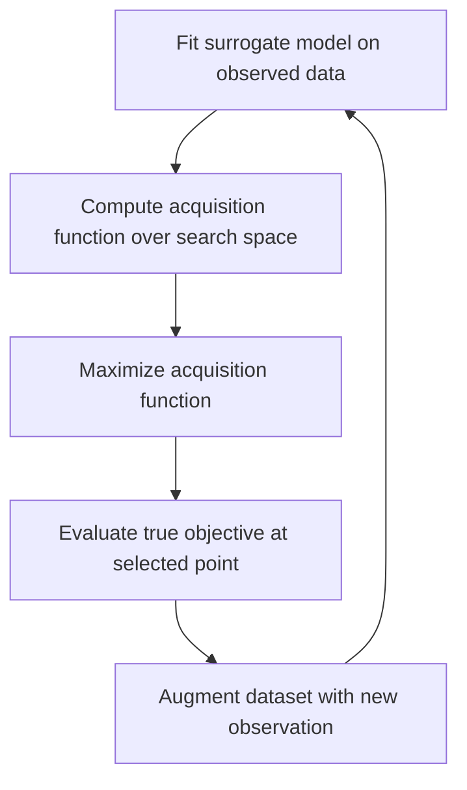

## Acquisition Functions

### Overview

Acquisition functions guide the sequential decision-making process in Bayesian optimization by quantifying the utility of evaluating the objective function at any given point in the search space. Given a probabilistic surrogate model — typically a Gaussian Process (GP) — fitted to observed data, the acquisition function transforms the surrogate's posterior mean and uncertainty into a single scalar score at each candidate point. The next evaluation point is chosen by maximizing this score. This turns the expensive-to-evaluate original objective into a cheap-to-evaluate proxy problem that can be solved with conventional optimizers.

The central tension every acquisition function must resolve is the **exploration-exploitation tradeoff**: exploitation favors points where the surrogate predicts good objective values (low mean, for minimization), while exploration favors points where the surrogate is uncertain (high variance), since these might hide better optima that the model hasn't yet discovered.

### Role in the Bayesian Optimization Loop

Bayesian optimization proceeds iteratively. At each step:

1. Fit or update the surrogate model (commonly a GP) using all observations so far.
2. Use the acquisition function to score candidate points based on the surrogate's posterior predictive distribution.
3. Optimize the acquisition function to select the next point to evaluate.
4. Evaluate the true objective at that point and append the result to the dataset.
5. Repeat until a budget is exhausted.

The acquisition function itself is typically cheap to evaluate (closed-form or fast Monte Carlo estimate), so step 3 — though itself a nonconvex optimization problem — is tractable via multi-start gradient ascent, DIRECT, or CMA-ES, even though the original objective in step 4 is expensive.

### Notation and Setup

Let $f: \mathcal{X} \to \mathbb{R}$ be the expensive black-box objective, assumed to be minimized (analogous results hold for maximization by sign flip). Given observations $\mathcal{D}_n = \{(x_i, y_i)\}_{i=1}^n$, a GP surrogate provides, at any candidate point $x$, a posterior predictive distribution:

$$f(x) \mid \mathcal{D}_n \sim \mathcal{N}(\mu_n(x), \sigma_n^2(x))$$

where $\mu_n(x)$ is the posterior mean and $\sigma_n(x)$ is the posterior standard deviation. Let $f^* = \min_i y_i$ denote the best (incumbent) objective value observed so far. Acquisition functions are built as functionals of $\mu_n(x)$, $\sigma_n(x)$, and $f^*$.

### Probability of Improvement (PI)

Probability of Improvement selects the point most likely to improve upon the current best observation by any margin.

$$\text{PI}(x) = \Phi\left(\frac{f^* - \mu_n(x) - \xi}{\sigma_n(x)}\right)$$

Here $\Phi$ is the standard normal CDF, and $\xi \geq 0$ is an exploration parameter that requires improvement to exceed a small margin, preventing the acquisition function from clustering evaluations around marginally better points.

**Key Points**
- PI only cares about the *probability* of any improvement, not its *magnitude* — a candidate with a 90% chance of a tiny improvement can outscore a candidate with a 40% chance of a huge improvement.
- Without a nonzero $\xi$, PI tends to be overly exploitative, repeatedly sampling near the current incumbent.
- Cheap to compute and easy to interpret, but rarely used alone in modern implementations due to its exploitation bias.

### Expected Improvement (EI)

Expected Improvement addresses PI's blindness to improvement magnitude by integrating over the full distribution of possible improvement.

Define the improvement at $x$ as $I(x) = \max(f^* - f(x), 0)$ (for minimization). Taking the expectation under the GP posterior yields a closed form:

$$\text{EI}(x) = \begin{cases} (f^* - \mu_n(x) - \xi)\,\Phi(z) + \sigma_n(x)\,\phi(z) & \text{if } \sigma_n(x) > 0 \\ 0 & \text{if } \sigma_n(x) = 0 \end{cases}$$

where

$$z = \frac{f^* - \mu_n(x) - \xi}{\sigma_n(x)}$$

and $\phi$ is the standard normal PDF.

**Key Points**
- The first term $(f^* - \mu_n(x) - \xi)\Phi(z)$ rewards low predicted mean (exploitation).
- The second term $\sigma_n(x)\phi(z)$ rewards high predicted uncertainty (exploration).
- EI is the most widely used acquisition function in practice due to its closed form under Gaussian posteriors, smooth gradients, and balanced exploration-exploitation behavior.
- The exploration parameter $\xi$ (often set around 0.01) trades off exploitation vs. exploration; higher $\xi$ biases toward exploration.

**Example**

Suppose the incumbent best is $f^* = 2.0$. At candidate point $x_1$: $\mu_n(x_1) = 1.8$, $\sigma_n(x_1) = 0.05$ (confident, near-incumbent prediction). At candidate point $x_2$: $\mu_n(x_2) = 2.3$, $\sigma_n(x_2) = 1.0$ (uncertain region).

With $\xi = 0$:
- For $x_1$: $z = (2.0 - 1.8)/0.05 = 4.0$, so $\Phi(4.0) \approx 1.0$ and $\phi(4.0) \approx 0.0001$. $\text{EI}(x_1) \approx 0.2 \times 1.0 + 0.05 \times 0.0001 \approx 0.2$.
- For $x_2$: $z = (2.0 - 2.3)/1.0 = -0.3$, so $\Phi(-0.3) \approx 0.382$ and $\phi(-0.3) \approx 0.381$. $\text{EI}(x_2) \approx (-0.3)(0.382) + (1.0)(0.381) \approx -0.115 + 0.381 = 0.266$.

Despite $x_2$'s worse predicted mean, its high uncertainty gives it a slightly higher EI, illustrating how EI can favor exploration over a confident but only mediocre prediction.

### Upper/Lower Confidence Bound (UCB/LCB)

Confidence bound acquisition functions take a more direct, tunable approach to the exploration-exploitation tradeoff, without requiring probabilistic integration.

For maximization (Upper Confidence Bound):

$$\text{UCB}(x) = \mu_n(x) + \kappa\,\sigma_n(x)$$

For minimization (Lower Confidence Bound):

$$\text{LCB}(x) = \mu_n(x) - \kappa\,\sigma_n(x)$$

where $\kappa > 0$ explicitly controls the exploration weight.

**Key Points**
- Simplicity: no CDF/PDF evaluation, just a linear combination of mean and standard deviation.
- $\kappa$ is directly interpretable — larger values push the search toward higher-uncertainty regions.
- The GP-UCB variant (Srinivas et al.) provides theoretical regret bounds by scheduling $\kappa$ to grow logarithmically with iteration count $t$, e.g. $\kappa_t = \sqrt{2 \log(t^{d/2+2}\pi^2/(3\delta))}$ for a $d$-dimensional space and confidence level $1-\delta$. [Inference] The exact constants in this schedule vary across papers and are frequently simplified or hand-tuned in practical implementations rather than applied literally.
- Because UCB/LCB has no closed-form probabilistic justification tied to "improvement," it's often favored when regret bounds or worst-case guarantees are the priority, e.g., in some active learning and safe optimization settings.

### Thompson Sampling

Thompson Sampling takes a fundamentally different, sampling-based approach rather than computing a deterministic acquisition score.

At each iteration:
1. Draw a sample function $\tilde{f}$ from the GP posterior over the entire domain (or from posterior at a discrete candidate set).
2. Select $x_{n+1} = \arg\min_x \tilde{f}(x)$ (or $\arg\max$ for maximization).

**Key Points**
- No explicit acquisition function formula — the "acquisition" is implicit in the stochastic sampling process itself.
- Naturally handles exploration-exploitation balance: points with high posterior variance are more likely to yield extreme sampled values, and thus are more likely to be selected occasionally, without a manually tuned exploration parameter.
- Particularly well suited to **parallel/batch Bayesian optimization**: independent posterior draws for each batch member naturally diversify the batch without needing explicit batch-aware acquisition functions like q-EI.
- Exact sampling of a continuous GP sample path is intractable in general; practical implementations use random Fourier features or discretized candidate sets to approximate the sampled function. [Unverified] The specific approximation quality depends heavily on the chosen basis expansion and candidate set density, which are implementation- and library-specific.

### Entropy Search and Predictive Entropy Search

These information-theoretic acquisition functions target a different objective than improvement-based methods: they aim to reduce uncertainty about the *location of the global optimum* $x^*$, rather than uncertainty about the *function value* at any point.

Entropy Search (ES) chooses the point that maximizes the expected reduction in entropy of the posterior distribution over $x^*$:

$$\alpha_{ES}(x) = H[p(x^* \mid \mathcal{D}_n)] - \mathbb{E}_{y}\left[H[p(x^* \mid \mathcal{D}_n \cup \{(x,y)\})]\right]$$

Predictive Entropy Search (PES) reformulates this via a symmetry of mutual information to avoid directly estimating the (difficult) distribution over $x^*$, instead working with the predictive distribution, which is more tractable.

**Key Points**
- Computationally significantly more expensive than EI/UCB — requires approximating the distribution over the argmin, typically via Monte Carlo sampling of GP posterior paths or expectation propagation.
- Tends to produce more globally exploratory search behavior, since it isn't tied to the current best incumbent value the way EI and PI are.
- Max-value Entropy Search (MES) is a related, more computationally efficient variant that targets the entropy of the optimal *value* $f(x^*)$ rather than the optimal *location* $x^*$, which is a lower-dimensional (scalar) quantity and thus cheaper to estimate.

### Knowledge Gradient (KG)

The Knowledge Gradient acquisition function measures the expected improvement in the best achievable posterior mean after observing a new point — accounting for how a noisy observation updates beliefs everywhere in the domain, not just at the observed location.

$$\text{KG}(x) = \mathbb{E}_y\left[\min_{x'} \mu_{n+1}(x') \mid x, y\right] - \min_{x'} \mu_n(x')$$

**Key Points**
- Unlike EI, which only considers improvement relative to observed data points, KG accounts for the fact that a single new observation updates the posterior mean *everywhere* through the GP's correlation structure, so the "best point" after the update may not be one that's ever been observed.
- Particularly useful when the objective is noisy, since EI's dependence on $f^*$ (the best *observed* value) becomes less reliable under observation noise, whereas KG works directly with posterior means.
- Requires nested optimization (an inner minimization over $x'$ inside an outer expectation over $y$), making it substantially more expensive to evaluate than EI or UCB; typically approximated via Monte Carlo and discretization.

### Comparison of Acquisition Functions

| Acquisition Function | Exploration Control | Closed Form | Relative Cost | Best Suited For |
|---|---|---|---|---|
| PI | Implicit via $\xi$ | Yes | Low | Simple, fast-converging tasks; rarely used alone |
| EI | Implicit via $\xi$ | Yes | Low | General-purpose default |
| UCB/LCB | Explicit via $\kappa$ | Yes | Low | Regret-bound-driven / theoretical settings |
| Thompson Sampling | Implicit via posterior variance | No (sampling-based) | Medium | Parallel/batch optimization |
| Entropy Search / PES | Implicit via information gain | No (requires approximation) | High | Global optimum location matters more than value |
| Knowledge Gradient | Implicit via posterior mean update | No (nested optimization) | High | Noisy objectives, decision-theoretic settings |

### Exploration-Exploitation Illustration

<svg xmlns="http://www.w3.org/2000/svg" viewBox="0 0 700 420">
  <text x="350" y="30" text-anchor="middle" font-size="18" font-weight="bold" fill="#1a1a1a">Acquisition Function Behavior Near a GP Posterior (svg_diagram)</text>

  <line x1="60" y1="350" x2="650" y2="350" stroke="#333" stroke-width="2" />
  <line x1="60" y1="350" x2="60" y2="70" stroke="#333" stroke-width="2" />
  <text x="355" y="390" text-anchor="middle" font-size="13" fill="#333">Search Space x</text>
  <text x="30" y="210" text-anchor="middle" font-size="13" fill="#333" transform="rotate(-90 30 210)">f(x)</text>

  <path d="M 80 200 Q 150 120 220 180 T 360 150 T 500 220 T 620 160" fill="none" stroke="#2563eb" stroke-width="2.5" />
  <path d="M 80 200 Q 150 120 220 180 T 360 150 T 500 220 T 620 160" fill="none" stroke="#93c5fd" stroke-width="30" opacity="0.15" />
  <path d="M 80 240 Q 150 300 220 210 T 360 300 T 500 100 T 620 260" fill="none" stroke="#93c5fd" stroke-width="1" opacity="0" />

  <ellipse cx="150" cy="150" rx="10" ry="60" fill="#93c5fd" opacity="0.4" />
  <ellipse cx="220" cy="180" rx="6" ry="15" fill="#93c5fd" opacity="0.4" />
  <ellipse cx="360" cy="150" rx="6" ry="20" fill="#93c5fd" opacity="0.4" />
  <ellipse cx="500" cy="220" rx="10" ry="70" fill="#93c5fd" opacity="0.4" />
  <ellipse cx="620" cy="160" rx="10" ry="55" fill="#93c5fd" opacity="0.4" />

  <circle cx="150" cy="150" r="3" fill="#1e3a8a" />
  <circle cx="220" cy="180" r="3" fill="#1e3a8a" />
  <circle cx="220" cy="180" r="5" fill="#dc2626" />
  <circle cx="360" cy="150" r="3" fill="#1e3a8a" />

  <text x="220" y="205" text-anchor="middle" font-size="11" fill="#dc2626">observed (incumbent-adjacent)</text>

  <line x1="100" y1="350" x2="100" y2="356" stroke="#333" />
  <line x1="500" y1="350" x2="500" y2="356" stroke="#333" />
  <text x="500" y="368" text-anchor="middle" font-size="11" fill="#065f46" font-weight="bold">high uncertainty region</text>
  <text x="500" y="380" text-anchor="middle" font-size="10" fill="#065f46">(EI/UCB favor exploring here)</text>

  <text x="150" y="368" text-anchor="middle" font-size="11" fill="#7c2d12" font-weight="bold">low uncertainty, good mean</text>
  <text x="150" y="380" text-anchor="middle" font-size="10" fill="#7c2d12">(EI/UCB favor exploiting here)</text>

  <rect x="60" y="60" width="14" height="14" fill="#93c5fd" opacity="0.4" />
  <text x="80" y="71" font-size="11" fill="#333">Posterior uncertainty band ($\pm \sigma_n(x)$)</text>
  <line x1="60" y1="90" x2="74" y2="90" stroke="#2563eb" stroke-width="2.5" />
  <text x="80" y="94" font-size="11" fill="#333">Posterior mean $\mu_n(x)$</text>
  <circle cx="67" cy="108" r="3" fill="#1e3a8a" />
  <text x="80" y="112" font-size="11" fill="#333">Observed points</text>
</svg>

### Practical Considerations

- **Numerical stability**: EI and PI both involve division by $\sigma_n(x)$, which requires careful handling as $\sigma_n(x) \to 0$ (typically at or very near observed points) to avoid division-by-zero errors; most implementations special-case this to return zero acquisition value.
- **Batch acquisition**: Standard EI, PI, and UCB are inherently sequential (one point at a time). Batch variants exist — q-EI (Monte Carlo estimate of joint improvement over a batch), local penalization (penalizing the acquisition surface near already-selected batch points), and Thompson Sampling (naturally parallel via independent posterior draws).
- **Acquisition function optimization**: The acquisition function itself is nonconvex and often multimodal, especially in higher dimensions. Multi-start L-BFGS-B, CMA-ES, or random search followed by local refinement are common choices for the inner optimization loop.
- **Choice of $\xi$ and $\kappa$**: These hyperparameters are rarely tuned via cross-validation in practice; common defaults (e.g., $\xi = 0.01$, $\kappa = 2.0$) are used as reasonable starting points, with adjustment based on observed exploration behavior over the course of optimization. [Speculation] Some practitioners anneal these parameters over iterations to shift from exploration-heavy early search to exploitation-heavy late search, though this is not universally standardized across libraries.
- **Noisy objectives**: EI and PI as formulated above assume noiseless observations of $f^*$. Under observation noise, the "best observed value" becomes an unreliable target, motivating noisy-EI variants that integrate over the posterior distribution at the incumbent, or KG, which sidesteps the issue by working with posterior means rather than raw observations.

### Related Topics

- Gaussian Process regression fundamentals (kernels, hyperparameter marginalization, noise modeling)
- Batch/parallel Bayesian optimization strategies (q-EI, local penalization, Thompson Sampling batches)
- Multi-fidelity Bayesian optimization (acquisition functions incorporating cost-aware fidelity selection)
- Constrained Bayesian optimization (acquisition functions under feasibility constraints, e.g., constrained EI)
- Max-value Entropy Search (MES) in depth
- High-dimensional Bayesian optimization (random embeddings, additive GP structure)
- Regret bounds and theoretical guarantees for GP-UCB
- Surrogate model alternatives to GPs (random forests in SMAC, tree-structured Parzen estimators in TPE)