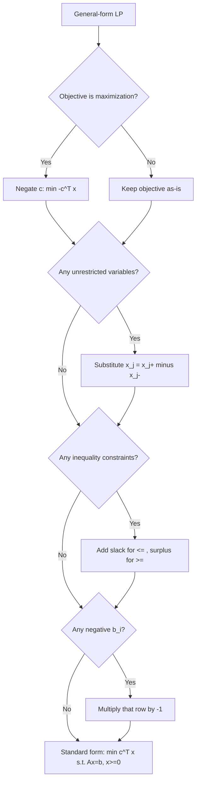

## Standard Form Linear Programs

### Overview

Standard form is a canonical representation for linear programming (LP) problems that normalizes the structure of the objective function and constraints into a fixed template. Nearly every LP algorithm — the Simplex method, interior-point methods, and the theory of duality — is developed and proven against this standardized structure, so any linear program, regardless of how it is originally posed, must first be converted into standard form before these algorithms and theoretical results can be applied directly.

### Definition

A linear program is in standard form when it satisfies all of the following conditions simultaneously:

1. The objective function is a **minimization**.
2. All constraints (other than variable bounds) are **equality constraints**.
3. All decision variables are constrained to be **non-negative**.

Formally:

$$\begin{aligned} \text{minimize} \quad & c^T x \\ \text{subject to} \quad & Ax = b \\ & x \geq 0 \end{aligned}$$

where $x \in \mathbb{R}^n$ is the vector of decision variables, $c \in \mathbb{R}^n$ is the cost vector, $A \in \mathbb{R}^{m \times n}$ is the constraint coefficient matrix, and $b \in \mathbb{R}^m$ is the right-hand-side vector.

**Key Points**
- $b \geq 0$ is often additionally imposed by convention (achieved by multiplying any row with negative RHS by $-1$), since this simplifies initialization of the Simplex method via an obvious non-negative starting point in some formulations.
- The equality constraint form $Ax = b$ is what allows the feasible region to be characterized purely in terms of basic feasible solutions — vertices of the polyhedron — which is the foundation of the Simplex method's vertex-searching strategy.
- Standard form is a *representation*, not a restriction on expressiveness: any linear program, regardless of its original structure (maximization, inequalities, unrestricted variables), can be transformed into an equivalent standard form problem.

### Why Standard Form Matters

**Key Points**
- **Algorithmic uniformity**: The Simplex method operates on equality-constrained systems by pivoting between basic feasible solutions; inequality constraints don't directly fit this operational structure without conversion.
- **Theoretical foundation**: LP duality theory, complementary slackness conditions, and sensitivity analysis are all conventionally derived and stated with respect to standard form, making conversion a prerequisite for applying these results directly.
- **Software interfaces**: Some solver internals and textbook algorithm descriptions expect standard form as input, even though modern commercial solvers (e.g., Gurobi, CPLEX) typically accept general form directly and perform the conversion internally as a preprocessing step.

### Converting to Standard Form

Any linear program can be systematically transformed into standard form through a sequence of mechanical transformations.

#### Converting Maximization to Minimization

A maximization problem is converted to minimization by negating the objective coefficients:

$$\max c^T x \quad \Longleftrightarrow \quad \min (-c)^T x$$

The optimal $x^*$ is identical; only the optimal objective value's sign flips (i.e., $\max c^Tx = -\min(-c)^Tx$).

#### Converting Inequality Constraints to Equalities (Slack and Surplus Variables)

A **less-than-or-equal** constraint is converted to equality by adding a non-negative **slack variable**:

$$a_i^T x \leq b_i \quad \Longrightarrow \quad a_i^T x + s_i = b_i, \quad s_i \geq 0$$

A **greater-than-or-equal** constraint is converted to equality by subtracting a non-negative **surplus variable**:

$$a_i^T x \geq b_i \quad \Longrightarrow \quad a_i^T x - s_i = b_i, \quad s_i \geq 0$$

**Key Points**
- The slack/surplus variable $s_i$ represents the "gap" between the left- and right-hand sides of the original inequality; it has a natural interpretation in many applications (e.g., unused resource capacity in a $\leq$ resource constraint).
- Each inequality constraint introduces exactly one new variable and increases $n$ (the dimension of $x$) by one; the constraint matrix $A$ grows by one column per slack/surplus variable added.
- Slack and surplus variables typically carry a zero coefficient in the objective function $c$, since they don't represent an actual decision, only bookkeeping — though in some formulations they may be assigned costs to represent penalties or resource values.

#### Converting Unrestricted (Free) Variables

A variable $x_j$ that is unrestricted in sign (i.e., $x_j \in \mathbb{R}$, not $x_j \geq 0$) is converted by substituting the difference of two non-negative variables:

$$x_j = x_j^+ - x_j^-, \quad x_j^+ \geq 0, \quad x_j^- \geq 0$$

**Key Points**
- This substitution is exact: since $x_j^+$ and $x_j^-$ can each range over all non-negative reals, their difference can represent any real number, so no feasible region is lost.
- This adds one additional variable and one additional column to $A$ for every free variable in the original problem.
- At an optimal basic feasible solution, at most one of $x_j^+$ and $x_j^-$ will be non-zero (i.e., in the optimal basis) — though during intermediate Simplex iterations, this need not hold. [Inference] This "at most one nonzero" property follows from basic feasible solution structure (at most $m$ nonzero variables total) combined with the fact that having both $x_j^+, x_j^- > 0$ simultaneously is never cost-optimal when both share the same objective coefficient magnitude with opposite sign, but the precise argument depends on non-degeneracy assumptions.

#### Converting Variables Bounded Below/Above by Nonzero Constants

A variable with a general lower bound $x_j \geq l_j$ is converted via the substitution $x_j' = x_j - l_j$, giving $x_j' \geq 0$, and substituting $x_j = x_j' + l_j$ everywhere $x_j$ appears (including in the objective and other constraints, absorbing the constant term $c_j l_j$ into the objective's constant offset).

A variable with an upper bound $x_j \leq u_j$ (with $x_j \geq 0$ also required) is typically kept as an explicit bound constraint in solvers optimized to handle bounds directly, or, if strict standard form is required, converted to an equality via a slack: $x_j + s_j = u_j$, $s_j \geq 0$.

### Step-by-Step Conversion Example

Consider the following linear program in general form:

$$\begin{aligned} \text{maximize} \quad & 3x_1 + 5x_2 \\ \text{subject to} \quad & x_1 + 2x_2 \leq 14 \\ & 3x_1 - x_2 \geq 0 \\ & x_1 - x_2 \leq 2 \\ & x_1 \geq 0, \; x_2 \text{ unrestricted} \end{aligned}$$

**Step 1 — Convert the objective to minimization:**

$$\text{minimize} \quad -3x_1 - 5x_2$$

**Step 2 — Handle the unrestricted variable** $x_2 = x_2^+ - x_2^-$, with $x_2^+, x_2^- \geq 0$:

$$\text{minimize} \quad -3x_1 - 5x_2^+ + 5x_2^-$$

**Step 3 — Add slack/surplus variables to each inequality:**

- $x_1 + 2x_2^+ - 2x_2^- \leq 14$ becomes $x_1 + 2x_2^+ - 2x_2^- + s_1 = 14$, $s_1 \geq 0$
- $3x_1 - x_2^+ + x_2^- \geq 0$ becomes $3x_1 - x_2^+ + x_2^- - s_2 = 0$, $s_2 \geq 0$
- $x_1 - x_2^+ + x_2^- \leq 2$ becomes $x_1 - x_2^+ + x_2^- + s_3 = 2$, $s_3 \geq 0$

**Output — Final standard form:**

$$\begin{aligned} \text{minimize} \quad & -3x_1 - 5x_2^+ + 5x_2^- + 0s_1 + 0s_2 + 0s_3 \\ \text{subject to} \quad & x_1 + 2x_2^+ - 2x_2^- + s_1 = 14 \\ & 3x_1 - x_2^+ + x_2^- - s_2 = 0 \\ & x_1 - x_2^+ + x_2^- + s_3 = 2 \\ & x_1, x_2^+, x_2^-, s_1, s_2, s_3 \geq 0 \end{aligned}$$

The problem now has 6 non-negative variables and 3 equality constraints, matching the $Ax = b$, $x \geq 0$ template exactly.

### Conversion Rules Summary

| Original Form | Standard Form Transformation |
|---|---|
| Maximize $c^Tx$ | Minimize $-c^Tx$ |
| $a_i^Tx \leq b_i$ | $a_i^Tx + s_i = b_i$, $s_i \geq 0$ |
| $a_i^Tx \geq b_i$ | $a_i^Tx - s_i = b_i$, $s_i \geq 0$ |
| $x_j$ unrestricted | $x_j = x_j^+ - x_j^-$, $x_j^+, x_j^- \geq 0$ |
| $x_j \geq l_j$ ($l_j \neq 0$) | $x_j' = x_j - l_j \geq 0$, substitute throughout |
| $b_i < 0$ | Multiply row $i$ by $-1$ |

### Conversion Process Flow

### Standard Form vs. Canonical Form

A related but distinct representation, sometimes called **canonical form**, expresses the LP with inequality constraints rather than equalities:

$$\begin{aligned} \text{minimize} \quad & c^T x \\ \text{subject to} \quad & Ax \geq b \\ & x \geq 0 \end{aligned}$$

**Key Points**
- Canonical form is primarily used in the derivation of LP duality (the dual of a canonical-form primal has a particularly clean symmetric structure), while standard form is primarily used in Simplex-method algorithmic descriptions.
- Terminology for "standard form" and "canonical form" is not perfectly consistent across textbooks — some sources swap these definitions or use "standard form" to refer to what is described here as canonical form. [Unverified] This inconsistency is a documented feature of the optimization literature, and readers should verify which convention a specific source is using rather than assuming based on the label alone.

### The Role of Basic Feasible Solutions

Once in standard form, the geometry of the feasible region $\{x : Ax = b, x \geq 0\}$ becomes central to solution methods. Assuming $A$ has full row rank $m$ (redundant rows removed) and $n > m$:

- A **basic solution** is obtained by selecting $m$ linearly independent columns of $A$ (the "basis"), setting the remaining $n - m$ variables (the "nonbasic" variables) to zero, and solving the resulting square system for the $m$ "basic" variables.
- A basic solution is **feasible** (a basic feasible solution, or BFS) if all basic variables are also non-negative.
- Each BFS corresponds geometrically to a **vertex (extreme point)** of the feasible polyhedron.

This correspondence is what allows the Simplex method to search for an optimum by moving from vertex to adjacent vertex along edges of the polyhedron, rather than searching the (potentially unbounded, continuous) feasible region directly — a fundamental theorem of linear programming guarantees that if an optimal solution exists, at least one optimal solution occurs at a vertex (basic feasible solution) of the feasible region.

### Practical Considerations

- **Problem size growth**: Converting to standard form generally increases the number of variables (via slacks, surpluses, and free-variable splitting) and can be significant for large-scale problems; this is one reason production solvers often avoid full standard-form conversion and instead handle bounds and ranges natively in their internal representations.
- **Numerical conditioning**: Splitting free variables into $x_j^+ - x_j^-$ can, in principle, introduce a degenerate direction (both variables can grow together without changing $x_j$), which some implementations mitigate with additional bounding or by using a "free variable" pivoting rule instead of the split, though standard textbook Simplex descriptions typically proceed with the split for simplicity of exposition.
- **Sparsity preservation**: Slack and surplus variables each touch only a single constraint row, so they preserve the sparsity pattern of $A$ well; free-variable splitting, by contrast, duplicates a full column, which has a comparatively minor impact on sparsity since it only doubles up on already-existing nonzero entries in that one column.
- **Redundant constraints**: Real-world LP formulations sometimes contain constraints that become linearly dependent after conversion (especially after variable substitutions); solvers typically detect and handle rank-deficient $A$ matrices via preprocessing rather than requiring users to verify full row rank manually.

### Related Topics

- The Simplex method (tableau construction, pivoting rules, Bland's rule for anti-cycling)
- LP duality theory and complementary slackness conditions
- Basic feasible solutions and the geometry of polyhedra
- Big-M method and Two-Phase Simplex for finding an initial basic feasible solution
- Interior-point methods for linear programming (barrier methods, primal-dual formulations)
- Sensitivity analysis and shift analysis in LP (ranging on $b$ and $c$)
- Degeneracy and cycling in the Simplex method
- Integer programming as an extension of standard-form LP with integrality constraints