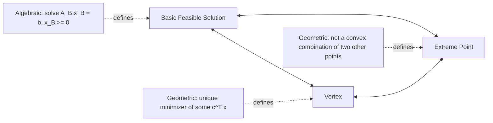
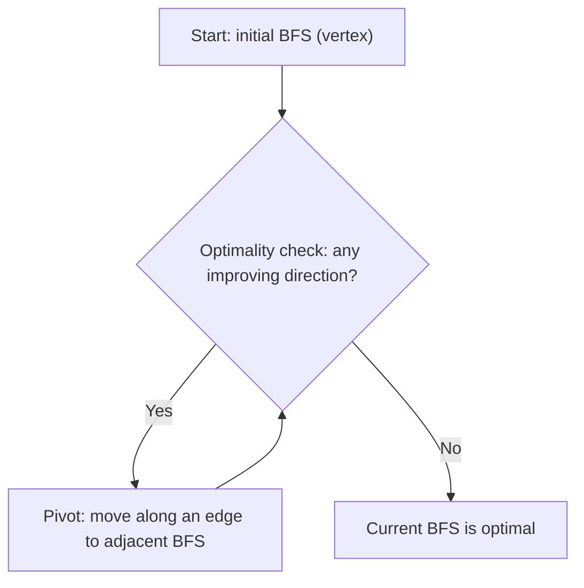

## Polyhedra and Basic Feasible Solutions

### Overview

The geometric theory of polyhedra underpins the entire algorithmic machinery of linear programming. A linear program's feasible region — the set of points satisfying all constraints — forms a polyhedron, and the correspondence between the algebraic notion of a **basic feasible solution (BFS)** and the geometric notion of a **vertex (extreme point)** of that polyhedron is the foundation that makes the Simplex method work: it justifies restricting the search for an optimum to a finite set of candidate points rather than the entire continuous feasible region.

### Polyhedra: Definitions

A **polyhedron** is the intersection of finitely many closed half-spaces:

$$P = \{x \in \mathbb{R}^n : Ax \leq b\}$$

for some matrix $A \in \mathbb{R}^{m \times n}$ and vector $b \in \mathbb{R}^m$. Equality constraints can be represented as two opposing inequalities ($a^Tx \leq b$ and $a^Tx \geq b$), so this definition subsumes the standard-form feasible region $\{x : Ax = b, x \geq 0\}$ as a special case.

**Key Points**
- A polyhedron is always a **convex set**: for any $x, y \in P$ and $\lambda \in [0,1]$, the point $\lambda x + (1-\lambda) y \in P$, since each defining half-space is itself convex and the intersection of convex sets is convex.
- A **bounded** polyhedron is called a **polytope**.
- A polyhedron may be empty (infeasible LP), a single point, unbounded in some directions, or full-dimensional — its geometric character depends entirely on $A$ and $b$.

### Extreme Points, Vertices, and Basic Feasible Solutions

Three distinct definitions — one purely geometric, one algebraic — turn out to describe exactly the same set of points for a polyhedron in standard form. Establishing their equivalence is one of the fundamental results of linear programming theory.

#### Extreme Point (Geometric Definition)

A point $x \in P$ is an **extreme point** of $P$ if it cannot be written as a proper convex combination of two other distinct points in $P$. That is, there do not exist $y, z \in P$ with $y \neq z$ and $\lambda \in (0,1)$ such that $x = \lambda y + (1-\lambda)z$.

**Key Points**
- Intuitively, extreme points are the "corners" of the polyhedron — points that are not "between" any two other feasible points.
- A line segment or a face of positive dimension contains infinitely many points but no interior point of that segment/face is extreme, since any such point can be written as a combination of the segment's endpoints.

#### Vertex (Alternative Geometric Definition)

A point $x \in P$ is a **vertex** if there exists some cost vector $c$ such that $c^Tx < c^Ty$ for all $y \in P$, $y \neq x$ — i.e., $x$ is the *strict, unique* minimizer of some linear objective over $P$.

**Key Points**
- This definition is operationally meaningful: it says a vertex is a point that some linear objective function "picks out" uniquely.
- It can be shown that the set of extreme points and the set of vertices of a polyhedron coincide exactly, which is why the terms are frequently used interchangeably in LP theory.

#### Basic Feasible Solution (Algebraic Definition)

Given the standard-form system $Ax = b$, $x \geq 0$ with $A \in \mathbb{R}^{m \times n}$ of full row rank $m$:

- A **basis** is a set of $m$ linearly independent columns of $A$, indexed by $B \subseteq \{1, \dots, n\}$, $|B| = m$.
- The corresponding **basic solution** sets all nonbasic variables ($x_j$ for $j \notin B$) to zero and solves $A_B x_B = b$ for the basic variables $x_B$ (uniquely, since $A_B$ is invertible).
- The basic solution is a **basic feasible solution (BFS)** if additionally $x_B \geq 0$.

**Key Points**
- A BFS is called **degenerate** if one or more basic variables equal zero — this means the algebraic basis is not uniquely determined by the geometric point, since multiple bases can yield the same (degenerate) solution.
- With $n$ variables and $m$ constraints, the number of possible bases is at most $\binom{n}{m}$, giving a finite (though potentially large) upper bound on the number of BFSs — this finiteness is what makes vertex-searching algorithms like Simplex terminate.

### The Fundamental Equivalence

**Theorem.** For a polyhedron $P = \{x : Ax = b, x \geq 0\}$ with $A$ full row rank, the following are equivalent for a point $x \in P$:

1. $x$ is a basic feasible solution.
2. $x$ is a vertex of $P$.
3. $x$ is an extreme point of $P$.

This three-way equivalence is what allows LP theory to move fluidly between algebraic manipulation (basic solutions, useful for computation) and geometric intuition (vertices/extreme points, useful for visualization and proofs), treating them as the same object.

### Illustrative Example

Consider the polyhedron in $\mathbb{R}^2$ defined by:

$$x_1 + x_2 \leq 4, \quad x_1 \leq 3, \quad x_1 \geq 0, \quad x_2 \geq 0$$

**Example**

Converting to standard form with slacks $s_1, s_2 \geq 0$:

$$x_1 + x_2 + s_1 = 4, \quad x_1 + s_2 = 3, \quad x_1, x_2, s_1, s_2 \geq 0$$

This system has $n = 4$ variables and $m = 2$ constraints, so a basis consists of any 2 linearly independent columns out of 4, giving $\binom{4}{2} = 6$ candidate bases. Checking each:

| Basis (nonzero vars) | Values | Feasible? | Corresponds to |
|---|---|---|---|
| $\{x_1, x_2\}$ | $x_1=3, x_2=1$ | Yes | Vertex $(3,1)$ |
| $\{x_1, s_1\}$ | $x_1=3, s_1=1$ | Yes | Vertex $(3,0)$ |
| $\{x_1, s_2\}$ | $x_1=4, s_2=-1$ | No ($s_2 < 0$) | — |
| $\{x_2, s_1\}$ | $x_2=4, s_1=0$, $x_1=0$ | Yes (degenerate: $s_1=0$ basic but zero) | Vertex $(0,4)$ |
| $\{x_2, s_2\}$ | $x_2=4, s_2=3$, $x_1=0$ | Yes | Vertex $(0,4)$ (same point, different basis) |
| $\{s_1, s_2\}$ | $s_1=4, s_2=3$, $x_1=x_2=0$ | Yes | Vertex $(0,0)$ |

**Output**

Five distinct BFSs correspond to exactly five geometric vertices: $(0,0)$, $(3,0)$, $(3,1)$, and $(0,4)$ — with $(0,4)$ realized by two different algebraic bases, illustrating degeneracy, where a single geometric vertex has more than one valid basic representation.

### Geometric Visualization

<svg xmlns="http://www.w3.org/2000/svg" viewBox="0 0 600 480">
  <text x="300" y="30" text-anchor="middle" font-size="18" font-weight="bold" fill="#1a1a1a">Polyhedron Vertices as Basic Feasible Solutions (svg_diagram)</text>

  <line x1="80" y1="420" x2="520" y2="420" stroke="#333" stroke-width="2" />
  <line x1="80" y1="420" x2="80" y2="60" stroke="#333" stroke-width="2" />
  <text x="500" y="440" font-size="13" fill="#333">x1</text>
  <text x="60" y="70" font-size="13" fill="#333">x2</text>

  <polygon points="80,420 320,420 320,180 80,60" fill="#93c5fd" opacity="0.3" stroke="none" />

  <line x1="80" y1="420" x2="320" y2="420" stroke="#6b7280" stroke-width="1" stroke-dasharray="4,3" />
  <line x1="320" y1="420" x2="320" y2="60" stroke="#6b7280" stroke-width="1" stroke-dasharray="4,3" />
  <text x="325" y="380" font-size="11" fill="#6b7280">x1 = 3</text>

  <line x1="80" y1="60" x2="320" y2="180" stroke="#333" stroke-width="2.5" />
  <text x="140" y="100" font-size="11" fill="#333">x1 + x2 = 4</text>

  <circle cx="80" cy="420" r="6" fill="#dc2626" />
  <text x="65" y="440" font-size="12" fill="#dc2626">(0,0)</text>
  <text x="30" y="455" font-size="10" fill="#7f1d1d">basis {s1,s2}</text>

  <circle cx="320" cy="420" r="6" fill="#dc2626" />
  <text x="325" y="440" font-size="12" fill="#dc2626">(3,0)</text>
  <text x="290" y="455" font-size="10" fill="#7f1d1d">basis {x1,s1}</text>

  <circle cx="320" cy="180" r="6" fill="#dc2626" />
  <text x="330" y="180" font-size="12" fill="#dc2626">(3,1)</text>
  <text x="330" y="197" font-size="10" fill="#7f1d1d">basis {x1,x2}</text>

  <circle cx="80" cy="60" r="6" fill="#dc2626" />
  <text x="90" y="55" font-size="12" fill="#dc2626">(0,4)</text>
  <text x="90" y="72" font-size="10" fill="#7f1d1d">degenerate: 2 bases</text>

  <text x="90" y="250" font-size="12" fill="#1e3a8a" font-weight="bold">Feasible region</text>
  <text x="90" y="266" font-size="11" fill="#1e3a8a">(polytope)</text>
</svg>

### Faces, Edges, and the Simplex Method's Search Path

**Key Points**
- A polyhedron's boundary decomposes into **faces** of varying dimension: vertices (0-dimensional faces), edges (1-dimensional faces), and higher-dimensional facets, all the way up to the polyhedron itself.
- An **edge** connecting two adjacent vertices corresponds algebraically to two bases that differ in exactly one column — this is precisely the structure exploited by a single **pivot operation** in the Simplex method.
- The Simplex method's iteration — moving from one BFS to an adjacent BFS with a better (or equal) objective value — is therefore literally a walk along the edges of the feasible polyhedron from vertex to vertex.

### Existence and Boundedness Considerations

**Key Points**
- If the feasible region $P$ is nonempty and contains at least one BFS, and $A$ has full row rank, then $P$ has at least one extreme point — this is guaranteed by the structure of standard form (non-negativity constraints prevent the polyhedron from containing a line, which is the general condition for extreme points to exist).
- The **Fundamental Theorem of Linear Programming** states that if an LP in standard form has an optimal solution, then it has an optimal BFS — i.e., an optimal solution occurring at a vertex. This holds even when the optimal objective value is attained on an entire face (edge or higher-dimensional facet) of the polyhedron, since at least one vertex of that optimal face achieves the same objective value.
- If $P$ is unbounded in a direction that improves the objective indefinitely, the LP is **unbounded**, and no optimal BFS exists regardless of how many vertices $P$ has — Simplex detects this case when a pivot step reveals no valid ratio-test bound on how far it can move along an improving edge.

### Degeneracy in Depth

**Key Points**
- Geometric degeneracy occurs when more than $m$ of the defining half-space constraints are tight (active) at a single vertex in $\mathbb{R}^{n}$ effectively $n$-dimensional space — more hyperplanes pass through the point than are strictly necessary to pin it down.
- Degeneracy can cause the Simplex method to **cycle**: a sequence of pivots that revisits the same basis (or a set of bases corresponding to the same degenerate vertex) without making progress in the objective value, in principle looping forever without an anti-cycling safeguard.
- Anti-cycling rules — most notably **Bland's rule** (choosing the lowest-indexed eligible variable at each pivot step) — provably prevent cycling, though they can be slower in practice than more aggressive pivoting rules like Dantzig's rule (largest coefficient), which is why many practical implementations use aggressive rules by default and fall back to Bland's rule only when cycling is detected or suspected. [Inference] The specific fallback strategy (e.g., switching to Bland's rule after a fixed iteration count without objective improvement) is implementation-specific and not standardized across solvers.

### Practical Considerations

- **Exponential vertex count**: The number of vertices of a polyhedron can grow exponentially in the number of constraints even though the LP itself has polynomially-sized input — this is part of why worst-case Simplex complexity is exponential, even though it performs efficiently on most practical instances.
- **Redundant constraints and rank deficiency**: If $A$ does not have full row rank, some constraints are linearly dependent on others; solvers typically detect and remove such redundancies during a presolve phase, since the basic-solution machinery (requiring an invertible $A_B$) assumes full row rank.
- **Numerical degeneracy sensitivity**: Near-degenerate vertices (where a basic variable is very close to, but not exactly, zero) can cause numerical instability in Simplex pivoting; production solvers apply tolerance-based feasibility checks and perturbation techniques to maintain robustness. [Unverified] The specific perturbation and tolerance strategies vary significantly across commercial and open-source solver implementations and are generally not publicly documented in full detail.
- **Interior-point method contrast**: Unlike Simplex, interior-point methods traverse the *interior* of the polyhedron rather than walking along its vertices/edges, converging to an optimal vertex only in the limit — this is a fundamentally different geometric strategy that avoids the combinatorial vertex-enumeration character of Simplex.

### Related Topics

- The Simplex method (tableau form, pivoting rules, ratio test)
- Big-M method and Two-Phase Simplex for initial BFS construction
- LP duality and complementary slackness at optimal vertices
- Degeneracy, cycling, and anti-cycling rules (Bland's rule, lexicographic ordering)
- Interior-point methods and the central path
- Polytope theory (facets, faces, dimension, the vertex enumeration problem)
- Sensitivity analysis via basis changes (shadow prices, ranging)
- Integer programming and the relationship between LP relaxation vertices and integral solutions