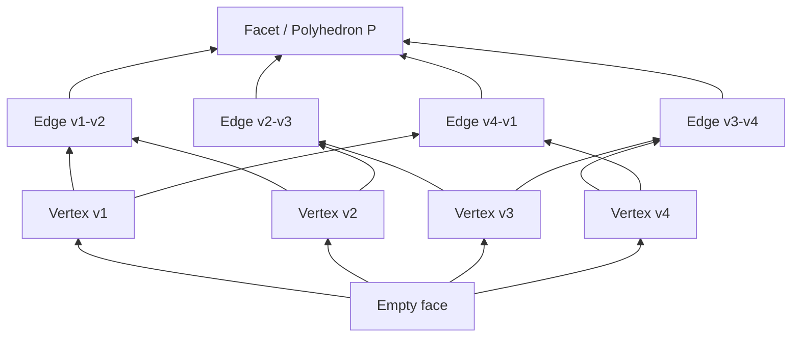

## Vertices, Edges, and Extreme Points of Polyhedra

### Overview

This module builds directly on the foundational equivalence between basic feasible solutions, vertices, and extreme points established previously, deepening the treatment of polyhedral geometry itself: the formal structure of faces, edges, and extreme rays, and how these geometric objects govern both the feasible region's shape and the paths available to vertex-searching algorithms like the Simplex method.

### Faces of a Polyhedron

Given a polyhedron $P = \{x \in \mathbb{R}^n : Ax \leq b\}$, a **face** of $P$ is a subset $F \subseteq P$ of the form:

$$F = \{x \in P : a_i^Tx = b_i \text{ for all } i \in I\}$$

for some subset $I$ of the constraint indices — i.e., a face is obtained by turning a subset of the inequality constraints into equalities and intersecting with $P$.

**Key Points**
- Faces are classified by **dimension**: a face of dimension 0 is a vertex, a face of dimension 1 is an edge, and a face of dimension $n-1$ (one less than the ambient space, assuming $P$ is full-dimensional) is called a **facet**.
- $P$ itself is (trivially) a face of itself, and the empty set is conventionally also considered a face.
- Faces form a partial order under inclusion, and this structure is often visualized as a **face lattice**, with the empty face at the bottom and $P$ itself at the top.

### Edges

An **edge** of a polyhedron is a face of dimension 1 — geometrically, a line segment (or, in the unbounded case, a ray or a full line) connecting two vertices, along which exactly $n-1$ linearly independent constraints are tight (for a full-dimensional polyhedron in $\mathbb{R}^n$).

**Key Points**
- Two vertices are called **adjacent** if the line segment connecting them is an edge of $P$ — equivalently, if their corresponding bases differ in exactly one basic variable (one variable leaves the basis, one enters).
- This adjacency structure is exactly what the Simplex method exploits: each pivot operation moves from a vertex to an adjacent vertex along an edge, never jumping to a non-adjacent vertex directly.
- The **graph of a polyhedron** (vertices as nodes, edges as connections) is the combinatorial skeleton that Simplex implicitly traverses; the diameter of this graph (longest shortest-path between any two vertices) is the subject of the still only partially resolved **Hirsch conjecture** and its variants, which bound how many pivots Simplex could need in the worst case. [Unverified] The current state of resolved and unresolved bounds in this area is an active research topic and specific numeric bounds should be verified against current literature rather than assumed from memory.

### Adjacency in Algebraic Terms

Two basic feasible solutions with bases $B_1$ and $B_2$ (each a set of $m$ column indices) are adjacent if and only if $|B_1 \cap B_2| = m - 1$ — they share all but one basic variable.

**Example**

Returning to the earlier polyhedron $x_1 + x_2 \leq 4$, $x_1 \leq 3$, $x_1, x_2 \geq 0$ with slacks $s_1, s_2$:

- Basis $\{x_1, s_1\}$ (vertex $(3,0)$) and basis $\{x_1, x_2\}$ (vertex $(3,1)$) share the column $x_1$ — they differ by exactly one variable ($s_1$ leaves, $x_2$ enters). These vertices are adjacent, connected by an edge along the line $x_1 = 3$.
- Basis $\{s_1, s_2\}$ (vertex $(0,0)$) and basis $\{x_1, x_2\}$ (vertex $(3,1)$) share zero columns — they differ by two variables simultaneously. These vertices are **not** adjacent; reaching one from the other via Simplex requires at least two pivots, passing through an intermediate vertex such as $(3,0)$ or $(0,4)$.

### Extreme Rays and Unbounded Polyhedra

When a polyhedron is unbounded, its structure cannot be fully described by vertices alone — it also requires **extreme rays**, which capture the directions in which the polyhedron extends infinitely.

A vector $d \neq 0$ is a **direction** of $P$ if, for every $x \in P$, the ray $\{x + \theta d : \theta \geq 0\}$ remains in $P$. A direction $d$ is an **extreme ray** if it cannot be written as a positive combination $d = \lambda_1 d_1 + \lambda_2 d_2$ of two other distinct (non-parallel) directions $d_1, d_2$ of $P$, with $\lambda_1, \lambda_2 > 0$.

**Key Points**
- Extreme rays play a role for unbounded polyhedra analogous to the role extreme points play for bounded ones: a general (possibly unbounded) polyhedron's entire structure can be characterized by a finite set of extreme points and a finite set of extreme rays.
- If an LP's objective can be improved indefinitely along an extreme ray of the feasible region, the problem is **unbounded** — this is precisely the condition the Simplex method detects when a pivot's ratio test finds no limiting row (every entry in the pivot column is non-positive).
- Extreme rays correspond algebraically to specific patterns in the Simplex tableau: a nonbasic variable with a negative reduced cost (improving direction) but a pivot column containing no positive entries signals an unbounded extreme ray.

### The Resolution Theorem (Minkowski–Weyl)

**Key Points**
- The **Minkowski–Weyl theorem** establishes that every polyhedron can be represented in two equivalent ways: as the intersection of finitely many half-spaces ($Ax \leq b$, the "H-representation"), or as the Minkowski sum of the convex hull of a finite set of points (its extreme points) and the conical hull of a finite set of directions (its extreme rays) — the "V-representation."
- Formally, for a polyhedron $P$ with extreme points $v_1, \dots, v_k$ and extreme rays $r_1, \dots, r_l$:

$$P = \left\{ \sum_{i=1}^k \lambda_i v_i + \sum_{j=1}^l \mu_j r_j \; : \; \sum_{i=1}^k \lambda_i = 1, \; \lambda_i \geq 0, \; \mu_j \geq 0 \right\}$$

- This dual representation underlies a range of algorithmic and theoretical tools, from vertex enumeration algorithms to the structure of Dantzig-Wolfe decomposition in large-scale LP.
- For a bounded polyhedron (polytope), the ray terms vanish entirely and every point is a convex combination of extreme points alone — this is essentially the finite-dimensional statement of the Krein–Milman theorem.

### Illustration: Bounded vs. Unbounded Polyhedra

<svg xmlns="http://www.w3.org/2000/svg" viewBox="0 0 700 420">
  <text x="350" y="30" text-anchor="middle" font-size="18" font-weight="bold" fill="#1a1a1a">Bounded Polytope vs. Unbounded Polyhedron with Extreme Ray (svg_diagram)</text>

  <text x="170" y="60" text-anchor="middle" font-size="14" font-weight="bold" fill="#1e3a8a">Polytope (bounded)</text>
  <line x1="60" y1="380" x2="60" y2="90" stroke="#333" stroke-width="1.5" />
  <line x1="60" y1="380" x2="300" y2="380" stroke="#333" stroke-width="1.5" />
  <polygon points="90,380 260,380 260,260 170,110 90,220" fill="#93c5fd" opacity="0.35" stroke="#1e40af" stroke-width="2" />
  <circle cx="90" cy="380" r="5" fill="#dc2626" />
  <circle cx="260" cy="380" r="5" fill="#dc2626" />
  <circle cx="260" cy="260" r="5" fill="#dc2626" />
  <circle cx="170" cy="110" r="5" fill="#dc2626" />
  <circle cx="90" cy="220" r="5" fill="#dc2626" />
  <text x="170" y="400" text-anchor="middle" font-size="11" fill="#333">All points = convex combo of 5 extreme points</text>

  <text x="530" y="60" text-anchor="middle" font-size="14" font-weight="bold" fill="#1e3a8a">Unbounded polyhedron</text>
  <line x1="420" y1="380" x2="420" y2="90" stroke="#333" stroke-width="1.5" />
  <line x1="420" y1="380" x2="660" y2="380" stroke="#333" stroke-width="1.5" />
  <polygon points="450,380 620,380 660,240 660,90 500,90 450,220" fill="#93c5fd" opacity="0.35" stroke="#1e40af" stroke-width="2" />
  <circle cx="450" cy="380" r="5" fill="#dc2626" />
  <circle cx="620" cy="380" r="5" fill="#dc2626" />
  <circle cx="450" cy="220" r="5" fill="#dc2626" />
  <line x1="620" y1="380" x2="660" y2="240" stroke="#1e40af" stroke-width="2" />
  <line x1="500" y1="90" x2="660" y2="90" stroke="#059669" stroke-width="2.5" stroke-dasharray="6,3" />
  <line x1="660" y1="90" x2="690" y2="90" stroke="#059669" stroke-width="2.5" stroke-dasharray="6,3" marker-end="url(#arrow)" />
  <text x="580" y="80" font-size="11" fill="#059669">extreme ray direction</text>
  <text x="530" y="400" text-anchor="middle" font-size="11" fill="#333">Extreme points + one extreme ray</text>

  </svg>

### Face Lattice Structure

### Adjacent Vertices and Simplex Pivoting

**Key Points**
- At a non-degenerate BFS, exactly $n - m$ nonbasic variables are candidates to enter the basis, and each corresponds to a distinct edge emanating from that vertex — so a non-degenerate vertex in $\mathbb{R}^n$ constrained by $m$ equalities has exactly $n - m$ edges incident to it.
- Choosing *which* improving edge to follow (i.e., which nonbasic variable enters the basis) is the role of the **pivoting rule** — Dantzig's rule, Bland's rule, steepest-edge rules, and devex pricing are different strategies for selecting among the available improving edges at each vertex.
- The **ratio test** determines how far along the chosen edge to travel before hitting the next vertex — specifically, until some currently-basic variable is driven to zero, at which point it leaves the basis and the edge terminates at the new adjacent vertex.

### Degenerate Vertices and Edge Ambiguity

**Key Points**
- At a **degenerate** vertex (more than the minimum $m$ constraints tight), multiple bases correspond to the identical geometric point, and consequently multiple "edges" in the algebraic sense may correspond to a zero-length step (a pivot that changes the basis but not the point itself).
- This can cause **stalling**, where Simplex performs pivots without making geometric progress — related to, but distinct from, full cycling (which requires eventually returning to a previously visited basis).
- Perturbation methods (e.g., lexicographic perturbation) and combinatorial rules (Bland's rule) address degeneracy by ensuring that even when geometric progress stalls temporarily, the algebraic pivoting sequence still makes monotonic progress in some auxiliary ordering, guaranteeing eventual termination.

### Practical Considerations

- **Vertex enumeration complexity**: Explicitly enumerating all vertices of a polyhedron (as opposed to searching among them, as Simplex does) is computationally expensive in the worst case — the number of vertices can be exponential in the number of facets (and vice versa), a phenomenon studied via the theory of the **cyclic polytope**, which achieves the maximum possible vertex count for given dimension and facet count.
- **Software representation**: Most LP solvers never construct an explicit face lattice or enumerate extreme rays; they work implicitly with the current basis and tableau, deriving adjacency and boundedness information from pivot mechanics rather than precomputed geometric structure.
- **Degenerate real-world problems**: Highly symmetric or structured LPs (e.g., transportation and assignment problems) are frequently degenerate by construction, since their constraint structure often causes many constraints to be simultaneously tight at optimal vertices — practitioners working with such problem classes should anticipate degeneracy-related pivoting behavior rather than treating it as an edge case.
- **Connection to interior-point methods**: Interior-point methods sidestep vertex/edge combinatorics entirely by traversing the polyhedron's interior along the central path, converging toward a vertex (or a point on the optimal face) only asymptotically — this avoids combinatorial edge-following but introduces its own numerical considerations (barrier parameter scheduling, Newton step computation).

### Related Topics

- The Simplex method (pivoting rules, ratio test, tableau mechanics)
- Degeneracy, stalling, and cycling (Bland's rule, lexicographic and perturbation methods)
- Minkowski–Weyl theorem and polyhedral decomposition
- Dantzig-Wolfe decomposition and column generation for large-scale LP
- LP duality and the relationship between primal vertices and dual facets
- Vertex enumeration algorithms (reverse search, double description method)
- Interior-point methods and the central path
- Combinatorial optimization structures with inherent degeneracy (transportation, assignment, network flow problems)