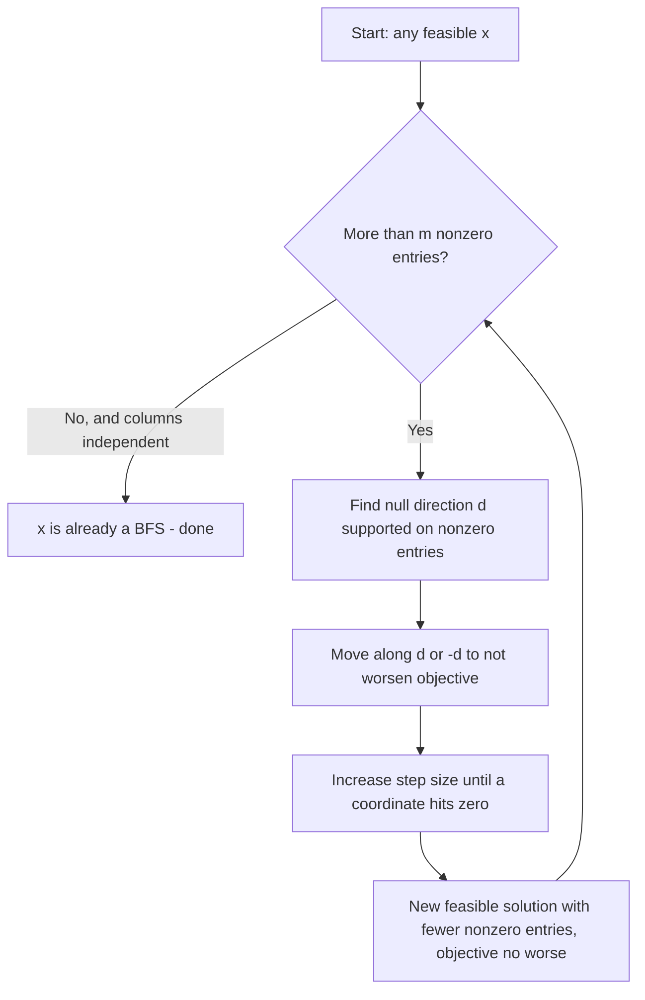
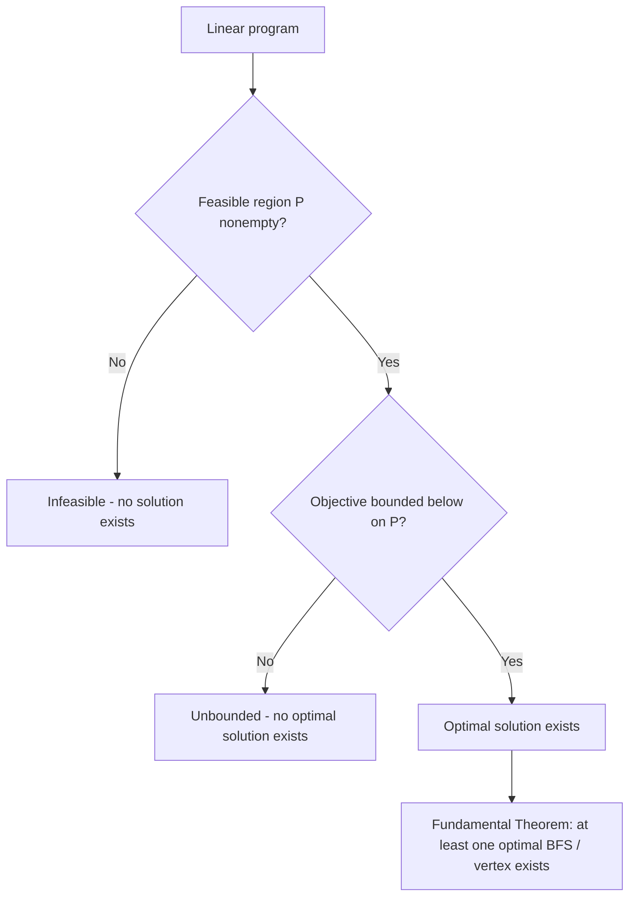

## Fundamental Theorem of Linear Programming

### Overview

The Fundamental Theorem of Linear Programming formalizes the precise relationship between the geometric structure of a polyhedron's feasible region and the location of an optimal solution, establishing that if a linear program has an optimal solution at all, an optimal solution can always be found among the (finitely many) basic feasible solutions — the vertices of the feasible polyhedron. This single result is what justifies restricting any LP-solving algorithm's search to a finite candidate set rather than an infinite continuous region, and it is the theoretical bedrock on which the Simplex method's correctness rests.

### Statement of the Theorem

For a linear program in standard form:

$$\begin{aligned} \text{minimize} \quad & c^T x \\ \text{subject to} \quad & Ax = b \\ & x \geq 0 \end{aligned}$$

with $A \in \mathbb{R}^{m \times n}$ of full row rank and feasible region $P = \{x : Ax = b, x \geq 0\}$ nonempty, exactly one of the following three cases holds:

1. **Infeasibility does not apply** (since $P$ is assumed nonempty), so this case is excluded by hypothesis.
2. **The LP is unbounded**: $c^Tx$ can be made arbitrarily small (approaching $-\infty$) over $P$, and no optimal solution exists.
3. **The LP has an optimal solution**, and moreover, at least one optimal solution is a basic feasible solution (a vertex of $P$).

**Key Points**
- The theorem does not claim that *every* optimal solution is a vertex — an LP can have infinitely many optimal solutions forming an entire edge or face of the polyhedron — only that *at least one* vertex achieves the optimal value.
- This is a strong existence result: it converts an optimization problem over a continuous, potentially unbounded set into a search over a finite set of candidate points (BFSs), even though that finite set can be exponentially large in the worst case.
- The theorem presupposes $P \neq \emptyset$; a separate, simpler argument (feasibility checking, e.g., via Phase I of the Two-Phase Simplex method) is needed to establish whether $P$ is nonempty in the first place.

### Proof Sketch

The theorem is typically established via a constructive argument that starts from any feasible solution and shows it can be transformed into a basic feasible solution without increasing the objective value.

**Step 1 — Start with any feasible solution.** Let $x$ be feasible with $Ax = b$, $x \geq 0$. If $x$ has at most $m$ nonzero entries and those columns are linearly independent, $x$ is already a BFS and the argument terminates.

**Step 2 — Handle the case of more than $m$ nonzero entries.** Suppose $x$ has $k > m$ nonzero components, indexed by set $S$, $|S| = k$. Since $k > m$ and $A$ has only $m$ rows, the columns $\{A_j : j \in S\}$ must be linearly dependent. This means there exists a nonzero vector $d$ supported on $S$ (i.e., $d_j = 0$ for $j \notin S$) such that $Ad = 0$.

**Step 3 — Move along the direction $d$.** Consider $x(\theta) = x + \theta d$ for scalar $\theta$. Since $Ad = 0$, we have $Ax(\theta) = Ax = b$ for all $\theta$ — feasibility of the equality constraints is preserved regardless of $\theta$. The objective changes linearly: $c^Tx(\theta) = c^Tx + \theta(c^Td)$.

**Step 4 — Choose the sign of $\theta$ to not worsen the objective, and increase $|\theta|$ until a variable hits zero.** If $c^Td \leq 0$, increase $\theta$ from 0; if $c^Td \geq 0$, decrease $\theta$ (i.e., use $-d$ as the direction instead) — either way, the objective value is non-increasing as $|\theta|$ grows. Continue increasing $|\theta|$ until the first coordinate in $S$ hits zero (this must happen at some finite $\theta$, since $x \geq 0$ bounds how far any coordinate can move before going negative). At that point, $x(\theta)$ is feasible, has the same or better objective value, and has strictly fewer nonzero entries than $x$.

**Step 5 — Repeat.** Reapply Steps 2–4 to the new solution, which has at least one fewer nonzero entry each time. Since the number of nonzero entries strictly decreases and is bounded below, this process terminates after finitely many iterations at a solution with at most $m$ nonzero, linearly independent components — a basic feasible solution — whose objective value is no worse than the original $x$.

**Output**

Since $x$ was assumed optimal at the start of this argument, and every step in the reduction process either preserves the objective value or reduces it, the terminating BFS is optimal, since it cannot have a worse objective than the assumed-optimal $x$ while satisfying feasibility. This constructively establishes the existence of an optimal BFS whenever an optimal solution exists at all.

### Geometric Interpretation

**Key Points**
- Geometrically, the proof's reduction process corresponds to sliding along a face of the polyhedron in the direction $d$ until hitting a lower-dimensional face — repeatedly dropping to boundaries of boundaries until arriving at a vertex.
- If the optimal objective value is achieved on an entire face $F$ of positive dimension (e.g., an edge, meaning multiple optimal solutions exist forming a continuum), the theorem guarantees that at least one vertex of that face — necessarily also a vertex of $P$ itself — achieves the same optimal value.
- This connects directly to the earlier equivalence between basic feasible solutions and extreme points: the theorem's content, restated geometrically, is that a linear function attains its minimum over a polyhedron at an extreme point (assuming a finite minimum exists).

### Illustration: Optimal Face vs. Optimal Vertex

<svg xmlns="http://www.w3.org/2000/svg" viewBox="0 0 700 420">
  <text x="350" y="30" text-anchor="middle" font-size="18" font-weight="bold" fill="#1a1a1a">Unique Optimal Vertex vs. Optimal Edge (svg_diagram)</text>

  <text x="170" y="60" text-anchor="middle" font-size="14" font-weight="bold" fill="#1e3a8a">Unique optimal vertex</text>
  <line x1="60" y1="380" x2="60" y2="90" stroke="#333" stroke-width="1.5" />
  <line x1="60" y1="380" x2="300" y2="380" stroke="#333" stroke-width="1.5" />
  <polygon points="90,380 260,380 260,260 170,110 90,220" fill="#93c5fd" opacity="0.3" stroke="#1e40af" stroke-width="2" />
  <circle cx="90" cy="380" r="4" fill="#1e3a8a" />
  <circle cx="260" cy="380" r="4" fill="#1e3a8a" />
  <circle cx="260" cy="260" r="4" fill="#1e3a8a" />
  <circle cx="90" cy="220" r="4" fill="#1e3a8a" />
  <circle cx="170" cy="110" r="7" fill="#dc2626" />
  <text x="170" y="100" text-anchor="middle" font-size="11" fill="#dc2626" font-weight="bold">unique optimum</text>
  <line x1="30" y1="150" x2="310" y2="150" stroke="#059669" stroke-width="1.5" stroke-dasharray="5,3" />
  <text x="215" y="145" font-size="10" fill="#059669">objective contour c^Tx = const</text>

  <text x="530" y="60" text-anchor="middle" font-size="14" font-weight="bold" fill="#1e3a8a">Optimal along an entire edge</text>
  <line x1="420" y1="380" x2="420" y2="90" stroke="#333" stroke-width="1.5" />
  <line x1="420" y1="380" x2="660" y2="380" stroke="#333" stroke-width="1.5" />
  <polygon points="450,380 620,380 660,260 580,110 450,220" fill="#93c5fd" opacity="0.3" stroke="#1e40af" stroke-width="2" />
  <line x1="450" y1="220" x2="580" y2="110" stroke="#dc2626" stroke-width="4" />
  <circle cx="450" cy="220" r="6" fill="#dc2626" />
  <circle cx="580" cy="110" r="6" fill="#dc2626" />
  <text x="440" y="90" font-size="11" fill="#dc2626" font-weight="bold">entire edge optimal</text>
  <line x1="400" y1="130" x2="620" y2="200" stroke="#059669" stroke-width="1.5" stroke-dasharray="5,3" />
  <text x="600" y="215" font-size="10" fill="#059669">contour parallel to edge</text>

  <text x="170" y="400" text-anchor="middle" font-size="11" fill="#333">Contour touches exactly one vertex</text>
  <text x="530" y="400" text-anchor="middle" font-size="11" fill="#333">Both endpoints (and edge) are optimal BFSs</text>
</svg>

**Key Points**
- The left case (unique optimal vertex) occurs when the objective's gradient direction is not parallel to any face of the polyhedron at the optimum — this is the generic case for a "random" cost vector.
- The right case (an entire optimal edge) occurs when the objective's level sets happen to be parallel to a face of the polyhedron — a non-generic, "knife-edge" alignment between $c$ and the polyhedron's geometry.
- In the right case, the Simplex method will still terminate having identified one optimal vertex (one of the edge's endpoints, or another vertex on the optimal face) — it does not need to enumerate the entire optimal face to correctly report the optimal objective value.

### The Three Possible Outcomes for an LP

Every LP falls into exactly one of three outcome categories, and the Fundamental Theorem specifically concerns the boundary between the second and third:

| Outcome | Description | Detected By |
|---|---|---|
| Infeasible | $P = \emptyset$; no point satisfies all constraints | Phase I of Two-Phase Simplex reports nonzero optimal artificial-variable sum |
| Unbounded | $P \neq \emptyset$ but $c^Tx$ has no finite lower bound over $P$ | Ratio test finds no limiting row during a pivot on an improving column |
| Optimal (finite) | $P \neq \emptyset$ and $\min_{x \in P} c^Tx$ is finite | Simplex terminates at a BFS with no improving reduced cost |

### Why This Justifies the Simplex Method

**Key Points**
- Because an optimal solution (when one exists) is guaranteed to occur at a vertex, an algorithm only needs to search among vertices rather than the entire continuous feasible region — this converts an infinite search space into a finite (if potentially large) combinatorial one.
- Because adjacent vertices are connected by edges (established in the polyhedral geometry module), and a pivot step moves between adjacent vertices while never worsening the objective (in the standard, non-degenerate case), the Simplex method's vertex-to-vertex walk is a valid search strategy that provably terminates at an optimal BFS, provided cycling is prevented (e.g., via Bland's rule).
- The theorem does not by itself guarantee *efficiency* — it only guarantees that a finite, vertex-restricted search suffices; the exponential worst-case vertex count of certain polyhedra (e.g., the Klee-Minty cube) is a separate concern addressed by pivoting-rule design and by fundamentally different algorithmic approaches like interior-point methods.

### Practical Considerations

- **Multiple optima and solution reporting**: When an LP has an optimal face rather than a unique optimal vertex, most solvers report only one optimal vertex (whichever the algorithm happened to terminate at) rather than a description of the entire optimal face; extracting the full set of optimal solutions typically requires additional post-processing (e.g., re-solving with perturbed objectives or examining reduced costs for degeneracy at zero).
- **Degenerate optimal vertices**: If the optimal vertex is degenerate, multiple bases may represent it, and the reported "optimal basis" from a solver may not be unique even though the optimal point and objective value are — this matters for downstream tasks like sensitivity analysis, which depend on the specific basis reported.
- **Interior-point method contrast**: Interior-point methods are not directly built on this vertex-restriction principle; they instead find optimal solutions by approaching the optimal face (or a specific point within it) via a continuous central-path trajectory through the polyhedron's interior. [Inference] When an LP has multiple optimal solutions, interior-point methods typically converge toward a specific point (often characterized as an analytic center of the optimal face) rather than a vertex, in contrast with the vertex output of Simplex, though the precise limiting point depends on the specific method and implementation.
- **Verification of optimality**: The Fundamental Theorem underlies why checking optimality at a single BFS (via reduced costs / complementary slackness in Simplex, or KKT conditions more generally) is sufficient to certify global optimality for an LP — no separate check against non-vertex points is needed, since the theorem guarantees no non-vertex point can do strictly better.

### Related Topics

- The Simplex method (initialization, pivoting, termination conditions)
- Polyhedra, vertices, and basic feasible solutions (geometric foundations)
- LP duality theory and the complementary slackness optimality conditions
- Phase I / Two-Phase Simplex and the Big-M method for feasibility and initialization
- Degeneracy and cycling (Bland's rule, lexicographic perturbation)
- Klee-Minty cube and worst-case Simplex complexity
- Interior-point methods and the central path
- Sensitivity analysis and the role of the optimal basis in ranging