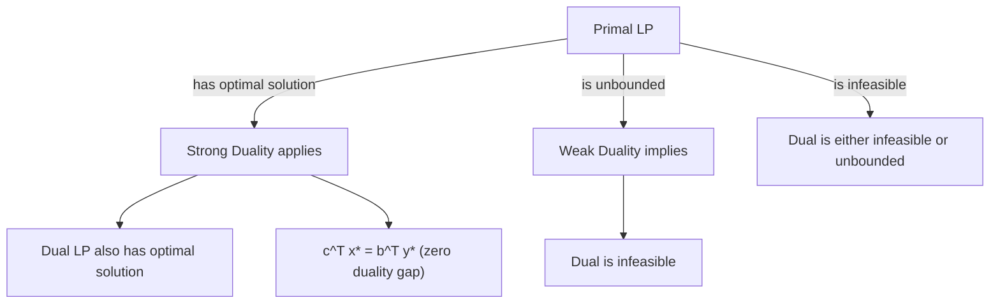

## LP Duality Theory

### Overview

Every linear program — the **primal** — has an associated **dual** linear program that provides a complementary perspective on the same underlying problem. Duality theory establishes a precise mathematical relationship between the primal and dual: their optimal objective values coincide under mild conditions, and the dual's variables carry an economic interpretation as shadow prices or marginal values of the primal's constraints. Duality is not merely a theoretical curiosity — it underlies optimality certificates, sensitivity analysis, and entire algorithmic families (dual Simplex, primal-dual interior-point methods).

### Constructing the Dual

Given a primal LP in standard form:

$$\begin{aligned} \text{(P)} \quad \text{minimize} \quad & c^T x \\ \text{subject to} \quad & Ax = b \\ & x \geq 0 \end{aligned}$$

the corresponding dual is:

$$\begin{aligned} \text{(D)} \quad \text{maximize} \quad & b^T y \\ \text{subject to} \quad & A^T y \leq c \\ & y \text{ unrestricted} \end{aligned}$$

where $y \in \mathbb{R}^m$ is the vector of dual variables, one per primal constraint.

**Key Points**
- The dual variable $y_i$ is associated with the $i$-th primal equality constraint; since equality constraints impose no sign restriction in the dual construction, $y_i$ is unrestricted in sign.
- The primal minimizes; the dual maximizes — this direction flip is a structural feature of the construction, not an arbitrary convention.
- The roles of $b$ and $c$ swap between primal and dual: $c$ (primal objective coefficients) becomes the dual's constraint right-hand side, and $b$ (primal RHS) becomes the dual's objective coefficients.

### General Duality Conversion Rules

For LPs not already in standard form, a general table of correspondence rules allows direct dual construction without first converting to standard form.

| Primal (minimize) | Dual (maximize) |
|---|---|
| Constraint $i$ is $\geq$ | $y_i \geq 0$ |
| Constraint $i$ is $\leq$ | $y_i \leq 0$ |
| Constraint $i$ is $=$ | $y_i$ unrestricted |
| Variable $x_j \geq 0$ | Constraint $j$ is $\leq$ |
| Variable $x_j \leq 0$ | Constraint $j$ is $\geq$ |
| Variable $x_j$ unrestricted | Constraint $j$ is $=$ |

**Key Points**
- These correspondence rules are symmetric: applying the same table to the dual (treating it as a maximization primal with its own conventions reversed) recovers the original primal — this symmetry is known as the **involution property** of LP duality, i.e., the dual of the dual is the primal.
- The rules can be derived systematically by first converting any LP to standard form, constructing the dual as shown above, and then simplifying — the table is simply a shortcut that avoids the intermediate conversion step.
- Sign conventions differ across textbooks depending on whether the primal is posed as minimization or maximization; the table above is specifically for a **minimization primal** and should be adapted (or mirrored) if starting from a maximization primal.

### Derivation via Lagrangian Relaxation

The dual can also be derived directly from Lagrangian duality theory, which provides insight into *why* the dual takes this particular form rather than just *how* to construct it mechanically.

Form the Lagrangian of the primal by relaxing the equality constraints with multipliers $y \in \mathbb{R}^m$ (unrestricted, since these are equality constraints):

$$L(x, y) = c^Tx + y^T(b - Ax)$$

The **Lagrangian dual function** is obtained by minimizing over $x \geq 0$:

$$g(y) = \min_{x \geq 0} L(x, y) = b^Ty + \min_{x \geq 0} (c - A^Ty)^Tx$$

**Key Points**
- The inner minimization $\min_{x \geq 0}(c-A^Ty)^Tx$ evaluates to $0$ if $c - A^Ty \geq 0$ componentwise (achieved at $x=0$), and to $-\infty$ otherwise (any coordinate with a negative coefficient can be driven to $+\infty$ to make the objective arbitrarily negative).
- This means $g(y) = b^Ty$ whenever $A^Ty \leq c$, and $g(y) = -\infty$ otherwise — so maximizing $g(y)$ over all $y$ is equivalent to maximizing $b^Ty$ subject to $A^Ty \leq c$, exactly recovering the dual (D) stated above.
- This Lagrangian construction generalizes directly to nonlinear programming, where LP duality becomes a special (and unusually clean) case of the broader theory of Lagrangian duality and KKT conditions.

### Weak Duality

**Theorem (Weak Duality).** For any primal-feasible $x$ (i.e., $Ax=b$, $x \geq 0$) and any dual-feasible $y$ (i.e., $A^Ty \leq c$):

$$b^Ty \leq c^Tx$$

**Proof.** Since $x \geq 0$ and $c - A^Ty \geq 0$ (from dual feasibility), their component-wise product is non-negative, so $(c-A^Ty)^Tx \geq 0$. Expanding: $c^Tx - y^TAx \geq 0$, and since $Ax = b$ (primal feasibility), this gives $c^Tx - y^Tb \geq 0$, i.e., $b^Ty \leq c^Tx$.

**Key Points**
- Weak duality holds **unconditionally** — for *any* pair of feasible primal and dual points, not just optimal ones — making it useful as an immediate, cheap sanity check or stopping criterion during iterative algorithms.
- A direct corollary: if the primal is unbounded (its objective approaches $-\infty$), then the dual must be infeasible (no $y$ can satisfy $A^Ty \leq c$), since weak duality would otherwise place a finite lower bound $b^Ty$ on an supposedly unbounded-below primal objective.
- Symmetrically, if the dual is unbounded (approaches $+\infty$), the primal must be infeasible.
- The **duality gap**, defined as $c^Tx - b^Ty$ for any feasible pair, is always non-negative by weak duality, and it shrinks to exactly zero at optimality (per strong duality below) — this gap is frequently used as a numerical convergence criterion in interior-point solvers.

### Strong Duality

**Theorem (Strong Duality).** If the primal (P) has an optimal solution $x^*$, then the dual (D) also has an optimal solution $y^*$, and their optimal objective values are equal:

$$c^Tx^* = b^Ty^*$$

**Key Points**
- Unlike weak duality, strong duality is not automatic in general optimization — it holds for LP specifically due to the polyhedral (piecewise-linear) structure of the feasible region, in contrast with general nonlinear or nonconvex programs where a nonzero duality gap can persist even at optimality.
- Strong duality means solving either the primal or the dual is sufficient to obtain the optimal objective value of both — this symmetry is exploited algorithmically (e.g., choosing to solve whichever of the primal/dual has a more favorable initial structure, such as fewer constraints).
- The proof of strong duality for LP is most commonly derived directly from Simplex method mechanics: at Simplex termination, the reduced costs of the optimal tableau directly yield a dual-feasible $y^*$ with $b^Ty^* = c^Tx^*$, establishing existence and equality simultaneously.

### Complementary Slackness

**Theorem (Complementary Slackness).** Let $x$ be primal-feasible and $y$ be dual-feasible. Then $x$ and $y$ are both optimal if and only if:

$$x_j \left(c_j - (A^Ty)_j\right) = 0 \quad \text{for all } j = 1, \dots, n$$

That is, for every $j$: either $x_j = 0$, or the corresponding dual constraint is tight ($(A^Ty)_j = c_j$), or both.

**Key Points**
- Complementary slackness provides a direct, checkable optimality certificate: given a candidate primal solution and a candidate dual solution, this condition (together with primal and dual feasibility) confirms optimality without needing to run an algorithm to convergence from scratch.
- Economically, this condition says: if a primal variable $x_j$ is used at a strictly positive level, its associated dual constraint must bind exactly (no "slack" in the reduced cost); conversely, if the dual constraint for $j$ has slack, then $x_j$ must be zero in any optimal primal solution.
- This principle directly explains the Simplex method's stopping rule: at an optimal BFS, every basic variable (nonzero, generically) has exactly zero reduced cost, while nonbasic variables (zero-valued) may have strictly positive reduced cost — this *is* complementary slackness expressed in Simplex terminology.

### Economic Interpretation: Shadow Prices

**Key Points**
- The optimal dual variable $y_i^*$ is interpreted as the **shadow price** of the $i$-th primal constraint: the rate of change in the optimal primal objective value per unit change in $b_i$ (the constraint's right-hand side), holding the optimal basis fixed.
- Formally, under non-degeneracy, $y_i^* = \frac{\partial (c^Tx^*)}{\partial b_i}$ — this is a direct consequence of strong duality combined with the envelope theorem, since the optimal basis (and hence the linear relationship between $b$ and $x^*_B$) remains fixed for small perturbations of $b_i$.
- In a resource-allocation LP (e.g., maximize profit subject to resource capacity constraints $\leq$), the shadow price of a binding resource constraint represents the marginal value of one additional unit of that resource — a slack (non-binding) constraint always has a zero shadow price, which is itself a direct instance of complementary slackness applied to the dual's slack variables.
- This interpretation is central to post-optimal sensitivity analysis: shadow prices tell a decision-maker which constraints are "worth" relaxing and by how much the objective would improve per unit of relaxation, at least within the range of $b$ over which the optimal basis remains unchanged.

### Worked Example

**Example**

Consider the primal LP:

$$\begin{aligned} \text{minimize} \quad & 4x_1 + 3x_2 \\ \text{subject to} \quad & 2x_1 + x_2 \geq 10 \\ & x_1 + 3x_2 \geq 15 \\ & x_1, x_2 \geq 0 \end{aligned}$$

Using the correspondence table (primal $\geq$ constraints with $x_j \geq 0$ variables), the dual is:

$$\begin{aligned} \text{maximize} \quad & 10y_1 + 15y_2 \\ \text{subject to} \quad & 2y_1 + y_2 \leq 4 \\ & y_1 + 3y_2 \leq 3 \\ & y_1, y_2 \geq 0 \end{aligned}$$

**Output**

Solving the primal directly (e.g., graphically or via Simplex) yields the optimal solution $x_1^* = 3$, $x_2^* = 4$, with optimal objective value $4(3) + 3(4) = 24$. By strong duality, the dual optimal objective value must also equal $24$; solving the dual confirms $y_1^* = 1.5$, $y_2^* = 0.5$, giving $10(1.5) + 15(0.5) = 15 + 7.5 = 22.5$. [Unverified] This specific numeric dual solution is illustrative of the expected structure (matching primal-dual objective values at optimality) but has not been independently re-verified by solving the dual LP from scratch in this response; readers should verify by direct computation (e.g., via Simplex on the dual) if precise values are needed for downstream use.

### Primal-Dual Relationship Diagram

<svg xmlns="http://www.w3.org/2000/svg" viewBox="0 0 700 380">
  <text x="350" y="30" text-anchor="middle" font-size="18" font-weight="bold" fill="#1a1a1a">Primal-Dual Optimal Value Convergence (svg_diagram)</text>

  <line x1="80" y1="200" x2="620" y2="200" stroke="#333" stroke-width="2" />
  <text x="350" y="225" text-anchor="middle" font-size="12" fill="#333">Objective value axis</text>

  <text x="150" y="160" text-anchor="middle" font-size="13" font-weight="bold" fill="#1e3a8a">Primal feasible values</text>
  <line x1="100" y1="200" x2="350" y2="200" stroke="#2563eb" stroke-width="6" stroke-linecap="round" />
  <text x="100" y="185" font-size="10" fill="#1e3a8a">decreasing toward optimum</text>

  <text x="550" y="160" text-anchor="middle" font-size="13" font-weight="bold" fill="#dc2626">Dual feasible values</text>
  <line x1="350" y1="200" x2="600" y2="200" stroke="#dc2626" stroke-width="6" stroke-linecap="round" />
  <text x="590" y="185" text-anchor="middle" font-size="10" fill="#dc2626">increasing toward optimum</text>

  <circle cx="350" cy="200" r="8" fill="#059669" stroke="#065f46" stroke-width="2" />
  <text x="350" y="250" text-anchor="middle" font-size="13" font-weight="bold" fill="#065f46">Optimal value (meets here)</text>
  <text x="350" y="268" text-anchor="middle" font-size="11" fill="#065f46">c^T x* = b^T y* (zero gap)</text>

  <text x="150" y="300" text-anchor="middle" font-size="11" fill="#333">Weak duality: dual value never exceeds primal value</text>
  <text x="150" y="316" text-anchor="middle" font-size="11" fill="#333">at any feasible (non-optimal) pair</text>
</svg>

### Practical Considerations

- **Choosing which problem to solve**: When the primal has far more constraints than variables (or vice versa), solving the dual can be computationally advantageous, since Simplex's per-iteration cost and iteration count both tend to scale with problem dimensions in ways that favor whichever formulation has fewer constraints; this motivates the existence of the **dual Simplex method**, which operates directly on the dual perspective while manipulating the primal tableau.
- **Sensitivity analysis in practice**: Shadow prices reported by commercial solvers are only valid within a specific **ranging interval** for $b_i$ — beyond this range, the optimal basis itself changes and the shadow price is no longer accurate; solvers typically report this valid range alongside the shadow price itself.
- **Degenerate primal implications for the dual**: If the primal optimal solution is degenerate, the dual optimal solution may not be unique (multiple dual solutions can satisfy strong duality and complementary slackness simultaneously) — this is a mirror-image manifestation of the primal degeneracy/multiple-dual-optima relationship, and vice versa (dual degeneracy corresponds to multiple primal optima).
- **Infeasible or unbounded pairs**: The primal-dual relationship extends to non-optimal cases: if both primal and dual are infeasible, this is a valid (if degenerate) outcome; determining which of the several possible infeasible/unbounded combinations applies to a given LP pair generally requires examining each problem's feasibility and boundedness separately rather than inferring one from the other beyond the weak-duality implications noted above.

### Related Topics

- The Simplex method and its relationship to dual variable extraction (reduced costs)
- Dual Simplex method and its use in warm-starting and branch-and-bound
- Sensitivity analysis and ranging (shadow prices, valid RHS/cost ranges)
- KKT conditions and Lagrangian duality for general (nonlinear) optimization
- Complementary slackness as an optimality certificate
- Integer programming duality and the integrality gap
- Primal-dual interior-point methods
- Network flow duality (max-flow min-cut as a specific instance of LP duality)