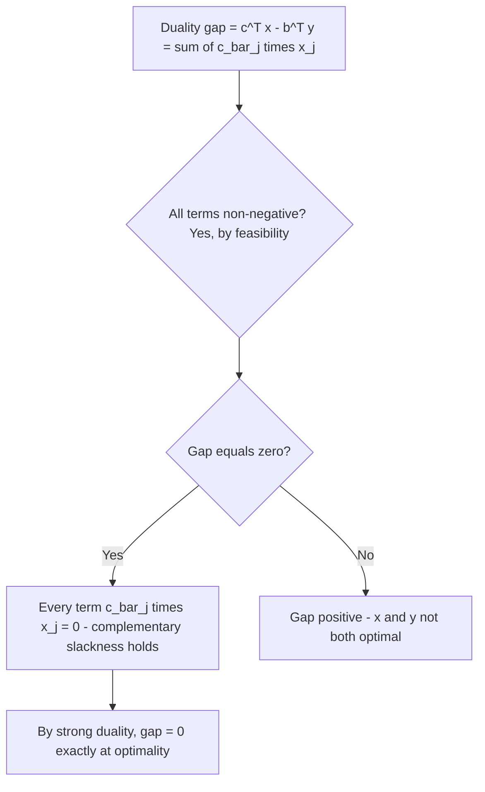

## Complementary Slackness

### Overview

Complementary slackness is the precise optimality condition connecting a primal-feasible solution to a dual-feasible solution, stating exactly when both can simultaneously be optimal. While the previous module introduced complementary slackness as a component of LP duality theory, this module treats it as a standalone tool: a certificate for verifying optimality without re-running an algorithm, a bridge to constructing dual solutions directly from primal ones (and vice versa), and the conceptual seed of the KKT conditions that generalize LP optimality to nonlinear programming.

### Formal Statement

Consider the primal-dual pair:

$$\begin{aligned} \text{(P)} \quad \text{minimize} \quad & c^T x & \text{(D)} \quad \text{maximize} \quad & b^T y \\ \text{subject to} \quad & Ax = b, \; x \geq 0 & \text{subject to} \quad & A^Ty \leq c \end{aligned}$$

Let $x$ be primal-feasible and $y$ be dual-feasible. Define the **primal reduced cost** vector $\bar{c} = c - A^Ty$, so dual feasibility is exactly $\bar{c} \geq 0$.

**Theorem (Complementary Slackness).** $x$ and $y$ are both optimal for their respective problems if and only if:

$$x_j \, \bar{c}_j = 0 \quad \text{for every } j = 1, \dots, n$$

Equivalently, for every index $j$: $x_j = 0$ **or** $\bar{c}_j = 0$ (or both).

**Key Points**
- This is often called the **complementary slackness condition**, and $x_j$ and $\bar c_j$ are said to be a **complementary pair** — at most one of the two can be strictly positive/nonzero at optimality.
- The condition is an *if and only if*: it is both necessary and sufficient for optimality (given that $x$ and $y$ are each already feasible for their own problem) — this bidirectional property is what makes it usable as a genuine certificate rather than just a necessary consequence.
- Since standard form has only equality constraints (already tight by definition), the "slackness" terminology specifically refers to the slack in the *dual* constraints $A^Ty \leq c$, i.e., whether $\bar c_j > 0$; the term originates more transparently from the inequality-constrained (canonical form) version discussed below.

### Proof of the Equivalence

**Step 1 — Derive the duality gap expression.** For any primal-feasible $x$ and dual-feasible $y$:

$$c^Tx - b^Ty = c^Tx - y^T(Ax) = (c - A^Ty)^Tx = \bar{c}^Tx = \sum_{j=1}^n \bar{c}_j x_j$$

using $Ax = b$ in the first substitution.

**Step 2 — Observe the sign of each term.** Since $x \geq 0$ (primal feasibility) and $\bar{c} \geq 0$ (dual feasibility), every term $\bar{c}_jx_j$ in the sum is non-negative. Therefore the entire sum — which equals the duality gap $c^Tx - b^Ty$ — is non-negative, recovering weak duality as an immediate corollary.

**Step 3 — Connect the gap to complementary slackness.** The duality gap $c^Tx - b^Ty$ equals zero (i.e., $x$ and $y$ achieve equal objective values) if and only if every individual term $\bar{c}_jx_j$ in the sum equals zero, since the sum consists entirely of non-negative terms. By strong duality, the gap is zero exactly when both $x$ and $y$ are optimal. Combining these two facts yields the theorem: $x, y$ optimal $\iff$ $\bar{c}_jx_j = 0$ for all $j$.

### Canonical Form Version (Inequality Constraints)

Complementary slackness has an equivalent, often more intuitive statement when the primal is posed with inequality constraints rather than in standard form, which makes the "slackness" terminology directly transparent.

For primal $\min c^Tx$ s.t. $Ax \geq b$, $x \geq 0$ and dual $\max b^Ty$ s.t. $A^Ty \leq c$, $y \geq 0$, complementary slackness states **two** simultaneous conditions:

$$y_i \left( (Ax)_i - b_i \right) = 0 \quad \text{for all } i \quad \text{(primal constraint slackness)}$$

$$x_j \left( c_j - (A^Ty)_j \right) = 0 \quad \text{for all } j \quad \text{(dual constraint slackness)}$$

**Key Points**
- The first condition says: if primal constraint $i$ has positive slack (is not tight, $(Ax)_i > b_i$), then the corresponding dual variable $y_i$ must be zero — a non-binding primal constraint carries no shadow price.
- The second condition says: if a dual constraint $j$ has positive slack ($ (A^Ty)_j < c_j$), then the corresponding primal variable $x_j$ must be zero — this is the same condition derived above for the standard-form case.
- In canonical form both conditions are needed because both the primal and dual now have genuine inequality constraints (as opposed to standard form, where the primal's equality constraints are trivially always "tight" and only the dual side has meaningful slack).

### Using Complementary Slackness as an Optimality Certificate

**Key Points**
- Given a candidate primal solution $x$ and candidate dual solution $y$, complementary slackness (combined with primal and dual feasibility) provides a *checkable* proof of optimality that requires no algorithm execution — only feasibility verification and a term-by-term product check.
- This is especially useful for verifying solutions obtained by heuristics, hand-derivation, or external unverified sources: if primal feasibility, dual feasibility, and complementary slackness all check out, optimality is certain by the theorem, independent of how the candidate solutions were obtained.
- In automated solver contexts, complementary slackness checks (alongside primal/dual feasibility residuals) are standard **stopping criteria**, e.g., interior-point methods track the complementary slackness product (or "duality measure") $x^T\bar{c}$ as it shrinks toward a numerical tolerance, terminating once it falls below a threshold.

### Using Complementary Slackness to Construct One Solution from the Other

A powerful practical use of complementary slackness is deriving the optimal dual solution directly from a known optimal primal solution (or vice versa), without solving the second problem from scratch.

**Example**

Given the primal:

$$\text{minimize } 4x_1 + 3x_2 \text{ s.t. } 2x_1 + x_2 \geq 10, \; x_1 + 3x_2 \geq 15, \; x_1, x_2 \geq 0$$

with known optimal primal solution $x_1^* = 3$, $x_2^* = 4$ (both strictly positive), the corresponding dual is:

$$\text{maximize } 10y_1 + 15y_2 \text{ s.t. } 2y_1+y_2 \leq 4, \; y_1+3y_2 \leq 3, \; y_1, y_2 \geq 0$$

**Step 1 — Apply dual-side complementary slackness.** Since $x_1^* > 0$ and $x_2^* > 0$, both dual constraints must be tight (by the contrapositive: if a dual constraint had slack, its complementary primal variable would have to be zero):

$$2y_1 + y_2 = 4, \qquad y_1 + 3y_2 = 3$$

**Step 2 — Solve the resulting linear system.** From the two equations: multiplying the first by 3 gives $6y_1 + 3y_2 = 12$; subtracting the second gives $5y_1 = 9$, so $y_1 = 1.8$. Substituting back: $y_2 = 4 - 2(1.8) = 0.4$.

**Output**

$y_1^* = 1.8$, $y_2^* = 0.4$. Checking dual feasibility: $y_1, y_2 \geq 0$ holds. Checking the objective: $10(1.8) + 15(0.4) = 18 + 6 = 24$, which indeed matches the primal optimal objective $4(3)+3(4)=24$, confirming strong duality and correcting the earlier illustrative (and explicitly flagged unverified) dual values from the previous module's worked example.

### Illustration: Complementary Pairs

<svg xmlns="http://www.w3.org/2000/svg" viewBox="0 0 700 340">
  <text x="350" y="30" text-anchor="middle" font-size="18" font-weight="bold" fill="#1a1a1a">Complementary Pairs at Optimality (svg_diagram)</text>

  <text x="175" y="65" text-anchor="middle" font-size="13" font-weight="bold" fill="#1e3a8a">Primal variables x_j</text>
  <text x="525" y="65" text-anchor="middle" font-size="13" font-weight="bold" fill="#dc2626">Dual slack c_bar_j</text>

  <rect x="100" y="90" width="150" height="40" fill="#93c5fd" opacity="0.5" stroke="#1e3a8a" stroke-width="1.5" />
  <text x="175" y="115" text-anchor="middle" font-size="13" fill="#1e3a8a">x_1 = 3 (&gt; 0)</text>
  <rect x="450" y="90" width="150" height="40" fill="#fca5a5" opacity="0.3" stroke="#dc2626" stroke-width="1.5" stroke-dasharray="4,3" />
  <text x="525" y="115" text-anchor="middle" font-size="13" fill="#7f1d1d">c_bar_1 = 0 (tight)</text>
  <line x1="250" y1="110" x2="450" y2="110" stroke="#059669" stroke-width="2" />
  <text x="350" y="100" text-anchor="middle" font-size="10" fill="#059669">complementary</text>

  <rect x="100" y="150" width="150" height="40" fill="#93c5fd" opacity="0.5" stroke="#1e3a8a" stroke-width="1.5" />
  <text x="175" y="175" text-anchor="middle" font-size="13" fill="#1e3a8a">x_2 = 4 (&gt; 0)</text>
  <rect x="450" y="150" width="150" height="40" fill="#fca5a5" opacity="0.3" stroke="#dc2626" stroke-width="1.5" stroke-dasharray="4,3" />
  <text x="525" y="175" text-anchor="middle" font-size="13" fill="#7f1d1d">c_bar_2 = 0 (tight)</text>
  <line x1="250" y1="170" x2="450" y2="170" stroke="#059669" stroke-width="2" />
  <text x="350" y="160" text-anchor="middle" font-size="10" fill="#059669">complementary</text>

  <text x="350" y="230" text-anchor="middle" font-size="12" fill="#333">If instead a primal variable were zero (nonbasic),</text>
  <text x="350" y="248" text-anchor="middle" font-size="12" fill="#333">its complementary dual slack could be strictly positive</text>
  <text x="350" y="266" text-anchor="middle" font-size="12" fill="#333">— but never both nonzero simultaneously at optimality</text>
</svg>

### Relationship to Simplex Tableau Reduced Costs

**Key Points**
- At the optimal Simplex tableau, every **basic** variable has reduced cost exactly zero — this is complementary slackness in action, since basic variables are (generically) strictly positive and hence must pair with a zero dual slack.
- Every **nonbasic** variable at its lower bound (zero) may have a strictly positive reduced cost — the reduced cost itself directly equals $\bar{c}_j$ for that column, so the entire optimal tableau simultaneously encodes both a certified-optimal primal solution and the data needed to read off a dual-optimal solution.
- This is precisely why extracting dual values ("shadow prices") from a solved LP is computationally free once Simplex has terminated — the reduced costs of the slack variable columns in the optimal tableau directly equal the optimal dual variables $y_i^*$ (up to sign conventions that depend on constraint direction), requiring no separate dual solve.

### Degenerate Cases and Non-Uniqueness

**Key Points**
- If the primal optimal solution is **degenerate** (a basic variable equals zero even though it's in the basis), complementary slackness alone does not pin down a unique dual solution — multiple dual-feasible $y$ vectors may satisfy the complementary slackness conditions simultaneously, since a zero-valued primal variable places no constraint on its complementary dual slack (the condition $x_j\bar c_j = 0$ is automatically satisfied when $x_j=0$, regardless of $\bar c_j$).
- Symmetrically, if the dual optimal solution is degenerate, the primal optimal solution may not be unique for the same underlying reason applied to the dual side.
- This non-uniqueness is a real practical consideration when using complementary slackness for the "construct-the-other-solution" technique demonstrated above — the technique yields a *valid* optimal dual solution when the primal solution is non-degenerate (as in the worked example above, where both $x_1^*, x_2^* > 0$ pinned down both dual constraints uniquely), but may require additional constraints or a full LP solve to resolve ambiguity in degenerate cases.

### Practical Considerations

- **Numerical tolerance in verification**: In practice, "equal to zero" in complementary slackness checks must be interpreted with a numerical tolerance (e.g., $|x_j \bar c_j| < \epsilon$ for small $\epsilon$) due to floating-point arithmetic, rather than exact equality — solvers and verification routines typically expose configurable tolerance parameters for this purpose.
- **Interior-point method usage**: Primal-dual interior-point methods maintain strict positivity ($x_j > 0$, $\bar c_j > 0$) throughout their iterations rather than driving variables to exact zero the way Simplex does, so complementary slackness for these methods is understood as an asymptotic target (the product $x_j\bar c_j \to 0$ as the barrier parameter shrinks) rather than an exact equality maintained at every iteration.
- **Extension to nonlinear programming**: Complementary slackness generalizes directly to the KKT conditions for nonlinear programs with inequality constraints, where an analogous condition ($\lambda_i g_i(x) = 0$ for inequality constraint multipliers $\lambda_i$ and constraint functions $g_i$) plays the identical role — LP's complementary slackness is a special case of this broader framework, one where the linear structure makes the condition provably both necessary and sufficient rather than merely necessary (as in the general nonlinear, non-convex case).
- **Diagnostic use in modeling**: When a solved LP produces an unexpected shadow price (e.g., a zero shadow price on a constraint the modeler expected to bind), complementary slackness explains why: the corresponding primal constraint must have slack in the optimal solution, which can prompt a modeler to re-examine whether the constraint was formulated as intended.

### Related Topics

- LP duality theory (weak duality, strong duality, dual construction rules)
- The Simplex method and reading dual values from the optimal tableau
- Sensitivity analysis and shadow price ranging
- KKT conditions for general (nonlinear) constrained optimization
- Primal-dual interior-point methods and the duality measure
- Degeneracy and non-uniqueness of primal/dual optimal solutions
- Dual Simplex method
- Economic interpretation of LP models (resource allocation, shadow prices)