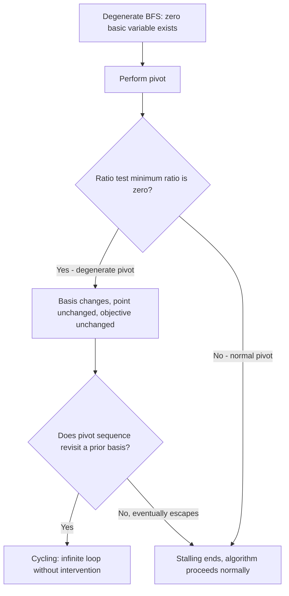

## Degeneracy and Its Implications

### Overview

Degeneracy is a structural condition in which a basic feasible solution has one or more basic variables equal to zero, causing a single geometric vertex to correspond to more than one algebraic basis. While earlier modules touched on degeneracy as a side note within polyhedral geometry and the Simplex method, this module treats it as a primary topic: its precise definition, why it arises, its concrete algorithmic consequences (stalling, cycling), the tools developed to handle it (Bland's rule, lexicographic perturbation, symbolic perturbation), and its downstream effects on duality and sensitivity analysis.

### Formal Definition

For a standard-form LP with $A \in \mathbb{R}^{m \times n}$ full row rank, a basic feasible solution corresponding to basis $B$ is **degenerate** if at least one basic variable $x_{B_i} = 0$.

**Key Points**
- Degeneracy is a property of the *solution*, not the problem in general — a given LP can have both degenerate and non-degenerate BFSs among its vertices.
- Geometrically, degeneracy at a vertex $v \in \mathbb{R}^n$ means that more than the minimum necessary number of constraints are tight (active) at $v$ — specifically, more than $n$ linearly independent active constraints pass through a single point in $n$-dimensional space, when only $n$ are needed to uniquely pin down a point.
- A **primal degenerate** solution has a zero basic variable in the primal; a **dual degenerate** solution has a zero reduced cost on a nonbasic variable in the dual (equivalently, multiple primal optimal solutions exist) — these are related but distinct phenomena, and an LP can exhibit either, both, or neither at its optimum.

### Why Degeneracy Arises

**Key Points**
- Degeneracy often arises from problem structure with inherent symmetry or redundancy — e.g., transportation and assignment problems frequently have degenerate optimal solutions because supply/demand balance constraints create linear dependencies among the tight constraints at a vertex almost by construction.
- Degeneracy can also arise incidentally from numeric coincidence in constraint data — e.g., two constraints happening to intersect at a common boundary point along with a third, unrelated constraint, without any deeper structural cause.
- Real-world LP formulations with tightly coupled constraints (e.g., network flow conservation, scheduling with overlapping resource limits) are more prone to degeneracy than "generic" randomly generated LPs, where degenerate vertices are comparatively rare, since exact coincidental tightness among more than $n$ constraints has probability zero under continuous random perturbation of problem data.

### Illustrative Example

**Example**

Consider the LP: minimize $-x_1 - x_2$ subject to $x_1 \leq 4$, $x_2 \leq 4$, $x_1 + x_2 \leq 8$, $x_1, x_2 \geq 0$. Converting to standard form with slacks $s_1, s_2, s_3 \geq 0$:

$$x_1 + s_1 = 4, \quad x_2 + s_2 = 4, \quad x_1 + x_2 + s_3 = 8$$

At the point $(4,4)$, all three original inequality constraints are simultaneously tight: $x_1=4$, $x_2=4$, and $x_1+x_2=8$. But in $\mathbb{R}^2$, only 2 tight constraints are needed to pin down a vertex. This is degeneracy: three constraints meet at one point where only two are required.

**Output**

At $(4,4)$: $s_1 = 0$, $s_2 = 0$, $s_3 = 0$. With $n=5$ variables and $m=3$ constraints, a basis requires exactly 3 basic variables. The point $(4,4)$ can be represented by the basis $\{x_1, x_2, s_1\}$ (with $s_1=0$, degenerate), or $\{x_1, x_2, s_2\}$ (with $s_2=0$, degenerate), or $\{x_1, x_2, s_3\}$ (with $s_3=0$, degenerate) — three distinct algebraic bases, all representing the identical geometric point.

### Geometric Illustration

<svg xmlns="http://www.w3.org/2000/svg" viewBox="0 0 600 420">
  <text x="300" y="30" text-anchor="middle" font-size="18" font-weight="bold" fill="#1a1a1a">Degenerate Vertex: Three Constraints, One Point (svg_diagram)</text>

  <line x1="80" y1="360" x2="80" y2="70" stroke="#333" stroke-width="2" />
  <line x1="80" y1="360" x2="480" y2="360" stroke="#333" stroke-width="2" />
  <text x="460" y="380" font-size="13" fill="#333">x1</text>
  <text x="55" y="80" font-size="13" fill="#333">x2</text>

  <polygon points="80,360 280,360 280,160 80,360" fill="none" />
  <polygon points="80,360 280,360 280,160 130,110 80,110" fill="#93c5fd" opacity="0.3" stroke="none" />

  <line x1="280" y1="360" x2="280" y2="80" stroke="#7c2d12" stroke-width="2" />
  <text x="290" y="100" font-size="11" fill="#7c2d12">x1 = 4</text>

  <line x1="80" y1="160" x2="480" y2="160" stroke="#1e40af" stroke-width="2" />
  <text x="400" y="150" font-size="11" fill="#1e40af">x2 = 4</text>

  <line x1="80" y1="360" x2="280" y2="160" stroke="#065f46" stroke-width="2" />
  <line x1="280" y1="160" x2="380" y2="60" stroke="#065f46" stroke-width="1" stroke-dasharray="4,3" />
  <text x="380" y="80" font-size="11" fill="#065f46">x1 + x2 = 8</text>

  <circle cx="280" cy="160" r="8" fill="#dc2626" />
  <text x="295" y="150" font-size="12" fill="#dc2626" font-weight="bold">(4,4)</text>
  <text x="295" y="168" font-size="10" fill="#dc2626">3 constraints tight,</text>
  <text x="295" y="184" font-size="10" fill="#dc2626">only 2 needed</text>

  <circle cx="280" cy="360" r="5" fill="#1e3a8a" />
  <text x="290" y="378" font-size="11" fill="#1e3a8a">(4,0) non-degenerate</text>
  <circle cx="80" cy="160" r="5" fill="#1e3a8a" />
  <text x="10" y="150" font-size="11" fill="#1e3a8a">(0,4) non-degenerate</text>
</svg>

### Algorithmic Consequence: Stalling

**Key Points**
- A **degenerate pivot** is a Simplex pivot in which the entering variable's value increases by exactly zero (the ratio test's minimum ratio is zero) — the basis changes, but the actual point in $\mathbb{R}^n$ does not move.
- A sequence of consecutive degenerate pivots is called **stalling**: the algorithm continues to perform valid pivot operations, but makes no geometric progress and (since the point is unchanged) no objective-value improvement either.
- Stalling is not itself a failure mode — the algorithm can still terminate correctly after a stalling sequence, as long as it eventually escapes to a genuinely improving pivot — but it does represent wasted computational effort, and in the worst case can precede or enable cycling.

### Algorithmic Consequence: Cycling

**Key Points**
- **Cycling** is the more severe failure mode where a sequence of degenerate pivots eventually **revisits a previously seen basis**, creating an infinite loop that never terminates without intervention — the algorithm would run forever, alternating among a fixed cycle of degenerate bases.
- Cycling requires degeneracy to occur, but degeneracy does not guarantee cycling will happen — most degenerate LPs solved by naive Simplex implementations still terminate correctly in practice, since a specific unlucky sequence of pivot choices is needed to actually complete a cycle. [Inference] The empirical rarity of cycling in practice (as opposed to its theoretical possibility) is a widely repeated observation in the optimization literature, though the exact frequency depends heavily on problem structure and the specific pivoting rule's tie-breaking behavior, and is not something that can be quantified with a single universal statistic.
- The classic textbook example demonstrating actual cycling under a naive largest-coefficient pivoting rule uses a small, specially constructed LP (often attributed to Beale) with carefully chosen degenerate coefficients — such examples are constructed specifically to trigger cycling and are not representative of typical problem instances.

### Anti-Cycling Rule: Bland's Rule

**Key Points**
- **Bland's rule** (also called the smallest-subscript rule) resolves ties in both the entering-variable selection and the leaving-variable (ratio test) selection by always choosing the **lowest-indexed** eligible variable, rather than the variable with the most negative reduced cost (Dantzig's rule) or other aggressive heuristics.
- Bland's rule is provably guaranteed to prevent cycling — this is a rigorous theorem, not an empirical heuristic, making it the standard fallback whenever cycling is a genuine concern (e.g., in symbolic/exact-arithmetic Simplex implementations where floating-point tie-breaking behavior differs from theory).
- The tradeoff is practical performance: Bland's rule's conservative, low-index-first selection strategy is generally slower in practice (requiring more total pivots) than aggressive rules like Dantzig's rule or steepest-edge pricing, which is why many production solvers default to an aggressive rule and switch to Bland's rule only defensively (e.g., after detecting a suspiciously long sequence of degenerate pivots).

### Anti-Cycling Rule: Lexicographic Perturbation

**Key Points**
- **Lexicographic perturbation** (or the lexicographic method) conceptually perturbs the right-hand side vector $b$ by an infinitesimal, symbolically-ordered amount, ensuring all basic feasible solutions become "lexicographically" non-degenerate — i.e., ties in the ratio test are broken by comparing subsequent tableau column entries in a fixed lexicographic order rather than resolving to an exact tie.
- Unlike Bland's rule, which is a *pivoting selection* strategy, lexicographic perturbation is a *problem modification* strategy — it changes how ties are computed and broken during the ratio test specifically, while typically retaining the more aggressive entering-variable selection rule (e.g., Dantzig's rule) for the rest of the algorithm.
- This approach is provably equivalent to (and can be understood as) applying an actual small perturbation to $b$ with generic (linearly independent) infinitesimal components, which guarantees a non-degenerate polyhedron and hence a finite, cycle-free pivot sequence, without introducing genuine numerical perturbation error into the computation.

### Impact on Duality and Complementary Slackness

**Key Points**
- As established when this topic was introduced during complementary slackness, primal degeneracy at the optimal solution implies the corresponding dual-optimal solution may be **non-unique** — the complementary slackness condition places no constraint on a dual slack variable $\bar c_j$ when its complementary primal variable $x_j$ is (degenerately) zero.
- Symmetrically, dual degeneracy at optimality corresponds to the primal having **multiple optimal solutions** (an optimal face of dimension greater than zero) — the two forms of degeneracy are connected but not identical, and one can occur independently of the other.
- This non-uniqueness has practical consequences for sensitivity analysis: shadow prices derived from a degenerate optimal basis may not be the *only* valid set of shadow prices consistent with optimality, and the "ranging interval" over which a reported shadow price remains valid can shrink to a single point (zero width) exactly at a degenerate optimum — a phenomenon sometimes described informally as the shadow price being "unstable" at that specific $b$.

### Degeneracy in Practice Across Problem Classes

| Problem Class | Degeneracy Tendency | Typical Cause |
|---|---|---|
| Randomly generated generic LPs | Rare | Continuous random data makes exact coincidental tightness improbable |
| Transportation / assignment problems | Common | Supply-demand balance constraints create structural redundancy |
| Network flow problems | Common | Flow conservation constraints at nodes create structural redundancy |
| Scheduling with overlapping resource limits | Common | Multiple constraints frequently bind simultaneously at feasible boundary schedules |
| LPs with many redundant/duplicate constraints | Common | Redundant constraints directly create excess tight constraints at shared vertices |

### Practical Considerations

- **Detecting degeneracy in practice**: Most production solvers report basic variable values, and a simple post-solve check for basic variables equal to (or numerically indistinguishable from) zero within a small tolerance can flag degenerate optimal solutions, which is useful context before trusting reported shadow prices at face value.
- **Solver defaults and safeguards**: Commercial and open-source LP solvers commonly default to aggressive pivoting rules (Dantzig's rule variants, steepest-edge, or devex pricing) for typical performance, layering in perturbation or Bland's-rule fallbacks specifically as anti-cycling safeguards rather than as the default behavior. [Unverified] The precise fallback triggering logic (e.g., iteration count thresholds, explicit cycle detection via basis hashing) is generally solver-specific and not standardized or fully documented publicly across different solver implementations.
- **Degeneracy and interior-point methods**: Interior-point methods are comparatively insensitive to primal degeneracy in the sense that they do not perform discrete basis pivots and therefore cannot "cycle" in the Simplex sense — however, degenerate optimal faces still affect interior-point convergence behavior near the optimum (e.g., the specific point on the optimal face the method converges toward), just through a different mechanism than Simplex stalling/cycling.
- **Modeling-level mitigation**: When degeneracy is anticipated from problem structure (e.g., transportation problems), some practitioners apply small, deliberate perturbations to problem data (analogous to but distinct from formal lexicographic perturbation) purely as an ad hoc practical workaround to reduce observed stalling — though this approach introduces genuine numerical approximation and should be applied cautiously, since it changes the problem being solved rather than just the tie-breaking mechanism.

### Related Topics

- The Simplex method (pivoting rules, ratio test mechanics)
- Polyhedra, vertices, and basic feasible solutions (geometric roots of degeneracy)
- LP duality and complementary slackness (dual degeneracy and non-uniqueness)
- Sensitivity analysis and ranging (shadow price validity intervals)
- Transportation and assignment problem structure
- Interior-point methods and the central path
- Symbolic/exact arithmetic Simplex implementations
- Klee-Minty cube and worst-case Simplex complexity