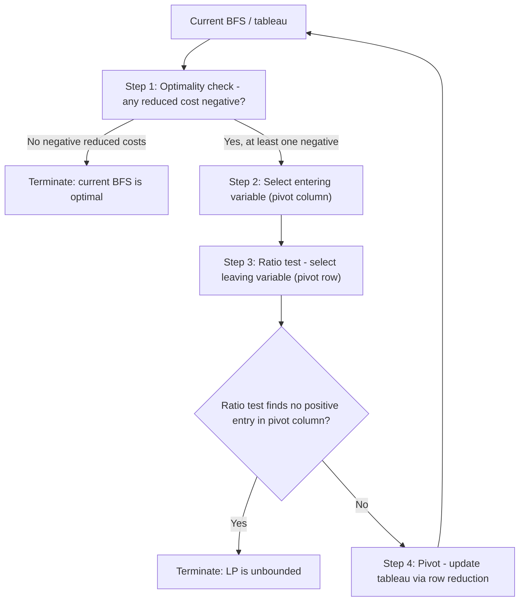

## Simplex Method Mechanics

### Overview

The Simplex method is the classical algorithm for solving linear programs by systematically moving from one basic feasible solution to an adjacent one, guided by the guarantee — established by the Fundamental Theorem of Linear Programming — that an optimal solution can be found among the vertices of the feasible polyhedron. This module details the concrete computational mechanics: the tableau representation, entering/leaving variable selection, the ratio test, and the full pivot cycle, tying together the geometric and duality concepts developed in prior modules into an executable algorithm.

### The Simplex Tableau

Given a standard-form LP $\min c^Tx$ s.t. $Ax=b$, $x \geq 0$, and a current basis $B$ with $A_B$ invertible, the **tableau** encodes the system after expressing all quantities relative to the current basis:

$$A_B^{-1}Ax = A_B^{-1}b$$

The tableau's rows represent this transformed constraint system, augmented with an objective row expressing the current objective value and the **reduced costs** of every variable.

**Key Points**
- The tableau is typically organized with columns for each variable (basic and nonbasic), a right-hand-side column (giving the current values of the basic variables, since nonbasic variables are held at zero), and an objective row.
- The **reduced cost** of variable $j$, denoted $\bar{c}_j = c_j - c_B^TA_B^{-1}A_j$, measures the net per-unit change in the objective if variable $j$ were increased from zero — basic variables always have reduced cost exactly zero in a valid tableau.
- Modern implementations rarely maintain an explicit, fully updated tableau at every iteration for large problems; instead, they use the **revised Simplex method**, which maintains only $A_B^{-1}$ (or an equivalent factorization) and computes tableau quantities on demand — this is computationally far more efficient for sparse, large-scale problems, though the full-tableau version remains the standard pedagogical presentation.

### The Pivot Cycle: Four Steps

Each Simplex iteration consists of four steps, repeated until termination.

#### Step 1 — Optimality Check

**Key Points**
- For a minimization problem, the current BFS is optimal if and only if every reduced cost $\bar{c}_j \geq 0$ for all nonbasic $j$ — no nonbasic variable can be increased from zero without worsening (or at best not improving) the objective.
- This optimality check is a direct computational instance of the complementary slackness / dual feasibility condition: reduced costs $\bar c_j \geq 0$ for all $j$ is exactly dual feasibility ($A^Ty \leq c$ with $y = (A_B^{-1})^Tc_B$), so optimality-check-passing is equivalent to having found a dual-feasible $y$ that pairs with the current primal-feasible $x$ to satisfy complementary slackness.
- If multiple nonbasic variables have negative reduced costs, any one of them is a valid candidate for entering; the *choice* among them is the pivoting rule (discussed below).

#### Step 2 — Entering Variable Selection

**Key Points**
- **Dantzig's rule** (most common in introductory treatments): select the nonbasic variable with the most negative reduced cost, on the heuristic that this promises the largest per-unit objective improvement.
- Dantzig's rule does not guarantee the largest *total* objective improvement per pivot (since the actual improvement also depends on how far the ratio test allows the variable to increase) — it is a simple, cheap-to-compute heuristic rather than a provably optimal selection strategy.
- Alternative rules — **steepest-edge pricing** (accounting for the actual geometric step length along each candidate edge) and **devex pricing** (an efficient approximation to steepest-edge) — often outperform Dantzig's rule in practice on large problems, at the cost of more computation per iteration; most production solvers default to some variant of these rather than plain Dantzig's rule.

#### Step 3 — Ratio Test (Leaving Variable Selection)

Having selected entering variable $x_k$ (pivot column), the ratio test determines the leaving variable by computing, for each row $i$ with a strictly positive pivot-column entry $\bar{A}_{ik} > 0$:

$$\theta = \min_{i \,:\, \bar{A}_{ik} > 0} \frac{\bar{b}_i}{\bar{A}_{ik}}$$

The row achieving this minimum ratio determines the **leaving variable** (the current basic variable in that row).

**Key Points**
- The ratio test finds how far $x_k$ can increase before some currently-basic variable is driven to exactly zero (and would go negative if $x_k$ increased further) — this is precisely the mechanism ensuring the next solution remains feasible ($x \geq 0$).
- If **no** row has $\bar{A}_{ik} > 0$ (every entry in the pivot column is non-positive), the ratio test is undefined — this signals that $x_k$ can increase without bound while all basic variables remain non-negative, meaning the LP is **unbounded**.
- **Ties in the ratio test** (multiple rows achieving the same minimum ratio) are exactly the condition that produces a degenerate pivot in the next iteration; this is where anti-cycling tie-breaking rules like Bland's rule or lexicographic ordering are applied.

#### Step 4 — Pivot Operation

**Key Points**
- The pivot operation performs Gauss-Jordan elimination on the tableau: the pivot element $\bar{A}_{rk}$ (row $r$ from the ratio test, column $k$ from entering-variable selection) is normalized to 1, and all other entries in column $k$ are eliminated to zero via row operations, updating every row (including the objective row) accordingly.
- After the pivot, variable $x_k$ becomes basic (occupying row $r$'s basic-variable slot) and the previous basic variable in row $r$ becomes nonbasic (set to zero) — this is the algebraic realization of "entering" and "leaving" the basis.
- The updated tableau represents the new BFS, geometrically the adjacent vertex reached by moving along the edge corresponding to $x_k$'s increase, and the algorithm returns to Step 1 to re-check optimality from this new vertex.

### Worked Numerical Example

**Example**

Consider: minimize $-3x_1 - 2x_2$ subject to $x_1 + x_2 \leq 4$, $x_1 + 3x_2 \leq 6$, $x_1, x_2 \geq 0$. Adding slacks $s_1, s_2$:

$$x_1 + x_2 + s_1 = 4, \qquad x_1 + 3x_2 + s_2 = 6$$

**Initial tableau** (basis $\{s_1, s_2\}$, so $x_1=x_2=0$, $s_1=4$, $s_2=6$, objective $=0$):

| Basic | $x_1$ | $x_2$ | $s_1$ | $s_2$ | RHS |
|---|---|---|---|---|---|
| $s_1$ | 1 | 1 | 1 | 0 | 4 |
| $s_2$ | 1 | 3 | 0 | 1 | 6 |
| obj | $-3$ | $-2$ | 0 | 0 | 0 |

**Step 1 (optimality check):** Reduced costs $-3$ (for $x_1$) and $-2$ (for $x_2$) are both negative — not optimal.

**Step 2 (entering variable, Dantzig's rule):** $x_1$ has the more negative reduced cost ($-3 < -2$), so $x_1$ enters.

**Step 3 (ratio test):** Column $x_1$ has entries $1$ (row $s_1$) and $1$ (row $s_2$). Ratios: $4/1=4$ and $6/1=6$. Minimum is $4$, achieved by row $s_1$ — so $s_1$ leaves.

**Step 4 (pivot on row $s_1$, column $x_1$):** The pivot element is already 1. Eliminate $x_1$ from row $s_2$ and the objective row:

- New row $s_2$: (old row $s_2$) $-$ (1)(row $s_1$) $= [0, 2, -1, 1 \mid 2]$
- New obj row: (old obj) $+$ (3)(row $s_1$) $= [0, 1, 3, 0 \mid 12]$

**Updated tableau** (basis $\{x_1, s_2\}$, $x_1=4$, $s_2=2$, $x_2=0$, $s_1=0$, objective $=-12$):

| Basic | $x_1$ | $x_2$ | $s_1$ | $s_2$ | RHS |
|---|---|---|---|---|---|
| $x_1$ | 1 | 1 | 1 | 0 | 4 |
| $s_2$ | 0 | 2 | $-1$ | 1 | 2 |
| obj | 0 | 1 | 3 | 0 | 12 |

**Step 1 again:** Reduced cost for $x_2$ is $+1 \geq 0$; all reduced costs non-negative.

**Output**

The current tableau is optimal: $x_1^* = 4$, $x_2^* = 0$, with optimal objective value $c^Tx^* = -3(4)-2(0) = -12$ (matching the tableau's objective row, recalling the sign convention that the tableau tracks $-(c^Tx)$ built up from the negated original objective row entries, here directly read as $12$ requiring the sign flip back to $-12$ for the original minimize $-3x_1-2x_2$ objective).

### Constructing an Initial BFS: Two-Phase Method

Standard form does not always provide an "obvious" starting BFS (e.g., when constraints are equalities from the start, without slack variables to use as an initial basis).

**Key Points**
- The **Two-Phase Simplex method** addresses this by introducing artificial variables $a_i \geq 0$ to each constraint lacking an obvious basic variable, then running a **Phase I** LP that minimizes the sum of artificial variables $\sum_i a_i$ subject to the original constraints (augmented with the artificials).
- If Phase I's optimal objective value is exactly zero, all artificial variables have been driven out of the basis (or are basic at zero, a degenerate case requiring care), and the resulting BFS — with artificials removed — is a valid initial BFS for the original problem, launching **Phase II**, which runs ordinary Simplex on the true objective from that starting point.
- If Phase I's optimal objective value is strictly positive, the artificial variables cannot all be driven to zero while satisfying the original constraints, which certifies that the **original problem is infeasible** — this is how Two-Phase Simplex detects infeasibility as a direct byproduct of its construction.

### Alternative Initialization: The Big-M Method

**Key Points**
- The **Big-M method** is a single-phase alternative to the Two-Phase method: artificial variables are added as in Phase I, but instead of a separate Phase I objective, they are appended to the *original* objective with a very large penalty coefficient $M$ (e.g., minimize $c^Tx + M\sum_i a_i$), so that any Simplex-driven objective improvement will naturally push artificial variables toward zero.
- The choice of $M$ must be "sufficiently large" relative to the problem's other coefficients to guarantee artificials are driven out before the algorithm would otherwise consider them attractive to keep in the basis — in practice this can introduce numerical conditioning issues if $M$ is chosen too large relative to the machine's floating-point precision. [Inference] The specific numerical instability threshold depends on the solver's floating-point precision and the scale of the problem's other coefficients, which is why many practical implementations favor the Two-Phase method (which avoids the need to select a numeric penalty value entirely) over Big-M for robust automated solving.
- If, at Big-M's termination, any artificial variable remains in the basis at a positive value, the original problem is infeasible — analogous to the Two-Phase method's infeasibility detection, but read off directly from the single combined tableau rather than a separate Phase I check.

### Termination Guarantees

**Key Points**
- **Finite termination** (assuming no cycling) follows directly from the finiteness of the set of possible bases (at most $\binom{n}{m}$) combined with the fact that non-degenerate pivots strictly improve the objective value, so no basis can be revisited — the algorithm must either find an improving pivot or terminate (at optimality or detecting unboundedness) within a finite number of steps.
- With degeneracy present, finite termination is not automatic without an anti-cycling safeguard (Bland's rule or lexicographic perturbation), as detailed in the prior degeneracy module — without such a safeguard, cycling is a theoretical (if empirically rare) possibility.
- **Worst-case exponential behavior**: Despite typically fast practical performance, specially constructed instances (the Klee-Minty cube being the canonical example) force Dantzig's-rule Simplex to visit an exponential number of vertices before terminating — this worst-case behavior is why Simplex is not a polynomial-time algorithm in the worst case, in contrast to interior-point methods, which achieve polynomial-time worst-case guarantees.

### Simplex Variants Summary

| Variant | Distinguishing Feature | Primary Use Case |
|---|---|---|
| Primal Simplex (tableau) | Explicit full tableau maintained and updated each iteration | Pedagogical / small problems |
| Revised Simplex | Maintains only $A_B^{-1}$ (or LU factorization); computes tableau entries on demand | Large-scale, sparse practical problems |
| Two-Phase Simplex | Separate Phase I (feasibility) and Phase II (optimality) LPs | Initialization when no obvious starting BFS exists |
| Big-M Method | Single combined objective with penalty coefficient | Alternative initialization, simpler conceptually but numerically delicate |
| Dual Simplex | Operates on a dual-feasible (not necessarily primal-feasible) tableau, restoring primal feasibility iteratively | Warm-starting after adding constraints (e.g., in branch-and-bound) |

### Practical Considerations

- **Numerical stability in implementation**: Repeated row-reduction operations across many pivots can accumulate floating-point error in a naively implemented tableau method; production-grade revised Simplex implementations periodically refactorize $A_B^{-1}$ from scratch (rather than purely incrementally updating it) to control error accumulation.
- **Warm-starting**: Because the tableau (or its revised-Simplex equivalent) fully encodes the current basis, Simplex is naturally suited to **warm-starting** — resuming from a previous optimal basis after a small problem modification (e.g., a new constraint or a changed coefficient) — which is heavily exploited in iterative contexts like branch-and-bound for integer programming, where each subproblem differs only slightly from its parent.
- **Sparse large-scale problems**: For LPs with thousands to millions of variables and constraints, the sparsity pattern of $A$ is critical to performance; revised Simplex implementations rely on sparse linear algebra techniques (sparse LU factorization, Bartels-Golub updates) to keep each pivot's computational cost proportional to the problem's sparsity rather than its dense dimensions.
- **When Simplex is not the right tool**: For very large-scale LPs, especially those with dense constraint structure or where only a moderate-precision solution is needed quickly, interior-point methods often outperform Simplex in wall-clock time despite Simplex's typically excellent practical pivot-count behavior on many problem classes — the choice between the two is frequently empirical and problem-dependent rather than governed by a single decisive theoretical criterion.

### Related Topics

- Fundamental Theorem of Linear Programming (theoretical justification for vertex-restricted search)
- Degeneracy, stalling, and cycling (Bland's rule, lexicographic perturbation)
- LP duality and complementary slackness (dual feasibility as the optimality check)
- Revised Simplex method and sparse linear algebra techniques
- Dual Simplex method and warm-starting in branch-and-bound
- Interior-point methods (contrast in worst-case complexity and iteration structure)
- Klee-Minty cube and worst-case Simplex pivot counts
- Sensitivity analysis via post-optimal tableau examination