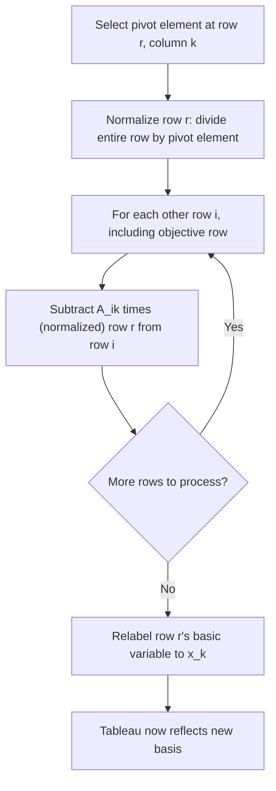

## Tableau Representation and Pivoting

### Overview

While the prior module covered the Simplex pivot cycle at an operational level, this module focuses specifically on the tableau as a data structure: its precise algebraic construction from the underlying matrix system, the exact row-operation mechanics of a pivot, how to read every quantity of interest (reduced costs, dual values, ranging information) directly off a tableau, and the relationship between the naive full-tableau method and the more computationally efficient revised Simplex representation used in practice.

### Algebraic Construction of the Tableau

Given standard form $\min c^Tx$ s.t. $Ax=b$, $x\geq 0$, and a basis $B$ (an index set of $m$ columns with $A_B$ invertible), partition $A = [A_B \; A_N]$ and $x = (x_B, x_N)$ correspondingly. The constraint system can be rewritten as:

$$A_Bx_B + A_Nx_N = b \quad \Longrightarrow \quad x_B = A_B^{-1}b - A_B^{-1}A_Nx_N$$

Left-multiplying the full system by $A_B^{-1}$ gives the **canonical tableau form**:

$$A_B^{-1}Ax = A_B^{-1}b$$

**Key Points**
- In this canonical form, the columns of $A_B^{-1}A$ corresponding to basic variables form the identity matrix $I_m$ — this is a defining, checkable property of a correctly constructed tableau: basic columns always reduce to standard basis vectors.
- The right-hand side $A_B^{-1}b$ directly gives the current values of the basic variables (with nonbasic variables implicitly at zero) — this vector is often called $\bar{b}$ in tableau notation.
- The objective row is similarly transformed to express the objective purely in terms of nonbasic variables, yielding the reduced costs $\bar{c}_j = c_j - c_B^TA_B^{-1}A_j$ for every column $j$, with $\bar c_j = 0$ automatically for every basic column.

### Anatomy of a Tableau

A standard tableau layout organizes these quantities into a single matrix-like grid:

| Basic Var | $x_1$ | $\cdots$ | $x_n$ | RHS ($\bar{b}$) |
|---|---|---|---|---|
| $x_{B_1}$ | $\bar{A}_{11}$ | $\cdots$ | $\bar{A}_{1n}$ | $\bar{b}_1$ |
| $\vdots$ | $\vdots$ | $\ddots$ | $\vdots$ | $\vdots$ |
| $x_{B_m}$ | $\bar{A}_{m1}$ | $\cdots$ | $\bar{A}_{mn}$ | $\bar{b}_m$ |
| obj ($z$) | $\bar{c}_1$ | $\cdots$ | $\bar{c}_n$ | $-z$ (or $z$, by convention) |

**Key Points**
- Each row (other than the objective row) corresponds to exactly one basic variable — the row's label identifies which variable is basic in that row, and reading across that row gives the coefficients of every variable's contribution to that basic variable's value.
- The column under each basic variable, read down all rows, is a standard basis vector $e_i$ (all zeros except a 1 in that variable's own row) — this identity-submatrix structure is what makes the RHS column directly readable as the current basic solution, with no further computation needed.
- Sign conventions for the objective row's RHS entry (whether it stores $z$ or $-z$, and whether reduced costs are stored as $\bar c_j$ or $-\bar c_j$) vary across textbooks; consistency within a single derivation matters far more than which specific convention is chosen.

### The Pivot Operation in Detail

Given a selected pivot element at row $r$ (the leaving variable's row, from the ratio test) and column $k$ (the entering variable's column), the pivot operation transforms the entire tableau via Gauss-Jordan elimination.

**Step 1 — Normalize the pivot row.** Divide every entry in row $r$ (including $\bar{b}_r$) by the pivot element $\bar{A}_{rk}$:

$$\text{Row}_r \leftarrow \frac{\text{Row}_r}{\bar{A}_{rk}}$$

**Step 2 — Eliminate the pivot column from all other rows.** For every other row $i \neq r$ (including the objective row), subtract an appropriate multiple of the (newly normalized) row $r$ to zero out column $k$ in row $i$:

$$\text{Row}_i \leftarrow \text{Row}_i - \bar{A}_{ik} \cdot \text{Row}_r \quad \text{(using the already-normalized Row}_r\text{)}$$

**Step 3 — Relabel the basis.** Update the basic-variable label of row $r$ from the old leaving variable to the new entering variable $x_k$.

**Key Points**
- This is exactly the Gauss-Jordan elimination procedure used to solve a linear system by row reduction, applied specifically to maintain the "identity submatrix on basic columns" invariant after every pivot.
- The objective row is transformed by the identical elimination rule as every other row — there is no special-case handling needed, since the objective row is simply one more row in the augmented system being maintained in canonical form.
- After a correctly executed pivot, the new pivot column $k$ becomes a standard basis vector (all zeros except a 1 in row $r$), and the column that was previously the standard basis vector for the leaving variable is no longer guaranteed to be — this swap is the algebraic essence of "entering" and "leaving" the basis.

### Fully Worked Pivot Example

**Example**

Starting from the tableau (basis $\{s_1, s_2\}$) for minimize $-3x_1-2x_2$ s.t. $x_1+x_2+s_1=4$, $x_1+3x_2+s_2=6$:

| Basic | $x_1$ | $x_2$ | $s_1$ | $s_2$ | RHS |
|---|---|---|---|---|---|
| $s_1$ | 1 | 1 | 1 | 0 | 4 |
| $s_2$ | 1 | 3 | 0 | 1 | 6 |
| obj | $-3$ | $-2$ | 0 | 0 | 0 |

Selecting entering variable $x_2$ this time (illustrating a different pivot path than the previous module's worked example) with reduced cost $-2$: the ratio test on column $x_2$ gives $4/1=4$ (row $s_1$) and $6/3=2$ (row $s_2$); the minimum is $2$, so $s_2$ leaves via row 2.

**Step 1 — Normalize row 2** (divide by pivot element 3): $[1/3, 1, 0, 1/3 \mid 2]$

**Step 2 — Eliminate column $x_2$ from row 1:** Row 1 $-$ (1)(new Row 2) $= [1 - 1/3, 1-1, 1-0, 0-1/3 \mid 4-2] = [2/3, 0, 1, -1/3 \mid 2]$

**Step 2 (continued) — Eliminate column $x_2$ from objective row:** obj $-$ ($-2$)(new Row 2) $= [-3+2/3, -2+2, 0+0, 0+2/3 \mid 0+4] = [-7/3, 0, 0, 2/3 \mid 4]$

**Output**

Updated tableau (basis $\{s_1, x_2\}$):

| Basic | $x_1$ | $x_2$ | $s_1$ | $s_2$ | RHS |
|---|---|---|---|---|---|
| $s_1$ | $2/3$ | 0 | 1 | $-1/3$ | 2 |
| $x_2$ | $1/3$ | 1 | 0 | $1/3$ | 2 |
| obj | $-7/3$ | 0 | 0 | $2/3$ | 4 |

The reduced cost for $x_1$ is still negative ($-7/3$), so this tableau is not yet optimal, and the process would continue with another pivot — illustrating that different valid entering-variable choices lead to different intermediate tableaux and pivot paths, though (in the non-degenerate case) all such paths eventually reach the same optimal objective value.

### Reading Information Directly from the Optimal Tableau

**Key Points**
- **Primal solution**: basic variable values are read directly from the RHS column; nonbasic variables are implicitly zero — no further computation required.
- **Dual solution (shadow prices)**: at optimality, the reduced costs of the *slack variable* columns directly give the optimal dual variables $y_i^*$ (up to a sign convention depending on constraint direction and objective-row sign convention) — this is the computational payoff of the primal-dual relationship established in the duality module.
- **Ranging / sensitivity information**: the columns of $A_B^{-1}A_N$ (the nonbasic columns of the optimal tableau) directly encode how much each $b_i$ or $c_j$ can change before the current basis stops being optimal — this is the algebraic machinery behind sensitivity analysis, extracted without any additional LP solves.
- **Alternative optima detection**: if any nonbasic variable has reduced cost exactly zero at an optimal tableau, this signals that pivoting it into the basis would yield a different BFS with the identical (optimal) objective value — i.e., the LP has multiple optimal solutions, forming an optimal face rather than a unique optimal vertex.

### Full Tableau vs. Revised Simplex

**Key Points**
- The **full tableau method**, as demonstrated above, explicitly stores and updates the entire $m \times (n+1)$ matrix at every iteration — conceptually simple and pedagogically standard, but computationally wasteful for large, sparse problems, since dense row operations are applied even when the underlying $A$ matrix is highly sparse.
- The **revised Simplex method** instead maintains only $A_B^{-1}$ (or, in practice, a numerically stable factorization of it, such as an LU decomposition) and computes only the specific tableau quantities needed at each step — the pivot column $A_B^{-1}A_k$, the RHS $A_B^{-1}b$, and the relevant reduced costs — on demand, rather than updating every entry of a full tableau.
- The pivot operation in revised Simplex is algebraically equivalent to the full-tableau pivot — updating $A_B^{-1}$ via a rank-one update (the **product form of the inverse**, or more numerically stable factorization-update techniques like Bartels-Golub) achieves the same mathematical result with significantly reduced computational cost for sparse, large-scale problems.
- For small, dense, hand-worked, or pedagogical examples (as in this module), the full tableau method remains the clearer and more transparent presentation, even though production solver implementations invariably use revised Simplex or closely related techniques internally.

### Tableau Invariants Checklist

**Key Points**
- After every valid pivot, the following properties must hold, and serve as a useful correctness check when implementing or hand-verifying Simplex: the basic columns form an identity submatrix; the RHS column is entrywise non-negative (feasibility); exactly one variable is designated basic per row, matching the row's current identity-column position; and the objective row's reduced costs for basic variables are all exactly zero.
- A violation of any of these invariants after a pivot operation indicates either an arithmetic error in the row reduction or an incorrect entering/leaving variable selection (e.g., choosing a pivot element that doesn't actually correspond to a valid ratio-test winner) — these checks are a standard debugging tool when implementing Simplex from scratch.
- Numerically, floating-point implementations may show near-zero but not exactly zero values where exact zero is expected (e.g., $10^{-15}$ instead of $0$ in a basic column's off-diagonal entries) — production implementations apply tolerance thresholds when checking these invariants rather than exact equality comparisons.

### Illustration: Tableau Pivot as Matrix Transformation

<svg xmlns="http://www.w3.org/2000/svg" viewBox="0 0 700 400">
  <text x="350" y="30" text-anchor="middle" font-size="18" font-weight="bold" fill="#1a1a1a">Pivot: Gauss-Jordan Elimination on the Tableau (svg_diagram)</text>

  <text x="150" y="65" text-anchor="middle" font-size="13" font-weight="bold" fill="#1e3a8a">Before pivot</text>
  <rect x="60" y="80" width="180" height="120" fill="none" stroke="#333" stroke-width="1.5" />
  <line x1="60" y1="120" x2="240" y2="120" stroke="#333" stroke-width="1" />
  <line x1="60" y1="160" x2="240" y2="160" stroke="#333" stroke-width="1" />
  <line x1="150" y1="80" x2="150" y2="200" stroke="#333" stroke-width="1" />
  <rect x="150" y="120" width="90" height="40" fill="#fca5a5" opacity="0.5" />
  <text x="195" y="145" text-anchor="middle" font-size="12" fill="#7f1d1d" font-weight="bold">pivot element</text>
  <text x="105" y="105" text-anchor="middle" font-size="10" fill="#333">other rows</text>
  <text x="195" y="105" text-anchor="middle" font-size="10" fill="#333">pivot col</text>
  <text x="105" y="145" text-anchor="middle" font-size="10" fill="#333">pivot row</text>
  <text x="105" y="185" text-anchor="middle" font-size="10" fill="#333">other rows</text>

  <path d="M 260 140 L 320 140" stroke="#059669" stroke-width="3" marker-end="url(#arrow2)" />
  <text x="290" y="125" text-anchor="middle" font-size="11" fill="#059669">pivot</text>

  <text x="530" y="65" text-anchor="middle" font-size="13" font-weight="bold" fill="#1e3a8a">After pivot</text>
  <rect x="440" y="80" width="180" height="120" fill="none" stroke="#333" stroke-width="1.5" />
  <line x1="440" y1="120" x2="620" y2="120" stroke="#333" stroke-width="1" />
  <line x1="440" y1="160" x2="620" y2="160" stroke="#333" stroke-width="1" />
  <line x1="530" y1="80" x2="530" y2="200" stroke="#333" stroke-width="1" />
  <rect x="530" y="120" width="90" height="40" fill="#86efac" opacity="0.5" />
  <text x="575" y="145" text-anchor="middle" font-size="12" fill="#065f46" font-weight="bold">= 1</text>
  <text x="485" y="145" text-anchor="middle" font-size="10" fill="#065f46">= 0 (eliminated)</text>
  <text x="485" y="185" text-anchor="middle" font-size="10" fill="#065f46">= 0 (eliminated)</text>
  <text x="575" y="105" text-anchor="middle" font-size="10" fill="#333">now identity col</text>

  <text x="350" y="250" text-anchor="middle" font-size="12" fill="#333">Pivot column becomes a standard basis vector;</text>
  <text x="350" y="268" text-anchor="middle" font-size="12" fill="#333">entering variable's row/column pair reflects its new basic status</text>
</svg>

### Practical Considerations

- **Manual computation error sources**: Hand-worked tableau pivots are highly error-prone at the arithmetic level (fraction bookkeeping, sign errors in the elimination step); systematically verifying the post-pivot invariants (identity submatrix, non-negative RHS, zero reduced costs on basic columns) after each pivot catches the majority of such errors before they propagate.
- **Choosing between tableau and revised Simplex for implementation**: For coursework, prototyping, or small illustrative problems, implementing the full tableau method directly is simpler to code and debug; for anything approaching production scale (hundreds of variables and up), implementing or using an existing revised Simplex implementation with proper sparse linear algebra support is essential for acceptable performance.
- **Reduced cost sign conventions in software**: Different LP solver APIs and libraries may report reduced costs with different sign conventions (some report $\bar c_j$ directly, others report $-\bar c_j$, and some flip the sign again depending on whether the original problem was stated as minimize or maximize) — always verify the specific convention of a given solver's output against a small known example before interpreting reported reduced costs or shadow prices in a new toolchain.
- **Relationship to the Simplex mechanics module**: The pivot cycle (optimality check → entering selection → ratio test → pivot) described in the prior module is the control flow; this module's Gauss-Jordan elimination procedure is the concrete linear-algebra operation executed inside the "pivot" step of that cycle — the two modules describe the same algorithm at different levels of granularity.

### Related Topics

- Simplex method mechanics (pivot cycle control flow, entering/leaving variable rules)
- Revised Simplex method and sparse factorization techniques (LU decomposition, Bartels-Golub updates)
- Sensitivity analysis and ranging extracted from the optimal tableau
- LP duality and reading dual values from reduced costs
- Degeneracy and ties in the ratio test
- Dual Simplex method and tableau-based warm-starting
- Two-Phase and Big-M methods for initial tableau construction
- Numerical stability and refactorization strategies in large-scale Simplex implementations