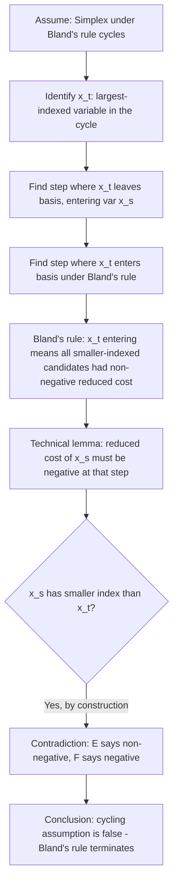

## Bland's Rule

### Overview

Bland's rule is a pivoting-tie-breaking strategy for the Simplex method that provably guarantees termination in finitely many iterations, entirely eliminating the possibility of cycling regardless of the degree of degeneracy present in a linear program. Where earlier modules established that degeneracy *can* cause cycling and mentioned Bland's rule as one available countermeasure, this module provides the rule's precise mechanics, a full proof of its anti-cycling guarantee, and a worked demonstration contrasting cycling behavior under a naive rule against guaranteed termination under Bland's rule.

### Statement of the Rule

Bland's rule (also called the **smallest-subscript rule** or **lowest-index rule**) modifies both selection steps of the standard Simplex pivot cycle:

**Entering variable selection:** Among all nonbasic variables with a negative reduced cost, choose the one with the **smallest index** (rather than, e.g., the most negative reduced cost as in Dantzig's rule).

**Leaving variable selection (ratio test tie-breaking):** Among all rows tied for the minimum ratio in the ratio test, choose the row whose basic variable has the **smallest index**.

**Key Points**
- Both rules apply the identical principle — always break any tie or choice in favor of the lowest-indexed variable — applied consistently at both decision points of every pivot.
- Bland's rule requires a fixed, consistent labeling of variables (indices $1$ through $n$) established once at the start of the algorithm and never changed; the rule's guarantee depends on this fixed ordering being respected throughout.
- Unlike Dantzig's rule or steepest-edge pricing, Bland's rule requires no additional computation beyond identifying which reduced costs are negative and which ratios are tied — it is computationally the *cheapest* pivoting rule to implement, even though it is not the fastest in terms of total iterations required.

### Why Cycling Requires More Than Just Degeneracy

**Key Points**
- Cycling requires a very specific pathological sequence: a set of degenerate pivots that returns the algorithm to a **previously visited basis**, at which point the exact same sequence of pivots (under a deterministic pivoting rule) would repeat indefinitely.
- For cycling to occur under a fixed, deterministic pivoting rule, the *same* entering/leaving variable choices must be made every time the same intermediate tableau states recur — this is precisely what makes rule design relevant: a rule that provably avoids ever revisiting a basis prevents cycling by construction, without needing to detect or interrupt a cycle after the fact.
- The classical textbook examples demonstrating actual cycling (e.g., variants of Beale's example) are deliberately engineered with a small number of variables and carefully chosen degenerate coefficients specifically to trigger a repeating pivot sequence under naive rules like Dantzig's rule — such examples are pedagogical demonstrations, not typical occurrences.

### Proof That Bland's Rule Prevents Cycling

The proof proceeds by contradiction, showing that a cycle under Bland's rule leads to a logical impossibility.

**Setup.** Suppose, for contradiction, that Simplex under Bland's rule cycles: a sequence of pivots visits a sequence of bases $B_0, B_1, \dots, B_k = B_0$, returning to the starting basis after $k$ degenerate pivots (the objective value must stay exactly constant throughout a cycle, since cycling requires degenerate pivots with zero step length).

**Step 1 — Identify the largest-indexed variable involved in the cycle.** Let $x_t$ be the variable with the largest index among all variables that enter or leave the basis at some point during the cycle $B_0 \to B_1 \to \cdots \to B_k = B_0$.

**Step 2 — Examine the pivot where $x_t$ leaves the basis.** At some iteration in the cycle, $x_t$ leaves the basis (since it must both enter and leave for the basis composition to return to $B_0$, which does not contain $x_t$ as unchanged throughout — more precisely, $x_t$ leaves at some point since it's involved in the cycle). Let this occur at basis $B_p$, with entering variable $x_s$ at that step.

**Step 3 — Examine the pivot where $x_t$ enters the basis.** At another iteration, $x_t$ enters the basis; let this occur at basis $B_q$, with $x_t$ selected as entering variable specifically because Bland's rule chose it as the smallest-indexed variable with negative reduced cost at that step. Since $x_t$ has the *largest* index among all cycle-involved variables, every other variable with a negative reduced cost at step $B_q$ must have a larger index than... 

This requires care: actually every *other* variable involved in the cycle has a *smaller* index than $x_t$ (since $x_t$ was chosen as the largest), so if $x_t$ was selected to enter under Bland's rule (smallest index among negative-reduced-cost candidates), every cycle-involved variable with a smaller index must have had a *non-negative* reduced cost at that specific step $B_q$.

**Step 4 — Derive a contradiction via a weighted-sum argument.** A standard technical lemma (comparing the reduced costs of $x_s$ and $x_t$ across the two identified pivot steps $B_p$ and $B_q$, using the fact that both bases $B_p$ and $B_q$ lie on the same cycle and hence share the identical objective value) shows that the reduced cost of $x_s$ at step $B_q$ must be strictly negative — but $x_s$ has a smaller index than $x_t$ (since $x_t$ is the largest-indexed cycle variable), which contradicts Step 3's conclusion that every smaller-indexed cycle variable had non-negative reduced cost at $B_q$.

**Output**

The contradiction in Step 4 shows the initial assumption (that cycling occurs under Bland's rule) must be false. Since the number of possible bases is finite and every pivot either genuinely improves the objective (ruling out that basis from ever recurring) or is degenerate (and degenerate sequences cannot cycle, by the argument above), the algorithm must terminate in finitely many iterations. [Inference] The precise algebraic detail of Step 4's weighted-sum lemma is a standard but technically involved component of the full formal proof (originally due to Bland, 1977) that is typically presented with complete rigor in a linear programming theory textbook; the sketch given here conveys the logical structure and key contradiction rather than reproducing every algebraic step of the original proof.

### Demonstration: Cycling Under Dantzig's Rule vs. Termination Under Bland's Rule

**Key Points**
- The classical demonstration LPs constructed to exhibit cycling under Dantzig's rule (most-negative-reduced-cost entering selection) are specifically engineered so that following the most-negative-reduced-cost rule repeatedly leads back to an earlier basis after a fixed number of degenerate pivots.
- Applying Bland's rule to the *identical* problem instance — same constraints, same objective, same starting basis — necessarily avoids the cycle (by the proof above), though it may require visiting some different intermediate bases along the way, since the entering-variable choice at each step differs from Dantzig's rule whenever they disagree.
- [Unverified] Reproducing a specific numerical cycling example with full tableau-by-tableau arithmetic requires careful, error-checked construction (these examples are sensitive to exact coefficient values), and a specific instance is not worked step-by-step in this response; readers seeking a concrete cycling demonstration should consult a linear programming textbook's worked Beale-type example directly, cross-referencing tableau values carefully, rather than relying on a reconstruction from memory.

### Bland's Rule vs. Other Anti-Cycling Approaches

| Approach | Mechanism | Performance Tradeoff |
|---|---|---|
| Bland's rule | Always select lowest-indexed eligible variable at both entering and leaving steps | Provably cycle-free; typically slower in total iteration count than aggressive rules |
| Lexicographic perturbation | Symbolically perturb $b$ to break all ties uniquely, while retaining an aggressive entering rule | Provably cycle-free; preserves faster entering-variable selection, at the cost of more complex tie-breaking bookkeeping |
| Random perturbation | Genuinely (numerically) perturb $b$ by small random amounts to make degeneracy improbable | Not provably cycle-free (probabilistic only); introduces small numerical approximation error |
| Cycle detection + restart | Hash or fingerprint visited bases; detect an exact repeat and switch to Bland's rule only then | Retains fast aggressive pivoting in the common (non-cycling) case; adds bookkeeping overhead for detection |

### Illustration: Bland's Rule Selection Logic

<svg xmlns="http://www.w3.org/2000/svg" viewBox="0 0 700 380">
  <text x="350" y="30" text-anchor="middle" font-size="18" font-weight="bold" fill="#1a1a1a">Bland's Rule: Lowest-Index Tie-Breaking (svg_diagram)</text>

  <text x="175" y="65" text-anchor="middle" font-size="13" font-weight="bold" fill="#1e3a8a">Entering variable candidates</text>
  <rect x="60" y="85" width="90" height="45" fill="#fca5a5" opacity="0.5" stroke="#7f1d1d" />
  <text x="105" y="105" text-anchor="middle" font-size="11" fill="#7f1d1d">x_2</text>
  <text x="105" y="120" text-anchor="middle" font-size="10" fill="#7f1d1d">reduced cost -5</text>
  <rect x="160" y="85" width="90" height="45" fill="#86efac" opacity="0.6" stroke="#065f46" stroke-width="2" />
  <text x="205" y="105" text-anchor="middle" font-size="11" fill="#065f46" font-weight="bold">x_1 SELECTED</text>
  <text x="205" y="120" text-anchor="middle" font-size="10" fill="#065f46">reduced cost -2</text>
  <rect x="260" y="85" width="90" height="45" fill="#fca5a5" opacity="0.5" stroke="#7f1d1d" />
  <text x="305" y="105" text-anchor="middle" font-size="11" fill="#7f1d1d">x_4</text>
  <text x="305" y="120" text-anchor="middle" font-size="10" fill="#7f1d1d">reduced cost -8</text>

  <text x="205" y="155" text-anchor="middle" font-size="11" fill="#333">Bland's rule picks x_1 (lowest index),</text>
  <text x="205" y="171" text-anchor="middle" font-size="11" fill="#333">ignoring that x_4 has the most negative reduced cost</text>

  <text x="530" y="65" text-anchor="middle" font-size="13" font-weight="bold" fill="#1e3a8a">Ratio test ties (leaving variable)</text>
  <rect x="420" y="85" width="90" height="45" fill="#86efac" opacity="0.6" stroke="#065f46" stroke-width="2" />
  <text x="465" y="105" text-anchor="middle" font-size="11" fill="#065f46" font-weight="bold">s_1 SELECTED</text>
  <text x="465" y="120" text-anchor="middle" font-size="10" fill="#065f46">ratio = 2 (tied)</text>
  <rect x="520" y="85" width="90" height="45" fill="#fca5a5" opacity="0.5" stroke="#7f1d1d" />
  <text x="565" y="105" text-anchor="middle" font-size="11" fill="#7f1d1d">s_3</text>
  <text x="565" y="120" text-anchor="middle" font-size="10" fill="#7f1d1d">ratio = 2 (tied)</text>

  <text x="530" y="155" text-anchor="middle" font-size="11" fill="#333">Both rows tie at ratio 2;</text>
  <text x="530" y="171" text-anchor="middle" font-size="11" fill="#333">Bland's rule picks s_1 (lower index than s_3)</text>

  <line x1="60" y1="220" x2="640" y2="220" stroke="#999" stroke-width="1" stroke-dasharray="3,3" />
  <text x="350" y="250" text-anchor="middle" font-size="12" fill="#333">In both decisions, Bland's rule sacrifices short-term greedy improvement</text>
  <text x="350" y="268" text-anchor="middle" font-size="12" fill="#333">in exchange for a globally provable termination guarantee</text>
</svg>

### When to Use Bland's Rule in Practice

**Key Points**
- **Default use is uncommon**: because of its comparatively slow practical convergence (often requiring substantially more pivots than aggressive rules on non-degenerate or mildly-degenerate problems), Bland's rule is rarely the *default* pivoting strategy in production solvers.
- **Defensive fallback pattern**: a common practical strategy is to run an aggressive rule (Dantzig's, steepest-edge, devex) by default, monitor for signs of stalling (e.g., a long run of consecutive degenerate pivots or zero objective improvement), and switch to Bland's rule temporarily as a guaranteed-safe fallback once such signs are detected. [Unverified] The specific detection thresholds and switching logic used by any given commercial or open-source solver are generally implementation details not fully documented in public-facing solver documentation, and should not be assumed to follow a single universal pattern across different software.
- **Exact/symbolic arithmetic contexts**: implementations using exact rational arithmetic (rather than floating point) — for instance, in some formal verification or combinatorial optimization research contexts — may adopt Bland's rule as the default specifically because its termination guarantee is airtight and exactly provable, aligning naturally with a fully rigorous, non-heuristic implementation philosophy.
- **Educational and theoretical contexts**: Bland's rule is frequently the pivoting rule of choice in textbook proofs of Simplex's finite termination, precisely because its simplicity makes the termination proof itself tractable to present in full, in contrast with the more complex convergence arguments needed for aggressive pivoting rules.

### Practical Considerations

- **Implementation simplicity vs. iteration count tradeoff**: Bland's rule is trivial to implement correctly (a simple linear scan for the lowest-indexed eligible variable at each decision point) but can require substantially more total pivots to reach optimality compared to more sophisticated rules — this tradeoff between implementation/proof simplicity and empirical performance is the central practical consideration when deciding whether to use it as a primary rule versus a fallback.
- **Combining with revised Simplex**: Bland's rule integrates cleanly with the revised Simplex representation (maintaining $A_B^{-1}$ rather than a full tableau), since it only requires access to reduced costs and ratio-test values, both of which are already computed on demand in revised Simplex regardless of the pivoting rule chosen.
- **Verifying an implementation's correctness**: because Bland's rule's termination guarantee is unconditional, a Simplex implementation using Bland's rule that fails to terminate on a finite, correctly-formulated LP strongly suggests an implementation bug (e.g., an incorrect ratio test or an index-comparison error) rather than a genuine cycling phenomenon — this makes Bland's rule a useful debugging baseline when developing a Simplex implementation from scratch.
- **Distinction from feasibility/boundedness detection**: Bland's rule addresses *cycling* specifically; it does not change how unboundedness (no valid ratio-test row) or infeasibility (via Phase I / Two-Phase methods) are detected — those termination conditions operate identically regardless of which pivoting rule governs the entering/leaving variable selection.

### Related Topics

- Degeneracy and its implications (stalling, cycling, structural causes)
- Simplex method mechanics (the pivot cycle Bland's rule modifies)
- Lexicographic perturbation as an alternative anti-cycling method
- Tableau representation and pivoting (the mechanics Bland's rule operates within)
- Revised Simplex method and computational efficiency of pivoting rules
- Steepest-edge and devex pricing as aggressive alternatives to Dantzig's rule
- Two-Phase Simplex and Big-M method (interaction between degeneracy and initialization)
- Formal verification and exact-arithmetic LP solvers