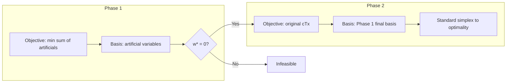

## Two-Phase Simplex Method

### Purpose and Motivation

The standard simplex method requires an initial basic feasible solution (BFS), typically obtained by using slack variables as the starting basis. This works cleanly when all constraints are $\leq$ with non-negative right-hand sides, since the slack variables themselves form an identity submatrix — an immediate feasible basis.

The difficulty arises with $\geq$ or $=$ constraints. These do not yield an obvious starting BFS: slack variables for $\geq$ constraints (surplus variables) have coefficient $-1$, not $+1$, so they cannot serve as basic variables at a feasible origin. The two-phase method resolves this by introducing **artificial variables** and using a preliminary optimization (Phase 1) to drive them out of the basis before solving the real problem (Phase 2).

### Standard Form Requirement

Before applying the method, the problem must be converted to standard form:

$$\min \; c^T x$$
$$\text{subject to } Ax = b, \quad x \geq 0, \quad b \geq 0$$

- Inequalities are converted to equalities using slack ($\leq$) or surplus ($\geq$) variables.
- If any $b_i < 0$, that row is multiplied by $-1$ to restore $b \geq 0$ before adding artificials.

### Phase 1: Finding a Feasible Basis

**Setup**

For each equality constraint that lacks an obvious basic variable (i.e., no slack with coefficient $+1$ isolated in that row), an artificial variable $a_i \geq 0$ is added:

$$\sum_j a_{ij} x_j + a_i = b_i$$

**Auxiliary Objective**

Phase 1 minimizes the sum of all artificial variables:

$$\min \; w = \sum_i a_i$$

subject to the same constraint set (now augmented with artificials) and $x, a \geq 0$.

- If $w^* = 0$ at optimality, a feasible solution to the original constraints exists, and the artificials can be dropped (or held at zero).
- If $w^* > 0$, no feasible solution exists — the original LP is **infeasible**, and the algorithm terminates.

**Solving Phase 1**

The Phase 1 problem is itself solved via ordinary simplex, using the artificial variables as the initial basis (each artificial's row coefficient is $+1$, giving an immediate identity submatrix). Pivoting proceeds by standard entering/leaving variable rules until $w$ is minimized.

**Degenerate Case: Artificial Variable Remains in Basis at Zero Level**

[Inference] In practice, if an artificial variable remains in the basis at the end of Phase 1 with value zero (a degenerate BFS), it indicates a redundant constraint. Standard remedy: pivot it out using any non-artificial column with a nonzero entry in its row, if one exists; if no such column exists, the row itself is redundant and can be deleted.

### Phase 2: Optimizing the Original Objective

**Transition**

- All artificial variables are removed from the tableau (their columns are dropped).
- The original objective function $c^T x$ replaces the Phase 1 objective $w$.
- The basis obtained at the end of Phase 1 (feasible for the original constraints) becomes the starting basis for Phase 2.

**Reduced Cost Recalculation**

Because the objective changed, the reduced costs (the bottom row of the simplex tableau) must be recomputed relative to $c^T x$ using the current basis:

$$z_j - c_j = c_B^T B^{-1} A_j - c_j$$

**Standard Simplex Iteration**

From here, the algorithm proceeds exactly as ordinary simplex: select an entering variable with favorable reduced cost, perform ratio test to select the leaving variable, pivot, and repeat until optimality (all reduced costs satisfy the optimality condition) or unboundedness is detected.

### Worked Example

**Problem**

$$\min \; z = 2x_1 + 3x_2$$
$$\text{subject to:}$$
$$x_1 + x_2 \geq 10$$
$$x_1 + 2x_2 \geq 12$$
$$x_1, x_2 \geq 0$$

**Standard Form Conversion**

Introduce surplus variables $s_1, s_2 \geq 0$ and artificial variables $a_1, a_2 \geq 0$:

$$x_1 + x_2 - s_1 + a_1 = 10$$
$$x_1 + 2x_2 - s_2 + a_2 = 12$$

**Phase 1 Objective**

$$\min \; w = a_1 + a_2$$

Expressed in terms of non-basic variables (substituting $a_1 = 10 - x_1 - x_2 + s_1$, $a_2 = 12 - x_1 - 2x_2 + s_2$):

$$w = 22 - 2x_1 - 3x_2 + s_1 + s_2$$

**Iteration 1**

Most negative coefficient in $w$-row (for entering variable, minimization of $w$) is $x_2$ (coefficient $-3$). Ratio test:
- Row 1: $10 / 1 = 10$
- Row 2: $12 / 2 = 6$ ← minimum

$x_2$ enters, $a_2$ leaves. Pivot on row 2.

**Iteration 2**

After pivoting, updated row 2: $x_2 = 6 - 0.5x_1 - 0.5s_2 + 0.5a_2$

Substitute into row 1 and the $w$-row. New $w$-row coefficient for $x_1$ becomes $-0.5$ (still negative), so $x_1$ enters next. Ratio test on updated rows determines $a_1$ leaves.

After this pivot, both artificials are out of the basis and $w = 0$ — Phase 1 complete, feasible basis found: $(x_1, x_2) = (8, 2)$.

**Phase 2**

Drop $a_1, a_2$ columns. Restore original objective $z = 2x_1 + 3x_2$, recompute reduced costs against the basis $\{x_1, x_2\}$. Checking optimality conditions on the recomputed tableau confirms $(x_1, x_2) = (8, 2)$ is already optimal for the original problem, giving:

$$z^* = 2(8) + 3(2) = 22$$

### Phase 1–Phase 2 Flow

<svg xmlns="http://www.w3.org/2000/svg" viewBox="0 0 720 460">
  <text x="360" y="28" font-size="18" font-weight="bold" text-anchor="middle" fill="#111">Two-Phase Simplex Flow (svg_diagram)</text>

  <rect x="260" y="50" width="200" height="50" rx="6" fill="#e8f0fe" stroke="#4285f4" stroke-width="1.5" />
  <text x="360" y="80" font-size="13" text-anchor="middle" fill="#111">Convert to standard form</text>

  <line x1="360" y1="100" x2="360" y2="130" stroke="#333" stroke-width="1.5" marker-end="url(#arrow)" />

  <rect x="230" y="130" width="260" height="60" rx="6" fill="#fef7e0" stroke="#f4b400" stroke-width="1.5" />
  <text x="360" y="155" font-size="13" text-anchor="middle" fill="#111">Add artificial variables</text>
  <text x="360" y="175" font-size="13" text-anchor="middle" fill="#111">Phase 1: minimize w = Σaᵢ</text>

  <line x1="360" y1="190" x2="360" y2="220" stroke="#333" stroke-width="1.5" marker-end="url(#arrow)" />

  <polygon points="360,220 460,255 360,290 260,255" fill="#fce8e6" stroke="#db4437" stroke-width="1.5" />
  <text x="360" y="250" font-size="12" text-anchor="middle" fill="#111">w* = 0 ?</text>
  <text x="360" y="266" font-size="11" text-anchor="middle" fill="#555">(feasible?)</text>

  <line x1="260" y1="255" x2="130" y2="255" stroke="#333" stroke-width="1.5" marker-end="url(#arrow)" />
  <text x="195" y="245" font-size="11" text-anchor="middle" fill="#111">No</text>
  <rect x="30" y="230" width="150" height="50" rx="6" fill="#fce8e6" stroke="#db4437" stroke-width="1.5" />
  <text x="105" y="260" font-size="13" text-anchor="middle" fill="#111">Infeasible — STOP</text>

  <line x1="360" y1="290" x2="360" y2="320" stroke="#333" stroke-width="1.5" marker-end="url(#arrow)" />
  <text x="380" y="310" font-size="11" text-anchor="middle" fill="#111">Yes</text>

  <rect x="230" y="320" width="260" height="50" rx="6" fill="#e6f4ea" stroke="#0f9d58" stroke-width="1.5" />
  <text x="360" y="350" font-size="13" text-anchor="middle" fill="#111">Drop artificial columns</text>

  <line x1="360" y1="370" x2="360" y2="400" stroke="#333" stroke-width="1.5" marker-end="url(#arrow)" />

  <rect x="210" y="400" width="300" height="50" rx="6" fill="#e6f4ea" stroke="#0f9d58" stroke-width="1.5" />
  <text x="360" y="430" font-size="13" text-anchor="middle" fill="#111">Phase 2: optimize original cᵀx</text>
</svg>

### Comparative Structure

### Relationship to the Big-M Method

The two-phase method is a direct alternative to the **Big-M method**, which instead penalizes artificial variables with a large coefficient $M$ directly in the original objective function, solving in a single phase.

- Two-phase avoids the numerical issues associated with choosing a sufficiently large $M$ (too small risks an infeasible-looking optimum; too large can cause floating-point instability in computer implementations).
- Two-phase requires switching objectives and rebuilding the reduced-cost row between phases, adding implementation complexity relative to Big-M's single continuous run.
- [Unverified] Whether one method is faster in practice depends on problem structure and implementation details; general performance claims comparing the two are not conclusively documented in the standard theory.

### Detecting Infeasibility and Redundancy

- **Infeasibility**: If Phase 1 terminates with $w^* > 0$, at least one artificial variable is unavoidably positive, meaning no point satisfies all original constraints simultaneously. The original LP has no feasible region.
- **Redundant constraints**: An artificial variable stuck in the basis at value 0 after Phase 1 signals that its associated constraint is linearly dependent on others. It can be pivoted out or the row deleted without affecting the feasible region, as noted above.

### Related Topics

- Big-M method (single-phase alternative using penalty coefficients)
- Duality theory and complementary slackness in LP
- Degeneracy and cycling in the simplex method (Bland's rule)
- Revised simplex method (matrix-based implementation for computational efficiency)
- Sensitivity analysis and post-optimality analysis
- Interior-point methods as an alternative to simplex-based LP solving