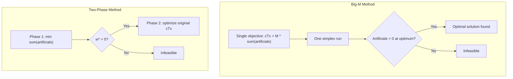

## Big-M Method

### Purpose and Motivation

The Big-M method is an alternative to the two-phase simplex method for handling linear programs whose constraints do not offer an obvious initial basic feasible solution — specifically $\geq$ and $=$ constraints requiring artificial variables. Rather than running a separate preliminary optimization to eliminate artificial variables, Big-M penalizes their presence directly in the original objective function using a very large positive constant $M$, so that any optimal solution will drive them to zero if a feasible solution exists at all. The entire problem is then solved in a **single simplex run**.

### Standard Form and Setup

As with two-phase, the problem must first be converted to standard form:

$$\min \; c^T x$$
$$\text{subject to } Ax = b, \quad x \geq 0, \quad b \geq 0$$

For each constraint lacking a ready basic variable, an artificial variable $a_i \geq 0$ is added, exactly as in the two-phase method. The distinction lies entirely in how the objective function is constructed.

### Modified Objective Function

Artificial variables are appended to the objective with a large positive penalty $M$ (for minimization problems):

$$\min \; z = c^T x + M \sum_i a_i$$

where $M$ is understood to be an arbitrarily large positive number — larger than any coefficient that could plausibly balance it out during optimization. $M$ is typically treated symbolically rather than assigned a specific numeric value during hand computation.

For **maximization** problems, the penalty is subtracted instead:

$$\max \; z = c^T x - M \sum_i a_i$$

**Effect of the Penalty**

Because $M$ is large, any basic feasible solution with a nonzero artificial variable produces an objective value far worse than one without artificials (in a minimization: much larger; in a maximization: much smaller). The simplex algorithm, always seeking to improve the objective, is therefore driven to pivot artificials out of the basis whenever a feasible way to do so exists.

### Initial Tableau and Reduced Costs

The initial basis consists of the artificial variables (and any legitimate slack variables available). Because $c_B$ includes the $M$ terms for the artificial basic variables, the reduced cost row is computed symbolically, keeping $M$ as an algebraic parameter:

$$z_j - c_j = c_B^T B^{-1} A_j - c_j$$

Each reduced cost entry typically takes the form $\alpha + \beta M$, where $\alpha$ and $\beta$ are ordinary numbers. Comparisons between reduced costs are made by first comparing the coefficient of $M$, and only using the constant term $\alpha$ as a tiebreaker when the $M$-coefficients are equal.

### Solving with Simplex

From the initial tableau, ordinary simplex pivoting proceeds:

- **Entering variable**: chosen by the most favorable reduced cost, treating $M$ as a large positive number (compare $M$-coefficients first).
- **Leaving variable**: standard minimum-ratio test.
- Iterate until no improving entering variable remains.

### Interpreting the Final Tableau

- **If all artificial variables are zero (whether or not still nominally in the basis) at optimality**: the solution is feasible and optimal for the original problem. The $M$-terms vanish from the final objective value since $a_i = 0$.
- **If any artificial variable remains positive at optimality**: the original problem is **infeasible** — no amount of pivoting could remove the artificial without worsening the objective, meaning the constraints cannot all be satisfied simultaneously. [Inference] This is detected in practice by inspecting the final basic feasible solution for a nonzero artificial value once the optimality condition is met.

### Worked Example

**Problem**

$$\min \; z = 2x_1 + 3x_2$$
$$\text{subject to:}$$
$$x_1 + x_2 \geq 10$$
$$x_1 + 2x_2 \geq 12$$
$$x_1, x_2 \geq 0$$

**Standard Form with Penalty**

Introduce surplus variables $s_1, s_2 \geq 0$ and artificials $a_1, a_2 \geq 0$:

$$x_1 + x_2 - s_1 + a_1 = 10$$
$$x_1 + 2x_2 - s_2 + a_2 = 12$$

$$\min \; z = 2x_1 + 3x_2 + M a_1 + M a_2$$

**Initial Basis**: $\{a_1, a_2\}$, so $c_B = (M, M)$.

**Reduced Costs (Iteration 0)**

Using $z_j - c_j = c_B^T B^{-1} A_j - c_j$ with $B^{-1} = I$ initially:

- For $x_1$: $M(1) + M(1) - 2 = 2M - 2$
- For $x_2$: $M(1) + M(2) - 3 = 3M - 3$
- For $s_1$: $M(-1) + M(0) - 0 = -M$
- For $s_2$: $M(0) + M(-1) - 0 = -M$

Since this is a minimization and we seek the most positive reduced cost to improve (standard convention: entering variable has the largest positive $z_j - c_j$), $x_2$ enters (coefficient $3M - 3$, larger $M$-coefficient tie broken by comparing structure — here $x_2$'s $M$-coefficient of 3 exceeds $x_1$'s 2).

**Ratio Test**

- Row 1: $10 / 1 = 10$
- Row 2: $12 / 2 = 6$ ← minimum

$x_2$ enters, $a_2$ leaves.

**Iteration 2**

After pivoting on row 2, recompute reduced costs. The updated $x_1$ coefficient still carries a positive $M$-term, so $x_1$ enters next. Ratio test determines $a_1$ leaves.

**Final Tableau**

Both artificials are now zero (and out of the basis), giving $(x_1, x_2) = (8, 2)$:

$$z^* = 2(8) + 3(2) = 22$$

This matches the two-phase result, as expected — both methods solve the same underlying LP.

### Big-M vs. Two-Phase: Structural Comparison

### Practical Considerations

**Choosing M**

- $M$ is typically kept as a symbolic parameter during hand calculation, avoiding the need to pick a numeric value.
- In computer implementations where a numeric value must be assigned, $M$ is generally set several orders of magnitude larger than the largest coefficient magnitude in the problem.
- [Inference] If $M$ is chosen too small relative to the problem's coefficients, the penalty may fail to dominate the objective, potentially yielding a solution where an artificial variable remains positive even though a truly feasible solution exists — a false indication of infeasibility.
- [Inference] If $M$ is chosen excessively large in a floating-point numerical implementation, it can introduce round-off error and ill-conditioning in the tableau, since the algorithm must represent both very large ($M$-scale) and very small (ordinary coefficient-scale) numbers simultaneously.

**Numerical Stability**

Because of this trade-off, many production LP solvers avoid the Big-M method entirely in favor of two-phase or other feasibility-restoration techniques, reserving Big-M primarily for hand-worked instructional examples and small symbolic problems.

### Relationship to Two-Phase Method

| Aspect | Big-M | Two-Phase |
|---|---|---|
| Number of simplex runs | One | Two (Phase 1, then Phase 2) |
| Objective function | Original + $M \cdot \sum a_i$ | $\sum a_i$ first, then original |
| Parameter selection | Requires choosing/handling $M$ | No penalty parameter needed |
| Numerical stability | Sensitive to choice of $M$ | Not affected by scale mismatch |
| Infeasibility detection | Artificial remains positive at optimum | $w^* > 0$ at end of Phase 1 |

### Related Topics

- Two-phase simplex method (alternative feasibility-restoration approach)
- Sensitivity analysis and shadow prices in LP
- Degeneracy and cycling (Bland's rule)
- Duality theory in linear programming
- Revised simplex method for computational efficiency
- Interior-point methods for large-scale LP