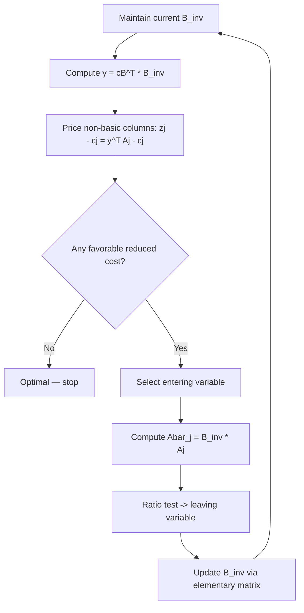

## Revised Simplex Method

### Purpose and Motivation

The standard (tableau) simplex method recomputes and stores the entire tableau — every column of $B^{-1}A$ — at each iteration, even though only a subset of that information is actually needed to determine the next pivot. For large-scale problems with many variables and constraints, this is computationally wasteful in both time and memory. The revised simplex method restructures the same underlying algorithm around matrix operations on $B^{-1}$ alone, computing only the specific columns and rows required at each step, rather than the full tableau.

### Core Idea

At any iteration, the simplex method needs three things to decide on the next pivot:

1. The reduced costs $z_j - c_j$ for all non-basic variables (to select the entering variable)
2. The updated column $B^{-1} A_j$ for the chosen entering variable (to perform the ratio test)
3. The current basic feasible solution $x_B = B^{-1} b$

None of these strictly require materializing the full tableau $B^{-1}A$. The revised simplex method instead maintains $B^{-1}$ (or an efficient factorization of it) explicitly, and computes only the pieces above as needed, on demand.

### Key Matrices and Vectors

- $B$: the current basis matrix, consisting of the columns of $A$ corresponding to basic variables
- $B^{-1}$: its inverse, maintained and updated across iterations
- $c_B$: the vector of objective coefficients for the basic variables
- $y^T = c_B^T B^{-1}$: the **simplex multipliers** (also interpretable as dual variables / shadow prices)

### Algorithm Steps

**Step 1 — Compute Simplex Multipliers**

$$y^T = c_B^T B^{-1}$$

**Step 2 — Price Out Non-Basic Variables**

For each non-basic variable $x_j$, compute the reduced cost:

$$z_j - c_j = y^T A_j - c_j$$

This is done column-by-column, on demand, rather than for the entire tableau at once. If no non-basic variable has a favorable reduced cost, the current solution is optimal — stop.

**Step 3 — Select Entering Variable**

Choose $x_j$ with the most favorable reduced cost (standard Dantzig rule, or another pivoting rule such as Bland's rule to avoid cycling).

**Step 4 — Compute Updated Entering Column**

$$\bar{A}_j = B^{-1} A_j$$

Only this single column is computed — not the full updated tableau.

**Step 5 — Ratio Test**

Using $\bar{A}_j$ and the current $x_B = B^{-1}b$, perform the standard minimum-ratio test to determine the leaving variable and the new basic feasible solution.

**Step 6 — Update the Basis Inverse**

Rather than recomputing $B^{-1}$ from scratch, it is updated using the pivot column via the **product form of the inverse** or an equivalent update formula (e.g., an eta-vector update):

$$B_{\text{new}}^{-1} = E \cdot B_{\text{old}}^{-1}$$

where $E$ is an elementary matrix (identity matrix with one column replaced) derived from $\bar{A}_j$ and the pivot row.

### Comparison with Tableau Simplex

| Aspect | Tableau Simplex | Revised Simplex |
|---|---|---|
| Data maintained per iteration | Full tableau $B^{-1}A$ | $B^{-1}$ (or its factorization) only |
| Column computation | All columns updated every iteration | Only entering column computed as needed |
| Memory usage | $O(mn)$ dense storage | $O(m^2)$ for $B^{-1}$, original $A$ often sparse |
| Numerical stability (naive impl.) | Degrades similarly without care | Degrades without periodic refactorization |
| Suitability | Small problems, hand computation, teaching | Large-scale, sparse, computer implementation |

Here $m$ is the number of constraints and $n$ the number of variables; in practice $n \gg m$ for many real LPs, making the savings substantial.

### Exploiting Sparsity

[Inference] A major practical advantage of the revised method is that it works naturally with sparse representations of $A$, since only individual columns $A_j$ are ever multiplied against $B^{-1}$, rather than requiring the fully dense updated tableau to be stored. Production LP solvers typically maintain $B^{-1}$ implicitly through a sparse LU factorization of $B$ rather than computing it explicitly, updating the factorization incrementally after each pivot rather than recomputing it from scratch.

### Numerical Considerations

Repeatedly applying elementary update matrices to $B^{-1}$ across many iterations can accumulate floating-point round-off error. [Inference] Standard practice in solver implementations is to periodically **refactorize** the basis matrix directly from $A$ (rather than continuing to chain updates) at fixed intervals or when a numerical instability indicator crosses a threshold, restoring accuracy.

### Worked Example (Conceptual Walkthrough)

**Problem** (same as prior sessions, reused for continuity):

$$\min \; z = 2x_1 + 3x_2 \quad \text{s.t.} \quad x_1 + x_2 \geq 10,\; x_1 + 2x_2 \geq 12,\; x_1, x_2 \geq 0$$

After converting to standard form with surplus variables $s_1, s_2$ and using a Phase-1-style feasible starting basis, suppose the basis at some intermediate iteration is $B = \{x_1, x_2\}$ with:

$$B = \begin{pmatrix} 1 & 1 \\ 1 & 2 \end{pmatrix}, \quad B^{-1} = \begin{pmatrix} 2 & -1 \\ -1 & 1 \end{pmatrix}$$

**Simplex multipliers**: with $c_B = (2, 3)^T$,

$$y^T = c_B^T B^{-1} = (2, 3)\begin{pmatrix} 2 & -1 \\ -1 & 1 \end{pmatrix} = (1, 1)$$

**Pricing a non-basic variable** (e.g., $s_1$, with $A_{s_1} = (-1, 0)^T$):

$$z_{s_1} - c_{s_1} = y^T A_{s_1} - 0 = (1,1)\begin{pmatrix} -1 \\ 0 \end{pmatrix} = -1$$

A negative reduced cost here (for this minimization, using the convention that non-negative reduced costs signal optimality) indicates this basis is already optimal with respect to $s_1$ — consistent with the optimal solution $(x_1, x_2) = (8, 2)$ found in the earlier two-phase and Big-M sessions. The point of this walkthrough is not the final answer (already established) but that it was reached using only $B^{-1}$, $c_B$, and single-column products — never a fully rebuilt tableau.

### Iteration Flow

### Relationship to Duality

The simplex multipliers $y^T = c_B^T B^{-1}$ computed at each iteration are precisely the values of the dual variables associated with the current primal basis. At optimality, these values give the shadow prices used in sensitivity analysis — the marginal change in the optimal objective value per unit change in a constraint's right-hand side.

### Practical Role in Modern Solvers

Nearly all production-grade LP solvers implement some variant of the revised simplex method (or the related simplex-with-bounded-variables extension) rather than the naive tableau form, precisely because of the memory and sparsity advantages described above. [Unverified] The exact factorization and update strategies used (e.g., Forrest–Tomlin updates, Bartels–Golub updates) vary by solver implementation and are generally proprietary or solver-specific implementation details beyond the scope of the core algorithm.

### Related Topics

- Two-phase simplex method and Big-M method (obtaining the initial feasible basis)
- Duality theory and shadow prices in linear programming
- Sensitivity analysis and post-optimality analysis
- Bounded-variable simplex method (handling variable upper/lower bounds directly)
- Sparse matrix factorization techniques (LU decomposition, Forrest–Tomlin updates)
- Interior-point methods as an alternative for large-scale LP