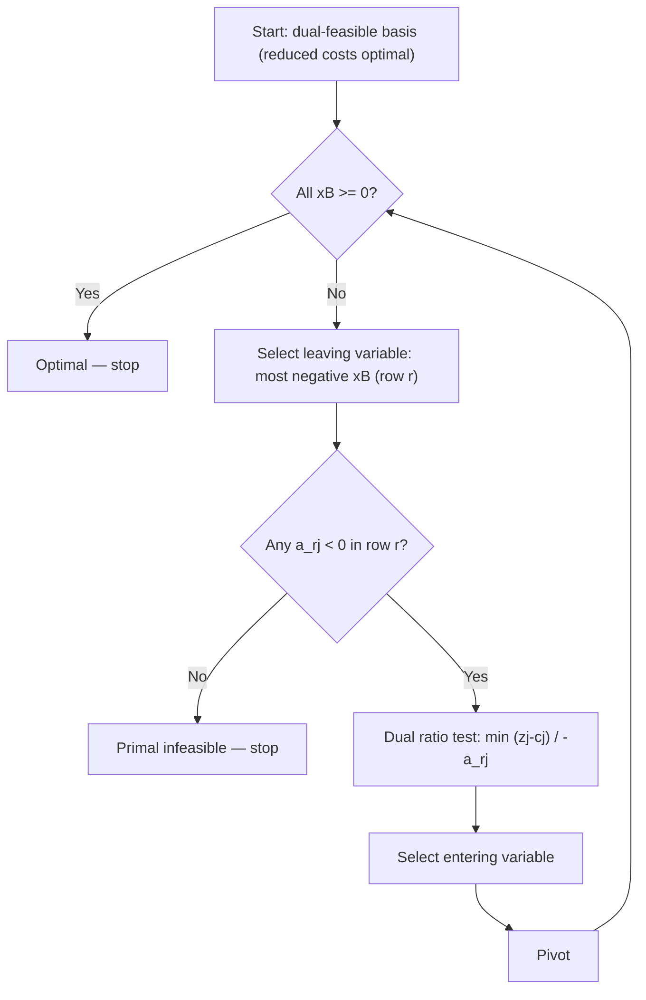

## Dual Simplex Method

### Purpose and Motivation

The (primal) simplex method starts from a basic feasible solution — one satisfying $Ax = b, x \geq 0$ — and works toward optimality by improving the objective at each pivot while preserving feasibility. The dual simplex method inverts this logic: it starts from a basis that is **dual feasible** (i.e., optimal with respect to the reduced-cost/optimality condition) but **primal infeasible** (some $x_B$ component is negative), and pivots toward primal feasibility while preserving dual feasibility (optimality condition) throughout.

This is especially useful in two common scenarios:

- After adding a new constraint to an already-optimal LP (common in cutting-plane methods for integer programming), the previous optimal basis often becomes primal infeasible but remains dual feasible.
- After a right-hand-side change in sensitivity analysis, re-optimizing from the previous optimal basis via dual simplex is typically far faster than re-solving from scratch.

### Primal vs. Dual Feasibility

| Condition | Primal Simplex | Dual Simplex |
|---|---|---|
| Starting requirement | $x_B \geq 0$ (primal feasible) | All reduced costs satisfy optimality (dual feasible) |
| Maintained throughout | Primal feasibility | Dual feasibility |
| Restored by algorithm | Optimality (reduced costs) | Primal feasibility ($x_B \geq 0$) |
| Terminates when | Reduced costs satisfy optimality | $x_B \geq 0$ achieved |

### Algorithm Steps

**Step 1 — Verify Dual Feasibility**

Confirm all reduced costs $z_j - c_j$ satisfy the optimality condition for the chosen convention (e.g., all non-negative for a standard minimization reduced-cost sign convention). If any basic variable value is negative, the basis is primal infeasible — dual simplex proceeds.

**Step 2 — Select Leaving Variable**

Choose the basic variable with the most negative value:

$$x_{B_r} = \min_i \{x_{B_i} : x_{B_i} < 0\}$$

This determines the **pivot row** $r$.

**Step 3 — Select Entering Variable (Dual Ratio Test)**

Among non-basic variables with a negative coefficient in row $r$ of the current tableau (i.e., $\bar{a}_{rj} < 0$), select the entering variable minimizing:

$$\min_j \left\{ \frac{z_j - c_j}{-\bar{a}_{rj}} : \bar{a}_{rj} < 0 \right\}$$

This ratio test is the dual counterpart of the primal ratio test — it ensures dual feasibility (optimality) is preserved after the pivot.

**Step 4 — Infeasibility Check**

If no $\bar{a}_{rj} < 0$ exists in row $r$ (all entries are $\geq 0$), the original primal problem is **infeasible** — no feasible solution exists, and the algorithm terminates.

**Step 5 — Pivot**

Perform the pivot on element $\bar{a}_{rj}$ exactly as in standard simplex (row operations to make the entering column a unit vector), update the tableau, and return to Step 1.

**Step 6 — Termination**

The algorithm terminates when $x_B \geq 0$ for all basic variables — at that point, both primal and dual feasibility hold simultaneously, meaning the current solution is optimal.

### Worked Example

**Problem** (same underlying LP used across this session's earlier topics, viewed from a dual-feasible starting tableau):

$$\min \; z = 2x_1 + 3x_2$$
$$\text{subject to:} \quad -x_1 - x_2 \leq -10, \quad -x_1 - 2x_2 \leq -12, \quad x_1, x_2 \geq 0$$

(Constraints rewritten in $\leq$ form with negated coefficients to permit a dual-feasible slack start.)

Adding slacks $s_1, s_2 \geq 0$:

$$-x_1 - x_2 + s_1 = -10$$
$$-x_1 - 2x_2 + s_2 = -12$$

**Initial Tableau**: basis $\{s_1, s_2\}$, $x_B = (-10, -12)$ — primal infeasible (both negative). Reduced costs for $x_1, x_2$ are $2, 3$ respectively (both $\geq 0$) — dual feasible. Dual simplex applies.

**Iteration 1**

Most negative $x_B$: $s_2 = -12$, so row 2 is the pivot row.

Row 2 coefficients: $x_1: -1$, $x_2: -2$. Both negative, so both are eligible.

Dual ratios: $x_1$: $2 / -(-1) = 2$; $x_2$: $3 / -(-2) = 1.5$.

Minimum ratio is $x_2$ (1.5) — $x_2$ enters, $s_2$ leaves.

**Iteration 2**

After pivoting, update the tableau. Row 1 (for $s_1$) recalculates to reflect the new basis. Suppose $x_B$ now shows $s_1 = -4$ (still negative) and $x_2 = 6$ — continue.

Pivot row is now row 1 ($s_1 = -4$). Check row 1 coefficient for $x_1$: negative, so eligible. Dual ratio computed and $x_1$ enters, $s_1$ leaves.

**Final Tableau**

Both basic variables become non-negative: $(x_1, x_2) = (8, 2)$, matching the optimal solution obtained via two-phase, Big-M, and revised simplex earlier in this session:

$$z^* = 2(8) + 3(2) = 22$$

### Iteration Flow

### Why Dual Feasibility Is Preserved

Each pivot is chosen specifically via the dual ratio test to ensure that no reduced cost violates the optimality condition after the update — the entering variable is the one that would cause the "tightest" possible degradation, guaranteeing all other reduced costs remain valid. This mirrors how the primal ratio test guarantees no basic variable goes negative during a primal pivot; the dual simplex method applies the same logic to the dual feasibility conditions instead.

### Relationship to Sensitivity Analysis and Re-Optimization

[Inference] The dual simplex method is particularly efficient for **warm-starting** re-optimization after a problem modification, because:

- Adding a new constraint to an optimal tableau typically preserves dual feasibility (the new row's reduced costs remain valid) while potentially violating primal feasibility (the new row may evaluate to a negative slack) — an ideal starting point for dual simplex rather than restarting primal simplex from scratch.
- Changing a right-hand-side value $b_i$ can shift $x_B = B^{-1}b$ into infeasibility while leaving reduced costs (which depend on $c$, not $b$) unaffected — again a natural dual simplex restart point.

This property makes dual simplex a core subroutine in cutting-plane and branch-and-bound algorithms for integer programming, where constraints are added incrementally to an LP relaxation that was already solved to optimality.

### Comparison Across the Four Methods Covered

| Method | Starting Point | Maintains | Restores | Typical Use Case |
|---|---|---|---|---|
| Two-Phase | None (builds via artificials) | — | Feasibility, then optimality | General-purpose, $\geq$/$=$ constraints |
| Big-M | None (builds via penalized artificials) | — | Feasibility and optimality together | Hand computation, teaching |
| Revised Simplex | Any valid feasible basis | Feasibility | Optimality (efficiently) | Large-scale, sparse computer solving |
| Dual Simplex | Dual-feasible basis | Dual feasibility | Primal feasibility | Re-optimization, warm starts, cutting planes |

### Related Topics

- Two-phase simplex method and Big-M method (primal feasibility construction)
- Revised simplex method (matrix-based implementation efficiency)
- Sensitivity analysis and shadow prices in linear programming
- Cutting-plane methods and branch-and-bound for integer programming
- Duality theory and the strong/weak duality theorems
- Parametric programming and post-optimality analysis