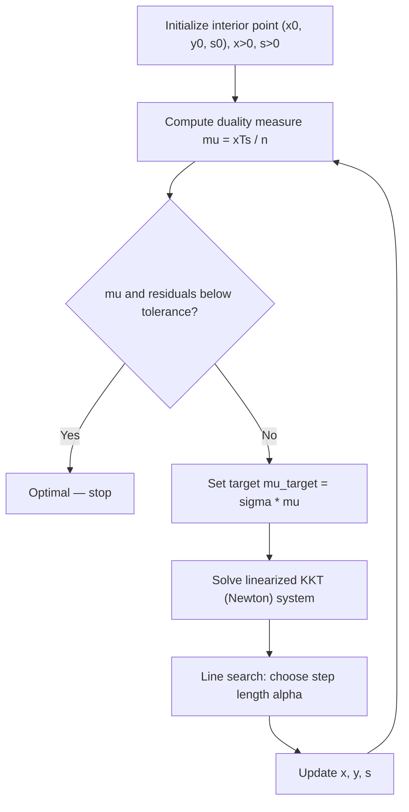

## Interior-Point Methods for Linear Programming

### Purpose and Motivation

All simplex variants covered so far — two-phase, Big-M, revised, and dual simplex — traverse the **vertices** (extreme points) of the feasible polytope, moving from one basic feasible solution to an adjacent one along the boundary until optimality is reached. Interior-point methods take a fundamentally different geometric approach: they move through the **interior** of the feasible region, following a continuous trajectory that approaches an optimal vertex only in the limit, without ever stepping onto the boundary until convergence.

This distinction matters most for large, sparse LPs where the number of vertices grows combinatorially with problem size. Although simplex is efficient in practice, its worst-case complexity is exponential in problem dimension; interior-point methods, by contrast, offer polynomial-time worst-case guarantees, making them theoretically and often practically preferable at very large scale.

### Central Idea: The Barrier Formulation

The standard-form LP,

$$\min \; c^T x \quad \text{s.t.} \quad Ax = b, \; x \geq 0$$

is reformulated by replacing the inequality constraints $x \geq 0$ with a **logarithmic barrier** term added to the objective:

$$\min \; c^T x - \mu \sum_{j=1}^n \ln(x_j) \quad \text{s.t.} \quad Ax = b$$

Here $\mu > 0$ is a barrier parameter. As $x_j \to 0^+$ for any variable, $-\ln(x_j) \to +\infty$, so the barrier term imposes an increasingly severe penalty as the solution approaches the boundary of the feasible region. This forces the solver's iterates to stay strictly interior ($x_j > 0$ for all $j$) throughout the process.

### The Central Path

For each fixed value of $\mu > 0$, the barrier problem has a unique minimizer $x^*(\mu)$ (under standard regularity conditions). As $\mu$ is driven toward zero, the trajectory traced by $x^*(\mu)$ is called the **central path**:

$$\{x^*(\mu) : \mu > 0\}$$

$$\lim_{\mu \to 0^+} x^*(\mu) = x^*$$

where $x^*$ is an optimal solution to the original LP. Interior-point algorithms work by approximately following this path, decreasing $\mu$ at each iteration while staying close enough to the central path to guarantee convergence.

### Optimality Conditions and the KKT System

Introducing the dual variables $y$ (for the equality constraints) and $s \geq 0$ (for the reduced-cost/dual feasibility conditions, sometimes called dual slacks), the barrier problem's stationarity conditions yield the **perturbed KKT system**:

$$A^T y + s = c$$
$$Ax = b$$
$$x_j s_j = \mu \quad \text{for all } j$$
$$x, s \geq 0$$

The first two equations are ordinary primal and dual feasibility. The third — $x_j s_j = \mu$ for every $j$, collectively called the **complementarity conditions** — is the barrier's signature: at $\mu = 0$, this becomes classical complementary slackness ($x_j s_j = 0$ for all $j$), the exact condition characterizing optimality in linear programming.

### Newton's Method on the Central Path

Because the KKT system above is nonlinear (due to the $x_j s_j = \mu$ terms), interior-point methods solve it approximately at each iteration using a single step of **Newton's method**, then decrease $\mu$ and repeat. Given a current interior point $(x, y, s)$, the Newton step $(\Delta x, \Delta y, \Delta s)$ solves the linearized system:

$$A^T \Delta y + \Delta s = c - A^T y - s$$
$$A \Delta x = b - Ax$$
$$S \Delta x + X \Delta s = \mu \mathbf{1} - X S \mathbf{1}$$

where $X = \text{diag}(x)$, $S = \text{diag}(s)$, and $\mathbf{1}$ is the all-ones vector. A step length $\alpha \in (0, 1]$ is then chosen to ensure the next iterate $(x + \alpha \Delta x, \, y + \alpha \Delta y, \, s + \alpha \Delta s)$ remains strictly positive in $x$ and $s$.

### Algorithm Outline (Primal-Dual Path-Following)

**Step 1 — Initialization**

Choose a strictly interior starting point $(x^0, y^0, s^0)$ with $x^0 > 0$, $s^0 > 0$ (not necessarily primal/dual feasible in early formulations, but feasible in most modern implementations).

**Step 2 — Compute Duality Measure**

$$\mu = \frac{(x^k)^T s^k}{n}$$

which measures the current average complementarity gap — how far the iterate is from satisfying complementary slackness exactly.

**Step 3 — Determine Target Barrier Parameter**

Set a target $\mu_{\text{target}} = \sigma \mu$ for a centering parameter $\sigma \in (0, 1)$, controlling how aggressively the method reduces the duality gap this iteration versus how closely it re-centers on the path.

**Step 4 — Solve Newton System**

Solve the linearized KKT system above for $(\Delta x, \Delta y, \Delta s)$ using $\mu_{\text{target}}$.

**Step 5 — Line Search / Step Length**

Choose $\alpha_k$ (often different for primal and dual directions) to preserve strict positivity of $x$ and $s$, typically backing off slightly from the maximum feasible step to remain safely interior.

**Step 6 — Update and Check Convergence**

$$x^{k+1} = x^k + \alpha_k \Delta x, \quad y^{k+1} = y^k + \alpha_k \Delta y, \quad s^{k+1} = s^k + \alpha_k \Delta s$$

Terminate when the duality gap $\mu$ and primal/dual infeasibility residuals fall below a specified tolerance; otherwise return to Step 2.

### Iteration Flow

### Central Path Geometry

<svg xmlns="http://www.w3.org/2000/svg" viewBox="0 0 640 420">
  <text x="320" y="26" font-size="17" font-weight="bold" text-anchor="middle" fill="#111">Central Path vs. Simplex Vertex Path (svg_diagram)</text>

  <polygon points="100,340 300,360 480,300 440,120 220,90 90,180" fill="#f1f6fd" stroke="#4285f4" stroke-width="2" />

  <circle cx="90" cy="180" r="4" fill="#333" />
  <circle cx="220" cy="90" r="4" fill="#333" />
  <circle cx="440" cy="120" r="4" fill="#333" />
  <circle cx="480" cy="300" r="4" fill="#333" />
  <circle cx="300" cy="360" r="4" fill="#333" />
  <circle cx="100" cy="340" r="4" fill="#333" />

  <polyline points="100,340 90,180 220,90 440,120" fill="none" stroke="#db4437" stroke-width="2.5" stroke-dasharray="6,4" />
  <text x="150" y="255" font-size="12" fill="#db4437">simplex path</text>
  <text x="150" y="270" font-size="12" fill="#db4437">(along edges)</text>

  <path d="M 105,335 C 180,260 220,200 320,150 C 380,120 420,120 435,122" fill="none" stroke="#0f9d58" stroke-width="2.5" />
  <text x="230" y="205" font-size="12" fill="#0f9d58">central path</text>
  <text x="230" y="220" font-size="12" fill="#0f9d58">(through interior)</text>

  <circle cx="105" cy="335" r="5" fill="#0f9d58" />
  <text x="70" y="358" font-size="11" fill="#111">start</text>

  <circle cx="435" cy="122" r="6" fill="#0f9d58" stroke="#111" />
  <text x="445" y="115" font-size="11" fill="#111">optimum (μ→0)</text>
</svg>

### Comparison: Interior-Point vs. Simplex Family

| Aspect | Simplex (all variants) | Interior-Point |
|---|---|---|
| Path through feasible region | Along boundary (vertex to vertex) | Through the interior |
| Worst-case complexity | Exponential (known pathological cases) | Polynomial |
| Typical practical performance | Very fast; few iterations in practice | Fewer iterations, but each iteration costlier |
| Iteration cost | One pivot (relatively cheap) | One Newton system solve (linear system of size ~$m+n$) |
| Warm-starting after small changes | Well-suited (esp. dual simplex) | [Inference] Generally harder — the central path shifts, complicating reuse of prior iterates |
| Solution structure returned | Exact vertex (extreme point) | Approaches a vertex in the limit; may need a "cross-over" step to recover exact basic solution |

### The Cross-Over Step

[Inference] Because interior-point methods converge to a point that is an optimal solution but not necessarily an exact vertex of the polytope (and does not directly identify an optimal basis), many production solvers apply a **cross-over** procedure after interior-point convergence: an additional simplex-based phase that moves from the near-optimal interior-point solution to an exact optimal basic feasible solution. This is typically needed when the application requires a basic solution specifically (e.g., for sensitivity analysis based on a basis) rather than just the optimal objective value and variable values.

### Complexity and Practical Considerations

- **Polynomial-time bound**: Interior-point path-following methods for LP were the first algorithms proven to run in polynomial time for linear programming with strong practical performance (following earlier polynomial-time results such as the ellipsoid method, which was polynomial but not competitive in practice).
- **Iteration count**: [Inference] Interior-point methods typically converge in a number of iterations that grows slowly (often cited as roughly proportional to $\sqrt{n}$ or logarithmically in the required accuracy) relative to problem size, in contrast to simplex's variable iteration count that depends heavily on problem structure and degeneracy.
- **Per-iteration cost**: Each iteration requires solving a linear system involving matrices related to $A$, $X$, and $S$ — computationally more expensive per step than a single simplex pivot, but this is offset by needing far fewer iterations on large problems.
- **Sparsity exploitation**: As with the revised simplex method, exploiting sparsity in $A$ when forming and factorizing the Newton system is essential for interior-point methods to scale to large problems.

### Relationship to the Broader Optimization Landscape

Interior-point methods are not unique to linear programming — the barrier-function approach generalizes directly to convex quadratic programming, semidefinite programming, and general convex optimization, making this family of methods a bridge between LP-specific algorithms (simplex variants) and the broader theory of interior-point and barrier methods used throughout continuous optimization.

### Related Topics

- Two-phase, Big-M, revised, and dual simplex methods (vertex-following alternatives)
- Karmarkar's algorithm (historical original polynomial-time interior-point method)
- Primal-dual path-following methods in detail (predictor-corrector variants)
- Convex quadratic programming via interior-point methods
- Semidefinite programming and conic optimization
- KKT conditions and duality theory in nonlinear programming