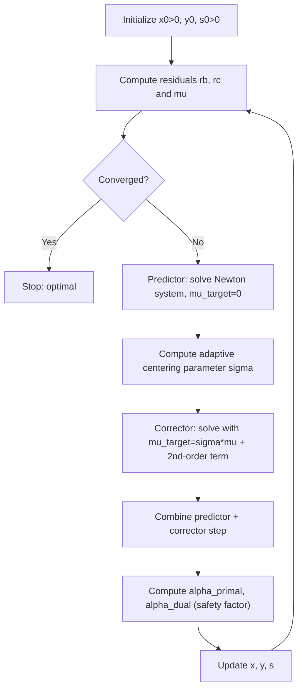

## Primal-Dual Interior-Point Algorithms

### Purpose and Motivation

The general interior-point framework covered previously — barrier reformulation, central path, Newton steps toward $\mu \to 0$ — can be implemented in several distinct algorithmic families. Among these, **primal-dual** methods are the dominant approach in modern LP solvers, having largely superseded pure primal or pure dual barrier variants. Rather than tracking only $x$ (primal barrier method) or only $(y, s)$ (dual barrier method), primal-dual algorithms update $x$, $y$, and $s$ **simultaneously** at every iteration, exploiting the symmetric structure of the KKT system directly.

### Recap: The Perturbed KKT System

As established in the prior session on interior-point methods, the primal-dual system to be solved (approximately, via Newton's method) at each iteration is:

$$A^T y + s = c \quad \text{(dual feasibility)}$$
$$Ax = b \quad \text{(primal feasibility)}$$
$$X S \mathbf{1} = \mu \mathbf{1} \quad \text{(perturbed complementarity)}$$
$$x, s > 0$$

where $X = \text{diag}(x)$, $S = \text{diag}(s)$. Primal-dual methods maintain iterates satisfying (or approximately satisfying) all three conditions at once, rather than solving a barrier subproblem in $x$ alone and recovering duals afterward.

### The Newton Direction in Detail

Linearizing the KKT system around a current iterate $(x, y, s)$ with $x, s > 0$, the Newton system for the step $(\Delta x, \Delta y, \Delta s)$ is:

$$\begin{pmatrix} 0 & A^T & I \\ A & 0 & 0 \\ S & 0 & X \end{pmatrix} \begin{pmatrix} \Delta x \\ \Delta y \\ \Delta s \end{pmatrix} = \begin{pmatrix} r_c \\ r_b \\ r_\mu \end{pmatrix}$$

where the residuals are:

$$r_c = c - A^T y - s, \qquad r_b = b - Ax, \qquad r_\mu = \mu \mathbf{1} - XS\mathbf{1}$$

**Solving via Elimination**

Because the system is large but structured, it is standard practice to reduce it algebraically rather than solving the full $(2n+m) \times (2n+m)$ system directly. Eliminating $\Delta s = X^{-1}(r_\mu - S\Delta x)$ from the third block row, then substituting into the first, yields the smaller **normal equations** system:

$$A D^2 A^T \Delta y = A D^2 (r_c - X^{-1} r_\mu) + r_b$$

where $D^2 = X S^{-1}$ (a diagonal scaling matrix). This is an $m \times m$ symmetric positive definite system — solvable via Cholesky factorization — after which $\Delta x$ and $\Delta s$ are recovered by back-substitution.

### Predictor-Corrector Refinement

The single Newton step described above is often improved using **Mehrotra's predictor-corrector method**, the algorithmic core of most production primal-dual solvers:

**Predictor Step**

First, solve the Newton system with $\mu_{\text{target}} = 0$ (pure Newton direction toward the KKT conditions directly, ignoring centering). This "affine-scaling" direction estimates how much the duality gap could be reduced.

**Adaptive Centering Parameter**

Using the predictor step's implied step length, compute an adaptive centering parameter $\sigma \in (0,1)$ — larger (more centering, smaller reduction) when the predictor step is poor, smaller (more aggressive gap reduction) when the predictor step is favorable.

**Corrector Step**

Re-solve the Newton system using the same coefficient matrix (already factorized) but with an updated right-hand side that both targets $\mu_{\text{target}} = \sigma \mu$ and adds a second-order correction term accounting for the nonlinearity of $X S \mathbf{1} = \mu \mathbf{1}$ that a pure linear (Newton) step ignores.

**Combined Step**

$$\Delta x = \Delta x_{\text{predictor}} + \Delta x_{\text{corrector}}, \quad \text{similarly for } \Delta y, \Delta s$$

[Inference] Mehrotra's approach is widely adopted in practice because the predictor and corrector systems share the same factorized coefficient matrix, so the corrector step is comparatively cheap to compute once the predictor's factorization is available — yielding substantially better practical iteration counts than a fixed-$\sigma$ scheme for a similar per-iteration cost.

### Step Length and Centrality Safeguards

After computing $(\Delta x, \Delta y, \Delta s)$, a step length $\alpha$ is chosen to preserve strict positivity:

$$\alpha^{\text{primal}}_{\max} = \max \{\alpha \in (0,1] : x + \alpha \Delta x \geq 0\}, \quad \alpha^{\text{dual}}_{\max} = \max \{\alpha \in (0,1] : s + \alpha \Delta s \geq 0\}$$

A safety factor $\gamma \in (0,1)$, typically close to but below 1 (e.g., 0.99...), is applied to each maximum step to keep the next iterate strictly interior rather than exactly on the boundary:

$$\alpha^{\text{primal}} = \gamma \, \alpha^{\text{primal}}_{\max}, \qquad \alpha^{\text{dual}} = \gamma \, \alpha^{\text{dual}}_{\max}$$

Primal and dual step lengths may differ, since $x$ and $s$ are updated with potentially different maximum feasible step sizes.

### Algorithm Outline

**Step 1 — Initialization**: Choose $(x^0, y^0, s^0)$ with $x^0, s^0 > 0$.

**Step 2 — Compute Residuals and Duality Gap**: $r_b, r_c$, and $\mu = (x^k)^T s^k / n$.

**Step 3 — Convergence Check**: If residual norms and $\mu$ are below tolerance, stop.

**Step 4 — Predictor Step**: Solve affine-scaling Newton system ($\mu_{\text{target}} = 0$).

**Step 5 — Compute Centering Parameter**: Using predictor's implied step, compute adaptive $\sigma$.

**Step 6 — Corrector Step**: Solve for the combined predictor-corrector direction.

**Step 7 — Step Length Selection**: Compute $\alpha^{\text{primal}}, \alpha^{\text{dual}}$ with safety factor.

**Step 8 — Update**: $x^{k+1} = x^k + \alpha^{\text{primal}} \Delta x$, and similarly for $y, s$ using $\alpha^{\text{dual}}$. Return to Step 2.

### Iteration Flow

### Comparison of Interior-Point Variants

| Variant | Variables Updated Jointly | Practical Status |
|---|---|---|
| Primal barrier method | $x$ only; duals recovered after | Largely superseded |
| Dual barrier method | $(y, s)$ only | Largely superseded |
| Primal-dual (basic Newton) | $x, y, s$ simultaneously | Foundation of modern methods |
| Primal-dual predictor-corrector (Mehrotra) | $x, y, s$ simultaneously, with adaptive $\sigma$ | Dominant in production solvers |

### Convergence and Complexity

[Inference] Primal-dual path-following methods with appropriate step-size and centering safeguards achieve polynomial-time worst-case iteration complexity, typically stated as $O(\sqrt{n} \log(1/\epsilon))$ iterations to reach a duality gap of $\epsilon$, where $n$ is the problem dimension — though the Mehrotra heuristic variant used in most solvers does not itself carry the same polynomial guarantee as the more conservative short-step methods; it is used because of its superior empirical performance despite weaker theoretical backing. [Unverified] The precise practical iteration counts observed (often cited as roughly 20–50 iterations regardless of problem size for well-behaved problems) are solver- and implementation-dependent and not a guaranteed property of the method in general.

### Relationship to Prior Session Topics

- The barrier parameter $\mu$ and central path concept carry over directly from the general interior-point method introduced earlier this session.
- The simplex multipliers $y^T = c_B^T B^{-1}$ from the revised simplex method play a conceptually analogous role to the dual variables $y$ maintained here — both represent the dual/shadow-price perspective on the same LP, though revised simplex computes them from a specific basis while primal-dual interior-point methods track them continuously.
- Cross-over to an exact basic solution, mentioned in the prior interior-point session, is often implemented as a final simplex-based cleanup phase specifically to recover the vertex structure that primal-dual convergence approaches but does not exactly reach.

### Related Topics

- General interior-point methods and the central path (prerequisite session)
- Revised and dual simplex methods (basis-based alternatives)
- Mehrotra predictor-corrector method in extended detail
- Interior-point methods for convex quadratic and semidefinite programming
- Warm-starting strategies for interior-point methods
- Homogeneous self-dual embedding (handling infeasibility detection in interior-point solvers)