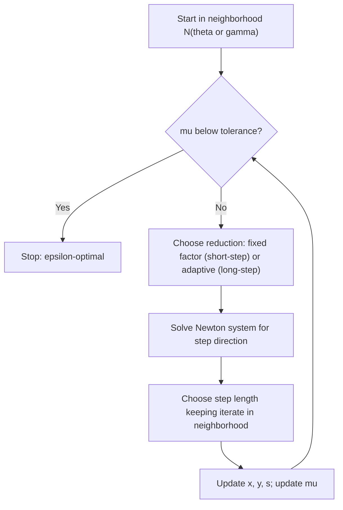

## Path-Following Methods

### Purpose and Motivation

The two preceding sessions established the central path and the primal-dual Newton machinery used to approximately follow it. **Path-following methods** are the formal algorithmic class built on that machinery — a family distinguished not by the Newton step itself (shared with primal-dual methods generally) but by *how tightly* each iterate is required to stay near the central path, and by the theoretical guarantees that proximity buys. This session treats path-following as its own topic: the neighborhood definitions, the short-step and long-step variants, and the convergence proofs that justify calling interior-point LP a polynomial-time method.

### Neighborhoods of the Central Path

Because exact central-path points $x^*(\mu)$ are generally irrational and unreachable in finite arithmetic, path-following algorithms instead require each iterate to lie within a defined **neighborhood** of the path. Two neighborhoods dominate the theory:

**The 2-Norm Neighborhood**

$$\mathcal{N}_2(\theta) = \left\{ (x, y, s) : Ax = b, \; A^T y + s = c, \; x, s > 0, \; \| X S \mathbf{1} - \mu \mathbf{1} \|_2 \leq \theta \mu \right\}$$

for a parameter $\theta \in (0, 1)$, where $\mu = x^Ts/n$ as before. This neighborhood is narrow — iterates must stay close to the path in a Euclidean sense — and is the basis of **short-step** path-following methods.

**The $-\infty$ (or Wide) Neighborhood**

$$\mathcal{N}_{-\infty}(\gamma) = \left\{ (x, y, s) : Ax = b, \; A^T y + s = c, \; x, s > 0, \; x_j s_j \geq \gamma \mu \; \forall j \right\}$$

for $\gamma \in (0, 1)$. This only requires each individual complementarity product to not fall too far below the average — a much looser requirement, permitting larger, more aggressive steps. This is the basis of **long-step** methods, including the Mehrotra predictor-corrector approach from the prior session.

### Short-Step Path-Following Method

**Core Idea**

At each iteration, take a single Newton step targeting a slightly reduced $\mu$, using a conservative reduction factor, while remaining inside a narrow $\mathcal{N}_2(\theta)$ neighborhood throughout.

**Update Rule**

$$\mu_{k+1} = \left(1 - \frac{\delta}{\sqrt{n}}\right) \mu_k$$

for a small constant $\delta \in (0, 1)$ (commonly cited choices are on the order of $\delta \approx 0.4$ [Unverified] — exact constants vary across textbook derivations and are not standardized). The $\sqrt{n}$ term is the key structural feature: it ties the *rate* of allowable progress to problem dimension, which is precisely what yields the polynomial iteration bound.

**Iteration Complexity**

Short-step methods staying within $\mathcal{N}_2(\theta)$ achieve

$$O\left(\sqrt{n} \, \log \frac{1}{\epsilon}\right)$$

iterations to reduce the duality gap to $\epsilon$. This is the strongest (best-known worst-case) complexity bound among practical path-following variants, and is the bound most commonly cited when interior-point LP is described as polynomial-time.

**Practical Drawback**

[Inference] Because $\theta$ must be kept small to preserve the convergence proof, the permissible step length at each iteration is correspondingly conservative, so short-step methods tend to require close to their theoretical worst-case iteration count in practice, in contrast to long-step methods which usually converge in far fewer iterations than their (weaker) worst-case bounds suggest.

### Long-Step Path-Following Method

**Core Idea**

Operating in the wider $\mathcal{N}_{-\infty}(\gamma)$ neighborhood, long-step methods allow the largest step length compatible with remaining in that neighborhood — rather than a small, fixed fractional reduction in $\mu$ — making substantially more progress per iteration when the geometry of the problem permits it.

**Iteration Complexity**

$$O\left(n \, \log \frac{1}{\epsilon}\right)$$

This bound is weaker (worse) in its dependence on $n$ than the short-step method's $O(\sqrt{n}\log(1/\epsilon))$. [Inference] The gap between the two bounds is a case where the provable worst-case guarantee and typical empirical performance diverge substantially: long-step and Mehrotra-style predictor-corrector methods, despite their weaker theoretical bound (or, for Mehrotra specifically, no polynomial guarantee at all under standard analysis), are the methods actually used in essentially all production LP solvers, because empirically they converge in far fewer iterations than either bound predicts.

### Predictor-Corrector as a Path-Following Variant

The Mehrotra predictor-corrector method from the previous session can be understood within this framework as an adaptive long-step method: rather than fixing $\gamma$ or $\theta$ a priori, it estimates, at each iteration, how aggressively it can reduce $\mu$ based on the predictor step's behavior — implicitly widening or narrowing its effective neighborhood tolerance iteration by iteration rather than committing to a single fixed neighborhood for the entire run.

### Comparison of Path-Following Variants

| Method | Neighborhood | Iteration Bound | Practical Behavior |
|---|---|---|---|
| Short-step | $\mathcal{N}_2(\theta)$, narrow | $O(\sqrt{n}\log(1/\epsilon))$ | Close to worst-case; conservative but reliable |
| Long-step | $\mathcal{N}_{-\infty}(\gamma)$, wide | $O(n\log(1/\epsilon))$ | Weaker bound, but faster in practice |
| Predictor-corrector (Mehrotra) | Adaptive, no fixed neighborhood | No standard polynomial guarantee | Fastest in practice; dominant in production |

### Convergence Proof Sketch (Short-Step Case)

[Inference] The standard argument establishing the $O(\sqrt{n}\log(1/\epsilon))$ bound proceeds roughly as follows, at a conceptual level:

1. Show that if the current iterate lies in $\mathcal{N}_2(\theta)$, a Newton step targeting the reduced $\mu_{k+1} = (1 - \delta/\sqrt{n})\mu_k$ keeps the next iterate in $\mathcal{N}_2(\theta)$ as well (neighborhood invariance).
2. Because $\mu$ decreases by a multiplicative factor of $(1 - \delta/\sqrt{n})$ each iteration, reaching $\mu \leq \epsilon \mu_0$ requires $\mu_0 (1-\delta/\sqrt{n})^k \leq \epsilon \mu_0$, which solving for $k$ gives $k = O(\sqrt{n}\log(1/\epsilon))$.
3. Since the duality gap $x^Ts = n\mu$ bounds the distance to optimality, this directly bounds the number of iterations to reach $\epsilon$-optimality.

This structure — proving a neighborhood-invariance lemma, then a linear (geometric) convergence rate for $\mu$, then converting that rate into an iteration count — is the template used across nearly all polynomial-time interior-point convergence proofs for LP, and generalizes with modification to convex quadratic and semidefinite programming.

### Iteration Flow (Generic Path-Following Template)

### Neighborhood Geometry

<svg xmlns="http://www.w3.org/2000/svg" viewBox="0 0 640 380">
  <text x="320" y="26" font-size="17" font-weight="bold" text-anchor="middle" fill="#111">Narrow vs. Wide Path Neighborhoods (svg_diagram)</text>

  <path d="M 90,320 C 180,220 260,160 340,120 C 400,90 440,80 460,78" fill="none" stroke="#0f9d58" stroke-width="2.5" />
  <text x="330" y="230" font-size="12" fill="#0f9d58">central path</text>

  <path d="M 90,320 C 180,220 260,160 340,120 C 400,90 440,80 460,78" fill="none" stroke="#4285f4" stroke-width="18" opacity="0.25" />
  <text x="150" y="150" font-size="12" fill="#4285f4">N2(theta) — narrow</text>
  <text x="150" y="165" font-size="12" fill="#4285f4">(short-step)</text>

  <path d="M 90,320 C 180,220 260,160 340,120 C 400,90 440,80 460,78" fill="none" stroke="#f4b400" stroke-width="55" opacity="0.2" />
  <text x="80" y="245" font-size="12" fill="#a67c00">N-inf(gamma) — wide</text>
  <text x="80" y="260" font-size="12" fill="#a67c00">(long-step)</text>

  <circle cx="90" cy="320" r="5" fill="#333" />
  <text x="55" y="345" font-size="11" fill="#111">start</text>
  <circle cx="460" cy="78" r="6" fill="#333" stroke="#111" />
  <text x="470" y="72" font-size="11" fill="#111">optimum</text>
</svg>

### Relationship to Prior Session Topics

- The Newton system, KKT residuals, and $\mu$ update mechanics reuse exactly the machinery from the primal-dual interior-point session — path-following adds the neighborhood constraint governing *how* $\mu$ is reduced and how step length is chosen, not a different underlying linear system.
- The central path itself was introduced in the general interior-point methods session; this session formalizes the notion of "following" it with provable guarantees.
- The practical dominance of Mehrotra's method despite weaker theoretical bounds, previewed in the primal-dual session, is explained more fully here through the short-step/long-step tradeoff.

### Related Topics

- Primal-dual interior-point algorithms and Mehrotra's predictor-corrector method (prerequisite session)
- General interior-point methods and the central path (prerequisite session)
- Polynomial-time complexity theory for linear and convex optimization
- Self-concordant barrier functions (generalizing the log-barrier to broader convex optimization)
- Homogeneous self-dual embedding for infeasibility detection
- Interior-point methods for convex quadratic and semidefinite programming