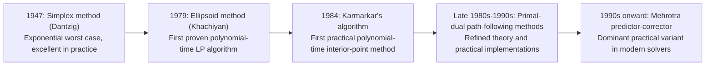

## Computational Complexity Comparisons

### Purpose and Motivation

The preceding six sessions covered two distinct algorithmic families for linear programming — the simplex family (two-phase, Big-M, revised, dual) and the interior-point family (general barrier methods, primal-dual, path-following). This session consolidates their complexity properties side by side: worst-case theoretical bounds, typical practical behavior, and the structural reasons the two often diverge sharply from one another.

### Complexity Classes: A Brief Framing

An algorithm is **polynomial-time** if its running time is bounded by a polynomial function of the input size (here, roughly $n$ variables, $m$ constraints, and the bit-length $L$ of the input data). An algorithm is **exponential-time** in the worst case if no such polynomial bound exists, even though it may still be extremely fast on nearly all practical inputs. Linear programming's complexity history is largely the story of closing the gap between "works extremely well in practice" (simplex, from the 1940s onward) and "provably efficient in the worst case" (interior-point methods and their predecessors, from the late 1970s onward).

### Simplex Method: Worst-Case Behavior

**The Klee-Minty Cube**

[Inference] The standard result establishing simplex's exponential worst case is a family of specially constructed polytopes — commonly referred to via the Klee-Minty construction — where Dantzig's original pivoting rule (choosing the entering variable with the most favorable reduced cost) visits every one of the $2^n$ vertices of an $n$-dimensional cube before reaching the optimum, one pivot per vertex. This demonstrates that simplex, under this pivoting rule, is not polynomial-time in the worst case.

**Pivoting Rule Dependence**

Worst-case behavior is a property of the *pivoting rule*, not simplex as an abstract framework. Different rules (Dantzig's rule, Bland's rule, steepest-edge rules, and others) all remain exponential in the worst case for known adversarial constructions, though no pivoting rule has been proven polynomial-time in the worst case, and none has been proven impossible to be — this remains a notable open question in the theory of linear programming.

**Smoothed Analysis**

[Inference] A separate and influential line of theoretical work (smoothed analysis) shows that when the input data of an LP is subject to small random perturbations, the *expected* running time of simplex (under certain pivoting rules) is polynomial — offering a theoretical explanation for why simplex performs so well in practice on real-world instances despite its exponential worst case on adversarially constructed inputs.

### Interior-Point Methods: Worst-Case Behavior

As covered in the path-following session, interior-point methods carry provable polynomial-time worst-case bounds:

| Method | Iteration Bound |
|---|---|
| Short-step path-following | $O(\sqrt{n} \log(1/\epsilon))$ |
| Long-step path-following | $O(n \log(1/\epsilon))$ |
| Predictor-corrector (Mehrotra) | No standard polynomial guarantee under typical analysis |

Each iteration additionally requires solving a Newton (linear) system, typically costing $O(n^3)$ in the dense case via direct factorization, though this is substantially reduced in practice through sparsity exploitation (as discussed in the revised simplex and interior-point sessions). Multiplying iteration count by per-iteration cost gives an overall polynomial bound on total work — the headline theoretical result distinguishing this family from simplex.

### Historical Timeline of Polynomial-Time LP Algorithms

### The Ellipsoid Method: A Brief Note

[Inference] The ellipsoid method, though historically important as the first proven polynomial-time algorithm for LP, is generally not used in practice for solving LPs directly — its polynomial bound, while theoretically significant, involves large constants and weak practical performance relative to both simplex and later interior-point methods. Its main lasting significance is theoretical: establishing that LP belongs to the polynomial-time complexity class P, and providing algorithmic tools used elsewhere in combinatorial optimization (e.g., certain problems solvable via the ellipsoid method combined with a separation oracle even when the number of constraints is exponential).

### Side-by-Side Comparison

| Property | Simplex Family | Interior-Point Family |
|---|---|---|
| Worst-case complexity | Exponential (known adversarial instances) | Polynomial |
| Typical practical iteration count | Empirically low; grows slowly with problem size for well-behaved instances | Low and relatively size-insensitive (often cited informally as tens of iterations) |
| Per-iteration cost | Relatively cheap (one pivot) | More expensive (Newton system solve) |
| Solution type returned | Exact vertex / basic feasible solution | Point on or near central path; needs cross-over for exact basis |
| Warm-starting | Well-suited, especially dual simplex | Comparatively harder |
| Sensitivity analysis support | Direct, via basis structure | Requires cross-over or specialized techniques |
| Best suited for | Small-to-medium LPs, problems needing repeated re-optimization | Very large-scale, sparse LPs where vertex enumeration would be costly |

### Why the Theoretical and Practical Pictures Diverge

[Inference] The gap between simplex's poor worst-case bound and its strong practical performance, and the parallel gap between short-step interior-point methods' strong worst-case bound and their comparatively conservative practical performance (relative to long-step/Mehrotra variants), both stem from the same underlying phenomenon: worst-case complexity analysis characterizes performance on adversarially constructed inputs, which are rare or structurally unlike typical real-world LP instances arising from applications. This is precisely the gap that smoothed analysis (for simplex) and empirical iteration studies (for interior-point long-step/Mehrotra variants) attempt to explain theoretically.

### Practical Solver Choice Considerations

<svg xmlns="http://www.w3.org/2000/svg" viewBox="0 0 680 320">
  <text x="340" y="26" font-size="17" font-weight="bold" text-anchor="middle" fill="#111">Simplex vs. Interior-Point: When to Prefer Each (svg_diagram)</text>

  <rect x="40" y="55" width="280" height="230" rx="8" fill="#e8f0fe" stroke="#4285f4" stroke-width="1.5" />
  <text x="180" y="82" font-size="14" font-weight="bold" text-anchor="middle" fill="#111">Simplex Family</text>
  <text x="60" y="110" font-size="12" fill="#111">- Small/medium problem size</text>
  <text x="60" y="132" font-size="12" fill="#111">- Frequent re-optimization</text>
  <text x="60" y="154" font-size="12" fill="#111">- Need exact vertex solutions</text>
  <text x="60" y="176" font-size="12" fill="#111">- Sensitivity analysis via basis</text>
  <text x="60" y="198" font-size="12" fill="#111">- Integer programming subroutine</text>
  <text x="60" y="220" font-size="12" fill="#111">- (branch and bound, cutting planes)</text>

  <rect x="360" y="55" width="280" height="230" rx="8" fill="#e6f4ea" stroke="#0f9d58" stroke-width="1.5" />
  <text x="500" y="82" font-size="14" font-weight="bold" text-anchor="middle" fill="#111">Interior-Point Family</text>
  <text x="380" y="110" font-size="12" fill="#111">- Very large-scale, sparse LPs</text>
  <text x="380" y="132" font-size="12" fill="#111">- One-off solves (no warm start need)</text>
  <text x="380" y="154" font-size="12" fill="#111">- Worst-case guarantees matter</text>
  <text x="380" y="176" font-size="12" fill="#111">- Related convex problems</text>
  <text x="380" y="198" font-size="12" fill="#111">- (QP, SDP via barrier extension)</text>
</svg>

### Modern Solver Practice

[Unverified] Most production-grade commercial and open-source LP solvers implement both families and select between them (or offer both as user-selectable options) depending on problem characteristics, since neither family strictly dominates the other across all problem structures; the specific default heuristics used to choose between simplex and interior-point solvers vary by solver vendor and are generally not part of the core published theory.

### Summary Across This Session Series

This completes a structural arc: two-phase and Big-M (constructing initial feasibility), revised simplex (efficient tableau-free implementation), dual simplex (efficient re-optimization), general interior-point methods (the barrier/central-path idea), primal-dual algorithms (the modern Newton-based implementation), path-following theory (the convergence guarantees), and this session (complexity comparison across the whole family) — together spanning the complete algorithmic toolkit for solving linear programs from both the classical vertex-following and modern interior-point perspectives.

### Related Topics

- Simplex method pivoting rules and cycling prevention (Bland's rule) in complexity detail
- Smoothed analysis of algorithms (broader theoretical framework beyond LP)
- Ellipsoid method and its role in combinatorial optimization
- Karmarkar's original algorithm and its historical significance
- Complexity theory for convex optimization beyond LP (QP, SDP, conic programming)
- Branch-and-bound and cutting-plane methods for integer programming (where simplex/dual simplex serve as subroutines)