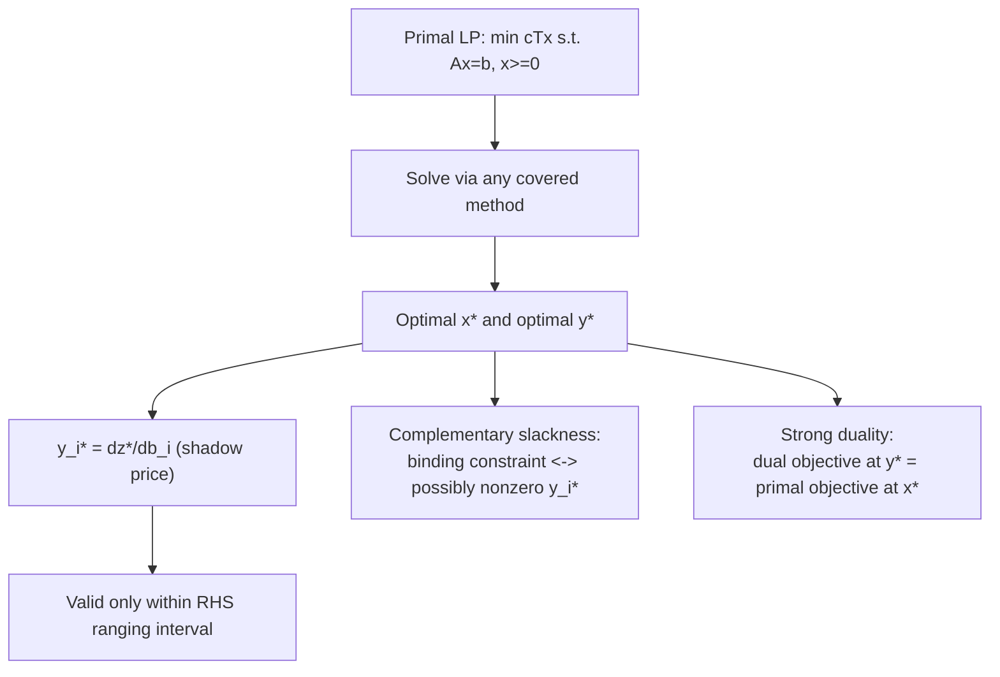

## Shadow Prices and Their Interpretation

### Purpose and Motivation

Every LP algorithm covered so far — simplex variants and interior-point methods alike — produces, alongside the optimal primal solution $x^*$, a set of optimal dual variables $y^*$ (and, where relevant, $s^*$). These dual values are not merely a computational byproduct; they carry direct economic and sensitivity meaning known as **shadow prices**. This session focuses on interpreting those values rather than computing them, since the computation itself was already covered across the revised simplex ($y^T = c_B^T B^{-1}$) and primal-dual interior-point sessions.

### Definition

For the standard-form primal problem,

$$\min \; c^T x \quad \text{s.t.} \quad Ax = b, \; x \geq 0$$

the shadow price of constraint $i$ is the optimal dual variable $y_i^*$, interpreted as:

$$y_i^* = \frac{\partial z^*}{\partial b_i}$$

the rate of change of the optimal objective value $z^*$ with respect to a small change in the right-hand side $b_i$, holding all other data fixed. In words: **the shadow price tells you how much the optimal objective would improve (or worsen) per unit increase in the availability of resource $i$**, when resource $i$ corresponds to constraint $i$.

### Sign Conventions and Interpretation by Constraint Type

Sign conventions for shadow prices are a frequent source of confusion and depend on both the optimization direction and constraint type. The following table summarizes the standard interpretation for constraints in original (non-standardized) form:

| Problem Type | Constraint Type | Shadow Price Sign | Interpretation |
|---|---|---|---|
| Maximization | $\leq$ (resource limit) | $\geq 0$ | Marginal value of one more unit of the resource |
| Maximization | $\geq$ (minimum requirement) | $\leq 0$ | Marginal cost of tightening the requirement further |
| Minimization | $\geq$ (minimum requirement) | $\geq 0$ | Marginal cost of one more unit of required minimum |
| Minimization | $\leq$ (resource limit) | $\leq 0$ | Marginal saving from relaxing the limit |

[Inference] These sign patterns follow directly from the complementary slackness and weak duality relationships established in general LP duality theory; the underlying intuition in every case is the same — a shadow price measures the marginal value (positive) or marginal cost (with a sign flip, depending on constraint direction) of relaxing that specific constraint by one unit.

### Complementary Slackness and Zero Shadow Prices

A fundamental link between the primal solution's structure and shadow price interpretation:

$$y_i^* > 0 \implies \text{constraint } i \text{ is binding (tight) at } x^*$$
$$\text{constraint } i \text{ is slack (not binding) at } x^* \implies y_i^* = 0$$

This is complementary slackness applied specifically to shadow-price interpretation: **only binding constraints can have a nonzero shadow price**. If a resource constraint is not fully used at the optimum, adding a small amount more of that resource cannot improve the objective — hence a zero shadow price. This is intuitively consistent: slack resources have no marginal value at the current optimum.

### The Range of Validity

The shadow price $y_i^*$ is only valid as a *marginal* rate over a specific range of $b_i$ values — the **right-hand-side ranging** interval — beyond which the optimal basis itself changes and the shadow price value may shift.

$$b_i \in [b_i^{\text{lower}}, \, b_i^{\text{upper}}]$$

Within this range, the current optimal basis $B$ remains optimal, and the objective changes linearly:

$$z^*(b_i + \Delta) = z^*(b_i) + y_i^* \Delta, \quad \text{for } \Delta \text{ within the valid range}$$

Outside this range, a new optimal basis takes over (a **basis change**), and the shadow price for the constraint may take on a different value under the new basis. Determining this range from the final simplex tableau is a standard sensitivity-analysis calculation, using the same $B^{-1}$ information maintained throughout the revised simplex method.

### Worked Example

Reusing the LP from the two-phase, Big-M, revised, and dual simplex sessions:

$$\min \; z = 2x_1 + 3x_2 \quad \text{s.t.} \quad x_1 + x_2 \geq 10, \; x_1 + 2x_2 \geq 12, \; x_1, x_2 \geq 0$$

with optimal solution $(x_1, x_2) = (8, 2)$, $z^* = 22$. From the revised simplex session, the simplex multipliers at optimality were computed as $y^* = (1, 1)$.

**Interpretation**

- Constraint 1 ($x_1 + x_2 \geq 10$): shadow price $y_1^* = 1$. Since this is a $\geq$ constraint in a minimization, and the sign is positive, increasing the required minimum from 10 to 11 would increase the optimal cost by approximately 1 unit (within the valid range), i.e., $z^*$ would rise to approximately 23.
- Constraint 2 ($x_1 + 2x_2 \geq 12$): shadow price $y_2^* = 1$. Similarly, tightening this requirement from 12 to 13 would increase $z^*$ by approximately 1, to approximately 23.

**Checking Binding Status**

At $(x_1, x_2) = (8, 2)$: constraint 1 gives $8 + 2 = 10$ (exactly binding), and constraint 2 gives $8 + 4 = 12$ (exactly binding). Both constraints are tight at the optimum, consistent with both shadow prices being nonzero, per complementary slackness.

### Shadow Prices as Dual Solution Values

An important structural fact tying this session to LP duality theory generally: the shadow prices $y^*$ are precisely the optimal solution to the **dual LP**. For the primal minimization above, the corresponding dual is a maximization:

$$\max \; 10 y_1 + 12 y_2 \quad \text{s.t.} \quad y_1 + y_2 \leq 2, \; y_1 + 2y_2 \leq 3, \; y_1, y_2 \geq 0$$

Evaluating the dual objective at $y^* = (1,1)$: $10(1) + 12(1) = 22$, matching the primal optimal value exactly — an instance of the **strong duality theorem**, confirming that shadow prices are not merely an interpretive convenience but literally the solution coordinates of a well-defined companion optimization problem.

### Visualizing the Shadow Price Relationship

### Practical Applications

- **Resource allocation decisions**: A manager deciding whether to acquire more of a limited resource compares the shadow price (marginal value of the resource) against its marginal acquisition cost — acquiring more is worthwhile only if the shadow price exceeds the cost per unit, within the valid ranging interval.
- **Pricing internal transfers**: In multi-unit organizations, shadow prices from a shared resource-allocation LP are sometimes used as a basis for internal transfer pricing between departments competing for the same limited resource.
- **Identifying non-binding constraints for relaxation**: Constraints with zero shadow price indicate resources with idle capacity — candidates for reduction or reallocation elsewhere without affecting the current optimal objective value.
- **Post-optimality "what-if" analysis**: Shadow prices allow rapid approximate re-evaluation of the objective under small parameter changes without re-solving the entire LP, provided the change stays within the ranging interval — directly connecting to the dual simplex method's warm-starting role covered earlier this session series.

### Relationship to Other Session Topics

- The dual simplex method (earlier this session) exploits exactly this dual-feasibility structure — its starting point is dual feasible (valid shadow prices under the optimality condition) even when primal infeasible.
- Revised simplex explicitly computes $y^T = c_B^T B^{-1}$ at every iteration — the shadow prices are available "for free" throughout the algorithm's run, not just at termination.
- Primal-dual interior-point methods maintain $y$ (and $s$) as first-class variables throughout, converging to the same shadow-price values from the interior rather than recovering them from a final basis.

### Related Topics

- Strong and weak duality theorems in linear programming
- Right-hand-side ranging and objective coefficient ranging (full sensitivity analysis)
- Complementary slackness conditions in detail
- Dual simplex method (prerequisite session, this series)
- Economic interpretation of Lagrange multipliers in nonlinear programming
- Parametric linear programming (tracking optimal solutions as parameters vary continuously)