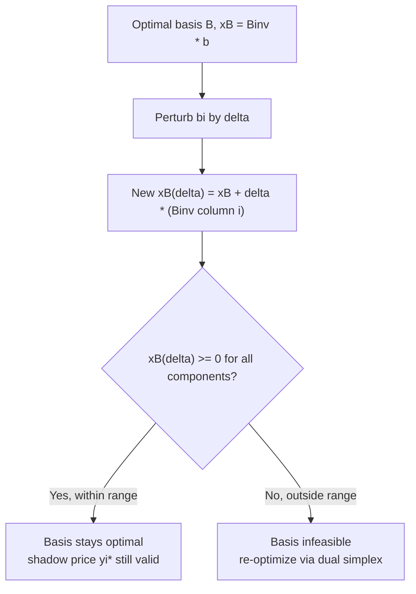

This file is close to a natural consolidation point (many similar-shaped entries accumulating), but it's nowhere near the size cap yet, so I'll just keep appending as usual.## Ranging Analysis for Right-Hand Side Values

### Purpose and Motivation

The shadow-price session established that $y_i^*$ measures the marginal rate of objective change per unit of $b_i$, and asserted that this rate holds only within a specific validity interval. This session derives that interval explicitly — completing the sensitivity-analysis picture alongside objective coefficient ranging from the previous session. Where coefficient ranging asks "how far can $c_j$ move before the reduced-cost/optimality condition breaks," RHS ranging asks the dual question: "how far can $b_i$ move before the primal-feasibility condition $x_B \geq 0$ breaks."

### Setup

Recall that for a fixed optimal basis $B$, the basic variable values are:

$$x_B = B^{-1} b$$

If $b_i$ changes to $b_i + \Delta$, this perturbs $b$ in its $i$-th component only. Because $B^{-1}$ does not itself depend on $b$, the new basic solution is:

$$x_B(\Delta) = B^{-1}(b + \Delta e_i) = B^{-1}b + \Delta \, B^{-1}e_i = x_B + \Delta \, \bar{b}_i$$

where $\bar{b}_i = B^{-1} e_i$ is simply the $i$-th **column of $B^{-1}$** ($e_i$ being the $i$-th standard unit vector) — a quantity already available from whichever method produced the optimal basis, without any new computation.

### Ranging Condition

The current basis remains optimal (in the sense of remaining primal feasible — dual feasibility/optimality is untouched since $c$ hasn't changed) as long as:

$$x_B + \Delta \, \bar{b}_i \geq 0 \quad \text{componentwise}$$

For each basic variable $x_{B_k}$ with $(\bar{b}_i)_k \neq 0$, this gives an individual bound on $\Delta$:

$$\Delta \geq -\frac{(x_B)_k}{(\bar{b}_i)_k} \quad \text{if } (\bar{b}_i)_k > 0, \qquad \Delta \leq -\frac{(x_B)_k}{(\bar{b}_i)_k} \quad \text{if } (\bar{b}_i)_k < 0$$

As with objective coefficient ranging, the overall valid range for $\Delta$ is the **intersection** of all these individual bounds across every basic variable — the tightest lower and tightest upper bound found among them. This directly gives:

$$b_i \in [b_i^{\text{old}} + \Delta_{\min}, \; b_i^{\text{old}} + \Delta_{\max}]$$

the range referenced without derivation in the shadow-price session.

### Worked Example

Using the recurring LP with optimal basis $\{x_1, x_2\}$, $x_B = (8, 2)$, and (from the revised simplex session):

$$B^{-1} = \begin{pmatrix} 2 & -1 \\ -1 & 1 \end{pmatrix}$$

**Ranging $b_1$ (currently 10)**

The relevant column is the first column of $B^{-1}$: $\bar{b}_1 = (2, -1)^T$.

Applying the ranging condition to each component of $x_B = (8, 2)$:

- For $x_1 = 8$ with $(\bar{b}_1)_1 = 2 > 0$: $\Delta \geq -8/2 = -4$
- For $x_2 = 2$ with $(\bar{b}_1)_2 = -1 < 0$: $\Delta \leq -2/(-1) = 2$

Combined range: $\Delta \in [-4, 2]$, so:

$$b_1 \in [10 - 4, \; 10 + 2] = [6, 12]$$

Within this range, the shadow price $y_1^* = 1$ (established in the shadow-price session) remains the exact marginal rate. At $b_1 = 12$ or beyond, or at $b_1 = 6$ or below, the current basis $\{x_1, x_2\}$ would no longer be feasible, and a new basis (with a potentially different shadow price) would take over.

**Ranging $b_2$ (currently 12)**

The relevant column is the second column of $B^{-1}$: $\bar{b}_2 = (-1, 1)^T$.

- For $x_1 = 8$ with $(\bar{b}_2)_1 = -1 < 0$: $\Delta \leq -8/(-1) = 8$
- For $x_2 = 2$ with $(\bar{b}_2)_2 = 1 > 0$: $\Delta \geq -2/1 = -2$

Combined range: $\Delta \in [-2, 8]$, so:

$$b_2 \in [12 - 2, \; 12 + 8] = [10, 20]$$

### Interpreting the Boundary Points

At the edge of a ranging interval, one basic variable reaches exactly zero — this is precisely the point at which a **degenerate basis change** would occur if $b_i$ moved further. [Inference] This connects directly to the dual simplex method: if $b_i$ is pushed outside its valid range, the resulting $x_B$ acquires a negative component while the reduced costs (unaffected by a pure $b$ change) remain dual feasible — exactly the primal-infeasible, dual-feasible starting condition dual simplex is designed to resolve, making dual simplex the natural re-optimization tool once an RHS ranging boundary is crossed.

### Visualizing RHS Ranging

### Geometric Interpretation

<svg xmlns="http://www.w3.org/2000/svg" viewBox="0 0 640 380">
  <text x="320" y="26" font-size="17" font-weight="bold" text-anchor="middle" fill="#111">RHS Ranging — Geometric View (svg_diagram)</text>

  <polygon points="120,320 320,340 460,220 380,90 200,80 110,180" fill="#f1f6fd" stroke="#4285f4" stroke-width="2" opacity="0.5" />
  <polygon points="150,300 330,315 445,210 375,110 215,100 140,190" fill="none" stroke="#0f9d58" stroke-width="2.5" stroke-dasharray="4,3" />

  <circle cx="320" cy="340" r="6" fill="#333" stroke="#111" />
  <text x="330" y="360" font-size="12" fill="#111">original optimal vertex</text>

  <circle cx="330" cy="315" r="5" fill="#0f9d58" />
  <text x="345" y="312" font-size="11" fill="#0f9d58">vertex shifts as bi</text>
  <text x="345" y="326" font-size="11" fill="#0f9d58">increases within range</text>

  <line x1="320" y1="340" x2="440" y2="360" stroke="#db4437" stroke-width="2" stroke-dasharray="5,3" />
  <text x="450" y="365" font-size="11" fill="#db4437">basis change point</text>
  <text x="450" y="378" font-size="11" fill="#db4437">(range boundary)</text>
</svg>

As $b_i$ moves within its valid range, the constraint boundary shifts in parallel, and the optimal vertex slides continuously along the same pair of binding constraint edges — the basis (which edges are binding) stays fixed while the vertex's exact location moves. At the range boundary, the vertex reaches a point where a third constraint becomes binding (or a current one stops being binding), forcing a basis change.

### Comparison Table: Coefficient vs. RHS Ranging (Consolidated)

| Aspect | Objective Coefficient Ranging | RHS Ranging |
|---|---|---|
| Perturbation | $c_j \to c_j + \Delta$ | $b_i \to b_i + \Delta$ |
| Quantity checked | Reduced costs $z_k - c_k \geq 0$ | Basic values $x_B \geq 0$ |
| Uses from $B^{-1}$ | Row $r$ (if $x_j$ basic) or column $A_j$ (if non-basic) | Column $i$: $\bar{b}_i = B^{-1}e_i$ |
| Preserves | Dual feasibility | Primal feasibility |
| At the boundary | A non-basic reduced cost hits zero | A basic variable value hits zero |
| Natural re-optimization tool beyond range | Primal simplex (single pivot typically) | Dual simplex (single pivot typically) |

### Practical Use Cases

- **Capacity planning**: If constraint $i$ represents a resource capacity, RHS ranging identifies exactly how much that capacity could be expanded or contracted before the current production/allocation plan's structure (which resources are binding) would need to change.
- **Rapid re-evaluation under known changes**: If a planned change to $b_i$ is known to fall within the ranging interval, the new objective value can be computed instantly via $z^*_{\text{new}} = z^*_{\text{old}} + y_i^* \Delta$, without re-solving the LP.
- **Identifying fragile vs. robust constraints**: A narrow ranging interval signals a constraint whose right-hand side is a sensitive point in the model — small errors in estimating that value could change which basis (and which shadow prices) are actually valid, warranting more careful data collection for that particular constraint.

### Relationship to Other Session Topics

This session closes the loop opened in the shadow-price session (which asserted the existence of a valid range without deriving it) and mirrors, in structure, the objective-coefficient ranging session — both use the same "perturb, propagate through $B^{-1}$, find the tightest binding condition across all affected components" template, applied to opposite halves of the primal-dual KKT system.

### Related Topics

- Shadow prices and their interpretation (prerequisite session — the RHS ranging validity claim derived here)
- Objective coefficient ranging (structurally parallel companion session)
- Dual simplex method (natural re-optimization tool at a ranging boundary)
- The 100% rule for simultaneous right-hand-side changes
- Parametric linear programming for continuous RHS variation beyond a single range
- Degeneracy and its effect on uniqueness of ranging intervals