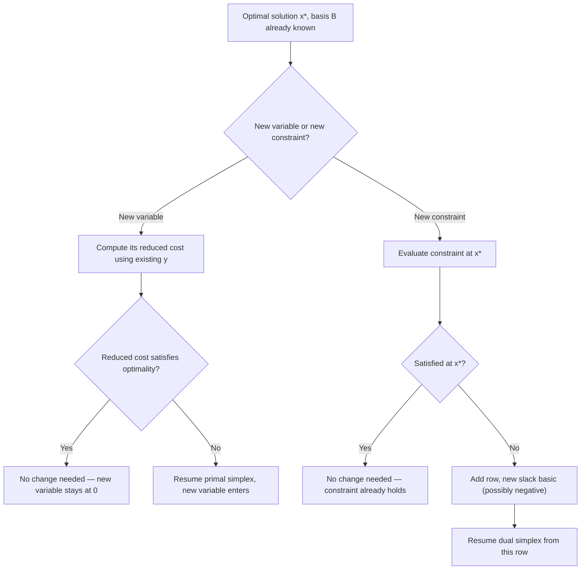

The topic list line is getting long — I'll consolidate it now rather than keep appending indefinitely, folding the running list into a compact form with room to grow.## Adding New Variables or Constraints Post-Optimality

### Purpose and Motivation

The two preceding ranging sessions analyzed sensitivity to *continuous* changes in existing data ($c_j$ or $b_i$) within a fixed problem structure. This session addresses a structurally different question: what happens when the problem itself grows — a **new variable** (activity) or a **new constraint** (restriction) is introduced after an optimal solution has already been found? Both cases can often be resolved by extending the existing optimal tableau rather than re-solving the LP from scratch, directly building on the revised simplex and dual simplex machinery from earlier in this series.

### Adding a New Variable

**Setup**

Suppose the LP $\min c^Tx$ s.t. $Ax=b, x\geq0$ has already been solved to optimality with basis $B$, and a new variable $x_{n+1}$ (with objective coefficient $c_{n+1}$ and constraint column $A_{n+1}$) is introduced.

**Key Insight**

The existing optimal basis $B$ and its inverse $B^{-1}$ remain entirely valid and unchanged — a new variable does not alter $A$'s existing columns, $b$, or any previously computed $x_B$. The only question is whether $x_{n+1}$ is attractive to bring into the basis.

**Procedure**

1. Compute the new variable's reduced cost using the *existing* simplex multipliers $y^T = c_B^T B^{-1}$ (no need to recompute $y$):

$$z_{n+1} - c_{n+1} = y^T A_{n+1} - c_{n+1}$$

2. **If the optimality condition still holds** ($z_{n+1} - c_{n+1} \geq 0$ for minimization): the current solution remains optimal even with the new variable available — $x_{n+1}$ is simply set to zero, and no re-optimization is needed.

3. **If the optimality condition is violated** ($z_{n+1} - c_{n+1} < 0$): $x_{n+1}$ is a profitable variable to introduce. Resume primal simplex from the current (now temporarily suboptimal) tableau, with $x_{n+1}$ as the entering variable — this typically requires only a handful of additional pivots rather than a full re-solve, since the vast majority of the tableau structure is already correct.

**Why This Works**

[Inference] Because $B$ and $B^{-1}$ are basis properties of the *existing* variables only, adding a column to $A$ cannot invalidate anything about the current basic solution's feasibility — it can only potentially introduce a new, more attractive pivot opportunity, which is exactly what checking the new reduced cost detects.

### Adding a New Constraint

**Setup**

Suppose a new constraint $a_{m+1}^T x \; (\leq, =, \text{or} \geq) \; b_{m+1}$ is added to an already-optimal LP.

**Case A — Constraint Already Satisfied**

Evaluate the new constraint at the current optimal $x^*$. If it is already satisfied, the current solution remains feasible and optimal for the expanded problem without any changes — the new constraint was redundant at this optimum (though it could still matter if the problem were later modified further).

**Case B — Constraint Violated**

If $x^*$ violates the new constraint, the current basis is no longer primal feasible for the expanded problem. However, a key structural fact makes this case tractable:

[Inference] Because the new constraint was not present when $c$ and the objective were optimized, the reduced costs computed from the *existing* variables and basis remain dual feasible with respect to the new (larger) problem — adding a constraint (and its associated new slack/surplus variable) does not change any existing reduced cost, only introduces one new row and one new basic variable (the new slack) into the tableau.

**Procedure**

1. Add the new constraint as an additional row to the tableau, expressed in terms of the current basis (substitute out any basic variables appearing in the new constraint using the existing tableau rows, so the row is expressed purely in non-basic variables plus a new slack).
2. The new slack variable becomes basic for this row; if the resulting value is negative, the current basis is primal infeasible but — per the point above — remains dual feasible.
3. This is precisely the dual-feasible, primal-infeasible starting condition the **dual simplex method** (covered earlier this session series) is designed for. Resume with dual simplex, using the new row as the initial pivot row, to restore primal feasibility while preserving dual feasibility (optimality) throughout.

### Worked Example — Adding a Constraint

Reusing the LP $\min z = 2x_1 + 3x_2$ s.t. $x_1+x_2\geq10$, $x_1+2x_2\geq12$, with optimum $(x_1,x_2)=(8,2)$, $z^*=22$.

**New Constraint**: $x_1 + 3x_2 \geq 20$ (a stricter joint requirement).

**Check at Current Optimum**: $8 + 3(2) = 14 < 20$ — violated. The current solution is no longer feasible for the expanded problem.

**Resolution**

The new constraint is added as a row, and — following the procedure above — treated via dual simplex from the current (now primal-infeasible, still dual-feasible) tableau. [Inference] Because only one new constraint row was introduced, this typically resolves in very few dual simplex pivots, producing a new optimal solution that satisfies all three constraints; the exact new optimum would require carrying the new row through the existing tableau's substitutions to determine, but the qualitative point — that dual simplex is the appropriate and efficient re-optimization tool here rather than restarting from Phase 1 — holds regardless of the specific numbers.

### Iteration Flow — Unified View

### Why This Approach Beats Re-Solving From Scratch

| Change Type | Naive Approach | Warm-Start Approach | Typical Advantage |
|---|---|---|---|
| New variable, not attractive | Re-solve entire LP | Check one reduced cost | Essentially free |
| New variable, attractive | Re-solve entire LP | Resume primal simplex, one entering variable | Few pivots vs. full solve |
| New constraint, already satisfied | Re-solve entire LP | No action needed | Free |
| New constraint, violated | Re-solve entire LP (often from Phase 1) | Resume dual simplex from new row | Few pivots vs. full Phase 1 + Phase 2 |

[Inference] This table's qualitative pattern — that incremental problem changes are almost always cheaper to handle via warm-starting from the previous optimal basis than via a full re-solve — is the same underlying principle that makes revised simplex (efficient tableau maintenance) and dual simplex (efficient primal-infeasible recovery) valuable in the first place; this session applies both to the specific case of structural problem growth.

### Connection to Cutting-Plane Methods

This "add a constraint, resume via dual simplex" pattern is not merely a convenience — it is the computational core of **cutting-plane methods** for integer programming, where a fractional LP-relaxation solution is repeatedly cut off by adding a new valid inequality (constraint) that the fractional solution violates but no integer solution does, then re-optimizing via exactly the dual-simplex warm-start procedure described here. [Inference] This makes this session's content foundational groundwork for later coverage of integer programming techniques, rather than a standalone sensitivity-analysis curiosity.

### Practical Considerations

- **Order of operations matters for new variables**: if several new variables are considered for addition, checking all their reduced costs against the existing $y^*$ before deciding which (if any) to formally add avoids unnecessary re-optimization for variables that would not improve the solution anyway.
- **Redundant constraint detection**: the "Case A" check (evaluate the new constraint at $x^*$) doubles as a fast redundancy test — if many candidate constraints are being considered for a model, this check quickly filters out ones that impose no binding restriction at the current design.
- **Multiple simultaneous additions**: [Speculation] Handling several new variables and constraints together in a single warm-start pass is possible in principle by combining the individual procedures above, though the interaction effects between simultaneous additions are more complex to reason about than any single addition in isolation, and are not covered in the standard single-change ranging framework used in this session.

### Relationship to Other Session Topics

- Dual simplex method (prerequisite session) is the direct computational tool used for the new-constraint case.
- Revised simplex's maintained $B^{-1}$ and $y^T$ are exactly what make the new-variable check computationally cheap — no full tableau recomputation is needed.
- RHS and coefficient ranging (previous two sessions) address *quantitative* perturbations within a fixed structure; this session addresses *structural* perturbations — together the three sessions form a complete picture of post-optimality analysis.

### Related Topics

- Dual simplex method (prerequisite — the re-optimization engine for new constraints)
- Cutting-plane methods for integer programming (direct application of this session's constraint-addition procedure)
- RHS ranging and objective coefficient ranging (companion sensitivity-analysis sessions)
- Branch-and-bound methods for integer programming
- Column generation methods (the symmetric large-scale technique for handling many candidate variables)
- Parametric programming for continuous structural or data variation