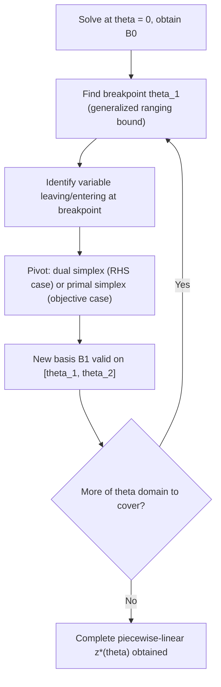

## Parametric Linear Programming

### Purpose and Motivation

The ranging sessions asked: over what interval does the current optimal basis remain valid as a single parameter ($c_j$ or $b_i$) changes? Parametric programming generalizes this by asking a follow-on question: **what happens beyond that interval, and beyond the next one, and the one after that** — tracing the complete sequence of optimal bases as a parameter varies continuously across its entire range, not just certifying validity within one interval. Where ranging analysis produces a single interval and a single shadow price, parametric analysis produces a full piecewise structure describing the optimal solution as a function of the parameter.

### Two Standard Forms

**Parametric Right-Hand Side**

$$b(\theta) = b^0 + \theta \, \Delta b, \quad \theta \geq 0$$

Track $x^*(\theta)$ and $z^*(\theta)$ as $\theta$ increases from 0.

**Parametric Objective**

$$c(\theta) = c^0 + \theta \, \Delta c, \quad \theta \geq 0$$

Track $x^*(\theta)$ and $z^*(\theta)$ as $\theta$ increases from 0.

Both forms reduce, over any single sub-interval where the optimal basis is fixed, to exactly the ranging calculations from the two preceding sessions — parametric programming is precisely the concatenation of ranging analysis applied repeatedly, at each successive basis-change breakpoint, across the parameter's full domain.

### Parametric RHS Algorithm

**Step 1 — Solve at $\theta = 0$**

Obtain the optimal basis $B_0$ for $b(0) = b^0$ using any method covered in this session series.

**Step 2 — Determine the Current Interval's Upper Breakpoint**

Using the RHS ranging procedure from two sessions prior, applied to the direction $\Delta b$ rather than a single unit perturbation, find the largest $\theta$ for which $B_0$ remains primal feasible:

$$\theta_1 = \min_k \left\{ -\frac{(x_{B_0})_k}{(B_0^{-1}\Delta b)_k} : (B_0^{-1}\Delta b)_k < 0 \right\}$$

This is the direct vector generalization of the single-component ranging bound derived in the RHS ranging session.

**Step 3 — Identify the Leaving Variable and Pivot**

At $\theta = \theta_1$, the basic variable achieving the minimum in Step 2 reaches exactly zero. This variable leaves the basis. Because dual feasibility (the objective hasn't changed) is preserved throughout a pure RHS parametrization, the appropriate pivot at this breakpoint is chosen via the **dual simplex ratio test** — directly reusing the dual simplex machinery from earlier in this series to select the entering variable that restores primal feasibility while keeping the solution dual feasible.

**Step 4 — Update and Repeat**

With the new basis $B_1$ valid for $\theta \in [\theta_1, \theta_2]$, repeat Steps 2–3 to find the next breakpoint $\theta_2$, and so on, until either $\theta$'s domain of interest is exhausted or the problem becomes infeasible for all $\theta$ beyond some point (no valid leaving-variable ratio exists).

### Parametric Objective Algorithm

The mirror-image procedure, using coefficient ranging (from the objective ranging session) generalized along the direction $\Delta c$:

**Step 1 — Solve at $\theta = 0$**, obtaining basis $B_0$.

**Step 2 — Determine the Breakpoint**: find the largest $\theta$ for which every non-basic reduced cost remains within the optimality condition, generalizing the single-coefficient bound from the coefficient-ranging session to the full vector $\Delta c$.

**Step 3 — Pivot via Primal Simplex**: at the breakpoint, a non-basic reduced cost hits exactly zero; that variable becomes the entering variable for a standard **primal simplex** pivot (since primal feasibility, unaffected by an objective change, is preserved throughout).

**Step 4 — Repeat** across successive intervals.

### Worked Example — Parametric RHS

Using the recurring LP with $b^0 = (10, 12)^T$ and, say, $\Delta b = (1, 0)^T$ (increasing only the first requirement), starting from $B_0 = \{x_1, x_2\}$ with $B_0^{-1} = \begin{pmatrix}2 & -1\\-1 & 1\end{pmatrix}$ and $x_{B_0} = (8, 2)$ (established in the revised simplex session):

$$B_0^{-1}\Delta b = \begin{pmatrix}2 & -1\\-1 & 1\end{pmatrix}\begin{pmatrix}1\\0\end{pmatrix} = \begin{pmatrix}2\\-1\end{pmatrix}$$

Applying Step 2: only the second component is negative ($-1$), giving

$$\theta_1 = -\frac{2}{-1} = 2$$

This matches the RHS ranging session's finding that $b_1 \in [6, 12]$ — since $b_1(\theta) = 10 + \theta$, the interval's upper end $b_1 = 12$ corresponds exactly to $\theta_1 = 2$. At $\theta = \theta_1$, $x_2$ (the second basic variable) reaches zero and leaves the basis; a dual-simplex pivot at this point determines the entering variable and the next basis $B_1$, valid for some interval $\theta \in [2, \theta_2]$.

### The Complete Piecewise-Linear Structure

Across the full range of $\theta$, the optimal objective value $z^*(\theta)$ is a **piecewise-linear, convex function** (for parametric RHS in a minimization) or **piecewise-linear, concave function** (for parametric objective in a minimization) — the slope of each linear piece is exactly the shadow price (RHS case) or the fixed basic solution's dot product direction (objective case) valid on that piece, and each breakpoint marks a basis change.

### Visualizing the Piecewise Structure

<svg xmlns="http://www.w3.org/2000/svg" viewBox="0 0 640 340">
  <text x="320" y="24" font-size="17" font-weight="bold" text-anchor="middle" fill="#111">z*(θ) — Piecewise-Linear Optimal Value Function (svg_diagram)</text>

  <line x1="60" y1="290" x2="580" y2="290" stroke="#333" stroke-width="1.5" />
  <line x1="60" y1="290" x2="60" y2="50" stroke="#333" stroke-width="1.5" />
  <text x="590" y="295" font-size="12" fill="#111">θ</text>
  <text x="45" y="45" font-size="12" fill="#111">z*(θ)</text>

  <polyline points="60,270 180,220 320,150 460,130 580,95" fill="none" stroke="#0f9d58" stroke-width="3" />

  <circle cx="180" cy="220" r="4" fill="#db4437" />
  <circle cx="320" cy="150" r="4" fill="#db4437" />
  <circle cx="460" cy="130" r="4" fill="#db4437" />

  <line x1="180" y1="220" x2="180" y2="290" stroke="#db4437" stroke-width="1" stroke-dasharray="3,2" />
  <line x1="320" y1="150" x2="320" y2="290" stroke="#db4437" stroke-width="1" stroke-dasharray="3,2" />
  <line x1="460" y1="130" x2="460" y2="290" stroke="#db4437" stroke-width="1" stroke-dasharray="3,2" />

  <text x="170" y="308" font-size="11" fill="#db4437">θ1</text>
  <text x="310" y="308" font-size="11" fill="#db4437">θ2</text>
  <text x="450" y="308" font-size="11" fill="#db4437">θ3</text>

  <text x="100" y="255" font-size="11" fill="#0f9d58">slope = y1* (basis B0)</text>
  <text x="230" y="195" font-size="11" fill="#0f9d58">slope changes (basis B1)</text>
</svg>

Each red dot marks a breakpoint where the basis changes and the slope of $z^*(\theta)$ shifts — the shadow price valid on each segment is exactly the slope of that segment, directly generalizing the single-point shadow-price interpretation from two sessions prior into a full function.

### Relationship to Ranging Analysis

| Aspect | Ranging Analysis (RHS or Coefficient) | Parametric Programming |
|---|---|---|
| Scope | One interval around a current value | Entire domain of $\theta$ |
| Output | A single valid range, single shadow price | Full piecewise-linear $z^*(\theta)$, sequence of bases |
| Computational cost | One calculation from existing tableau | Repeated ranging calculations at each breakpoint |
| Reuses | $B^{-1}$, current tableau | Same, applied iteratively; dual/primal simplex for pivots |

### Applications

- **Trade-off curves**: Parametric objective analysis directly produces the full trade-off frontier when blending two competing objectives via $c(\theta) = (1-\theta)c^{(1)} + \theta c^{(2)}$, tracing every Pareto-relevant basis along the blend — a standard technique bridging single-objective LP theory toward multi-objective optimization.
- **Resource-expansion planning**: Parametric RHS along a direction representing proportional capacity expansion across multiple resources traces out exactly how the optimal objective improves as investment in capacity increases, identifying every point at which the production plan's structure would need to change.
- **Algorithmic subroutine in other methods**: [Inference] Parametric programming techniques underlie certain algorithms for related problem classes — for instance, tracing the regularization path in some statistical estimation problems solvable via LP reformulation follows an analogous parametric-breakpoint structure, though the specific connection depends on the problem's formulation.

### Relationship to Other Session Topics

This session is the direct capstone of the sensitivity-analysis arc: RHS ranging and coefficient ranging (single-interval analysis) generalize here into full-domain analysis, using dual simplex (for RHS parametrization) and primal simplex (for objective parametrization) as the pivoting engines at each breakpoint — tying together nearly every algorithmic and analytical topic covered across this entire Linear Programming Algorithms sequence.

### Related Topics

- RHS ranging and objective coefficient ranging (the single-interval building blocks of this session)
- Dual simplex and primal simplex methods (the pivoting engines at each breakpoint)
- Multi-objective and goal programming (natural extension of parametric objective blending)
- Adding new variables or constraints post-optimality (a related but distinct form of post-optimality analysis)
- Regularization paths in statistical estimation (a related parametric-breakpoint structure in a different domain)
- Integer programming sensitivity analysis (parametric analysis is significantly more complex once integrality is imposed)