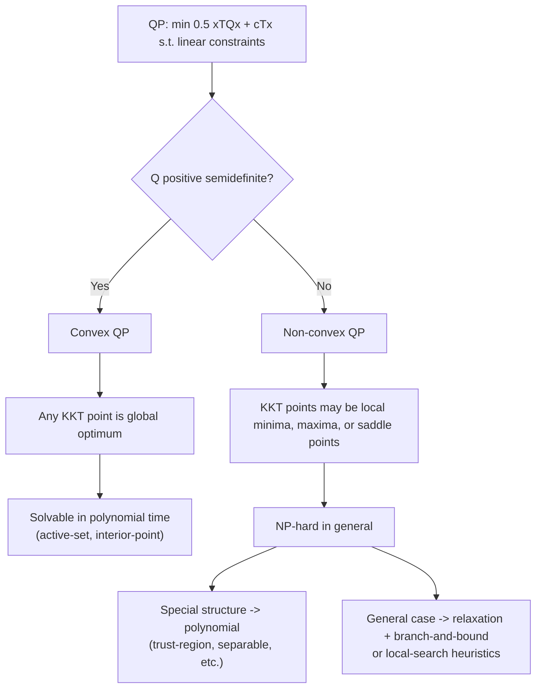

## Convex versus Nonconvex Quadratic Programs

### Purpose and Motivation

The previous session established definiteness of $Q$ as the primary classifier of a QP and asserted the consequences at a high level: convex QP is tractable, non-convex QP is generally NP-hard. This session examines that divide in depth — the precise structural reasons convexity confers tractability, the specific pathologies that arise without it, and the practical spectrum of techniques used when convexity cannot be assumed.

### Why Convexity Confers Tractability: The Formal Argument

**Definition of a Convex Optimization Problem**

A minimization problem is convex if the objective function is convex and the feasible region is a convex set. For QP with linear constraints, the feasible region (a polyhedron, an intersection of halfspaces) is always convex regardless of $Q$ — convexity of the *problem* therefore hinges entirely on convexity of the *objective*, i.e., on $Q \succeq 0$.

**The Local-Global Theorem**

For a convex function over a convex feasible set, any point satisfying first-order (KKT) stationarity is a global minimizer. [Inference] The proof intuition: if a convex function had a local minimum that was not global, the line segment connecting that local minimum to a lower point elsewhere in the (convex) feasible region would, by the convexity inequality $f(\lambda x + (1-\lambda)y) \leq \lambda f(x) + (1-\lambda)f(y)$, produce points arbitrarily close to the claimed local minimum with strictly lower objective value — contradicting the assumption that it was a local minimum in the first place.

**Consequence for Algorithms**

Because local and global optimality coincide, any algorithm that reliably finds *a* KKT point of a convex QP has, without further work, found *the* global solution (or one of possibly several tied global solutions, in the positive-semidefinite non-strict case). This is precisely the property exploited by active-set and interior-point QP methods (covered in upcoming sessions) — they are designed only to satisfy KKT conditions, and convexity is what makes that sufficient.

### What Breaks Without Convexity

**Multiple Local Minima**

An indefinite $Q$ creates a feasible region on which the objective can have several distinct local minima with different objective values, none of which is guaranteed to be global. A KKT-satisfying algorithm may converge to any of them depending on its starting point, with no way to certify (without additional global search) that a better solution doesn't exist elsewhere in the feasible region.

**Saddle Points**

Indefinite $Q$ also introduces genuine saddle points — points satisfying first-order stationarity in an unconstrained sense but which are minima along some directions and maxima along others. Constrained to a polyhedron, such points can still satisfy the full KKT system without being any kind of local minimum for the constrained problem, an outcome impossible in the convex case.

**NP-Hardness**

[Inference] The general non-convex QP — even in the seemingly simple case of just checking whether $Q$ has a negative eigenvalue combined with box constraints $0 \leq x \leq 1$ — is known to be NP-hard; this specific case (sometimes called the "0-1 indefinite QP" or connected to the max-cut problem via a standard reduction) is a canonical hardness result in the combinatorial optimization literature, and reflects the same complexity barrier as many other combinatorial problems.

### Special Structure That Restores Tractability

Even within non-convex QP, several structured special cases remain polynomially solvable or well-approximable:

- **Trust-region subproblems**: minimizing a (possibly indefinite) quadratic subject to a single ball constraint $\|x\| \leq \Delta$ is solvable in polynomial time despite general non-convexity, because the single spherical constraint's structure admits a tractable characterization of the global optimum via a specific eigenvalue-based condition (related to, but distinct from, general KKT analysis).
- **QP with a single quadratic constraint (in addition to a quadratic objective)**: certain classes remain tractable via semidefinite programming relaxations, though this connects to more advanced convex-relaxation theory beyond the immediate QP toolkit.
- **Diagonal or near-diagonal $Q$ with box constraints**: separable structure (where the quadratic term decomposes into independent per-variable terms) often permits efficient specialized solution even when individual diagonal entries are negative.

### Convex Relaxation as a Practical Strategy

[Inference] A common practical approach to non-convex QP is not to solve it exactly but to construct a convex relaxation — for instance, replacing the exact non-convex feasible/objective structure with a semidefinite programming relaxation that provides a provable lower bound (for minimization) on the true optimal value, then using that bound within a branch-and-bound search over the original non-convex problem to certify or approach the true global optimum. This mirrors, in spirit, the role LP relaxations play in integer programming — a tractable relaxation guiding search over an intractable exact problem.

### Visual Comparison

### Geometric Illustration

<svg xmlns="http://www.w3.org/2000/svg" viewBox="0 0 680 340">
  <text x="340" y="24" font-size="17" font-weight="bold" text-anchor="middle" fill="#111">Convex vs. Non-Convex Feasible-Region Objective Landscape (svg_diagram)</text>

  <text x="170" y="55" font-size="13" font-weight="bold" text-anchor="middle" fill="#111">Convex QP over polyhedron</text>
  <polygon points="70,260 270,270 300,150 180,80 90,140" fill="#e8f0fe" stroke="#4285f4" stroke-width="2" />
  <ellipse cx="180" cy="190" rx="70" ry="45" fill="none" stroke="#0f9d58" stroke-width="1.5" opacity="0.7" />
  <ellipse cx="180" cy="190" rx="45" ry="28" fill="none" stroke="#0f9d58" stroke-width="1.5" opacity="0.7" />
  <ellipse cx="180" cy="190" rx="20" ry="12" fill="none" stroke="#0f9d58" stroke-width="1.5" opacity="0.7" />
  <circle cx="180" cy="190" r="5" fill="#0f9d58" stroke="#111" />
  <text x="180" y="310" font-size="11" text-anchor="middle" fill="#111">single global minimum</text>

  <text x="520" y="55" font-size="13" font-weight="bold" text-anchor="middle" fill="#111">Non-convex QP over polyhedron</text>
  <polygon points="420,260 620,270 650,150 530,80 440,140" fill="#fce8e6" stroke="#db4437" stroke-width="2" />
  <ellipse cx="490" cy="220" rx="35" ry="22" fill="none" stroke="#db4437" stroke-width="1.5" opacity="0.7" />
  <ellipse cx="580" cy="140" rx="30" ry="20" fill="none" stroke="#db4437" stroke-width="1.5" opacity="0.7" />
  <circle cx="490" cy="220" r="5" fill="#db4437" stroke="#111" />
  <circle cx="580" cy="140" r="5" fill="#db4437" stroke="#111" />
  <text x="490" y="245" font-size="10" text-anchor="middle" fill="#111">local min A</text>
  <text x="580" y="165" font-size="10" text-anchor="middle" fill="#111">local min B</text>
  <text x="525" y="310" font-size="11" text-anchor="middle" fill="#111">multiple local minima</text>
</svg>

### Practical Detection and Handling Workflow

**Step 1 — Classify.** Compute (or estimate) the eigenvalues of $Q$, or attempt a Cholesky factorization, to determine positive (semi)definiteness before selecting a solution method.

**Step 2 — If convex.** Proceed directly with active-set or interior-point QP methods (upcoming sessions), with full confidence that any converged KKT point is globally optimal.

**Step 3 — If non-convex, check for exploitable structure.** Determine whether the problem falls into a special tractable class (trust-region form, separable structure, single indefinite direction).

**Step 4 — If no special structure, choose a global strategy.** Options include: exact global methods (branch-and-bound with convex relaxations, at higher computational cost), or local/heuristic methods (multiple random restarts of a local KKT-point solver, accepting the risk of a merely local solution).

### Relationship to Prior Session Topics

- This session directly deepens the classification table introduced in the previous QP formulation session, providing the theoretical justification (the local-global theorem) for why that table's tractability column is structured the way it is.
- The NP-hardness contrast with LP connects back to the computational complexity comparisons session from the Linear Programming Algorithms sequence — LP's polynomial-time tractability (via either simplex's practical performance or interior-point's worst-case guarantee) does not carry over once even a single non-convex quadratic term is introduced.
- Branch-and-bound, mentioned here as a strategy for exact non-convex QP solving, connects forward to the same technique's central role in integer programming, previewed in the earlier cutting-plane discussion.

### Related Topics

- Quadratic program formulation and classification (prerequisite session)
- Active-set and interior-point methods for convex QP (upcoming algorithmic sessions)
- Trust-region methods in nonlinear optimization
- Semidefinite programming relaxations for non-convex problems
- Branch-and-bound for global optimization
- Max-cut and other combinatorial problems reducible to indefinite QP