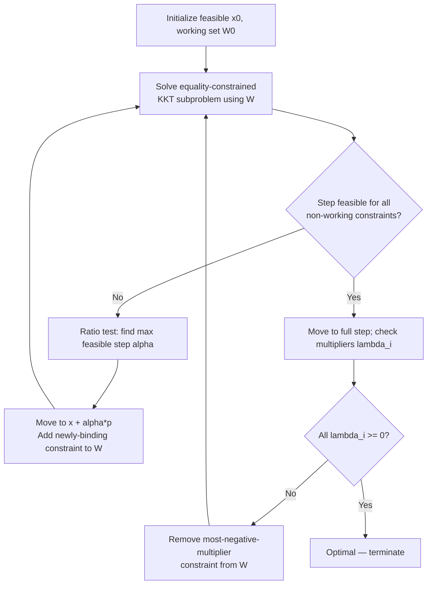

## Active-Set Methods for Quadratic Programming

### Purpose and Motivation

The formulation session flagged a key structural departure from LP: a convex QP's optimum need not sit at a vertex of the feasible polyhedron, ruling out direct vertex-enumerating simplex-style pivoting. Active-set methods resolve this by generalizing the *concept* underlying simplex — maintaining a working set of constraints treated as equalities, iterating toward optimality — without requiring that working set to correspond to a full vertex. This session covers the equality-constrained QP subproblem at the algorithm's core and the primal active-set method built around it.

### The Equality-Constrained QP Subproblem

**Simplification First**

If all constraints in a QP were equalities rather than inequalities, the problem would be directly solvable via a linear system. Given:

$$\min \; \frac{1}{2}x^TQx + c^Tx \quad \text{s.t.} \quad A_{\text{eq}}x = b_{\text{eq}}$$

the KKT stationarity and feasibility conditions form a single linear system (the **KKT system** for equality-constrained QP):

$$\begin{pmatrix} Q & A_{\text{eq}}^T \\ A_{\text{eq}} & 0 \end{pmatrix} \begin{pmatrix} x^* \\ \lambda^* \end{pmatrix} = \begin{pmatrix} -c \\ b_{\text{eq}} \end{pmatrix}$$

This system, solvable directly via a single linear solve (given a nonsingular coefficient matrix, which holds when $Q$ is positive definite on the null space of $A_{\text{eq}}$), is the computational workhorse each active-set iteration reduces to.

### The Active-Set Concept

For a QP with inequality constraints $Ax \leq b$, define the **active set** at a feasible point $x$ as the indices of constraints satisfied with equality: $\mathcal{A}(x) = \{i : (Ax)_i = b_i\}$. The key algorithmic idea: if the correct active set at the optimal solution were known in advance, the QP could be solved exactly as an equality-constrained problem using only those constraints — the remaining (inactive) inequality constraints could simply be dropped, since they don't bind at the optimum anyway. Active-set methods iteratively *guess and refine* this working set, converging to the true active set at optimality.

### Primal Active-Set Algorithm

**Step 1 — Initialization**

Obtain a feasible starting point $x^0$ satisfying all constraints (this itself may require a Phase-1-style auxiliary procedure, directly analogous to the two-phase simplex method's Phase 1, when no obvious feasible point is available). Initialize a working set $\mathcal{W}^0 \subseteq \mathcal{A}(x^0)$ — a subset of the constraints active at $x^0$.

**Step 2 — Solve the Equality-Constrained Subproblem**

Treating the working-set constraints as equalities and temporarily ignoring all others, solve the KKT system above (using the working set in place of $A_{\text{eq}}$) to obtain a candidate step direction $p^k$ toward the equality-constrained optimum $\hat{x}$, where $p^k = \hat{x} - x^k$.

**Step 3 — Case A: Direction is Feasible for Non-Working Constraints**

If $x^k + p^k$ satisfies all inactive (non-working-set) constraints, check the sign of the Lagrange multipliers $\lambda_i$ obtained from the subproblem for each working-set inequality constraint:

- **If all $\lambda_i \geq 0$** (for constraints of the form $\leq$, using the standard KKT sign convention): the current working set is optimal — the point $x^k + p^k$ is the global solution (for convex QP). Terminate.
- **If some $\lambda_i < 0$**: that constraint is not truly necessary in the active set (removing it would improve the objective). Remove the constraint with the most negative multiplier from the working set and repeat Step 2.

**Step 4 — Case B: Direction is Infeasible for Some Non-Working Constraint**

If moving the full step $p^k$ would violate some inactive constraint, perform a **ratio test** (directly analogous to the simplex ratio test) to find the maximum step length $\alpha^k \in [0,1]$ that keeps $x^k + \alpha^k p^k$ feasible for all constraints:

$$\alpha^k = \min\left(1, \; \min_{i \notin \mathcal{W}^k, \, (Ap^k)_i > 0} \frac{b_i - (Ax^k)_i}{(Ap^k)_i}\right)$$

Move to $x^{k+1} = x^k + \alpha^k p^k$. The constraint achieving the minimum ratio (the newly-encountered binding constraint) is added to the working set for the next iteration.

**Step 5 — Repeat**

Return to Step 2 with the updated point and working set, continuing until Step 3's termination condition (all multipliers non-negative) is reached.

### Worked Example (Conceptual)

**Problem**

$$\min \; \frac{1}{2}(x_1^2 + x_2^2) - x_1 - 3x_2 \quad \text{s.t.} \quad x_1 + x_2 \leq 4, \; x_1 \geq 0, \; x_2 \geq 0$$

Here $Q = I$ (identity), positive definite — a convex QP.

**Iteration 1**: Starting from a feasible point, say $x^0 = (0,0)$ with working set $\mathcal{W}^0 = \{x_1 \geq 0, x_2 \geq 0\}$ (both non-negativity constraints active). Solving the equality-constrained subproblem with both variables pinned at zero trivially gives $p^0$ pointing toward the unconstrained minimizer of the quadratic, $(1, 3)$ — but this would leave the working-set constraints, so the algorithm instead evaluates the multipliers directly and finds it beneficial to drop constraints from the working set toward the true unconstrained direction.

**Iteration 2**: Moving in the direction of the unconstrained minimum $(1,3)$ from $(0,0)$: check feasibility against $x_1+x_2\leq4$: at $(1,3)$, $1+3=4$ — exactly on the boundary. So $\alpha = 1$ is feasible with equality, and the point $(1,3)$ is reached with the constraint $x_1+x_2\leq4$ newly active.

**Iteration 3**: With working set $\{x_1+x_2\leq4\}$, solve the equality-constrained subproblem restricted to this constraint. [Inference] The resulting KKT system yields a multiplier $\lambda \geq 0$ for this constraint at the resulting point, confirming optimality — the algorithm terminates with $(x_1,x_2)=(1,3)$ as the solution, satisfying all constraints and the KKT sign conditions.

### Iteration Flow

### Analogy to the Simplex Method

| Aspect | Simplex (LP) | Active-Set (QP) |
|---|---|---|
| Working structure | Basis (set of basic variables) | Working set (set of active constraints) |
| Per-iteration computation | Pivot on tableau | Solve equality-constrained KKT system |
| Feasibility restoration | Ratio test | Ratio test (directly analogous) |
| Optimality check | Reduced costs $\geq 0$ | Lagrange multipliers $\geq 0$ |
| Adding to working structure | N/A (basis size fixed at $m$) | New constraint added when a ratio-test boundary is hit |
| Removing from working structure | Leaving variable | Constraint with negative multiplier removed |
| Solution location | Always a vertex | May move along faces/interior, not just vertices |

[Inference] This structural parallel is not a coincidence — active-set QP methods were developed as a direct generalization of simplex-style reasoning to the quadratic case, and the two methods share essentially the same combinatorial character (a finite sequence of working-set changes converging to the KKT-optimal set) even though the underlying subproblem solved at each step differs (linear system solve vs. tableau pivot).

### Practical Considerations

- **Cost per iteration**: [Inference] Solving the KKT system at each iteration is more expensive than a single simplex pivot, but many implementations exploit the fact that the working set changes by only one constraint per iteration to update a factorization of the KKT matrix incrementally, rather than refactorizing from scratch — directly analogous to the product-form/eta-vector updates used in revised simplex.
- **Finite termination for convex QP**: For strictly convex QP (or convex QP under standard non-degeneracy assumptions), the active-set method is guaranteed to terminate in a finite number of iterations, since there are finitely many possible working sets and (under non-degeneracy) the objective strictly decreases at each non-trivial step.
- **Warm-starting**: [Inference] Active-set methods are particularly well suited to warm-starting from a nearby previously-solved QP (e.g., in sequential QP methods for nonlinear optimization, where a new QP subproblem is solved at every outer iteration) — directly paralleling the dual simplex method's warm-starting role for LP.
- **Scalability limitation**: For QPs with a very large number of inequality constraints, the potential number of working-set changes (and hence iterations) can grow substantially, making interior-point QP methods (an alternative approach, covered separately) often preferred at large scale — mirroring the same simplex-vs-interior-point tradeoff established for LP in the complexity comparisons session.

### Relationship to Prior Session Topics

- The KKT conditions used throughout this method were introduced generally in the QP formulation session and rely on the convexity guarantee (local optimum = global optimum) established in the convex-vs-nonconvex session — active-set methods are only guaranteed globally optimal for convex QP.
- The ratio test here is structurally identical in purpose to the primal simplex ratio test from the two-phase and Big-M sessions — both determine the maximum feasible step before a new constraint becomes binding.
- The Lagrange multiplier sign check plays the same functional role as reduced-cost sign checking in LP — both are the dual-feasibility (optimality) verification step.

### Related Topics

- Quadratic program formulation and classification (prerequisite session)
- Convex versus non-convex quadratic programs (prerequisite session — convexity assumption underlying this method's guarantees)
- Interior-point methods for quadratic programming (alternative large-scale approach)
- Sequential quadratic programming for general nonlinear optimization
- KKT conditions and Lagrange multiplier theory
- Warm-starting strategies in optimization (parallel to dual simplex's role in LP)