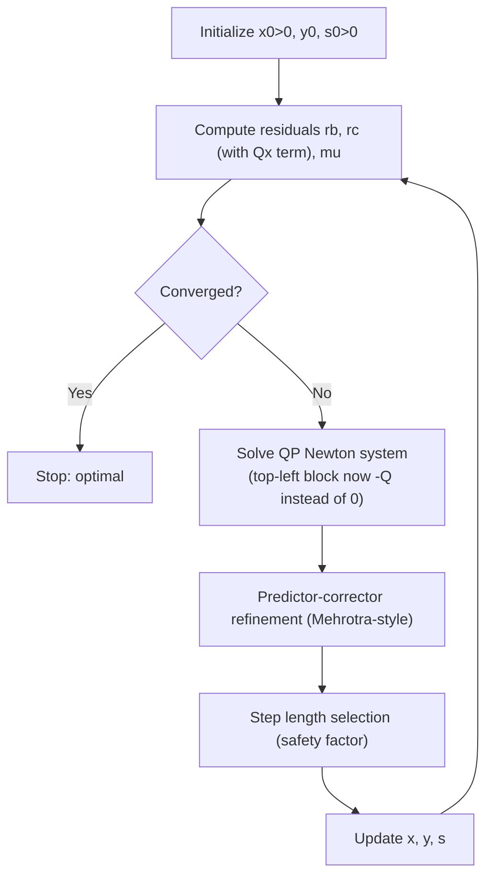

## Interior-Point Methods for Quadratic Programming

### Purpose and Motivation

The active-set session closed by noting the same simplex-vs-interior-point tradeoff established for LP recurs here: active-set methods can require many working-set changes on large-scale QPs, motivating an interior-point alternative. This session extends the barrier/central-path machinery from the LP interior-point sessions directly to convex QP — a generalization previewed explicitly in the QP formulation session's closing note, and one that turns out to require remarkably little new theory, since the log-barrier construction is agnostic to whether the objective is linear or quadratic.

### From LP Interior-Point to QP Interior-Point

**Recall the LP Barrier Problem**

$$\min \; c^Tx - \mu\sum_j \ln(x_j) \quad \text{s.t.} \quad Ax = b$$

**The QP Barrier Problem**

Replacing the linear objective with the quadratic one, and handling inequality constraints via the same log-barrier device:

$$\min \; \frac{1}{2}x^TQx + c^Tx - \mu\sum_j \ln(x_j) \quad \text{s.t.} \quad Ax = b$$

The structure is otherwise unchanged: as $\mu \to 0^+$, the barrier problem's minimizer traces a central path converging to the QP's optimal solution, exactly as in the LP case.

### The Perturbed KKT System for QP

Introducing dual variables $y$ (equality multipliers) and $s \geq 0$ (complementary to $x \geq 0$), the QP analog of the LP primal-dual KKT system is:

$$Qx + c - A^Ty - s = 0 \quad \text{(stationarity, quadratic gradient replacing linear } c\text{)}$$
$$Ax = b \quad \text{(primal feasibility)}$$
$$XS\mathbf{1} = \mu\mathbf{1} \quad \text{(perturbed complementarity, identical in form to LP)}$$
$$x, s > 0$$

**The Only Structural Change**

Comparing directly to the LP primal-dual KKT system from the earlier session: the dual-feasibility equation $A^Ty + s = c$ becomes $A^Ty + s = c + Qx$ — the quadratic term contributes an $x$-dependent shift to what was, in the LP case, a constant right-hand side. This single modification propagates through the rest of the algorithm.

### Newton System for QP Interior-Point

Linearizing the perturbed KKT system around a current iterate $(x, y, s)$, the Newton step $(\Delta x, \Delta y, \Delta s)$ solves:

$$\begin{pmatrix} -Q & A^T & I \\ A & 0 & 0 \\ S & 0 & X \end{pmatrix} \begin{pmatrix} \Delta x \\ \Delta y \\ \Delta s \end{pmatrix} = \begin{pmatrix} r_c \\ r_b \\ r_\mu \end{pmatrix}$$

where the residuals generalize directly from the LP case:

$$r_c = c + Qx - A^Ty - s, \qquad r_b = b - Ax, \qquad r_\mu = \mu\mathbf{1} - XS\mathbf{1}$$

**Comparison to the LP Newton System**

The LP primal-dual session's Newton system had a zero block in the top-left position; here that block is $-Q$. This is the *only* structural difference in the entire linear system — every other aspect (residual definitions, the diagonal blocks $S$ and $X$ in the third row) carries over unchanged. [Inference] This is a direct consequence of the stationarity condition's gradient: for a linear objective the gradient is the constant $c$ (contributing nothing to the Jacobian), while for a quadratic objective the gradient $Qx+c$ contributes $Q$ to the Jacobian — precisely the block that appears.

### Reduction via Elimination

As in the LP primal-dual session, the system is reduced algebraically rather than solved in full $(2n+m)$-dimensional form. Eliminating $\Delta s$ from the third row and substituting into the first yields a smaller system in $(\Delta x, \Delta y)$:

$$\begin{pmatrix} -(Q + X^{-1}S) & A^T \\ A & 0 \end{pmatrix}\begin{pmatrix}\Delta x \\ \Delta y\end{pmatrix} = \begin{pmatrix} r_c - X^{-1}r_\mu \\ r_b \end{pmatrix}$$

[Inference] Compared to the pure LP reduction (which used only the diagonal matrix $X^{-1}S$ in this position), the QP version's coefficient matrix additionally carries $Q$ — meaning the elegant diagonal-only normal-equations reduction available in LP (allowing a further reduction to a pure $\Delta y$ system via $AD^2A^T$) is not generally available for QP unless $Q$ itself has convenient structure (e.g., diagonal), since $Q + X^{-1}S$ is no longer diagonal in general. This system is instead typically solved via a symmetric indefinite factorization or a similar direct method suited to the resulting saddle-point structure.

### Algorithm Outline

**Step 1 — Initialization**: choose $(x^0, y^0, s^0)$ with $x^0, s^0 > 0$.

**Step 2 — Compute Residuals and Duality Measure**: $r_b, r_c$ (now including the $Qx$ term), and $\mu = (x^k)^Ts^k/n$.

**Step 3 — Convergence Check**: stop if residuals and $\mu$ are below tolerance.

**Step 4 — Predictor-Corrector Steps**: as in the LP primal-dual session, an affine-scaling predictor step followed by an adaptive-$\sigma$ corrector step (Mehrotra-style) is standard practice, using the QP-adjusted Newton system above in place of the LP one.

**Step 5 — Step Length and Update**: identical mechanics to the LP case — compute $\alpha^{\text{primal}}, \alpha^{\text{dual}}$ preserving strict positivity, update $(x,y,s)$, return to Step 2.

### Iteration Flow

### Convexity Requirement

Because the reduced Newton coefficient matrix's definiteness properties (needed for a well-posed, stable solve at each iteration) rely on $Q$ being positive semidefinite, [Inference] QP interior-point methods of this standard primal-dual form are generally only directly applicable to convex QP — for non-convex QP, the barrier subproblem itself may not have a well-defined minimizer in the same sense, and the resulting Newton system can lose the favorable structure (e.g., positive definiteness of the relevant Schur complement) that guarantees well-behaved, convergent steps. This mirrors the active-set method's own restriction to convex QP for its optimality guarantees, established in the earlier sessions.

### Comparison: Active-Set vs. Interior-Point for QP

| Aspect | Active-Set | Interior-Point |
|---|---|---|
| Path through feasible region | Along working-set boundary, generalizing simplex | Through the interior, generalizing LP interior-point |
| Convexity requirement for guarantees | Convex QP | Convex QP |
| Per-iteration cost | Solve equality-constrained KKT system for current working set | Solve Newton system (larger, includes $Q$ block) |
| Scalability with many constraints | Can require many working-set changes | Iteration count comparatively insensitive to constraint count |
| Warm-starting | Well-suited (especially for sequential QP) | Comparatively harder, as in the LP case |
| Typical use case | Small-to-medium QP, sequential QP subproblems | Large-scale, sparse convex QP |

This table is a direct structural echo of the LP simplex-vs-interior-point comparison from the complexity comparisons session, with active-set standing in for the simplex family.

### Applications Benefiting from Large-Scale QP Interior-Point

- **Large portfolio optimization problems**: with thousands of assets, the covariance matrix $Q = \Sigma$ is dense but the problem's scale favors interior-point's iteration-count insensitivity to constraint count over active-set's potentially many working-set changes.
- **Support vector machine training on large datasets**: the SVM dual QP's size grows with the number of training examples, and interior-point (or specialized decomposition methods built on similar principles) is often preferred at scale.
- **Model predictive control**: some real-time control applications solve a structured (often sparse, block-structured) convex QP at every control step, where interior-point methods exploiting the specific sparsity pattern are common.

### Relationship to Prior Session Topics

- This session is the direct QP analog of the primal-dual interior-point LP session, reusing its predictor-corrector algorithmic template with the single structural modification of the $-Q$ block in the Newton system.
- The convexity requirement connects to the convex-vs-nonconvex QP session's local-global theorem — both active-set and interior-point QP methods rely on the same convexity guarantee for correctness.
- The active-set vs. interior-point tradeoff table mirrors, almost line for line, the LP-family comparison from the computational complexity comparisons session earlier in this account's coverage.

### Related Topics

- Active-set methods for quadratic programming (prerequisite session — the alternative vertex-adjacent approach)
- Primal-dual interior-point algorithms for LP (direct algorithmic precursor)
- Convex versus non-convex quadratic programs (convexity requirement underlying this method)
- Sequential quadratic programming for general nonlinear optimization
- Semidefinite programming via interior-point methods (further generalization)
- Sparse linear system solvers for saddle-point systems (the QP Newton system's structural class)