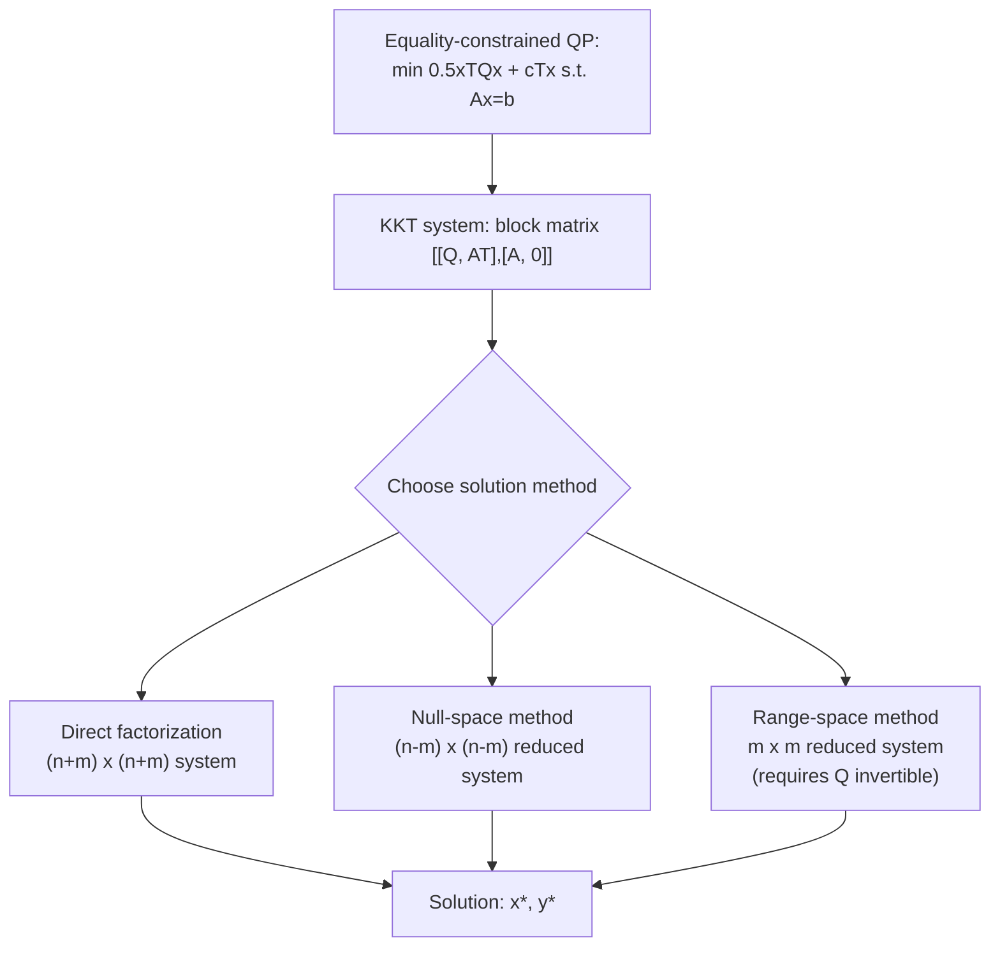

## Equality-Constrained Quadratic Programming via KKT Systems

### Purpose and Motivation

Both algorithmic methods covered so far for QP — active-set and interior-point — reduce, at their computational core, to repeatedly solving an equality-constrained QP subproblem via a KKT linear system. That system was introduced only briefly in each prior session as a component of a larger algorithm. This session isolates it as a subject in its own right: its exact structure, when and why it is solvable, and the numerical methods used to solve it efficiently — since the practical performance of both active-set and interior-point QP methods hinges almost entirely on how well this one recurring subproblem is handled.

### The Equality-Constrained QP

$$\min \; \frac{1}{2}x^TQx + c^Tx \quad \text{subject to} \quad Ax = b$$

with $Q$ symmetric ($n \times n$) and $A$ of size $m \times n$ (full row rank $m \leq n$ assumed, as with the LP standard-form conventions used throughout this series).

### Deriving the KKT System

**Lagrangian**

$$\mathcal{L}(x, y) = \frac{1}{2}x^TQx + c^Tx - y^T(Ax - b)$$

**Stationarity Condition**

$$\nabla_x \mathcal{L} = Qx + c - A^Ty = 0$$

**Primal Feasibility**

$$\nabla_y \mathcal{L} = -(Ax - b) = 0 \implies Ax = b$$

**Combined System**

$$\begin{pmatrix} Q & A^T \\ A & 0 \end{pmatrix}\begin{pmatrix} x^* \\ y^* \end{pmatrix} = \begin{pmatrix} -c \\ b \end{pmatrix}$$

This $(n+m) \times (n+m)$ system — referred to as the **KKT matrix** or, in the numerical linear algebra literature, a **saddle-point system** due to its characteristic block structure — is exactly the system introduced in the active-set session and reappearing (with modification) in the QP interior-point session.

### Conditions for a Unique Solution

The KKT matrix is nonsingular — guaranteeing a unique solution $(x^*, y^*)$ — under the following standard sufficient condition:

$$A \text{ has full row rank}, \quad \text{and} \quad Z^TQZ \text{ is positive definite}$$

where $Z$ is any matrix whose columns form a basis for the null space of $A$ (i.e., $AZ = 0$). This condition — positive definiteness of $Q$ restricted to the constraint's null space, sometimes called **reduced Hessian positive definiteness** — is notably *weaker* than requiring $Q$ itself to be positive definite over the whole space.

[Inference] This distinction matters in practice: a $Q$ that is indefinite over $\mathbb{R}^n$ can still yield a well-posed, uniquely solvable equality-constrained QP subproblem, provided the indefinite directions of $Q$ are not reachable within the constraint's feasible directions (the null space of $A$) — meaning the equality constraints themselves can "tame" an otherwise non-convex-looking $Q$ for the purposes of this particular subproblem, though this does not make the original inequality-constrained QP convex in general.

### Solution Methods

**Method 1 — Direct Factorization of the Full KKT System**

Factorize the $(n+m)\times(n+m)$ symmetric indefinite matrix directly, typically via a symmetric indefinite ($LDL^T$-type) factorization suited to saddle-point structure (the matrix is generally indefinite even when $Q$ is positive definite, due to the zero block), rather than a standard Cholesky factorization which requires positive definiteness.

**Method 2 — The Null-Space (Range-Space) Method**

Using the null-space basis $Z$ introduced above, decompose any feasible $x$ as $x = x_p + Zv$ for a particular solution $x_p$ (satisfying $Ax_p = b$) and free variable $v$ ranging over the null space. Substituting into the objective eliminates the constraint entirely:

$$\min_v \; \frac{1}{2}(x_p+Zv)^TQ(x_p+Zv) + c^T(x_p+Zv)$$

This reduces to an **unconstrained** quadratic minimization in $v$, solvable via the smaller system:

$$(Z^TQZ)v^* = -Z^T(Qx_p + c)$$

[Inference] This method is often preferred when $m$ (number of constraints) is small relative to $n$, since the null-space dimension $n-m$ can make this reduced system substantially smaller than the full KKT system — though computing $Z$ itself (typically via a QR factorization of $A^T$) carries its own cost that must be weighed against the savings.

**Method 3 — The Range-Space (Schur Complement) Method**

When $Q$ is positive definite (invertible), eliminate $x^* = Q^{-1}(A^Ty^* - c)$ from the stationarity condition and substitute into primal feasibility, yielding a smaller system purely in $y^*$:

$$(AQ^{-1}A^T)y^* = AQ^{-1}c + b$$

This is the QP-specific analog of the normal-equations reduction used in LP's revised simplex and interior-point sessions. [Inference] This method is efficient specifically when $Q$ has an easily invertible or well-structured form (e.g., diagonal, or block-diagonal), since it requires solving with $Q$ (or having $Q^{-1}$ available) as a subroutine; it becomes considerably less attractive when $Q$ is dense and large, unlike the null-space method which avoids inverting $Q$ altogether.

### Comparison of Solution Methods

| Method | System Size Solved | Best Suited When | Key Requirement |
|---|---|---|---|
| Direct KKT factorization | $(n+m)\times(n+m)$ | General-purpose; no special structure assumed | Symmetric indefinite factorization support |
| Null-space method | $(n-m)\times(n-m)$ | Few constraints relative to variables ($m \ll n$) | Computing null-space basis $Z$ (e.g., via QR) |
| Range-space (Schur complement) | $m \times m$ | Few constraints, and $Q$ easily invertible/structured | $Q$ positive definite and efficiently invertible |

### Worked Example

**Problem**

$$\min \; \frac{1}{2}(x_1^2+x_2^2) \quad \text{s.t.} \quad x_1+x_2=4$$

Here $Q=I$, $c=0$, $A=(1 \; 1)$, $b=4$.

**KKT System**

$$\begin{pmatrix} 1 & 0 & 1 \\ 0 & 1 & 1 \\ 1 & 1 & 0\end{pmatrix}\begin{pmatrix}x_1^*\\x_2^*\\y^*\end{pmatrix} = \begin{pmatrix}0\\0\\4\end{pmatrix}$$

**Solving via Range-Space Method (Q = I is trivially invertible)**

$$AQ^{-1}A^T = (1\;1)\begin{pmatrix}1&0\\0&1\end{pmatrix}\begin{pmatrix}1\\1\end{pmatrix} = 2$$

$$y^* = \frac{b}{2} = \frac{4}{2} = 2$$

Recovering $x^*$: $x^* = Q^{-1}A^Ty^* = \begin{pmatrix}1\\1\end{pmatrix}(2) = \begin{pmatrix}2\\2\end{pmatrix}$

**Verification**: $x_1^*+x_2^*=2+2=4$ ✓, matching the constraint exactly, and by symmetry of the objective (equal weighting on $x_1,x_2$), splitting the constrained total evenly is intuitively the minimum-norm solution — consistent with $(2,2)$.

### System Structure Visualization

### Relationship to Prior Session Topics

- This is precisely the subproblem solved at every active-set iteration (using the current working set as $A$) — the active-set session referenced this system without deriving its solvability condition or comparing solution methods, both supplied here.
- The QP interior-point session's Newton system is a direct generalization: replacing $Q$ with $Q + X^{-1}S$ (a positive semidefinite addition when $x,s>0$) actually *improves* the conditioning relative to this session's pure equality-constrained case, since the added diagonal term pushes the block further toward positive definiteness.
- The range-space method's $AQ^{-1}A^T$ formula is the direct QP analog of the LP revised-simplex normal-equations reduction $AD^2A^T$ from the primal-dual interior-point session, with $Q^{-1}$ playing the role there occupied by the diagonal scaling matrix $D^2$.

### Related Topics

- Active-set methods for quadratic programming (primary consumer of this subproblem)
- Interior-point methods for quadratic programming (uses a closely related, augmented version of this system)
- Saddle-point linear systems and their numerical solution in broader scientific computing
- Reduced Hessian methods in nonlinear programming
- QR and Cholesky factorization techniques for structured linear systems
- Sequential quadratic programming (relies on repeatedly solving this exact subproblem type)