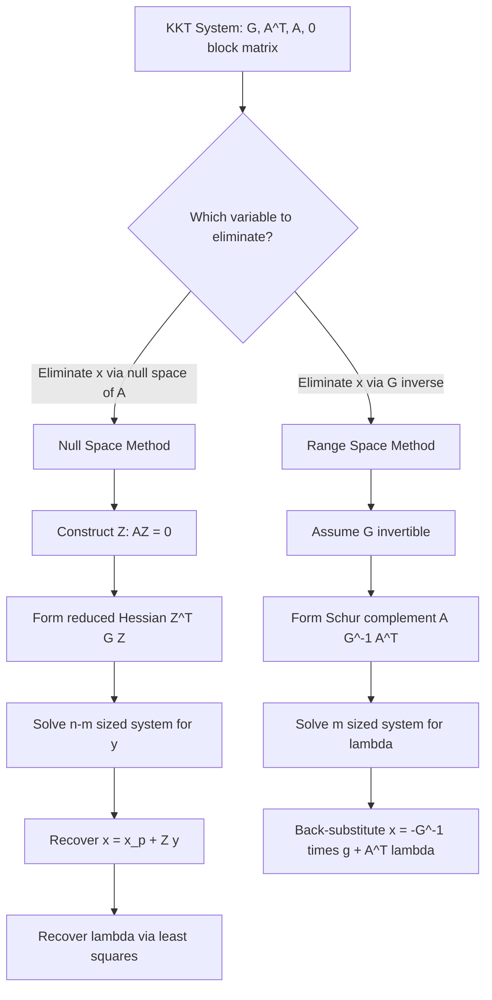

## Quadratic Programming — Range Space and Null Space Methods

### Problem Setup

Consider the equality-constrained quadratic program (QP):

$$\min_{x \in \mathbb{R}^n} \quad \frac{1}{2}x^T G x + g^T x \quad \text{subject to} \quad A x = b$$

where $G \in \mathbb{R}^{n \times n}$ is symmetric, $A \in \mathbb{R}^{m \times n}$ has full row rank $m < n$, $g \in \mathbb{R}^n$, and $b \in \mathbb{R}^m$.

The first-order optimality (KKT) conditions state that a solution $x^*$ paired with a multiplier vector $\lambda^*$ satisfies:

$$\begin{bmatrix} G & A^T \\ A & 0 \end{bmatrix} \begin{bmatrix} x^* \\ \lambda^* \end{bmatrix} = \begin{bmatrix} -g \\ b \end{bmatrix}$$

This is the **KKT system**. Both range space and null space methods are strategies for solving this indefinite linear system more efficiently than direct factorization of the full $(n+m) \times (n+m)$ matrix, by exploiting the block structure.

### Why Not Solve the KKT System Directly

The KKT matrix is symmetric but indefinite (it has both positive and negative eigenvalues whenever $G$ is positive definite on the relevant subspace), so standard Cholesky factorization cannot be applied directly to the full system. Direct approaches require symmetric indefinite factorizations (e.g., Bunch-Kaufman), which are more expensive and less numerically transparent than exploiting problem structure. Range space and null space methods reduce the problem to smaller, better-conditioned systems by eliminating either $x$ or $\lambda$ first.

### Null Space Method

**Key Points**

The null space method exploits a basis for the null space of $A$. Since $Ax = b$ is a linear manifold, any feasible $x$ can be written as:

$$x = x_p + Z y$$

where $x_p$ is any particular solution satisfying $A x_p = b$, $Z \in \mathbb{R}^{n \times (n-m)}$ is a matrix whose columns span the null space of $A$ (so $AZ = 0$), and $y \in \mathbb{R}^{n-m}$ is a free reduced variable.

Substituting into the objective eliminates the constraint entirely, converting the problem into an unconstrained QP in $y$:

$$\min_y \quad \frac{1}{2}(x_p + Zy)^T G (x_p + Zy) + g^T(x_p + Zy)$$

Expanding and dropping constant terms yields:

$$\min_y \quad \frac{1}{2} y^T (Z^T G Z) y + (Z^T(Gx_p + g))^T y$$

**Reduced Hessian**

The matrix $Z^T G Z \in \mathbb{R}^{(n-m)\times(n-m)}$ is called the **reduced Hessian**. If $Z^T G Z$ is positive definite, this reduced problem has a unique minimizer obtainable by solving the symmetric positive definite linear system:

$$(Z^T G Z) y^* = -Z^T(Gx_p + g)$$

This can be solved via Cholesky factorization, which is both cheap and numerically stable. Once $y^*$ is found, recover $x^* = x_p + Z y^*$. The multiplier $\lambda^*$ can then be recovered from the stationarity equation $G x^* + g + A^T \lambda^* = 0$ by solving a least-squares problem, typically:

$$(AA^T)\lambda^* = A(-g - Gx^*)$$

**Computing the Null Space Basis**

$Z$ is commonly computed via:
- **QR factorization** of $A^T$: if $A^T = Q\begin{bmatrix} R \\ 0 \end{bmatrix}$, then the last $n-m$ columns of $Q$ form an orthonormal basis for $\text{null}(A)$. This is the numerically preferred approach.
- **Variable partitioning**: partition $A = [B \ \ N]$ where $B \in \mathbb{R}^{m\times m}$ is invertible (a basis matrix), then $Z = \begin{bmatrix} -B^{-1}N \\ I \end{bmatrix}$. This is cheaper but can be poorly conditioned if $B$ is nearly singular.

[Inference] The QR-based construction is generally preferred in production solvers because it yields an orthonormal $Z$, which improves the conditioning of the reduced Hessian relative to non-orthogonal partitioning schemes; the actual conditioning gain is problem-dependent.

**When to Prefer Null Space**

The null space method is most effective when:
- $m$ (number of constraints) is close to $n$, making $n - m$ small, so the reduced system is small.
- $G$ is only positive semidefinite or indefinite on $\mathbb{R}^n$ but positive definite on the null space of $A$ (a weaker and more common condition in practice).
- $G$ is not easily invertible or is singular.

### Range Space Method

**Key Points**

The range space method takes the opposite elimination path: it eliminates $x$ first (assuming $G$ is invertible, typically positive definite) and reduces the system to one purely in $\lambda \in \mathbb{R}^m$.

From the first block row of the KKT system:

$$Gx^* + A^T\lambda^* = -g \implies x^* = -G^{-1}(g + A^T \lambda^*)$$

Substituting into the constraint $Ax^* = b$:

$$A\left(-G^{-1}(g + A^T\lambda^*)\right) = b$$

$$-AG^{-1}g - AG^{-1}A^T \lambda^* = b$$

$$\left(AG^{-1}A^T\right)\lambda^* = -b - AG^{-1}g$$

**Reduced System**

The matrix $A G^{-1} A^T \in \mathbb{R}^{m \times m}$ is called the **Schur complement** (with respect to $G$). If $G$ is positive definite, $AG^{-1}A^T$ is symmetric positive definite (given $A$ full row rank), so this $m \times m$ system can be solved via Cholesky factorization:

$$(AG^{-1}A^T)\lambda^* = -(b + AG^{-1}g)$$

Once $\lambda^*$ is recovered, back-substitute:

$$x^* = -G^{-1}(g + A^T\lambda^*)$$

The name "range space" comes from the fact that the update to $\lambda$ effectively lies in a space related to the range of $A G^{-1} A^T$, and the method is dual in spirit — it resembles solving a dual problem in the multipliers.

**When to Prefer Range Space**

The range space method is most effective when:
- $m \ll n$ (few constraints relative to variables), making the reduced $m \times m$ system small and cheap.
- $G$ is diagonal, block-diagonal, or otherwise cheaply invertible (e.g., a sparse structure allowing fast solves with $G^{-1}$), since the method requires explicit or implicit solves with $G$.
- $G$ is positive definite on the whole space, not merely on the null space of $A$.

**Practical Computation Note**

In practice, $G^{-1}$ is rarely formed explicitly. Instead, $G^{-1}A^T$ is computed by solving $m$ linear systems $G v_i = a_i$ (one per row/column of $A^T$), often via a precomputed Cholesky factorization $G = LL^T$. This keeps cost manageable when $G$ is sparse and well-structured.

### Comparison of the Two Methods

| Aspect | Null Space Method | Range Space Method |
|---|---|---|
| Eliminates | $x$ via $Z$, reduces to $y$ | $\lambda$, reduces to $m \times m$ system |
| Reduced system size | $(n-m) \times (n-m)$ | $m \times m$ |
| Requires | Basis $Z$ for $\text{null}(A)$ | $G$ invertible (cheaply) |
| Best when | $m$ large (close to $n$) | $m$ small (few constraints) |
| Hessian requirement | PD on null space only | PD on full space |
| Main cost driver | Computing $Z$, factorizing $Z^TGZ$ | Solving with $G$, factorizing $AG^{-1}A^T$ |

**Choosing Between Them**

[Inference] The general heuristic — range space favored when $m \ll n$ and null space favored when $m$ close to $n$ — reflects the relative sizes of the reduced systems each produces; actual performance also depends on sparsity patterns and the cost of forming $Z$ or factorizing $G$, so real solvers may deviate from this heuristic based on structure.

### Structural Diagram

<svg xmlns="http://www.w3.org/2000/svg" viewBox="0 0 900 480" font-family="Helvetica, Arial, sans-serif">
  <text x="450" y="30" font-size="20" font-weight="bold" text-anchor="middle" fill="#1a1a1a">KKT System Decomposition Strategies (svg_diagram)</text>

  <rect x="30" y="60" width="840" height="70" rx="8" fill="#eef2ff" stroke="#4338ca" stroke-width="1.5" />
  <text x="450" y="90" font-size="16" text-anchor="middle" fill="#1a1a1a">KKT System:  [ G  Aᵀ ; A  0 ] [x; λ] = [-g; b]</text>
  <text x="450" y="115" font-size="13" text-anchor="middle" fill="#444">Symmetric, indefinite (n+m) × (n+m) system</text>

  <line x1="300" y1="130" x2="180" y2="170" stroke="#666" stroke-width="1.5" />
  <line x1="600" y1="130" x2="720" y2="170" stroke="#666" stroke-width="1.5" />

  <rect x="40" y="170" width="440" height="290" rx="8" fill="#f0fdf4" stroke="#15803d" stroke-width="1.5" />
  <text x="260" y="198" font-size="16" font-weight="bold" text-anchor="middle" fill="#15803d">Null Space Method</text>
  <text x="260" y="222" font-size="12.5" text-anchor="middle" fill="#333">Eliminate x using x = x_p + Zy</text>
  <text x="260" y="242" font-size="12.5" text-anchor="middle" fill="#333">where AZ = 0, Z spans null(A)</text>

  <rect x="70" y="258" width="380" height="42" rx="4" fill="#ffffff" stroke="#15803d" />
  <text x="260" y="283" font-size="12.5" text-anchor="middle" fill="#1a1a1a">(ZᵀGZ) y* = -Zᵀ(Gx_p + g)</text>

  <text x="260" y="322" font-size="12" text-anchor="middle" fill="#333">Reduced system size: (n−m) × (n−m)</text>
  <text x="260" y="342" font-size="12" text-anchor="middle" fill="#333">Requires: ZᵀGZ positive definite</text>
  <text x="260" y="362" font-size="12" text-anchor="middle" fill="#333">Best when: m close to n</text>

  <rect x="70" y="382" width="380" height="58" rx="4" fill="#dcfce7" stroke="#15803d" stroke-dasharray="3,3" />
  <text x="260" y="404" font-size="12" text-anchor="middle" fill="#14532d">Basis Z via QR of Aᵀ (preferred)</text>
  <text x="260" y="424" font-size="12" text-anchor="middle" fill="#14532d">or variable partition [B N] → Z=[-B⁻¹N; I]</text>

  <rect x="420" y="170" width="440" height="290" rx="8" fill="#fff7ed" stroke="#c2410c" stroke-width="1.5" />
  <text x="640" y="198" font-size="16" font-weight="bold" text-anchor="middle" fill="#c2410c">Range Space Method</text>
  <text x="640" y="222" font-size="12.5" text-anchor="middle" fill="#333">Eliminate x using x = -G⁻¹(g + Aᵀλ)</text>
  <text x="640" y="242" font-size="12.5" text-anchor="middle" fill="#333">substitute into Ax = b</text>

  <rect x="450" y="258" width="380" height="42" rx="4" fill="#ffffff" stroke="#c2410c" />
  <text x="640" y="283" font-size="12.5" text-anchor="middle" fill="#1a1a1a">(AG⁻¹Aᵀ) λ* = -(b + AG⁻¹g)</text>

  <text x="640" y="322" font-size="12" text-anchor="middle" fill="#333">Reduced system size: m × m</text>
  <text x="640" y="342" font-size="12" text-anchor="middle" fill="#333">Requires: G positive definite (full space)</text>
  <text x="640" y="362" font-size="12" text-anchor="middle" fill="#333">Best when: m much less than n</text>

  <rect x="450" y="382" width="380" height="58" rx="4" fill="#ffedd5" stroke="#c2410c" stroke-dasharray="3,3" />
  <text x="640" y="404" font-size="12" text-anchor="middle" fill="#7c2d12">G⁻¹Aᵀ via m solves with Cholesky G=LLᵀ</text>
  <text x="640" y="424" font-size="12" text-anchor="middle" fill="#7c2d12">then back-substitute for x*</text>
</svg>

### Worked Example

**Example**

Consider $n = 3$, $m = 1$:

$$G = \begin{bmatrix} 2 & 0 & 0 \\ 0 & 2 & 0 \\ 0 & 0 & 2 \end{bmatrix}, \quad g = \begin{bmatrix} -2 \\ -5 \\ -3 \end{bmatrix}, \quad A = \begin{bmatrix} 1 & 1 & 1 \end{bmatrix}, \quad b = \begin{bmatrix} 1 \end{bmatrix}$$

**Range space approach** (since $m=1 \ll n=3$, and $G$ is trivially invertible):

$G^{-1} = \frac{1}{2}I$, so:

$$AG^{-1}A^T = \frac{1}{2}(1+1+1) = \frac{3}{2}$$

$$AG^{-1}g = \frac{1}{2}(-2-5-3) = -5$$

Solve the $1\times 1$ system:

$$\frac{3}{2}\lambda^* = -1 - (-5) = 4 \implies \lambda^* = \frac{8}{3}$$

Back-substitute:

$$x^* = -\frac{1}{2}\left(g + A^T\lambda^*\right) = -\frac{1}{2}\begin{bmatrix} -2 + 8/3 \\ -5 + 8/3 \\ -3 + 8/3 \end{bmatrix} = -\frac{1}{2}\begin{bmatrix} 2/3 \\ -7/3 \\ -1/3 \end{bmatrix} = \begin{bmatrix} -1/3 \\ 7/6 \\ 1/6 \end{bmatrix}$$

**Output**

$$x^* = \left(-\tfrac{1}{3}, \ \tfrac{7}{6}, \ \tfrac{1}{6}\right), \qquad \lambda^* = \tfrac{8}{3}$$

Verification: $Ax^* = -1/3 + 7/6 + 1/6 = -2/6 + 7/6 + 1/6 = 6/6 = 1 = b$. ✓ Constraint satisfied.

This example was intentionally chosen with $m=1$ to favor range space; had $m$ been $2$ (i.e., $n-m=1$), the null space method's reduced system would instead have collapsed to a scalar problem, illustrating the size trade-off directly.

### Numerical and Implementation Considerations

- **Conditioning**: The condition number of $AG^{-1}A^T$ (range space) or $Z^TGZ$ (null space) governs the numerical stability of the Cholesky solve. Ill-conditioned $A$ or $G$ can degrade accuracy in either approach. [Inference] Orthonormal null-space bases generally provide better-conditioned reduced Hessians than non-orthogonal partitioning, though the actual improvement is problem-specific.
- **Sparsity**: Range space methods are attractive when $G$ is sparse and diagonal/block-diagonal (common in many engineering and control formulations), since $G^{-1}$ solves are then cheap. Null space methods depend on the sparsity of $A$ influencing how cheaply $Z$ can be constructed and how sparse $Z^TGZ$ turns out to be — the latter can become dense even for sparse $A$ and $G$, which is a known drawback in large-scale settings.
- **Semidefinite $G$**: If $G$ is only positive semidefinite (singular), the range space method fails outright since $G^{-1}$ does not exist; the null space method can still succeed provided $Z^TGZ$ is positive definite on the null space, which is a substantially weaker requirement.
- **Iterative solves**: For very large-scale problems, both reduced systems ($AG^{-1}A^T$ or $Z^TGZ$) may be solved iteratively (e.g., via conjugate gradients) rather than by direct factorization, particularly when forming these matrices explicitly is prohibitive. [Inference] This is a standard extension used in large-scale QP solvers, though specific solver choices vary by implementation.

### Flow of the Two Methods

### Conclusion

Range space and null space methods both solve the equality-constrained QP KKT system by reducing it to a smaller, definite linear system rather than factorizing the full indefinite system directly. The range space method eliminates the primal variable using $G^{-1}$ and solves an $m \times m$ system in the multipliers, making it efficient when there are few constraints and $G$ is easily invertible. The null space method eliminates the primal variable using a basis for $\text{null}(A)$ and solves an $(n-m)\times(n-m)$ system, making it efficient when there are many constraints or when $G$ is not positive definite over the full space. The choice between them in practice hinges on problem dimensions, sparsity structure, and the definiteness properties of $G$.

**Related Topics**
- Active-set methods for inequality-constrained QP
- Interior-point methods for QP
- KKT conditions and second-order sufficiency for constrained optimization
- Schur complement theory and its role in saddle-point systems
- Sparse Cholesky and LDLᵀ factorization for indefinite systems
- Sequential Quadratic Programming (SQP) and its use of QP subproblems
- Conjugate gradient methods for constrained/projected optimization
- Lagrangian duality and dual QP formulations