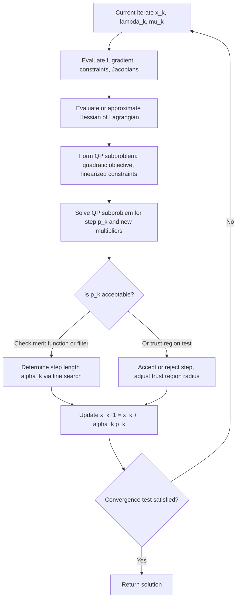

## Sequential Quadratic Programming — Subproblems

### Problem Setup

Consider the general nonlinear constrained optimization problem:

$$\min_{x \in \mathbb{R}^n} \quad f(x) \quad \text{subject to} \quad c_i(x) = 0, \ i \in \mathcal{E}, \quad c_j(x) \geq 0, \ j \in \mathcal{I}$$

where $f: \mathbb{R}^n \to \mathbb{R}$ and the constraint functions $c_i, c_j$ are twice continuously differentiable, $\mathcal{E}$ indexes equality constraints, and $\mathcal{I}$ indexes inequality constraints.

Sequential Quadratic Programming (SQP) solves this problem by generating a sequence of iterates $x_k$, at each of which a **quadratic programming subproblem** is formed and solved to produce a step $p_k$. The core idea is to model the nonlinear problem locally, at the current iterate, with a quadratic objective and linearized constraints — reusing the machinery of QP (including range space and null space methods) at every iteration.

### Motivation: From Newton's Method to SQP

**Key Points**

SQP can be understood as applying Newton's method to the KKT (first-order optimality) conditions of the nonlinear program. For the equality-constrained case, the Lagrangian is:

$$\mathcal{L}(x, \lambda) = f(x) - \lambda^T c(x)$$

with $c(x) = (c_i(x))_{i \in \mathcal{E}}$. The KKT conditions require:

$$\nabla_x \mathcal{L}(x, \lambda) = \nabla f(x) - A(x)^T \lambda = 0, \qquad c(x) = 0$$

where $A(x) = \nabla c(x)$ is the Jacobian of the constraints. Applying Newton's method to this nonlinear system of equations in $(x, \lambda)$, and evaluating derivatives at the current iterate $(x_k, \lambda_k)$, produces exactly the KKT system of a QP:

$$\begin{bmatrix} \nabla^2_{xx}\mathcal{L}(x_k,\lambda_k) & -A(x_k)^T \ A(x_k) & 0 \end{bmatrix} \begin{bmatrix} p_k \ \lambda_{k+1} \end{bmatrix} = \begin{bmatrix} -\nabla f(x_k) + A(x_k)^T \lambda_k \ -c(x_k) \end{bmatrix}$$

This identity is the central justification for SQP: solving a single Newton step on the KKT conditions is equivalent to solving a specific QP subproblem, so at each outer iteration SQP forms and solves that QP instead of solving the Newton system directly.

### The QP Subproblem (Equality-Constrained Case)

At iterate $x_k$ with multiplier estimate $\lambda_k$, the SQP subproblem is:

$$\min_{p \in \mathbb{R}^n} \quad \nabla f(x_k)^T p + \frac{1}{2} p^T \nabla^2_{xx}\mathcal{L}(x_k, \lambda_k), p$$ $$\text{subject to} \quad c_i(x_k) + \nabla c_i(x_k)^T p = 0, \quad i \in \mathcal{E}$$

**Interpretation of terms**:

- The objective is a **quadratic model** of $f$ built from its gradient at $x_k$ and the Hessian of the Lagrangian (not the Hessian of $f$ alone) — using $\nabla^2_{xx}\mathcal{L}$ correctly accounts for the curvature of the constraints.
- The constraint is a **first-order (linear) Taylor expansion** of each $c_i$ around $x_k$, requiring the step $p$ to move onto (or towards) the linearized constraint surface.

Solving this QP yields a step $p_k$ and a new multiplier estimate $\lambda_{k+1}$ (the QP's own Lagrange multiplier for its linear constraints becomes the updated multiplier for the outer nonlinear problem). The iterate is updated as:

$$x_{k+1} = x_k + \alpha_k p_k$$

where $\alpha_k$ is a step length (often $\alpha_k = 1$ near a solution, or determined by a line search / merit function further from it).

### The QP Subproblem (Inequality-Constrained Case)

**Key Points**

When inequality constraints are present, the SQP subproblem also linearizes them and preserves their inequality sense:

$$\min_{p \in \mathbb{R}^n} \quad \nabla f(x_k)^T p + \frac{1}{2} p^T \nabla^2_{xx}\mathcal{L}(x_k,\lambda_k,\mu_k), p$$ $$\text{subject to} \quad c_i(x_k) + \nabla c_i(x_k)^T p = 0, \quad i \in \mathcal{E}$$ $$c_j(x_k) + \nabla c_j(x_k)^T p \geq 0, \quad j \in \mathcal{I}$$

This is now an **inequality-constrained QP**, which itself must be solved by an active-set method or interior-point method (these are complete sub-algorithms in their own right, each iteration of the outer SQP loop invoking one). The active set found by the QP solver at the solution of the subproblem serves as a prediction of which inequality constraints are active at the solution of the original nonlinear program — this is why SQP is sometimes described as having an active-set-identification property.

The Lagrange multipliers $\mu_{k+1}$ associated with the QP's inequality constraints become the updated multiplier estimates $\mu_k \to \mu_{k+1}$ for the nonlinear inequalities.

### Structure of a Single SQP Iteration

### Role of the Hessian of the Lagrangian

**Key Points**

The subproblem's quadratic term $\nabla^2_{xx}\mathcal{L}$ is critical to getting the correct (Newton-like) step. Several practical strategies exist for obtaining or approximating this Hessian:

- **Exact Hessian**: Compute $\nabla^2 f(x_k) - \sum_i \lambda_i \nabla^2 c_i(x_k)$ directly. This gives full second-order (locally quadratic) convergence near a solution but requires second derivatives of all constraints, which may be expensive or unavailable.
- **Quasi-Newton approximations**: Most practical SQP implementations use BFGS or SR1 updates to build an approximation $B_k \approx \nabla^2_{xx}\mathcal{L}$, updated using the change in the Lagrangian's gradient between iterates rather than $f$'s gradient alone. This avoids second-derivative computation at the cost of superlinear (rather than quadratic) local convergence.
- **Gauss-Newton approximations**: For least-squares-structured objectives, a Gauss-Newton-style approximation to the Hessian can be used, dropping second-order constraint curvature terms.

[Inference] In practice, quasi-Newton (particularly damped BFGS) approximations are the most common choice in general-purpose SQP solvers because they avoid the cost and potential unavailability of exact second derivatives while retaining strong empirical convergence behavior; the specific update formula and damping strategy vary by implementation.

**Ensuring a Well-Posed Subproblem**

If $B_k$ (the approximate or exact Hessian) is not positive definite on the null space of the active constraint Jacobian, the QP subproblem may be unbounded below or may not have a unique solution. Common remedies include:

- Modifying $B_k$ (e.g., adding a multiple of the identity) to enforce positive definiteness.
- Using a trust-region framework instead of a line search, which bounds $|p|$ and remains well-posed even for indefinite $B_k$.
- Damped BFGS updates specifically designed to preserve positive definiteness of $B_k$ automatically.

### Inconsistent Linearized Constraints

**Key Points**

A structural difficulty specific to inequality-constrained SQP subproblems is that the linearized constraint set:

$${p : c_i(x_k) + \nabla c_i(x_k)^T p = 0,\ i \in \mathcal{E}; \ c_j(x_k) + \nabla c_j(x_k)^T p \geq 0,\ j \in \mathcal{I}}$$

can be **infeasible**, even though the original nonlinear feasible region is nonempty — linearization can locally "cut off" the feasible region. Standard remedies include:

- **Elastic/relaxation formulations**: introduce slack variables that penalize constraint violation in the subproblem's objective, so the QP always has a feasible (possibly infeasible-in-original-sense but solvable) point.
- **$\ell_1$ or $\ell_\infty$ penalty-based SQP (SLQP)**: reformulate infeasibility as an exact penalty term added to the QP objective.
- **Trust-region SQP with filter methods**: shrink the trust region and re-linearize, or use a filter that accepts steps balancing constraint violation against objective decrease rather than requiring exact feasibility of the linearization at each step.

[Inference] Which remedy is used is highly solver-dependent — general-purpose codes such as those using filter-SQP or interior-point-inspired damping choose different strategies, and behavior in edge cases (e.g., persistent local infeasibility of the linearization) can vary accordingly.

### Merit Functions and Globalization

**Key Points**

Because the pure Newton-like step from the QP subproblem is only guaranteed to work well **locally** (near a solution), SQP methods need a **globalization strategy** to ensure convergence from arbitrary starting points. The subproblem provides a candidate direction $p_k$; a merit function then decides whether (and how far) to move along it.

A common choice is the $\ell_1$ merit function:

$$\phi_1(x; \rho) = f(x) + \rho \sum_{i \in \mathcal{E}} |c_i(x)| + \rho \sum_{j \in \mathcal{I}} \max(0, -c_j(x))$$

where $\rho > 0$ is a penalty parameter balancing objective decrease against constraint violation. The step length $\alpha_k$ is chosen (e.g., via backtracking line search) to achieve sufficient decrease in $\phi_1$. An alternative, avoiding the need to tune $\rho$, is the **filter method**, which accepts a trial point if it improves either the objective or the constraint violation measure relative to previously visited points, in a Pareto sense.

[Inference] The Maratos effect — a known phenomenon where the merit function rejects good, fast-converging steps near the solution purely due to curvature in the constraints — is a recognized weakness of naive line-search $\ell_1$-merit SQP; different solvers address it differently (e.g., second-order correction steps), and susceptibility depends on the specific implementation and problem.

### Worked Example

**Example**

Minimize $f(x_1,x_2) = x_1^2 + x_2^2$ subject to $c(x) = x_1 + x_2 - 1 = 0$.

At $x_k = (0, 0)$, $\lambda_k = 0$:

- $\nabla f(x_k) = (0, 0)^T$
- $\nabla^2_{xx}\mathcal{L} = \nabla^2 f = \begin{bmatrix} 2 & 0 \ 0 & 2 \end{bmatrix}$ (since $c$ is linear, it contributes no curvature)
- $c(x_k) = -1$, $\nabla c(x_k) = (1, 1)^T$

The QP subproblem is:

$$\min_p \quad \frac{1}{2}p^T \begin{bmatrix} 2 & 0 \ 0 & 2 \end{bmatrix} p \quad \text{subject to} \quad -1 + p_1 + p_2 = 0$$

Using the KKT conditions for this small QP:

$$\begin{bmatrix} 2 & 0 & -1 \ 0 & 2 & -1 \ 1 & 1 & 0 \end{bmatrix} \begin{bmatrix} p_1 \ p_2 \ \lambda \end{bmatrix} = \begin{bmatrix} 0 \ 0 \ 1 \end{bmatrix}$$

From the first two rows: $p_1 = \lambda/2$, $p_2 = \lambda/2$. Substituting into the third: $\lambda/2 + \lambda/2 = 1 \implies \lambda = 1$, so $p_1 = p_2 = 1/2$.

**Output**

$$p_k = (0.5,\ 0.5), \qquad \lambda_{k+1} = 1$$

$$x_{k+1} = x_k + p_k = (0.5,\ 0.5)$$

Checking: $c(x_{k+1}) = 0.5+0.5-1 = 0$ — feasible, and this is in fact the exact global solution to the original problem, reached in a single SQP step because $f$ and $c$ are both quadratic/linear (so the local quadratic model is exact).

### Convergence Behavior

**Key Points**

- With the **exact** Hessian of the Lagrangian and a well-posed subproblem, SQP exhibits **local quadratic convergence** near a solution satisfying second-order sufficient conditions and strict complementarity, mirroring Newton's method.
- With **quasi-Newton** Hessian approximations, convergence is typically **superlinear**, not quadratic, though still fast in practice.
- **Global convergence** (from arbitrary starting points) depends entirely on the globalization strategy (merit function / line search or trust region); the QP subproblem alone only characterizes the local step, not the overall convergence guarantee.

[Inference] Empirically, well-implemented SQP methods are considered particularly effective for problems with a moderate number of variables and constraints where constraint gradients are exact and not too expensive to compute; performance on very large-scale problems is more implementation- and structure-dependent, since forming and solving the QP subproblem repeatedly can dominate cost.

### Comparison: SQP Subproblem vs. Standalone QP

|Aspect|Standalone QP (Topic prior)|SQP Subproblem|
|---|---|---|
|Objective|Fixed quadratic $\frac12 x^TGx + g^Tx$|Local quadratic model of $f$, re-linearized every iteration|
|Constraints|Fixed linear constraints|Linearization of nonlinear constraints at $x_k$, changes each iteration|
|Hessian used|Given problem data $G$|$\nabla^2_{xx}\mathcal{L}$ or its approximation, updated each iteration|
|Solved|Once|Repeatedly, once per outer SQP iteration|
|Output used for|Final solution directly|A step $p_k$ combined with a globalization strategy|

### Conclusion

The SQP subproblem is the mechanism by which a general nonlinear constrained optimization problem is reduced, at each iteration, to a QP that can be solved with the range space, null space, active-set, or interior-point methods developed for quadratic programming. The subproblem arises naturally as a single Newton step on the KKT conditions of the nonlinear problem, using the Hessian of the Lagrangian (exact or approximated) as the quadratic term and a linearization of the constraints as the feasible region. Careful handling of Hessian positive-definiteness, potential infeasibility of the linearized constraints, and globalization via merit functions or trust regions are what elevate the basic subproblem idea into a robust, practical algorithm.

**Related Topics**

- Line search and trust-region globalization strategies for SQP
- BFGS and damped BFGS updates for the Hessian of the Lagrangian
- Filter methods and the Maratos effect
- Interior-point methods for nonlinear programming
- Active-set methods for inequality-constrained QP
- Constraint qualification and second-order sufficient conditions
- Merit functions: $\ell_1$, $\ell_2$, and augmented Lagrangian variants
- Trust-region SQP (e.g., SLQP and composite-step methods)