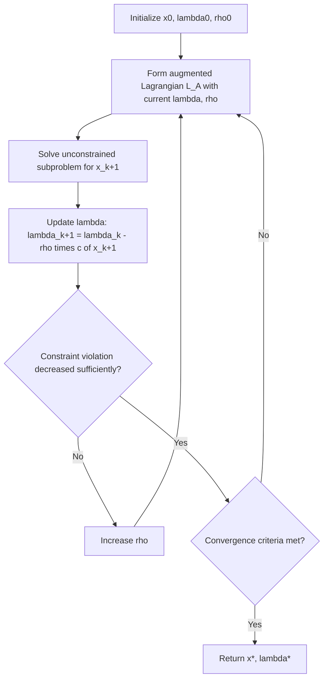

## Augmented Lagrangian Methods

### Motivation

**Key Points**

Augmented Lagrangian methods were developed to combine the practical simplicity of penalty methods (converting a constrained problem into a sequence of simpler subproblems) with better numerical behavior than the pure quadratic penalty. Recall two prior weaknesses:

- The **quadratic penalty method** requires $\rho \to \infty$ to achieve exact feasibility, and this drives the Hessian of the penalized objective to become severely ill-conditioned.
- The **exact ($\ell_1$) penalty method** achieves feasibility at finite $\rho$, but is non-smooth, complicating direct use of standard smooth unconstrained solvers.

The augmented Lagrangian method resolves both issues simultaneously: it achieves exact feasibility at a **finite, often modest** penalty parameter, while remaining **smooth** (twice continuously differentiable when $f$ and $c$ are), by combining the quadratic penalty term with an explicit Lagrange multiplier term that is updated alongside $x$.

### The Augmented Lagrangian Function (Equality-Constrained Case)

For the equality-constrained problem:

$$\min_{x} \quad f(x) \quad \text{subject to} \quad c_i(x) = 0,\ i \in \mathcal{E}$$

the augmented Lagrangian is defined as:

$$\mathcal{L}_A(x,\lambda;\rho) = f(x) - \lambda^T c(x) + \frac{\rho}{2}\|c(x)\|^2$$

This is precisely the ordinary Lagrangian $f(x) - \lambda^Tc(x)$ plus the quadratic penalty term $\frac{\rho}{2}\|c(x)\|^2$. It can equivalently be viewed as the quadratic penalty function applied to a *shifted* Lagrangian, or as the ordinary Lagrangian regularized by a penalty that vanishes on the feasible set.

**Key structural insight**: at the true solution $(x^*, \lambda^*)$, both the ordinary Lagrangian stationarity condition and the penalty term's contribution align, so that:

$$\nabla_x \mathcal{L}_A(x^*,\lambda^*;\rho) = \nabla f(x^*) - A(x^*)^T\lambda^* + \rho A(x^*)^Tc(x^*) = \nabla f(x^*) - A(x^*)^T\lambda^* = 0$$

(using $c(x^*)=0$), which is exactly the KKT stationarity condition — and this holds for **any** $\rho \geq 0$, not just in the limit $\rho \to \infty$. This is the key structural difference from the pure quadratic penalty, where feasibility (and hence correct stationarity) only emerges asymptotically.

### Why a Finite ρ Suffices

**Key Points**

For the pure quadratic penalty $Q(x;\rho) = f(x) + \frac{\rho}{2}\|c(x)\|^2$, the minimizer satisfies $\nabla f(x) + \rho A(x)^Tc(x) = 0$, which can only match the true KKT condition $\nabla f(x^*) - A(x^*)^T\lambda^* = 0$ if $\rho\, c(x) \to -\lambda^*$ as $\rho \to \infty$ — requiring $c(x) \to 0$ at a very specific rate, forcing $\rho$ to grow unboundedly to enforce this.

In the augmented Lagrangian, the multiplier term $-\lambda^Tc(x)$ already supplies (an estimate of) $-\lambda^*$ directly, so the penalty term only needs to correct the **error** in that estimate, not carry the full burden of enforcing $c(x)=0$. As $\lambda \to \lambda^*$, the required $\rho$ to maintain exactness shrinks and can remain bounded — this is the central mechanism by which the augmented Lagrangian avoids the severe ill-conditioning that plagues the pure quadratic penalty.

### Algorithm: Method of Multipliers

**Key Points**

The classical algorithm built on this function is known as the **method of multipliers**:

1. Choose initial $\lambda_0$, $\rho_0 > 0$, starting point $x_0^s$.
2. For $k = 0, 1, 2, \dots$:
   a. Solve (approximately) the unconstrained subproblem $x_{k+1} = \arg\min_x \mathcal{L}_A(x,\lambda_k;\rho_k)$, warm-started from $x_k$.
   b. Update the multiplier estimate using the **first-order multiplier update**:
   $$\lambda_{k+1} = \lambda_k - \rho_k\, c(x_{k+1})$$
   c. If constraint violation $\|c(x_{k+1})\|$ has not decreased sufficiently compared to the previous iteration, increase $\rho_{k+1} > \rho_k$ (e.g., $\rho_{k+1} = \gamma \rho_k$); otherwise, $\rho_{k+1} = \rho_k$ may be kept unchanged.
3. Stop when $\|c(x_{k+1})\|$ and the stationarity residual are sufficiently small.

**Derivation of the multiplier update**: at the minimizer $x_{k+1}$ of the subproblem, stationarity requires $\nabla f(x_{k+1}) - A(x_{k+1})^T\lambda_k + \rho_k A(x_{k+1})^Tc(x_{k+1}) = 0$, i.e., $\nabla f(x_{k+1}) - A(x_{k+1})^T(\lambda_k - \rho_k c(x_{k+1})) = 0$. Comparing to the KKT stationarity form $\nabla f - A^T\lambda = 0$ shows that $\lambda_k - \rho_kc(x_{k+1})$ is precisely the natural next multiplier estimate, giving the update in step (b).

### Convergence Behavior

**Key Points**

- If $\lambda_k$ is sufficiently close to $\lambda^*$, the method of multipliers can achieve fast local convergence **without** requiring $\rho \to \infty$; a fixed, moderate $\rho$ (larger than a problem-dependent threshold related to the Hessian of the Lagrangian) suffices for local convergence.
- If $\rho$ is too small relative to problem curvature, convergence can stall or fail; increasing $\rho$ when progress is insufficient (as in step 2c above) provides a practical safeguard.
- [Inference] Under standard regularity conditions (LICQ, second-order sufficiency), the method of multipliers exhibits linear convergence of $(x_k,\lambda_k)$ to $(x^*,\lambda^*)$ for fixed sufficiently large $\rho$, with the convergence factor shrinking as $\rho$ increases; the exact convergence rate and required threshold are problem-dependent and rely on bounds involving the Hessian of the Lagrangian at the solution.
- Because $\rho$ need not diverge to infinity, the ill-conditioning that degrades the pure quadratic penalty's inner subproblems is substantially mitigated, though not entirely eliminated — the subproblem Hessian still contains a $\rho A^TA$ term, so very large $\rho$ still degrades conditioning; the practical goal is to keep $\rho$ as small as possible while maintaining convergence.

### Structure of the Method of Multipliers Loop

### Extension to Inequality Constraints

**Key Points**

For inequality constraints $c_j(x) \geq 0$, the augmented Lagrangian is typically constructed by first converting each inequality into an equality using a slack variable, $c_j(x) - s_j = 0$ with $s_j \geq 0$, then applying the equality-constrained augmented Lagrangian machinery and eliminating $s_j$ in closed form. This produces the commonly used form:

$$\mathcal{L}_A(x,\mu;\rho) = f(x) + \frac{\rho}{2}\sum_{j \in \mathcal{I}} \left[\max\left(0,\ \mu_j/\rho - c_j(x)\right)\right]^2 - \frac{1}{2\rho}\sum_j \mu_j^2$$

with the multiplier update:

$$\mu_{j}^{k+1} = \max\left(0,\ \mu_j^k - \rho_k\, c_j(x_{k+1})\right)$$

This preserves the non-negativity of the inequality multipliers automatically through the $\max(0,\cdot)$ projection, and remains once continuously differentiable in $x$ (though the presence of $\max(0,\cdot)$ means it is not twice differentiable everywhere, a mild weakening compared to the equality-only case).

### Worked Example

**Example**

Minimize $f(x) = x^2$ subject to $c(x) = x - 1 = 0$ (consistent with prior penalty examples; true solution $x^*=1$, $\lambda^*=2$).

$$\mathcal{L}_A(x,\lambda;\rho) = x^2 - \lambda(x-1) + \frac{\rho}{2}(x-1)^2$$

Take $\rho = 1$ and initialize $\lambda_0 = 0$.

**Iteration 1**: Minimize over $x$: $\frac{d\mathcal{L}_A}{dx} = 2x - \lambda_0 + \rho(x-1) = 2x - 0 + (x - 1) = 3x - 1 = 0 \implies x_1 = 1/3$.

Update multiplier: $\lambda_1 = \lambda_0 - \rho\, c(x_1) = 0 - 1\cdot(1/3 - 1) = 2/3$.

**Iteration 2**: $\frac{d\mathcal{L}_A}{dx} = 2x - \lambda_1 + (x-1) = 3x - \lambda_1 - 1 = 0 \implies x_2 = (\lambda_1+1)/3 = (2/3+1)/3 = 5/9$.

Update multiplier: $\lambda_2 = \lambda_1 - (x_2 - 1) = 2/3 - (5/9 - 1) = 2/3 + 4/9 = 10/9$.

**Iteration 3**: $x_3 = (\lambda_2+1)/3 = (10/9+1)/3 = 19/27 \approx 0.7037$.

$\lambda_3 = \lambda_2 - (x_3-1) = 10/9 - (19/27 - 1) = 10/9 + 8/27 = 30/27+8/27 = 38/27 \approx 1.407$.

**Output**

| Iteration | $x_k$ | $\lambda_k$ |
|---|---|---|
| 0 | — | 0 |
| 1 | 0.333 | 0.667 |
| 2 | 0.556 | 1.111 |
| 3 | 0.704 | 1.407 |

The sequence is converging toward $x^*=1$, $\lambda^*=2$ **without increasing $\rho$ beyond 1** — in contrast to the pure quadratic penalty example from the earlier topic, which required $\rho$ into the hundreds or thousands to achieve comparable closeness to $x^*=1$ at a *fixed* $\lambda=0$. This directly illustrates the mechanism: the multiplier update does the work that, in the pure penalty method, only a diverging $\rho$ could accomplish.

### Comparison: Quadratic Penalty vs. Augmented Lagrangian

| Aspect | Quadratic Penalty | Augmented Lagrangian |
|---|---|---|
| Feasibility at finite $\rho$ | No — only in the limit $\rho\to\infty$ | Yes — with correct $\lambda$, exact stationarity holds at any $\rho$ |
| Conditioning as iterations proceed | Worsens as $\rho \to \infty$ | Can remain at a fixed, moderate $\rho$; conditioning much better controlled |
| Smoothness | Smooth | Smooth (equality case); once-differentiable (inequality case) |
| Extra state maintained | None beyond $x$ | Multiplier estimates $\lambda_k$ (or $\mu_k$) updated each iteration |
| Convergence driver | Penalty parameter growth | Multiplier update accuracy, with $\rho$ as a secondary safeguard |

### Relationship to Other Methods

**Key Points**

- **SQP**: the augmented Lagrangian can itself be used as a merit function for globalizing SQP steps, as an alternative to the $\ell_1$ exact penalty — offering smoothness advantages at the cost of needing to also track and update $\rho$ within the merit function framework.
- **Interior-point / barrier methods**: conceptually distinct (barrier methods penalize approaching infeasibility from the interior for inequalities), but modern large-scale NLP solvers sometimes blend augmented Lagrangian ideas with interior-point strategies for handling equality constraints robustly.
- **Method of Multipliers as dual ascent**: the multiplier update $\lambda_{k+1} = \lambda_k - \rho c(x_{k+1})$ can be interpreted as a gradient ascent step on the dual function with step size $\rho$, connecting the augmented Lagrangian method to dual decomposition and, more broadly, to algorithms such as ADMM (Alternating Direction Method of Multipliers) used in large-scale and distributed optimization. [Inference] This dual-ascent interpretation is a standard theoretical framing found in convex optimization treatments, though its precise applicability depends on convexity assumptions not required for the basic nonlinear method of multipliers described above.

### Conclusion

Augmented Lagrangian methods address the two central weaknesses of simpler penalty approaches: unlike the quadratic penalty, they achieve exact constraint satisfaction without requiring the penalty parameter to diverge, because an explicit, iteratively updated multiplier estimate absorbs most of the work of enforcing feasibility; and unlike the $\ell_1$ exact penalty, they retain smoothness, permitting the use of standard unconstrained optimization techniques on each subproblem. The resulting method of multipliers alternates between an unconstrained (or simply-constrained) minimization in $x$ and a simple update of the multiplier estimate, with the penalty parameter serving as a secondary safeguard rather than the primary convergence driver. This combination of properties has made augmented Lagrangian methods a foundational component of many modern nonlinear programming solvers, either as standalone algorithms or as merit functions within SQP frameworks.

**Related Topics**
- Method of Multipliers convergence theory and rate analysis
- ADMM (Alternating Direction Method of Multipliers) for large-scale and distributed problems
- Dual ascent and Lagrangian duality
- Augmented Lagrangian as an SQP merit function
- Interior-point methods for nonlinear programming
- Bound-constrained augmented Lagrangian variants (e.g., LANCELOT-style algorithms)
- Multiplier update strategies beyond first-order (e.g., least-squares multiplier updates)
- Second-order sufficient conditions and their role in local convergence guarantees