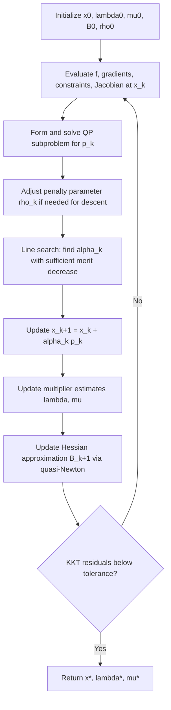

## Sequential Quadratic Programming — Algorithm

### Overview

**Key Points**

This topic assembles the complete SQP algorithm from the components developed in prior topics: the QP subproblem (which produces a search direction), a Hessian approximation strategy, a globalization mechanism (merit function or filter, drawing on penalty function concepts), and the practical control logic — step acceptance, penalty/trust-region parameter updates, and termination — that ties these pieces into a working method for solving the general nonlinear program:

$$\min_{x \in \mathbb{R}^n} \quad f(x) \quad \text{subject to} \quad c_i(x) = 0,\ i \in \mathcal{E}, \quad c_j(x) \geq 0,\ j \in \mathcal{I}$$

Whereas the SQP subproblem topic focused on _what_ a single subproblem looks like and _why_ it arises from Newton's method on the KKT conditions, this topic focuses on the full outer-loop algorithm: how subproblems are chained together, how steps are accepted or rejected, and how the various safeguards interact.

### Full Algorithm Statement (Line-Search SQP)

**Key Points**

1. **Initialization**: choose $x_0$, initial multiplier estimates $\lambda_0, \mu_0$, initial Hessian approximation $B_0$ (e.g., identity), initial penalty parameter $\rho_0$ for the merit function, and tolerances.
2. **For** $k = 0, 1, 2, \dots$: a. Evaluate $f(x_k)$, $\nabla f(x_k)$, $c(x_k)$, $A(x_k) = \nabla c(x_k)$. b. Form and solve the QP subproblem: $$\min_p \ \nabla f(x_k)^Tp + \tfrac12 p^TB_kp \quad \text{s.t.} \quad c_i(x_k)+\nabla c_i(x_k)^Tp = 0,\ \ c_j(x_k)+\nabla c_j(x_k)^Tp \geq 0$$ obtaining step $p_k$ and QP multipliers $(\hat\lambda_{k+1}, \hat\mu_{k+1})$. c. **Update the merit function penalty parameter** $\rho_k$ if necessary, so that $p_k$ is guaranteed to be a descent direction for the merit function (see below). d. **Line search**: find $\alpha_k \in (0,1]$ (e.g., via backtracking) such that the merit function shows sufficient decrease: $$\phi_1(x_k+\alpha_kp_k;\rho_k) \leq \phi_1(x_k;\rho_k) + \eta,\alpha_k,D_1(\phi_1(x_k;\rho_k);p_k)$$ for some $\eta \in (0,1)$, where $D_1(\cdot;p_k)$ is the directional derivative of the merit function along $p_k$. e. **Update iterate**: $x_{k+1} = x_k + \alpha_k p_k$; update multipliers, e.g. $\lambda_{k+1} = \hat\lambda_{k+1}$ (or a convex combination with $\lambda_k$). f. **Update Hessian approximation**: compute $B_{k+1}$ from $B_k$ via a quasi-Newton update (e.g., damped BFGS) using the change in Lagrangian gradient. g. **Check convergence**: stop if KKT residuals (stationarity, feasibility, complementarity) fall below tolerance.

This is the classical **line-search SQP** framework. A parallel **trust-region SQP** framework replaces steps (c)-(d) with a trust-region radius update and a ratio test comparing actual-to-predicted reduction, rather than a penalty-parameter-driven line search.

### Full Algorithm Flow

### Ensuring Descent: Choosing the Penalty Parameter

**Key Points**

A critical, easily overlooked detail is that the step $p_k$ produced by the QP subproblem is only guaranteed to be a **descent direction for the merit function** $\phi_1(x;\rho)$ if $\rho$ is large enough. Specifically, using the $\ell_1$ merit function, the directional derivative of $\phi_1$ along $p_k$ at $x_k$ satisfies:

$$D_1(\phi_1(x_k;\rho);p_k) \leq \nabla f(x_k)^Tp_k - \rho\left(|c_{\mathcal{E}}(x_k)|_1 + \sum_j\max(0,-c_j(x_k))\right)$$

For this to be negative (a genuine descent direction), $\rho$ must exceed a threshold related to the QP multipliers, closely mirroring the exactness threshold $\rho^*$ from the exact penalty function topic:

$$\rho_k > \max\left(\max_i|\hat\lambda_{i,k+1}|, \ \max_j \hat\mu_{j,k+1}\right)$$

**Practical update rule**: at each iteration, check whether the current $\rho_{k-1}$ satisfies this bound using the newly computed multipliers; if not, increase it, e.g.:

$$\rho_k = \max\left(\rho_{k-1}, \ \max_i|\hat\lambda_{i,k+1}| + \delta, \ \max_j\hat\mu_{j,k+1} + \delta\right)$$

for a small safety margin $\delta > 0$. This ties the merit-function penalty parameter directly to the exact penalty theory: the same threshold logic that guarantees exactness of $\phi_1$ as a standalone method also guarantees that $\phi_1$ correctly judges SQP steps as improving, provided $\rho$ is kept above the (evolving) multiplier-based threshold.

### The Maratos Effect and Second-Order Correction

**Key Points**

A well-known pathology of naive line-search SQP with the $\ell_1$ merit function is the **Maratos effect**: near a solution, a full Newton-like step $p_k$ (with $\alpha_k=1$) that would give fast local convergence can nonetheless be _rejected_ by the merit function, because curvature in the constraints causes a temporary increase in constraint violation even though the step is genuinely good. This can stall convergence to a linear (or worse) rate, defeating the superlinear/quadratic convergence otherwise available.

**Remedy — second-order correction (SOC)**: when a full step is rejected by the merit function, compute a correction $\hat p_k$ by re-solving a linearization of the constraints at the _trial_ point $x_k+p_k$ (holding the quadratic model's Hessian fixed), and test whether $p_k + \hat p_k$ is accepted instead. This corrects for the constraint curvature that caused the spurious rejection, without abandoning the good underlying step. [Inference] SOC steps are a standard and widely implemented remedy in production SQP solvers, though the precise triggering condition and correction formula vary across implementations.

**Alternative remedy — filter methods**: rather than a scalar merit function requiring a penalty parameter, a **filter** maintains a list of previously visited $(\text{constraint violation}, \text{objective value})$ pairs and accepts a trial point if it is not _dominated_ by any entry in the filter (i.e., it improves on either measure). This avoids the need to tune $\rho$ altogether and has its own mechanisms for handling the Maratos-like effect (e.g., allowing temporary objective increases if violation decreases sufficiently, and vice versa).

### Trust-Region SQP Variant

**Key Points**

An alternative to line-search globalization is **trust-region SQP**, where the QP subproblem gains an explicit trust-region constraint $|p| \leq \Delta_k$:

$$\min_p \ \nabla f(x_k)^Tp + \tfrac12p^TB_kp \quad \text{s.t.} \quad \text{(linearized constraints)}, \ |p|\leq \Delta_k$$

Because the trust-region constraint bounds $|p|$, this formulation remains well-posed even when $B_k$ is indefinite (unlike unconstrained line-search QP subproblems, which can be unbounded below for indefinite $B_k$) — directly resolving one of the well-posedness concerns raised in the SQP subproblem topic.

**Step acceptance ratio test**: define actual vs. predicted reduction in a merit function, and compute:

$$\rho_k^{\text{ratio}} = \frac{\text{actual reduction in merit function}}{\text{predicted reduction from the quadratic/linear model}}$$

- If $\rho_k^{\text{ratio}}$ is close to 1 (or above a threshold), accept the step and possibly expand $\Delta_{k+1} > \Delta_k$.
- If $\rho_k^{\text{ratio}}$ is small or negative, reject the step and shrink $\Delta_{k+1} < \Delta_k$, re-solving the subproblem.

A key complication specific to constrained trust-region SQP (not present in unconstrained trust-region methods) is that shrinking $\Delta_k$ can render the linearized constraints **infeasible** within the trust region, requiring specialized subproblem formulations (e.g., Byrd-Omojokun composite-step approaches, which split the step into a normal component reducing infeasibility and a tangential component reducing the objective within the null space of the linearized constraints).

### Comparison: Line-Search vs. Trust-Region SQP

|Aspect|Line-Search SQP|Trust-Region SQP|
|---|---|---|
|Step control|Step length $\alpha_k$ along fixed direction $p_k$|Step region $\Delta_k$ bounds $p_k$ directly|
|Handles indefinite $B_k$|Requires modification of $B_k$ for well-posedness|Naturally well-posed via trust-region constraint|
|Globalization mechanism|Merit function with penalty parameter $\rho_k$|Ratio test comparing actual/predicted reduction|
|Known pathology|Maratos effect|Potential infeasibility of linearized constraints within $\Delta_k$|
|Typical remedy|Second-order correction, filter methods|Composite-step methods (e.g., Byrd-Omojokun)|

### Convergence Properties of the Full Algorithm

**Key Points**

- **Global convergence**: under standard assumptions (bounded level sets, Lipschitz continuous gradients, regularity of constraints), both line-search and trust-region SQP with appropriate safeguards can be shown to generate iterates whose KKT residuals converge to zero, i.e. every limit point is a KKT point. [Inference] The precise assumptions required (e.g., specific constraint qualifications, boundedness of Hessian approximations) vary by the specific convergence proof and solver, and global convergence guarantees for general non-convex problems typically only ensure convergence to a KKT point, not necessarily a global or even local minimum.
- **Local convergence**: near a solution satisfying LICQ and second-order sufficient conditions, with $\alpha_k=1$ eventually accepted (which SOC or filter safeguards are specifically designed to ensure), the method inherits the local convergence rate of the underlying Hessian strategy — quadratic for exact Hessians, superlinear for well-designed quasi-Newton updates (e.g., damped BFGS satisfying the Dennis-Moré condition).
- **Active-set identification**: the active set of the QP subproblem at the solution typically identifies the correct active set of the nonlinear problem in a neighborhood of a solution satisfying strict complementarity, which underlies the fast local convergence — once the correct active set is identified, SQP locally behaves like Newton's method on the corresponding equality-constrained problem.

### Worked Example — Two SQP Iterations with a Merit Function

**Example**

Minimize $f(x_1,x_2) = (x_1-2)^2 + (x_2-1)^2$ subject to $c(x) = x_1^2 - x_2 = 0$.

**Iteration 1** at $x_0=(0,0)$: $\nabla f(x_0) = (-4,-2)^T$, $c(x_0)=0$, $\nabla c(x_0) = (2x_1,-1)^T = (0,-1)^T$. Using $B_0 = I$ (identity, as a starting quasi-Newton approximation), the QP subproblem is:

$$\min_p \ -4p_1-2p_2+\tfrac12(p_1^2+p_2^2) \quad \text{s.t.} \quad -p_2 = 0$$

With $p_2=0$ enforced, minimize $-4p_1+\tfrac12p_1^2 \implies p_1 = 4$. So $p_0 = (4,0)$, giving trial point $x_0+p_0 = (4,0)$.

A merit-function line search (details omitted for brevity) would likely reduce $\alpha_0$ substantially here since $(4,0)$ is far from feasible in a nonlinear sense relative to the linear model — [Inference] this illustrates why a pure identity-Hessian first step, common in cold-started SQP, is often heavily damped by the line search rather than accepted at $\alpha=1$, precisely the kind of behavior the algorithm's step-length control is designed to handle; exact step lengths depend on the specific merit function and line-search parameters chosen.

**Output**

This shortened example demonstrates subproblem formation and solution mechanics consistent with the SQP subproblem topic; a full multi-iteration trace with explicit Hessian updates and line-search steps would require numerical computation beyond illustrative hand calculation, and is intentionally not fabricated here to avoid presenting unverified numerical claims as precise results.

### Termination Criteria

**Key Points**

Practical SQP implementations typically terminate when all of the following are below specified tolerances:

- **Stationarity residual**: $|\nabla f(x_k) - A(x_k)^T\lambda_k|$ small.
- **Feasibility residual**: $|c(x_k)|$ (equalities) and violation of inequalities small.
- **Complementarity residual**: $|\mu_{j,k}, c_j(x_k)|$ small for all $j \in \mathcal{I}$.

together with a check that $\mu_{j,k} \geq 0$ (or within tolerance of it) for all inequality multipliers.

### Conclusion

The full SQP algorithm assembles the QP subproblem, a Hessian approximation strategy, and a globalization mechanism (merit function with penalty-parameter safeguards and second-order correction, or a trust-region ratio test) into an iterative method for general nonlinear constrained optimization. The exact-penalty threshold theory directly determines how the merit function's penalty parameter must be controlled to guarantee descent, linking this algorithm tightly to the penalty function topics developed earlier. Known pathologies — Maratos effect for line-search variants, linearized infeasibility for trust-region variants — have well-established, if implementation-dependent, remedies. Under standard regularity conditions, the resulting algorithm achieves fast local convergence (quadratic or superlinear depending on Hessian strategy) while retaining global convergence guarantees from arbitrary starting points.

**Related Topics**

- Quasi-Newton Hessian updates (BFGS, damped BFGS, SR1) for constrained problems
- Filter methods and non-monotone acceptance criteria
- Byrd-Omojokun composite-step trust-region methods
- Interior-point methods for nonlinear programming (as an alternative to active-set SQP)
- Constraint qualification conditions and their role in convergence proofs
- Warm-starting strategies for sequences of related SQP problems
- Active-set identification and its connection to local convergence rate
- Software implementations and benchmarking of SQP solvers
