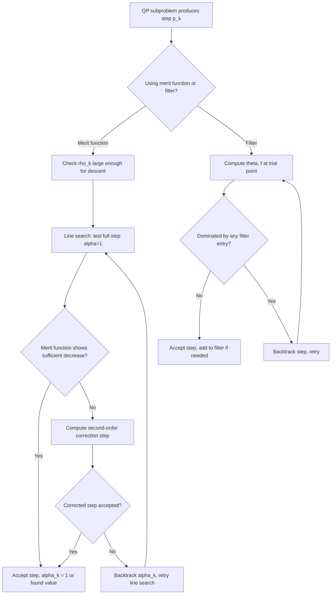

## SQP — Merit Functions and Globalization

### The Globalization Problem

**Key Points**

The QP subproblem developed earlier produces a step $p_k$ that is, near a solution, an excellent (Newton-like) direction. However, nothing in the subproblem's derivation guarantees that taking a full step $x_k + p_k$ actually makes *progress* toward a solution when $x_k$ is far from optimal — the subproblem is built from a purely **local** quadratic/linear model that can be arbitrarily inaccurate far from $x_k$. **Globalization** is the collective term for the mechanisms that decide *whether* and *how far* to move along $p_k$, ensuring the algorithm makes reliable progress from arbitrary starting points rather than only near a solution. This topic consolidates and extends the merit-function and filter concepts introduced piecemeal in the exact penalty and SQP algorithm topics, treating globalization as a subject in its own right.

### Role of a Merit Function

**Key Points**

A merit function $\phi(x;\text{params})$ is a scalar-valued function that trades off two competing goals — reducing the objective $f(x)$ and reducing constraint violation — into a single quantity that a line search can monitor for "sufficient decrease," in the same way ordinary unconstrained line searches monitor $f(x)$ directly. The core requirement for a merit function to be useful for globalization is:

**Compatibility condition**: the direction $p_k$ produced by the QP subproblem must be a **descent direction** for $\phi$ at $x_k$, for at least a suitable choice of any free parameters (typically a penalty parameter $\rho$) in $\phi$. Without this property, a line search along $p_k$ using $\phi$ could fail to find any accepted step length, stalling the algorithm.

### The ℓ1 Merit Function Revisited

**Key Points**

The most widely used choice remains the exact $\ell_1$ penalty function, already introduced as an exact penalty method in its own right:

$$\phi_1(x;\rho) = f(x) + \rho\sum_{i\in\mathcal{E}}|c_i(x)| + \rho\sum_{j\in\mathcal{I}}\max(0,-c_j(x))$$

As established in the SQP algorithm topic, the directional derivative of $\phi_1$ along the QP step $p_k$ satisfies a bound involving the QP's own Lagrange multipliers, and descent is guaranteed provided:

$$\rho_k > \max\left(\max_i|\hat\lambda_{i,k+1}|,\ \max_j\hat\mu_{j,k+1}\right)$$

This is the same threshold structure as the exactness condition for $\phi_1$ as a standalone exact penalty method — the globalization use of $\phi_1$ and its standalone exact-minimization use share the identical underlying threshold logic, differing only in *how* the penalized quantity is used (as an acceptance test for externally generated steps, versus as an objective to minimize directly).

**Non-smoothness in globalization**: because $\phi_1$ is non-smooth at constraint boundaries, standard line-search theory (which typically assumes smooth merit functions) must be adapted using one-sided directional derivatives, as noted earlier. This is manageable in practice but is a source of the Maratos effect described below.

### The ℓ2 (Quadratic) Merit Function

**Key Points**

An alternative, smoother merit function uses a quadratic (ℓ2-squared) constraint violation term instead of ℓ1:

$$\phi_2(x;\rho) = f(x) + \frac{\rho}{2}\left(\sum_{i\in\mathcal{E}}c_i(x)^2 + \sum_{j\in\mathcal{I}}\min(0,c_j(x))^2\right)$$

This is smooth (avoiding the ℓ1 kink issue) but is generally **not exact** — like the plain quadratic penalty method, it typically requires $\rho\to\infty$ for the merit function's minimizer to coincide with the true constrained solution, reintroducing the ill-conditioning concerns from the quadratic penalty topic. [Inference] For this reason $\phi_2$-style merit functions are less commonly used as the primary globalization tool in general-purpose SQP solvers compared to $\ell_1$ or augmented-Lagrangian-based merit functions, though it remains a valid theoretical option and appears in some specialized implementations.

### Augmented Lagrangian as a Merit Function

**Key Points**

As noted in the augmented Lagrangian topic, $\mathcal{L}_A(x,\lambda;\rho)$ can itself serve as a merit function:

$$\mathcal{L}_A(x,\lambda;\rho) = f(x) - \lambda^Tc(x) + \frac{\rho}{2}\|c(x)\|^2$$

**Advantages over $\phi_1$**: smoothness is retained (in the equality-constrained case), avoiding the non-smooth-optimization complications of $\ell_1$, while still achieving good conditioning at moderate, non-diverging $\rho$ — the same mechanism explored in the augmented Lagrangian topic.

**Added complexity**: using $\mathcal{L}_A$ as a merit function requires tracking and updating the multiplier estimate $\lambda$ *within* the merit function itself (in addition to the multiplier updates already occurring in the outer SQP iteration), and the descent-direction guarantee for $p_k$ depends on this multiplier estimate being reasonably accurate, not just on $\rho$ being large enough. [Inference] This added interdependency is often cited as a practical reason some solvers prefer the more straightforward (if non-smooth) ℓ1 merit function despite the augmented Lagrangian's smoothness advantage; the trade-off is implementation-specific.

### Comparison of Merit Function Choices

| Aspect | $\ell_1$ Penalty | $\ell_2$ (Quadratic) Penalty | Augmented Lagrangian |
|---|---|---|---|
| Smoothness | Non-smooth at boundary | Smooth | Smooth (equality case) |
| Exactness at finite $\rho$ | Yes | No (requires $\rho\to\infty$) | Yes (with accurate $\lambda$) |
| Conditioning at required $\rho$ | Not applicable (no conditioning issue from $\rho$ growth) | Degrades as $\rho\to\infty$ | Good at moderate, bounded $\rho$ |
| Extra state to maintain | None beyond $\rho$ | None beyond $\rho$ | $\rho$ and multiplier estimate $\lambda$ |
| Susceptible to Maratos effect | Yes | Less commonly discussed in this context | Reduced, but not eliminated |

### The Maratos Effect

**Key Points**

The Maratos effect, mentioned briefly in earlier topics, deserves fuller treatment here as the canonical pathology of merit-function-based globalization. Consider a step $p_k$ that is an excellent (even exact, in idealized cases) Newton-like step toward the solution. Because the constraints are *nonlinear*, the true constraint value at the trial point $c(x_k+p_k)$ can be worse (larger in magnitude) than the *linearized* prediction $c(x_k)+\nabla c(x_k)^Tp_k = 0$ suggests — curvature in $c$ causes actual constraint violation at the trial point even though the linear model predicted exact feasibility.

Since $\phi_1$ (or any merit function penalizing constraint violation) directly measures the *actual* (not linearized) violation, this curvature-induced violation can cause $\phi_1(x_k+p_k;\rho) > \phi_1(x_k;\rho)$ — the merit function reports the full Newton step as *worse*, triggering the line search to shrink $\alpha_k$ well below 1, even though the full step was in fact excellent and taking it would have produced fast local convergence.

**Consequence**: without a remedy, repeated rejection of good full steps degrades the algorithm's local convergence rate from quadratic/superlinear down to linear or worse, undermining the primary benefit of using a Newton-based subproblem in the first place.

### Maratos Effect Illustration

<svg xmlns="http://www.w3.org/2000/svg" viewBox="0 0 820 440" font-family="Helvetica, Arial, sans-serif">
  <text x="410" y="28" font-size="18" font-weight="bold" text-anchor="middle" fill="#1a1a1a">Maratos Effect: Linearized vs Actual Constraint Curve (svg_diagram)</text>

  <path d="M 100 350 Q 400 60 700 350" fill="none" stroke="#1d4ed8" stroke-width="2.5" />
  <text x="700" y="340" font-size="12" fill="#1d4ed8">Actual feasible curve c(x)=0</text>

  <line x1="180" y1="300" x2="480" y2="140" stroke="#c2410c" stroke-width="2.5" />
  <text x="490" y="135" font-size="12" fill="#c2410c">Linearized constraint at x_k</text>

  <circle cx="180" cy="300" r="6" fill="#1a1a1a" />
  <text x="150" y="320" font-size="12" fill="#1a1a1a">x_k</text>

  <circle cx="480" cy="140" r="6" fill="#7c2d12" />
  <text x="490" y="160" font-size="12" fill="#7c2d12">x_k + p_k (predicted feasible)</text>

  <line x1="480" y1="140" x2="480" y2="205" stroke="#dc2626" stroke-width="2" stroke-dasharray="4,3" />
  <text x="495" y="185" font-size="11" fill="#dc2626">Actual violation</text>
  <circle cx="480" cy="205" r="4" fill="#dc2626" />
  <text x="495" y="215" font-size="11" fill="#dc2626">true c(x_k+p_k) != 0</text>

  <text x="410" y="410" font-size="12.5" text-anchor="middle" fill="#555">
    Linear model predicts feasibility, but true nonlinear constraint curve shows real violation,
  </text>
  <text x="410" y="428" font-size="12.5" text-anchor="middle" fill="#555">
    causing the merit function to penalize an otherwise excellent step.
  </text>
</svg>

### Remedy 1: Second-Order Correction (SOC)

**Key Points**

When a step $p_k$ is rejected by the merit function line search, a **second-order correction** step $\hat{p}_k$ is computed by re-linearizing the constraints at the *trial* point $x_k+p_k$ (not $x_k$) while reusing the same quadratic model curvature, then solving:

$$\min_{\hat p} \ \nabla f(x_k)^T(p_k+\hat p) + \tfrac12(p_k+\hat p)^TB_k(p_k+\hat p) \quad \text{s.t.} \quad c(x_k+p_k)+\nabla c(x_k)^T\hat p = 0$$

The combined step $p_k+\hat p_k$ is then tested against the merit function. Because $\hat p_k$ directly corrects for the curvature-induced constraint violation observed at the trial point, this combined step typically restores feasibility to a much higher order, allowing the merit function to correctly recognize it as an improving step and accept it at (or near) full length $\alpha_k=1$. [Inference] SOC is widely regarded as an effective and standard remedy, though its cost (an extra constraint evaluation and linear system solve per rejected step) is a practical consideration, and the precise triggering criteria differ across solver implementations.

### Remedy 2: Filter Methods

**Key Points**

Filter methods, introduced briefly in earlier topics, avoid the Maratos effect through a fundamentally different acceptance mechanism rather than a direct correction. A **filter** is a set of pairs $(\theta_j, f_j)$ (constraint violation measure, objective value) already visited and accepted. A trial point $x_k+\alpha p_k$ with violation $\theta$ and objective $f$ is accepted if it is **not dominated** by any filter entry, i.e., if for every filter entry $(\theta_j,f_j)$:

$$\theta < \theta_j \quad \text{or} \quad f < f_j$$

meaning the trial point improves on *at least one* of the two measures relative to every previously accepted point. This sidesteps the need to combine $f$ and constraint violation into a single scalar via a penalty parameter, and crucially, allows a step that temporarily increases $f$ (as long as violation decreases enough) or temporarily increases violation (as long as $f$ decreases enough) — exactly the flexibility needed to accept a good Newton step whose *actual* constraint violation is nonzero but small, without requiring an artificial penalty-parameter-driven trade-off.

**Filter-specific safeguards**: to guarantee convergence, filter methods typically include a **sufficient decrease** requirement relative to the filter (not just non-domination) and mechanisms to prevent cycling, along with a feasibility restoration phase invoked when no acceptable step can be found (analogous in purpose to increasing $\rho$ in penalty-based methods, but structurally distinct).

### Comparison: SOC vs. Filter Methods

| Aspect | Second-Order Correction | Filter Methods |
|---|---|---|
| Underlying globalization | Still penalty/merit-function based | Replaces scalar merit function entirely |
| Mechanism | Corrects the step itself | Changes the acceptance criterion |
| Penalty parameter tuning | Still required (for the base merit function) | Not required |
| Extra cost per rejected step | One additional QP-like solve | Typically none (just a comparison against filter entries) |
| Can combine with the other | Yes — filter-SQP methods often still use SOC as an additional safeguard | Yes |

### Globalization Decision Flow

### Practical Guidance on Choice of Globalization Strategy

**Key Points**

- **$\ell_1$ merit with SOC**: a long-standing, well-understood combination; the main tuning burden is the penalty parameter update rule and SOC triggering condition.
- **Filter methods**: avoid penalty-parameter tuning altogether, and are used in several prominent modern NLP solvers; the trade-off is a somewhat more intricate acceptance/restoration logic.
- **Augmented Lagrangian merit**: preferred when smoothness of the merit function itself is valued (e.g., to support certain line-search convergence proofs relying on smoothness), at the cost of maintaining an additional multiplier estimate within the merit function.

[Inference] No single globalization strategy is universally regarded as superior; the choice in practice reflects a solver's broader design (e.g., whether it is fundamentally active-set or interior-point based, how it handles large-scale sparse Hessians, and the specific convergence guarantees its developers prioritize), and different well-regarded general-purpose solvers make different choices among these options.

### Conclusion

Globalization is what transforms the locally accurate QP subproblem into a globally reliable algorithm, by deciding whether and how far to move along the computed step from any starting point. Merit functions — whether the non-smooth but exact $\ell_1$ penalty, the smooth but inexact quadratic penalty, or the smooth and exact (at moderate $\rho$) augmented Lagrangian — provide the scalar criterion against which candidate steps are judged, with the choice of penalty parameter directly governed by the same exactness threshold theory developed for standalone exact penalty methods. The central pathology of this approach, the Maratos effect, arises from constraint curvature causing good steps to appear locally worse than they are, and is addressed either by correcting the step directly (second-order correction) or by replacing the scalar merit function with a filter that judges acceptance along two separate dimensions. Together, these globalization mechanisms complete the SQP algorithm, ensuring both reliable global progress and the fast local convergence that motivated the Newton-based subproblem approach in the first place.

**Related Topics**
- Filter methods: theory, restoration phases, and cycling prevention
- Non-monotone line search strategies
- Trust-region SQP as an alternative globalization paradigm
- Interior-point methods and their own globalization mechanisms (fraction-to-the-boundary rules)
- Watchdog techniques as an alternative remedy for the Maratos effect
- Convergence theory for non-smooth line search methods
- Feasibility restoration phases in filter-SQP algorithms
- Software benchmarking of $\ell_1$-merit vs. filter-based SQP solvers