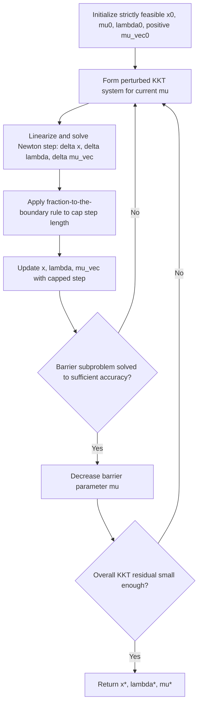

## Interior-Point Methods for Nonlinear Programming

### Motivation and Core Idea

**Key Points**

Interior-point methods (also called barrier methods) offer a fundamentally different strategy for handling inequality constraints than the active-set logic implicit in SQP's QP subproblems. Rather than explicitly tracking which inequality constraints are active at each iterate, interior-point methods add a **barrier term** to the objective that grows without bound as the iterate approaches the boundary of the inequality-feasible region from the interior, discouraging the iterate from ever reaching (let alone crossing) that boundary. The iterates are consequently maintained strictly inside the feasible region for the inequalities — hence "interior point."

For the general nonlinear program:

$$\min_{x} \quad f(x) \quad \text{subject to} \quad c_i(x)=0,\ i\in\mathcal{E}, \quad c_j(x)\geq 0,\ j\in\mathcal{I}$$

the logarithmic barrier reformulation replaces the inequality constraints with a penalty term added to the objective:

$$\min_{x} \quad f(x) - \mu\sum_{j\in\mathcal{I}}\ln(c_j(x)) \quad \text{subject to} \quad c_i(x)=0,\ i\in\mathcal{E}$$

where $\mu > 0$ is the **barrier parameter**. As $c_j(x) \to 0^+$ (approaching the boundary from the feasible side), $-\ln(c_j(x)) \to +\infty$, so the barrier term imposes an increasingly steep penalty near the boundary while contributing negligibly deep in the interior.

### Relationship to Penalty Methods

**Key Points**

The barrier approach is conceptually the mirror image of the exterior penalty methods covered earlier: whereas the quadratic penalty penalizes constraint **violation** from outside the feasible region, the logarithmic barrier penalizes **proximity to the boundary** from inside the feasible region — it is undefined (and effectively infinite) outside the feasible region altogether, since $\ln$ of a non-positive argument is undefined. This is why interior-point methods require a strictly feasible starting point with respect to the inequalities and must maintain strict feasibility throughout.

As $\mu \to 0^+$, the barrier term's influence vanishes everywhere except in a shrinking neighborhood of the boundary, and the minimizer of the barrier problem converges to a solution of the original constrained problem — directly analogous to the quadratic penalty's $\rho \to \infty$ limit, but approaching the solution from strictly inside the feasible region rather than from outside.

### The Barrier Subproblem and Central Path

**Key Points**

For each fixed $\mu > 0$, define $x(\mu)$ as the solution of the barrier problem. The stationarity condition for this subproblem (introducing multiplier $\lambda$ for the remaining equality constraints) is:

$$\nabla f(x) - \mu\sum_{j}\frac{\nabla c_j(x)}{c_j(x)} - A_{\mathcal{E}}(x)^T\lambda = 0$$

Defining $\mu_j = \mu/c_j(x)$ for each inequality (interpretable as an implicit multiplier estimate), this becomes:

$$\nabla f(x) - \sum_j \mu_j\nabla c_j(x) - A_{\mathcal{E}}(x)^T\lambda = 0, \qquad \mu_j, c_j(x) = \mu \ \text{ for all } j$$

The second relation, $\mu_j c_j(x) = \mu$, is a **perturbed complementarity condition** — compare to the exact KKT complementarity condition $\mu_j^_c_j(x^_)=0$. The barrier parameter $\mu$ thus directly controls how far the current iterate's implicit complementarity is from the true KKT complementarity condition. The set of solutions ${x(\mu) : \mu > 0}$ traced out as $\mu$ varies is called the **central path**, and it converges to a KKT point $(x^_,\lambda^_,\mu^*)$ as $\mu \to 0^+$ [Inference: under standard regularity conditions such as LICQ and strict complementarity at the limit point; behavior can differ in degenerate cases].

### Central Path Illustration

<svg viewBox="0 0 800 440" xmlns="http://www.w3.org/2000/svg" font-family="Helvetica, Arial, sans-serif"> <text x="400" y="28" font-size="18" font-weight="bold" text-anchor="middle" fill="#1a1a1a">Central Path Approaching the Solution as mu Decreases (svg_diagram)</text> <path d="M 100 380 L 700 380 L 500 80 Z" fill="#eef2ff" stroke="#4338ca" stroke-width="2"/> <text x="400" y="410" font-size="12" text-anchor="middle" fill="#4338ca">Feasible region (inequality constraints)</text> <path d="M 250 340 Q 400 250 480 130" fill="none" stroke="#c2410c" stroke-width="2.5" stroke-dasharray="0"/> <text x="490" y="115" font-size="12" fill="#c2410c">Central path x(mu)</text> <circle cx="250" cy="340" r="6" fill="#c2410c"/> <text x="200" y="360" font-size="11" fill="#333">mu large (deep interior)</text> <circle cx="380" cy="270" r="5" fill="#c2410c"/> <text x="390" y="270" font-size="11" fill="#333">mu medium</text> <circle cx="460" cy="160" r="5" fill="#c2410c"/> <text x="470" y="160" font-size="11" fill="#333">mu small</text> <circle cx="500" cy="90" r="6" fill="#15803d"/> <text x="500" y="70" font-size="12" fill="#15803d">x* (mu to 0, on boundary)</text>

<text x="400" y="435" font-size="12" text-anchor="middle" fill="#555">Iterates remain strictly interior, approaching x* only in the limit mu to 0</text> </svg>

### Newton's Method on the Barrier KKT System

**Key Points**

Rather than solving each barrier subproblem to full accuracy for a fixed $\mu$ before decreasing it, practical interior-point methods take a small number of Newton steps (often just one) on the perturbed KKT system for each $\mu$, then decrease $\mu$ and repeat. Writing the full perturbed KKT system for the general problem (with $s_j = c_j(x)$ as slack quantities and $\mu_j$ as the associated implicit multipliers):

$$\nabla f(x) - A_{\mathcal{E}}(x)^T\lambda - A_{\mathcal{I}}(x)^T\mu_{\text{vec}} = 0$$ $$c_{\mathcal{E}}(x) = 0$$ $$S M \mathbf{1} = \mu\mathbf{1} \quad \text{(perturbed complementarity, } S=\text{diag}(s_j),\ M=\text{diag}(\mu_j)\text{)}$$

Linearizing this system and applying Newton's method produces a step $(\Delta x, \Delta\lambda, \Delta\mu_{\text{vec}})$ at each iteration. This is structurally very similar to the KKT linear systems solved in QP methods (range space / null space decompositions apply here too), but now the system must be re-solved repeatedly as $\mu$ decreases, and the step must respect a **fraction-to-the-boundary rule**.

### Fraction-to-the-Boundary Rule

**Key Points**

Because interior-point iterates must remain strictly feasible with respect to inequalities (and strictly positive multiplier estimates $\mu_j > 0$), the Newton step cannot simply be taken at full length $\alpha=1$ if doing so would push $s_j$ or $\mu_j$ to zero or negative. The **fraction-to-the-boundary rule** caps the step length:

$$\alpha^{\max} = \max{\alpha \in (0,1] : s_j + \alpha\Delta s_j \geq (1-\tau)s_j,\ \ \mu_j+\alpha\Delta\mu_j \geq (1-\tau)\mu_j,\ \ \forall j}$$

for a parameter $\tau \in (0,1)$ close to 1 (e.g., $\tau=0.995$), ensuring the step retreats only a small fraction of the way toward the boundary rather than reaching or crossing it. This is analogous in spirit to a trust-region safeguard but specifically targeted at preserving strict interior feasibility and multiplier positivity.

### Barrier Parameter Update Strategies

**Key Points**

- **Fiacco-McCormick (monotone) strategy**: decrease $\mu$ by a fixed factor (e.g., $\mu_{k+1} = 0.2,\mu_k$) after each barrier subproblem is solved to sufficient accuracy — conceptually parallel to the penalty parameter update in exterior penalty methods.
- **Adaptive (predictor-corrector / Mehrotra-style) strategies**: adjust $\mu$ dynamically based on the progress of the current iterate toward complementarity, often computing an affine-scaling "predictor" direction first (as if $\mu=0$) to gauge how aggressively $\mu$ can be decreased, then a "corrector" step that accounts for the resulting nonlinearity. [Inference] Mehrotra-style predictor-corrector strategies, originally developed for linear programming interior-point methods, are widely adapted in nonlinear interior-point solvers and are generally reported to outperform simple monotone decrease strategies in practice, though the specific performance gain is problem- and implementation-dependent.

### Algorithm Structure

### Handling Equality Constraints and Global Convergence

**Key Points**

Equality constraints are typically retained directly (not barrier-transformed, since they have no interior/exterior distinction) and handled via the same Newton-KKT linearization used for the inequalities, effectively merging interior-point machinery with the Newton-on-KKT-conditions idea that also underlies SQP.

For global convergence from poor starting points, interior-point NLP solvers typically employ either:

- A **merit function** (e.g., an $\ell_1$ or augmented-Lagrangian-based merit function evaluated on the barrier-perturbed problem), analogous to SQP's globalization, or
- A **filter method** adapted to jointly monitor the barrier objective and constraint violation.

This shows that the globalization concepts developed for SQP (merit functions, filters, the Maratos effect and its remedies) are not specific to active-set SQP but recur, in adapted form, across constrained optimization algorithm families generally.

### Worked Example

**Example**

Minimize $f(x)=x^2$ subject to $c(x) = x-1 \geq 0$ (true solution $x^*=1$, on the boundary of the feasible region $x\geq 1$).

Barrier subproblem: $\min_x\ x^2 - \mu\ln(x-1)$, for $x>1$.

Stationarity: $2x - \dfrac{\mu}{x-1} = 0 \implies 2x(x-1) = \mu \implies 2x^2-2x-\mu=0$.

Solving the quadratic for $x$ (taking the root $>1$): $x(\mu) = \dfrac{2+\sqrt{4+8\mu}}{4} = \dfrac{1+\sqrt{1+2\mu}}{2}$.

**Output**

|$\mu$|$x(\mu)$|
|---|---|
|1|$\frac{1+\sqrt{3}}{2} \approx 1.366$|
|0.1|$\frac{1+\sqrt{1.2}}{2} \approx 1.048$|
|0.01|$\frac{1+\sqrt{1.02}}{2} \approx 1.0050$|
|0.001|$\approx 1.0005$|

As $\mu \to 0^+$, $x(\mu) \to 1 = x^*$, with the iterate always remaining strictly interior ($x(\mu) > 1$ for every finite $\mu>0$), illustrating the central-path convergence behavior described above — structurally parallel to, but geometrically the mirror image of, the exterior quadratic penalty example from the earlier topic.

### Comparison: Interior-Point vs. Active-Set SQP

|Aspect|Interior-Point (Barrier)|Active-Set SQP|
|---|---|---|
|Inequality handling|Barrier term; iterates stay strictly interior|Explicit active-set prediction via QP subproblem|
|Combinatorial active-set search|Avoided entirely|Implicit in the QP subproblem's active-set solve|
|Iterate feasibility|Strictly interior throughout (for inequalities)|Iterates can be infeasible with respect to inequalities during search|
|Per-iteration cost|One (or few) Newton-KKT linear system solves|One full QP solve (which may itself be iterative)|
|Warm-starting after minor problem changes|Can be less straightforward due to central-path structure|Often more natural, reusing prior active-set information|
|Scalability to large sparse problems|Generally considered to scale well due to fixed linear-system structure per iteration|[Inference] Can be less predictable in cost since QP subproblem solve time depends on active-set changes|

### Practical Considerations

**Key Points**

- **Initialization**: obtaining a strictly feasible starting point with respect to all inequality constraints can itself require a preliminary phase (a "Phase I" style procedure), particularly for problems where feasibility is not obvious.
- **Ill-conditioning near the solution**: as $\mu \to 0$, the linear systems solved at each Newton step become increasingly ill-conditioned (the diagonal matrices $S$ and $M$ develop widely varying entries as some $s_j \to 0$) — a conceptually similar conditioning concern to the quadratic penalty's $\rho\to\infty$ behavior, though interior-point solvers have well-developed techniques (e.g., specialized linear algebra exploiting the specific structure of this ill-conditioning) to manage it. [Inference] This structured ill-conditioning is generally regarded as more tractable than the unstructured ill-conditioning of the plain quadratic penalty, because its source and pattern are explicitly known and exploitable, though this remains an active area of numerical linear algebra research.
- **Choice vs. SQP**: [Inference] interior-point methods are often reported to have an advantage on large-scale problems with many inequality constraints (since they avoid combinatorial active-set search), while active-set SQP methods are often preferred for problems requiring frequent warm-starts from nearby solutions (e.g., within an outer optimization loop); these tendencies are general practitioner heuristics rather than universal rules, and the best choice is problem-dependent.

### Conclusion

Interior-point methods handle inequality constraints via a logarithmic barrier term that penalizes proximity to the feasible boundary, maintaining strictly interior iterates and tracing out a central path that converges to a KKT point as the barrier parameter $\mu \to 0^+$. This is structurally the mirror image of exterior penalty methods, replacing "penalize violation from outside" with "penalize approach from inside," and it inherits an analogous conditioning challenge as the controlling parameter approaches its limit, albeit one with more exploitable structure. By linearizing the perturbed KKT system and applying Newton's method with a fraction-to-the-boundary safeguard, interior-point methods avoid the combinatorial active-set search inherent to SQP's QP subproblems, offering a genuinely distinct algorithmic paradigm for nonlinear programming that nonetheless shares deep structural connections — Newton-KKT linearization, merit functions, central-path/penalty-parameter duality — with the SQP framework developed in earlier topics.

**Related Topics**

- Predictor-corrector (Mehrotra-style) interior-point algorithms
- Interior-point methods for linear and quadratic programming
- Primal-dual interior-point formulations
- Warm-starting strategies for interior-point methods
- Feasibility restoration and Phase I methods
- Ill-conditioning management in interior-point linear systems
- Comparison of interior-point and active-set solvers on benchmark problem sets
- Barrier function alternatives (e.g., shifted barriers, non-logarithmic barriers)

