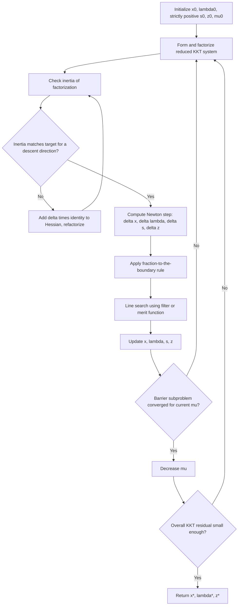

## Primal-Dual Interior-Point Methods for Nonconvex Problems

### From Pure Barrier to Primal-Dual Formulation

**Key Points**

The pure (primal) barrier method developed in the prior two topics treats $x$ as the only explicit variable, with the multiplier-like quantities $\mu_j = \mu/c_j(x)$ recovered only _after_ solving the barrier subproblem, as a byproduct of stationarity. **Primal-dual interior-point methods** instead treat $x$ and the multiplier estimates $z_j$ (using $z$ here for the inequality multiplier vector, distinguishing this formulation's notation from the pure barrier's $\mu_j$) as **independent variables solved for simultaneously**, rather than one being derived from the other after the fact.

This reformulation is not merely notational: solving for $x$ and $z$ jointly, via Newton's method applied directly to the _perturbed KKT system_ (rather than to the barrier-objective's stationarity condition), generally yields better numerical behavior and is the dominant approach in modern interior-point NLP solvers, largely superseding the pure primal barrier formulation described in the previous topic for practical implementation.

### The Perturbed KKT System

For the problem with both equality and inequality constraints:

$$\min_x f(x) \quad \text{s.t.} \quad c_i(x)=0,\ i\in\mathcal{E}, \quad c_j(x)\geq0,\ j\in\mathcal{I}$$

introduce slack variables $s_j \geq 0$ so that $c_j(x) - s_j = 0$, converting all inequalities into equalities plus explicit bound constraints $s_j \geq 0$. The primal-dual system solves for $(x,\lambda,s,z)$ satisfying the **perturbed KKT conditions**:

$$\nabla f(x) - A_{\mathcal{E}}(x)^T\lambda - A_{\mathcal{I}}(x)^Tz = 0 \quad \text{(stationarity)}$$ $$c_{\mathcal{E}}(x) = 0 \quad \text{(equality feasibility)}$$ $$c_{\mathcal{I}}(x) - s = 0 \quad \text{(inequality feasibility via slacks)}$$ $$SZ\mathbf{1} = \mu\mathbf{1} \quad \text{(perturbed complementarity, } S=\text{diag}(s),\ Z=\text{diag}(z)\text{)}$$ $$s > 0,\ z > 0 \quad \text{(strict positivity maintained throughout)}$$

As $\mu \to 0^+$, the perturbed complementarity condition $s_jz_j = \mu$ approaches the exact complementarity condition $s_jz_j=0$ required by KKT, recovering the standard optimality system in the limit — the same central-path idea from the pure barrier method, now expressed directly in terms of both primal ($x,s$) and dual ($\lambda,z$) variables.

### Newton Step on the Perturbed System

**Key Points**

Linearizing the perturbed KKT system at a current iterate $(x_k,\lambda_k,s_k,z_k)$ and applying Newton's method produces a linear system for the step $(\Delta x,\Delta\lambda,\Delta s,\Delta z)$:

$$\begin{bmatrix} H_k & -A_{\mathcal{E}}^T & -A_{\mathcal{I}}^T & 0 \ A_{\mathcal{E}} & 0 & 0 & 0 \ A_{\mathcal{I}} & 0 & -I & 0 \ 0 & 0 & Z_k & S_k \end{bmatrix}\begin{bmatrix}\Delta x \ \Delta\lambda \ \Delta s \ \Delta z\end{bmatrix} = -\begin{bmatrix} r_{\text{stat}} \ r_{\mathcal{E}} \ r_{\mathcal{I}} \ S_kZ_k\mathbf{1}-\mu\mathbf{1}\end{bmatrix}$$

where $H_k = \nabla^2_{xx}\mathcal{L}(x_k,\lambda_k,z_k)$ is the Hessian of the Lagrangian and $r_{\text{stat}}, r_{\mathcal{E}}, r_{\mathcal{I}}$ are the residuals of the corresponding KKT equations at the current iterate. This linear system can be reduced (eliminating $\Delta s$ and $\Delta z$ in closed form using the last block row, since $S_k, Z_k$ are diagonal) to a smaller symmetric system in $(\Delta x,\Delta\lambda)$ closely resembling the KKT systems solved in SQP and the range-space/null-space QP methods — a structural connection that recurs across essentially every constrained optimization method covered in this series.

### Nonconvexity: The Central New Issue

**Key Points**

The prior interior-point and barrier topics largely deferred discussion of nonconvexity to brief caveats. Here it is the central concern, because $H_k = \nabla^2_{xx}\mathcal{L}$ is **not guaranteed to be positive definite** (even on the relevant null space) for a general nonconvex $f$ or nonlinear constraints — unlike in the convex setting, where the barrier subproblem's Hessian is positive definite by construction and the Newton step is always well-defined and productive.

**Consequences of an indefinite $H_k$**:

- The Newton step may not be a descent direction for any reasonable merit function.
- The reduced KKT system may become singular or produce a step leading away from a minimizer (e.g., toward a saddle point).
- Without correction, the algorithm can fail to converge or converge to a non-minimizing KKT point.

This is structurally the same well-posedness concern raised for SQP's $B_k$ in the SQP subproblem topic, but here it applies to the _exact_ (not quasi-Newton-approximated) Hessian of the Lagrangian, since primal-dual interior-point methods typically do use exact second derivatives when available (their per-iteration linear-system cost is already dominated by the KKT solve, so second-derivative computation is a comparatively smaller additional burden than in some SQP contexts).

### Remedy 1: Inertia Correction

**Key Points**

A widely used remedy is **inertia correction**: the reduced KKT matrix, when factorized (e.g., via a symmetric indefinite $LDL^T$ factorization), has a computable **inertia** — the triple (number of positive, negative, zero eigenvalues). For the Newton step to correspond to a genuine descent direction toward a local minimizer (not a saddle point), the inertia must match a specific target determined by the problem's dimensions (number of variables and active/equality constraints).

If the computed inertia does not match this target — most commonly, if $H_k$ is not sufficiently positive definite on the relevant subspace — a multiple of the identity is added to $H_k$ (or specifically to its diagonal):

$$H_k \leftarrow H_k + \delta I, \quad \delta > 0$$

and the factorization is recomputed; $\delta$ is increased (e.g., geometrically) until the correct inertia is achieved. This is directly analogous to the Hessian-modification remedies mentioned for SQP's $B_k$, but here applied dynamically at each Newton step based on an explicit, computable diagnostic (the factorization's inertia) rather than a heuristic modification rule.

### Remedy 2: Line Search with Filter or Merit Function

**Key Points**

Even with a corrected (effectively positive-definite-enough) Newton direction, a **line search** is still needed to ensure global progress, exactly paralleling the globalization concepts from the SQP topics. Modern primal-dual interior-point NLP solvers typically use:

- A **filter** that jointly monitors the barrier objective (or Lagrangian) and constraint violation, accepting steps that improve on at least one measure relative to previously visited points — directly the same filter concept introduced for SQP, adapted to the barrier-augmented objective.
- **Fraction-to-the-boundary rules** (from the pure barrier topic) applied simultaneously, to keep $s>0$ and $z>0$ strictly maintained.

[Inference] The combination of inertia-corrected Newton steps with a filter line search is a widely cited and implemented design in prominent nonconvex interior-point NLP solvers; specific filter construction details, restoration-phase triggers, and correction heuristics vary meaningfully across implementations.

### Algorithm Structure

### Restoration Phase

**Key Points**

When the line search cannot find an acceptable step length even after backtracking substantially — typically a sign that the linearized problem is locally infeasible or that the current iterate is in a region where progress toward feasibility is needed more urgently than progress in the objective — primal-dual interior-point methods invoke a **restoration phase**: a separate subproblem, usually minimizing a measure of constraint violation alone (ignoring $f$ temporarily), is solved to move the iterate back toward a region where the regular filter/merit-function iteration can resume productively.

This mirrors the feasibility restoration concept in filter-SQP methods, underscoring that the various globalization safeguards developed across this series (SOC, filters, trust regions, restoration phases) are shared conceptual tools deployed, with adaptations, across essentially every major algorithm family for nonlinear constrained optimization.

### Comparison: Pure Barrier vs. Primal-Dual Interior-Point

|Aspect|Pure (Primal) Barrier Method|Primal-Dual Interior-Point|
|---|---|---|
|Variables solved simultaneously|$x$ only; multipliers derived after|$x,\lambda,s,z$ solved jointly|
|Handling of nonconvexity|Not directly addressed; assumes barrier subproblem Hessian usable|Explicit inertia correction mechanism|
|Typical Hessian used|Often approximated or assumes tractable curvature|Frequently exact $\nabla^2_{xx}\mathcal{L}$, since KKT solve already dominates cost|
|Numerical behavior near solution|Can suffer more from the primal-only formulation's conditioning|Generally regarded as more numerically robust|
|Modern general-purpose solver prevalence|Largely superseded for practical NLP|Dominant paradigm in modern interior-point NLP solvers|

### Local Convergence Rate

**Key Points**

Under standard regularity conditions — LICQ, strict complementarity, second-order sufficient conditions at the solution, and with the barrier parameter $\mu$ driven to zero at an appropriate rate relative to the Newton steps (rather than being fixed and fully converged at each stage) — primal-dual interior-point methods can achieve **superlinear, and under further conditions, quadratic local convergence**, comparable to Newton's method on the full KKT system. [Inference] Achieving the full quadratic rate in practice typically requires careful coordination between the $\mu$-decrease schedule and the Newton step acceptance criteria (e.g., Mehrotra-style predictor-corrector schemes, introduced in the interior-point topic); simpler monotone $\mu$-decrease schedules more commonly yield superlinear but sub-quadratic empirical behavior.

### Worked Example — Detecting and Correcting Nonconvexity

**Example**

Consider minimizing $f(x_1,x_2) = x_1^2 - x_2^2$ (a nonconvex, saddle-shaped objective) subject to $x_1+x_2 \geq 1$, at a trial iterate near $(0.5,0.5)$ with slack $s\approx0$ and small $\mu$.

The Hessian of the Lagrangian here is $\nabla^2_{xx}\mathcal{L} = \begin{bmatrix}2&0\0&-2\end{bmatrix}$ (the constraint is linear, contributing no curvature), which is **indefinite** — one positive, one negative eigenvalue.

**Output**

A direct Newton step using this indefinite Hessian could easily be attracted toward the saddle direction associated with the negative eigenvalue (decreasing $f$ by increasing $x_2$ without bound, since $-x_2^2$ is unbounded below), rather than toward a genuine constrained local minimizer. Inertia correction would detect that the factorization's inertia does not match the target for a minimizing direction and add $\delta I$ — e.g., $\delta=3$ giving a corrected Hessian $\begin{bmatrix}5&0\0&1\end{bmatrix}$, now positive definite — before computing the step, redirecting the search away from the unbounded saddle direction. [Inference] This example is constructed to be illustrative of the mechanism rather than a full numerical trace of a solver run; the specific $\delta$ a real implementation would choose depends on its particular correction heuristic and is not fabricated here as a precise reproducible value.

### Conclusion

Primal-dual interior-point methods extend the pure barrier approach by solving for primal variables and dual (multiplier) estimates simultaneously via Newton's method on the perturbed KKT system, a reformulation that has become the dominant paradigm for practical nonconvex nonlinear programming. The central new challenge relative to the convex or pure-barrier setting is that the Hessian of the Lagrangian is not guaranteed to be positive definite, which is addressed through inertia correction — a diagnostic-driven Hessian modification based on the computable inertia of the factorized KKT system — combined with filter-based line searches, fraction-to-the-boundary safeguards, and restoration phases for handling locally infeasible linearizations. These mechanisms are, in each case, adapted versions of globalization and well-posedness tools already developed across the SQP and barrier method topics, reinforcing that the major algorithm families for nonlinear constrained optimization, despite their differing surface mechanics, draw on a shared and mutually reinforcing set of underlying techniques.

**Related Topics**

- Inertia-revealing factorizations (e.g., symmetric indefinite $LDL^T$) and their computation
- Restoration phase algorithms for infeasible subproblems
- Mehrotra-style predictor-corrector primal-dual methods
- Filter line search adaptations for primal-dual interior-point solvers
- Second-order sufficient conditions and local quadratic convergence proofs
- Comparison of exact Hessian vs. quasi-Newton strategies within interior-point solvers
- Software implementations of nonconvex primal-dual interior-point NLP (e.g., general algorithmic design patterns)
- Warm-starting primal-dual interior-point methods across related problem instances
