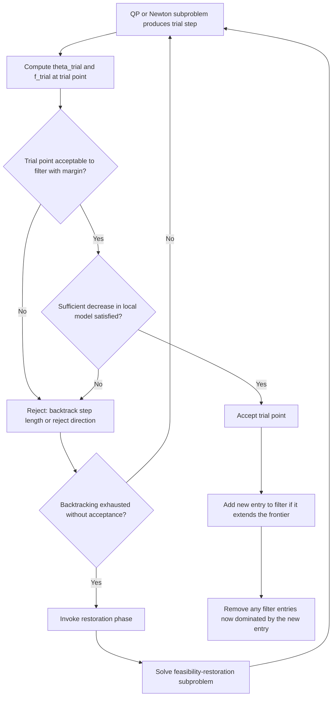

## Filter Methods for Nonlinear Programming

### Origins and Core Motivation

**Key Points**

Filter methods were introduced piecemeal across the SQP globalization and primal-dual interior-point topics as an alternative to penalty-parameter-driven merit functions. This topic treats the filter concept as a subject in its own right: its precise definitions, acceptance criteria, theoretical guarantees, and the specific mechanisms (sufficient decrease conditions, restoration phases, cycling prevention) that turn the basic idea into a convergent algorithm.

The motivating observation, first raised in the SQP merit function topic, is that combining objective value and constraint violation into a single scalar via a penalty parameter $\rho$ requires solving a genuinely awkward *tuning problem*: too small a $\rho$ risks accepting infeasible steps as if they were improving; too large a $\rho$ risks rejecting genuinely good steps (contributing to the Maratos effect). Filter methods sidestep this tuning problem entirely by treating objective value and constraint violation as **two separate, simultaneously tracked criteria**, using the concept of Pareto dominance from multi-objective optimization rather than a weighted scalar combination.

### Formal Definition

**Key Points**

Define, for any point $x$:

$$\theta(x) = \sum_{i\in\mathcal{E}}|c_i(x)| + \sum_{j\in\mathcal{I}}\max(0,-c_j(x))$$

as the **constraint violation measure** (zero if and only if $x$ is feasible), and let $f(x)$ be the objective value. A **filter** $\mathcal{F}$ is a finite set of pairs $(\theta_l, f_l)$, each representing a previously visited and accepted iterate's violation and objective value.

A trial point $x^{\text{trial}}$ with $(\theta^{\text{trial}}, f^{\text{trial}}) = (\theta(x^{\text{trial}}), f(x^{\text{trial}}))$ is said to be **acceptable to the filter** if, for every entry $(\theta_l,f_l) \in \mathcal{F}$:

$$\theta^{\text{trial}} < \theta_l \quad \text{or} \quad f^{\text{trial}} < f_l$$

Equivalently, $x^{\text{trial}}$ is rejected only if it is **dominated** by some existing filter entry — that is, some $(\theta_l,f_l)$ exists with $\theta^{\text{trial}} \geq \theta_l$ **and** $f^{\text{trial}} \geq f_l$ simultaneously (worse or equal on both measures).

### The Filter as a Pareto Frontier

**Key Points**

Geometrically, the filter can be understood as tracking an (evolving) approximation to the Pareto-efficient frontier of the bi-objective problem "minimize $\theta$ and minimize $f$ simultaneously." A point is accepted precisely when it is not dominated by anything already known to be achievable — the same logic used throughout multi-objective optimization to characterize non-dominated (Pareto-optimal) solutions. Points that would extend the frontier (improve on at least one measure without being simultaneously worse on the other) are, once accepted, typically added as new filter entries, and any existing entries they dominate are removed to keep the filter minimal.

### Filter Diagram

<svg xmlns="http://www.w3.org/2000/svg" viewBox="0 0 800 440" font-family="Helvetica, Arial, sans-serif">
  <text x="400" y="28" font-size="18" font-weight="bold" text-anchor="middle" fill="#1a1a1a">Filter: Acceptable Region Relative to Existing Entries (svg_diagram)</text>

  <line x1="90" y1="370" x2="740" y2="370" stroke="#333" stroke-width="1.5" />
  <line x1="90" y1="370" x2="90" y2="60" stroke="#333" stroke-width="1.5" />
  <text x="415" y="400" font-size="13" text-anchor="middle" fill="#333">theta (constraint violation)</text>
  <text x="45" y="220" font-size="13" text-anchor="middle" fill="#333" transform="rotate(-90 45 220)">f (objective value)</text>

  <circle cx="220" cy="280" r="6" fill="#1d4ed8" />
  <text x="230" y="280" font-size="11" fill="#1d4ed8">filter entry 1</text>
  <rect x="220" y="60" width="520" height="220" fill="#fee2e2" opacity="0.35" />

  <circle cx="380" cy="160" r="6" fill="#1d4ed8" />
  <text x="390" y="160" font-size="11" fill="#1d4ed8">filter entry 2</text>
  <rect x="380" y="160" width="360" height="120" fill="#fecaca" opacity="0.45" />

  <circle cx="150" cy="130" r="6" fill="#15803d" />
  <text x="120" y="115" font-size="11" fill="#15803d">accepted trial point A</text>

  <circle cx="480" cy="220" r="6" fill="#b91c1c" />
  <text x="490" y="240" font-size="11" fill="#b91c1c">dominated trial B (rejected)</text>

  <text x="415" y="425" font-size="12" text-anchor="middle" fill="#555">Shaded region: dominated by at least one filter entry (rejected zone). Point A escapes all shading; point B does not.</text>
</svg>

### Sufficient Decrease and the Envelope Condition

**Key Points**

Plain non-domination, as defined above, is insufficient on its own to guarantee convergence — a sequence of trial points could, in principle, make arbitrarily small improvements forever without converging, or could cycle. Practical filter methods therefore strengthen the acceptance test with a **margin** (sometimes called an envelope), requiring:

$$\theta^{\text{trial}} \leq (1-\gamma_\theta)\theta_l \quad \text{or} \quad f^{\text{trial}} \leq f_l - \gamma_f\theta^{\text{trial}}$$

for small constants $\gamma_\theta, \gamma_f \in (0,1)$, rather than plain strict inequality. This ensures each accepted point achieves a **quantifiable** improvement over every filter entry it might otherwise be marginally close to, which is what enables formal global convergence proofs (typically showing that $\theta_k \to 0$ and that a subsequence of iterates satisfies approximate KKT conditions).

**Sufficient decrease relative to the current point** (not just the filter) is also typically required: the trial point must show adequate improvement in a *local model* of $f$ or $\theta$ relative to the step just taken, analogous to the Armijo-type condition in ordinary line-search methods, ensuring the step itself is meaningfully productive and not merely technically non-dominated.

### Filter Step Acceptance Procedure

### The Restoration Phase

**Key Points**

If the line search or trust-region step-shrinking process exhausts its budget without finding an acceptable trial point — a situation that typically signals that the linearized subproblem is locally infeasible, or that the current iterate is in a region where the model direction cannot make simultaneous progress on both filter dimensions — the algorithm switches to a **restoration phase**.

The restoration phase temporarily abandons the original objective $f$ and instead solves a subproblem aimed purely at reducing $\theta(x)$ (constraint violation), for instance:

$$\min_x \ \theta(x) \quad \text{(possibly regularized to stay near the current iterate)}$$

Once a sufficiently feasible point is found by this subphase, the algorithm resumes normal filter-based iteration from that point, typically inserting the point that triggered restoration into the filter (to prevent the algorithm from returning to the same problematic region).

[Inference] The restoration phase is a critical component for the practical robustness of filter methods and is present, in some form, in essentially every filter-SQP and filter-interior-point implementation; the precise subproblem formulation and re-entry conditions vary by solver.

### Cycling Prevention

**Key Points**

A subtle theoretical concern for filter methods is **cycling**: a sequence of accepted iterates could, in principle, return arbitrarily close to a previously visited region without violating the (local) filter acceptance test, if the filter itself is not properly maintained or if step sizes are allowed to shrink without bound without triggering restoration. Standard safeguards include:

- Ensuring the sufficient-decrease/envelope margins ($\gamma_\theta,\gamma_f$) are bounded away from zero, so every accepted point contributes a non-vanishing improvement.
- Triggering the restoration phase (rather than allowing indefinite backtracking) once the step length falls below a minimum threshold.
- In some theoretical treatments, imposing that filter entries are only added (never merely updated in place) with the margin condition applied at insertion, which structurally prevents an infinite sequence of ever-smaller improving steps from being accepted without triggering restoration.

[Inference] The specific combination of safeguards needed to rigorously rule out cycling was the subject of substantial research refinement following the initial introduction of filter methods (originally proposed by Fletcher and Leyffer), and different published convergence proofs rely on somewhat different technical conditions; this remains a topic where implementation details matter for the precise theoretical guarantee obtained.

### Global Convergence Properties

**Key Points**

Under standard assumptions (bounded iterates, Lipschitz continuous derivatives, a properly implemented restoration phase, and appropriate sufficient-decrease margins), filter methods can be shown to generate a sequence for which either:

- $\theta_k \to 0$ and a subsequence of $(x_k)$ converges to a point satisfying approximate first-order (KKT-like) optimality conditions, or
- The restoration phase iterates converge to a stationary point of $\theta(x)$ itself — interpretable as a certificate that the original problem may be **locally infeasible** near that region (a genuinely useful diagnostic outcome, since detecting infeasibility is itself valuable, distinct from merely failing to converge).

This dual-outcome structure — either finding a KKT point of the original problem or a stationary point of the infeasibility measure — is a notable conceptual feature of filter convergence theory, distinguishing it from simple penalty-based convergence statements that typically only characterize the "success" outcome.

### Comparison: Filter vs. Merit Function Globalization

| Aspect | Merit Function (e.g., $\ell_1$) | Filter Method |
|---|---|---|
| Combines $f$ and $\theta$ | Yes, via penalty parameter $\rho$ | No — tracked as two separate criteria |
| Parameter tuning burden | Penalty parameter $\rho$ must be managed | No penalty parameter; margin constants $\gamma_\theta,\gamma_f$ instead |
| Susceptible to Maratos effect | Yes, directly | Reduced, though not entirely absent — some filter variants still benefit from an SOC-like step |
| Infeasibility detection | Implicit (via $\rho\to\infty$ behavior in the limit) | Explicit, structural outcome via restoration-phase convergence |
| Theoretical maturity | Long-established, deeply studied | Well-established since the late 1990s/2000s, still an active refinement area |
| Used in | Classical SQP, some interior-point solvers | Modern SQP solvers, modern interior-point NLP solvers (e.g., filter-based line search variants) |

### Filter Methods in Interior-Point Solvers

**Key Points**

As noted in the primal-dual interior-point topic, filter acceptance criteria are commonly adapted to interior-point iterations by using the **barrier objective** (or the Lagrangian of the barrier subproblem) in place of $f$ directly, while $\theta(x)$ continues to measure constraint violation (typically of the equality constraints and the slack-feasibility relation $c_j(x)-s_j=0$, since the inequality constraints themselves are handled by strict positivity of $s$ rather than contributing to $\theta$ directly). This illustrates that the filter concept, once developed for SQP, transfers with only modest adaptation to a structurally different algorithm family — reinforcing the recurring theme across this series that globalization mechanisms are largely modular and reusable across the major nonlinear programming paradigms.

### Worked Example

**Example**

Suppose the current filter contains two entries: $(\theta_1,f_1) = (0.5, 10)$ and $(\theta_2,f_2) = (0.1, 15)$ (representing two previously accepted iterates — one more feasible but with higher objective, one less feasible but with lower objective, illustrating the inherent trade-off the filter tracks).

Consider three candidate trial points:

- **Trial A**: $(\theta,f) = (0.05, 12)$. Check against entry 1: $0.05 < 0.5$ ✓ (dominates on $\theta$, so not dominated by entry 1). Check against entry 2: $0.05<0.1$ ✓. **Accepted** — improves on $\theta$ relative to both entries.
- **Trial B**: $(\theta,f) = (0.6, 8)$. Check against entry 1: $\theta=0.6\geq0.5$ and $f=8<10$, so the "or" condition holds via $f$. Check against entry 2: $\theta=0.6\geq0.1$ and $f=8<15$, "or" holds via $f$. **Accepted** — improves on $f$ relative to both entries despite worse feasibility than entry 1.
- **Trial C**: $(\theta,f)=(0.5,11)$. Check against entry 1: $\theta=0.5\geq0.5$ (not strictly less) and $f=11\geq10$ — **dominated by entry 1**, rejected regardless of its relation to entry 2.

**Output**

| Trial | $(\theta,f)$ | Outcome |
|---|---|---|
| A | (0.05, 12) | Accepted (improves violation) |
| B | (0.6, 8) | Accepted (improves objective) |
| C | (0.5, 11) | Rejected (dominated by entry 1) |

This example illustrates the essential character of filter acceptance: it permits genuinely different *kinds* of progress (better feasibility vs. better objective) to both count as legitimate improvement, which is precisely the flexibility that avoids the artificial trade-off forced by a single penalty parameter.

### Conclusion

Filter methods provide a globalization mechanism for nonlinear programming that avoids the penalty-parameter tuning problem inherent to merit-function-based line searches by tracking objective value and constraint violation as two separate criteria and accepting any trial point not dominated, in the Pareto sense, by previously accepted iterates. Strengthened with sufficient-decrease margins to guarantee measurable progress and a restoration phase to handle steps where no acceptable point can be found, filter methods achieve global convergence guarantees with a notably informative dual outcome — either convergence to a KKT point of the original problem, or detection of local infeasibility via convergence of the restoration phase. Originally developed for SQP, the filter concept transfers with modest adaptation to primal-dual interior-point methods, underscoring its status as a genuinely modular globalization tool within the broader landscape of nonlinear constrained optimization algorithms surveyed across this series.

**Related Topics**
- Fletcher-Leyffer original filter-SQP formulation and its refinements
- Restoration-phase subproblem design and regularization strategies
- Second-order correction steps combined with filter acceptance
- Feasibility detection and certificates of local infeasibility
- Non-monotone and relaxed filter variants
- Filter methods in derivative-free and trust-region optimization
- Convergence proof techniques for filter-based algorithms
- Benchmarking filter-based vs. merit-function-based solvers on standard NLP test sets