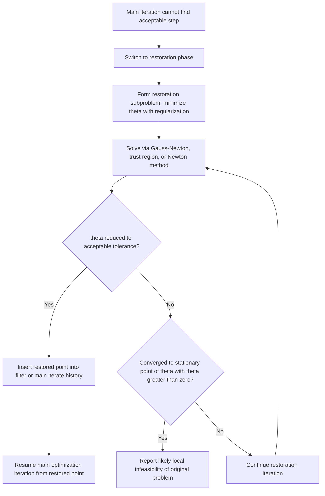

## Feasibility Restoration Techniques

### Overview and Unifying Purpose

**Key Points**

Feasibility restoration has appeared repeatedly across this series — as the restoration phase in filter-SQP, the constraint-restoration Newton solve inside GRG's line search, and the Phase I procedures mentioned for interior-point and GRG starting points — but has not yet been treated as a subject in its own right. This topic consolidates these threads: the general problem of recovering a feasible (or sufficiently feasible) point when the primary optimization iteration cannot proceed, the various algorithmic techniques for doing so, and how the choice of restoration technique interacts with the surrounding globalization framework (filter, merit function, or barrier).

Every constrained optimization method surveyed in this series assumes, implicitly or explicitly, that some mechanism exists for either starting from or returning to a feasible (or near-feasible) region. Feasibility restoration is the collection of techniques that provide this mechanism when it does not arise automatically from the main iteration.

### When Restoration Is Needed

**Key Points**

Restoration becomes necessary in several recurring situations across the methods already covered:

- **Filter-SQP/filter-interior-point**: when no trial step length can be found that is acceptable to the filter (as detailed in the filter methods topic), signaling that the linearized model direction cannot make joint progress on both objective and feasibility from the current point.
- **GRG**: at every trial point along the line search, since the nonbasic step generally moves off the nonlinear constraint manifold and the basic variables must be Newton-corrected back onto it (a form of restoration invoked routinely, not just as an exceptional fallback).
- **Interior-point / barrier methods**: when obtaining an initial strictly feasible point is itself nontrivial (Phase I), and in primal-dual variants, when the line search cannot find an acceptable step even after applying the fraction-to-the-boundary rule.
- **SQP with inconsistent linearized constraints**: as noted in the SQP subproblem topic, the linearization of the constraints at $x_k$ can itself be locally infeasible even though the original nonlinear feasible region is nonempty, requiring some form of relaxation or restoration before a step can even be computed.

### Restoration as a Bi-Objective Sub-Problem

**Key Points**

The most common formulation of restoration, consistent with the filter-methods framing, is to temporarily set aside the original objective $f$ and solve a subproblem aimed purely at reducing the constraint violation measure:

$$\min_x \quad \theta(x) = \sum_{i\in\mathcal{E}}|c_i(x)| + \sum_{j\in\mathcal{I}}\max(0,-c_j(x))$$

often regularized to discourage moving unnecessarily far from the current iterate $x_k$:

$$\min_x \quad \theta(x) + \zeta\,\|x-x_k\|^2$$

for a regularization parameter $\zeta>0$. The regularization term serves two purposes: it keeps the restoration step from wandering arbitrarily far in search of any feasible point (which might be a poor region for resuming the original optimization), and it typically improves the conditioning of the restoration subproblem itself, especially when $\theta(x)$ has flat or non-unique minimizers.

### Restoration Subproblem Illustration

<svg xmlns="http://www.w3.org/2000/svg" viewBox="0 0 800 420" font-family="Helvetica, Arial, sans-serif">
  <text x="400" y="28" font-size="18" font-weight="bold" text-anchor="middle" fill="#1a1a1a">Restoration: Returning Toward Feasibility from a Stalled Iterate (svg_diagram)</text>

  <path d="M 150 340 Q 400 100 650 340" fill="none" stroke="#1d4ed8" stroke-width="2.5" />
  <text x="650" y="330" font-size="12" fill="#1d4ed8">Feasible manifold c(x)=0</text>

  <circle cx="480" cy="230" r="6" fill="#b91c1c" />
  <text x="490" y="230" font-size="12" fill="#b91c1c">x_k: no acceptable step found</text>

  <path d="M 480 230 C 460 210, 430 190, 400 165" fill="none" stroke="#7c2d12" stroke-width="2.5" stroke-dasharray="6,4" />
  <circle cx="400" cy="165" r="6" fill="#15803d" />
  <text x="330" y="150" font-size="12" fill="#15803d">restored point (theta minimized)</text>

  <text x="400" y="400" font-size="12" text-anchor="middle" fill="#555">Restoration subproblem minimizes constraint violation, ignoring f temporarily, to re-enter a workable region</text>
</svg>

### Algorithmic Approaches to Restoration

**Key Points**

Several distinct algorithmic strategies for solving (or approximately solving) the restoration subproblem are used across implementations:

- **Gauss-Newton / Levenberg-Marquardt on $\theta$**: since $\theta$ is often expressed via a sum of (absolute values or squares of) constraint residuals, treating it as a nonlinear least-squares problem and applying Gauss-Newton or Levenberg-Marquardt style steps is a natural and commonly used approach, particularly efficient when $\theta$ is built from a squared-residual form.
- **Trust-region restoration**: bound the restoration step by a trust-region radius, applying the same ratio-test acceptance logic used in trust-region SQP, but now judged purely by reduction in $\theta$ rather than a merit function combining $f$ and $\theta$.
- **Elastic mode / penalty relaxation**: rather than fully switching to a separate $\theta$-only subproblem, some implementations use an "elastic" reformulation, introducing slack/elastic variables that relax the constraints with an associated penalty, effectively blending restoration and the original optimization into a single modified subproblem rather than an alternating two-phase procedure.
- **GRG-style Newton restoration**: as detailed in the GRG topic, when the constraint Jacobian's basic-variable submatrix is well-conditioned, a direct Newton iteration on the basic variables (holding nonbasic variables fixed) is a fast and simple restoration mechanism, well-suited to the specific structure of GRG's variable partitioning but less directly applicable when no such partition is available or well-conditioned.

### Restoration Convergence and Its Diagnostic Value

**Key Points**

A structurally important property of the restoration subproblem, already noted in the filter methods topic, is that its own convergence outcome carries diagnostic meaning for the original problem:

- If the restoration subproblem converges to a point with $\theta(x)=0$ (or below a small tolerance), feasibility has been successfully recovered, and the main iteration resumes from this point.
- If the restoration subproblem converges to a **stationary point of $\theta(x)$ with $\theta(x) > 0$**, this constitutes a computational certificate that the original nonlinear program may be **locally infeasible** in the vicinity of the search — a stationary point of the constraint violation measure that is not itself feasible generally indicates no feasible point exists nearby, since if one did, $\theta$ would not be locally minimized at a positive value.

This dual outcome is a valuable practical feature: rather than the algorithm simply failing or stalling with an uninformative error, restoration provides either a successful recovery or a meaningful, actionable infeasibility signal — a property inherited from the filter method's convergence theory but worth emphasizing here as a general property of well-designed restoration procedures across method families.

### Restoration Procedure Structure

### Interaction with the Surrounding Globalization Framework

**Key Points**

The way restoration interacts with the main algorithm differs meaningfully depending on the surrounding globalization mechanism:

- **Filter-based methods**: the point that triggered restoration is typically added to the filter (so the algorithm does not immediately return to the same problematic region), and the successfully restored point becomes the new current iterate, from which normal filter-based iteration resumes — this is the specific mechanism detailed in the filter methods topic.
- **Merit-function-based methods**: restoration is less commonly a fully separate phase in classical $\ell_1$-merit SQP (which more often handles inconsistent linearized constraints via the elastic/relaxation approach mentioned in the SQP subproblem topic), though modern implementations increasingly borrow filter-style restoration phases even within merit-function frameworks, blurring the historical distinction.
- **GRG**: restoration (constraint Newton correction) is not a fallback exceptional phase but an integral, routinely-invoked part of every line-search trial evaluation, reflecting GRG's fundamentally different algorithmic structure relative to SQP or interior-point methods.

### Comparison of Restoration Approaches

| Aspect | Filter-Style Restoration | Elastic/Relaxation Mode | GRG-Style Newton Restoration |
|---|---|---|---|
| Trigger | No acceptable filter step found | Linearized constraints locally inconsistent | Every line-search trial point |
| Original objective role | Fully set aside during restoration | Retained, but constraints relaxed with penalty | Fully set aside; only basic variables adjusted |
| Frequency of invocation | Occasional (exceptional fallback) | Occasional to frequent, problem-dependent | Routine, every trial step |
| Diagnostic value for infeasibility | High — stationary $\theta>0$ signals infeasibility | Lower — penalty relaxation can mask true infeasibility if not carefully monitored | Moderate — repeated restoration failure suggests local infeasibility or poor conditioning |
| Typical solver context | Modern filter-SQP, filter-interior-point | Classical/merit-function SQP | GRG-family solvers specifically |

### Worked Example

**Example**

Consider a stalled iterate $x_k=(0.9,0.9)$ for the constraint $c(x) = x_1^2+x_2^2-1=0$ (unit circle), where the main iteration's step direction has repeatedly failed the filter test. At $x_k$: $\theta(x_k) = |0.9^2+0.9^2-1| = |1.62-1| = 0.62$.

**Restoration subproblem**: $\min_x (x_1^2+x_2^2-1)^2 + \zeta\|x-x_k\|^2$ with small $\zeta$ (say $\zeta=0.01$, chosen small to prioritize feasibility while lightly discouraging large moves). Since $x_k$ is already reasonably close to the feasible circle, a Gauss-Newton step on the residual $r(x)=x_1^2+x_2^2-1$ can be applied: the Jacobian of $r$ is $(2x_1,2x_2) = (1.8,1.8)$ at $x_k$, and a Gauss-Newton correction along $-J^Tr/\|J\|^2$ moves radially inward/outward to correct $r$.

**Output**

Since $r(x_k)=0.62>0$ (outside the circle), the correction moves $x_k$ radially inward toward the circle; scaling $x_k$ by $1/\sqrt{1.62}\approx0.786$ gives the exact projection $x_{\text{restored}} \approx (0.707,0.707)$, which satisfies $c(x_{\text{restored}}) = 0.5+0.5-1=0$ exactly. This restored point (with $\theta=0$) would then be inserted appropriately and the main iteration resumed from there — a case where restoration succeeds cleanly, in contrast to the alternative outcome (stationary $\theta>0$) that would signal local infeasibility for problems where no nearby feasible point exists.

### Practical Considerations

**Key Points**

- **Cost management**: since restoration is (in filter-style frameworks) intended as an occasional fallback rather than a routine step, its computational cost — potentially another full nonlinear subproblem solve — should ideally be small relative to the overall iteration count; frequent restoration triggering is often, in practice, treated as a signal of a poorly scaled or poorly modeled problem warranting reformulation.
- **Regularization parameter choice**: too large a $\zeta$ in the regularized restoration subproblem can prevent the restoration from moving far enough to actually achieve feasibility; too small a $\zeta$ can lead the restoration to an feasible point far from $x_k$, disrupting the progress made by the main iteration up to that point. [Inference] Specific tuning heuristics for $\zeta$ are implementation-dependent and not standardized across solvers.
- **Interaction with second-order correction**: in some SQP implementations, a mild form of restoration (essentially a second-order correction step, as introduced in the SQP merit function topic) is used routinely and pre-emptively even without full restoration-phase failure, blurring the line between the Maratos-effect remedy and formal feasibility restoration — both mechanisms address forms of the same underlying nonlinear-curvature-induced constraint discrepancy.

### Conclusion

Feasibility restoration techniques address a problem that recurs, in various guises, across virtually every method surveyed in this series: what to do when the main optimization iteration's local model cannot produce an acceptable next step, typically because linearized or approximated constraint information has diverged too far from the true nonlinear constraint behavior. Restoration is most commonly formulated as a bi-objective sub-problem minimizing constraint violation alone, solved via Gauss-Newton, trust-region, or direct Newton techniques depending on the surrounding algorithm's structure, and carries valuable diagnostic significance: its convergence outcome can distinguish between successful recovery and a genuine indication of local infeasibility in the original problem. How restoration integrates with the main iteration differs meaningfully across filter-based, merit-function-based, and GRG-style frameworks, but the underlying purpose — reconnecting a stalled or infeasible-linearization iterate with a workable region from which optimization can meaningfully resume — is a shared, unifying concern across the constrained nonlinear optimization methods developed throughout this series.

**Related Topics**
- Elastic programming and constraint relaxation formulations
- Gauss-Newton and Levenberg-Marquardt methods for nonlinear least squares
- Local infeasibility detection and certificates
- Phase I methods for interior-point starting points
- Trust-region ratio tests applied to restoration subproblems
- Regularization parameter selection in restoration and related subproblems
- Elastic mode in modern SQP and interior-point solver implementations
- Diagnosing and reformulating persistently infeasible nonlinear programs