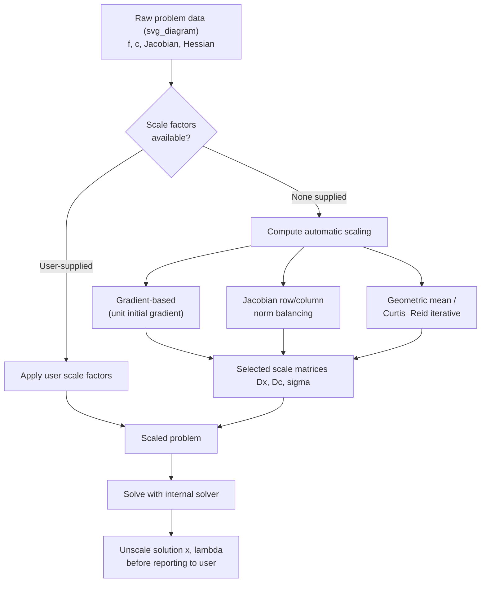
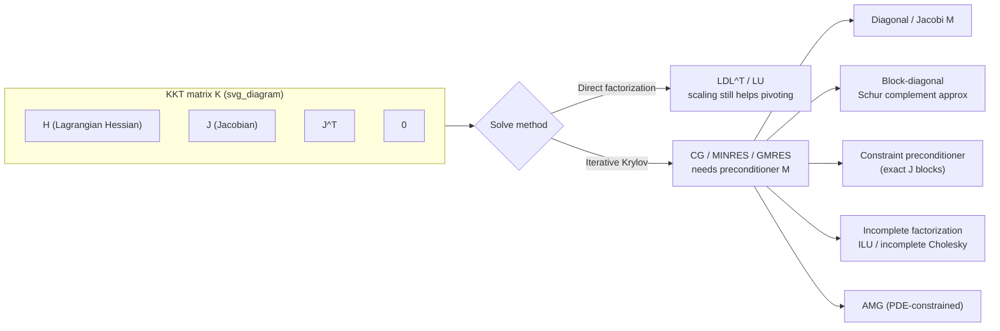

## Scaling and Preconditioning Constrained Problems

### Overview

Scaling and preconditioning address a practical failure mode in constrained optimization: even when a problem is mathematically well-posed, poor numerical conditioning of its variables, constraints, or derived linear systems can cause solvers to converge slowly, stall, or fail outright. Scaling rewrites the problem in transformed units so that variables, constraints, and gradients have comparable magnitudes. Preconditioning transforms the linear algebra inside the solver (typically the KKT system or a reduced Newton system) so that iterative methods converge faster. These are distinct but related interventions, and constrained solvers in practice depend on both.

### Why Constrained Problems Are Especially Sensitive

Unconstrained optimization already suffers when a Hessian is ill-conditioned — gradient descent zigzags, and even Newton-type methods lose accuracy in finite precision. Constrained problems compound this because:

- Variables and constraints often come in **different physical units** (e.g., a flow rate in $\text{m}^3/\text{s}$ next to a pressure in $\text{Pa}$), so their natural numerical scales differ by orders of magnitude.
- The **KKT matrix** combines the Hessian of the Lagrangian with the constraint Jacobian, so bad scaling in either block corrupts the whole system.
- **Active-set and interior-point methods** introduce additional structure (slack variables, barrier terms, multiplier estimates) whose scales interact multiplicatively with the original problem's scale, often worsening conditioning further as iterates approach a boundary.
- Multiplier magnitudes at a solution can be very large or very small depending on constraint scaling, since the Lagrangian $L(x,\lambda) = f(x) + \lambda^T c(x)$ ties $\lambda$'s scale directly to how $c(x)$ is scaled.

**Key Points**
- Ill-conditioning in constrained problems arises from at least three independent sources: variable scale, constraint scale, and the coupling between them in the KKT system.
- Poor scaling is a leading practical cause of solver failure reports (spurious infeasibility, stalled line search, "iteration limit exceeded") even when the underlying model is correct.
- Scaling should ideally be handled at model-formulation time; algorithmic preconditioning is a complementary, not a replacement, remedy.

### Scaling: Definitions and Mechanics

Scaling applies diagonal (or more general invertible) transformations to variables and/or constraints before or during solution.

**Variable scaling.** Replace $x$ with $x = D_x \hat{x}$ for a diagonal matrix $D_x$ with positive entries, so that $\hat{x}$ has more uniform magnitude (ideally $O(1)$). The objective and constraints are re-expressed in terms of $\hat{x}$:

$$\hat{f}(\hat{x}) = f(D_x \hat{x}), \qquad \hat{c}(\hat{x}) = c(D_x \hat{x})$$

**Constraint scaling.** Replace $c(x)$ with $D_c\, c(x)$ for diagonal $D_c$, adjusting the row-wise magnitude of the constraint residuals and Jacobian rows. This is equivalent to rescaling the corresponding Lagrange multipliers by $D_c^{-1}$.

**Objective scaling.** Multiply $f(x)$ by a scalar $\sigma$ to bring the objective's gradient magnitude in line with the constraint Jacobian's magnitude — important because many algorithms compare objective-gradient and constraint-gradient terms directly (e.g., in merit functions or Lagrangian gradients).

Combined, a scaled problem looks like:

$$\min_{\hat{x}} \ \sigma f(D_x \hat{x}) \quad \text{s.t.} \quad D_c\, c(D_x \hat{x}) = 0$$

The chain rule propagates these transformations to derivatives: $\nabla \hat{f} = \sigma D_x \nabla f$, and the Jacobian $J_{\hat{c}} = D_c J_c D_x$. Solvers that scale internally apply these transformations to the linear algebra without necessarily changing how the user specifies the model.

### Sources of Scaling Information

- **User-supplied scale factors.** Many solvers (e.g., IPOPT's `nlp_scaling_method`, CONOPT, SNOPT's scale option) accept explicit per-variable and per-constraint scale factors, or a scale factor derived from the user's problem knowledge (typical variable magnitude, expected constraint range).
- **Gradient-based automatic scaling.** Compute scale factors from the magnitude of gradient entries at the initial point, e.g., $d_i = 1 / \max(1, |\nabla f_i(x_0)|)$, so that all partial derivatives start near unit magnitude.
- **Jacobian-norm scaling.** Scale each constraint row by the inverse of its Jacobian row norm, and each variable column by the inverse of its column norm — a matrix-balancing approach closely related to the Sinkhorn–Knopp method for making a matrix's row and column norms comparable.
- **Geometric mean scaling.** For each row/column, use the geometric mean of the largest and smallest nonzero coefficient magnitudes as the scale factor — a heuristic long used in linear-programming presolve (e.g., in simplex-based LP solvers) because it is less sensitive to outlier coefficients than a simple max-based scheme.
- **Iterative (Curtis–Reid) scaling.** Solve a least-squares problem that jointly picks row and column scale factors to minimize the spread of the log-magnitudes of matrix entries — more expensive but more robust than single-pass heuristics, and standard in serious LP/QP presolve routines.

### Automatic Scaling Pipeline

### Preconditioning: Definitions and Mechanics

Preconditioning targets the **linear systems solved inside the optimization algorithm**, not the problem formulation directly. In Newton-type constrained methods, each iteration solves a KKT system of the form:

$$\begin{bmatrix} H & J^T \\ J & 0 \end{bmatrix} \begin{bmatrix} \Delta x \\ \Delta \lambda \end{bmatrix} = -\begin{bmatrix} \nabla f + J^T \lambda \\ c(x) \end{bmatrix}$$

where $H$ is the (possibly approximate) Hessian of the Lagrangian and $J$ is the constraint Jacobian. When this system is solved with a **direct factorization** (LU, LDL$^T$), preconditioning in the classical sense is less critical — the factorization handles ill-conditioning up to the limits of floating-point precision, though scaling still matters for numerical stability of pivoting. When the system is solved with an **iterative Krylov method** (CG, MINRES, GMRES) — common in large-scale problems where factorization is too expensive — preconditioning is essential for the iterative method to converge in a reasonable number of steps.

A preconditioner $M \approx K$ (where $K$ is the KKT matrix) is applied so that the iterative method solves $M^{-1}Kz = M^{-1}b$ instead of $Kz = b$, with $M^{-1}K$ having a more favorable eigenvalue distribution than $K$ alone.

**Key Points**
- Scaling is a problem-level transformation applied once (or once per iteration in adaptive schemes); preconditioning is a linear-algebra-level transformation applied inside each Newton/KKT solve.
- Direct solvers reduce, but do not eliminate, the need for good scaling — extreme conditioning can still cause loss of accuracy through cancellation.
- Iterative solvers depend on preconditioning far more heavily than direct solvers depend on scaling, because Krylov convergence rate is governed by the conditioning/eigenvalue clustering of $M^{-1}K$.

### Common Preconditioners for Constrained KKT Systems

- **Diagonal (Jacobi) preconditioner.** $M = \text{diag}(K)$. Cheapest option; effective when the KKT matrix is diagonally dominant-ish, which is rarely true near constraint boundaries but can help in early iterations.
- **Block-diagonal preconditioner.** Precondition the $(1,1)$ block ($H$) and $(2,2)$ block separately, often using $M = \begin{bmatrix} H & 0 \\ 0 & JH^{-1}J^T \end{bmatrix}$ or an approximation of the Schur complement $JH^{-1}J^T$. This exploits the saddle-point structure directly.
- **Constraint preconditioner.** $M = \begin{bmatrix} G & J^T \\ J & 0 \end{bmatrix}$ where $G$ approximates $H$ (e.g., $G = I$ or a diagonal approximation). This class preserves the exact $(2,1)$ and $(1,2)$ blocks, which is known to give favorable eigenvalue clustering for MINRES-type solvers on saddle-point systems.
- **Incomplete factorization preconditioners (ILU, incomplete Cholesky).** Compute an approximate sparse factorization of $K$ (or the Schur complement) and use it as $M$. Effective for large sparse KKT systems but sensitive to fill-in parameters and can fail on strongly indefinite systems without careful pivoting.
- **Limited-memory quasi-Newton preconditioners.** In methods already maintaining an L-BFGS approximation to $H$, reuse that low-rank approximation as part of the preconditioner for the reduced system, avoiding a separate preconditioning cost.
- **Algebraic multigrid (AMG).** For KKT systems arising from discretized PDE-constrained optimization, AMG preconditioners exploit the underlying grid structure and often outperform generic sparse preconditioners by an order of magnitude in iteration count.

[Inference] The relative effectiveness ranking among constraint preconditioners, block-diagonal preconditioners, and incomplete factorizations is problem-dependent; general claims about which is "best" without reference to a specific problem class and solver should be treated as heuristic guidance rather than a universal ordering.

### KKT Preconditioning Structure

### Interior-Point-Specific Scaling Issues

Interior-point methods introduce an additional, algorithm-induced conditioning problem independent of the original model's scaling. As iterates approach the boundary of the feasible region, slack variables $s_i \to 0$ for active inequality constraints, and the barrier/complementarity terms produce entries like $s_i^{-1}$ or $\mu / s_i^2$ on the diagonal of the KKT system. This causes the KKT matrix's condition number to grow **without bound** as the algorithm converges — a structural feature of the barrier approach, not a symptom of bad problem formulation.

Solvers handle this in characteristic ways:

- **Exploiting known structure.** Since the ill-conditioning is concentrated in specific diagonal blocks (the slack/multiplier terms), specialized factorization routines (e.g., in IPOPT's use of MA27/MA57, or in the LDL$^T$-based approaches of interior-point codes) are built to remain numerically stable despite this structured ill-conditioning, rather than relying on generic dense linear algebra.
- **Regularization.** Adding small perturbations to the diagonal of $H$ and/or the $(2,2)$ block of the KKT system (dynamic or static regularization) to prevent the factorization from encountering an exactly singular or numerically indefinite pivot, at the cost of a controlled inexactness in the Newton step.
- **Distinguishing this conditioning from formulation-scaling issues** matters practically: rescaling variables will not fix interior-point conditioning caused by $s \to 0$, since that ill-conditioning is inherent to the barrier method's approach to the boundary.

### Practical Workflow for Diagnosing Scaling Problems

- **Symptom: slow or stalled convergence, "restoration phase" failures (IPOPT), or repeated small steps.** Check the range of variable magnitudes and constraint function values at a representative point; large discrepancies ($>10^4$–$10^6$ ratio between largest and smallest) are a strong signal.
- **Symptom: spurious infeasibility reports or tight tolerances failing.** Check whether constraint tolerances (typically absolute) are being compared against constraint residuals in wildly different units — an absolute tolerance appropriate for a constraint measured in kilometers is far too loose for one measured in millimeters, and vice versa.
- **Diagnostic tool: scaling reports.** Most professional-grade solvers (IPOPT, KNITRO, SNOPT, Gurobi, CPLEX) emit scaling diagnostics — e.g., IPOPT's `nlp_scaling_method` output reports maximum gradient/Jacobian entries before and after scaling; Gurobi and CPLEX report matrix coefficient ranges in presolve logs.
- **Remedy priority order:** (1) reformulate the model in more natural units if possible (best long-term fix), (2) apply user-supplied or automatic scale factors, (3) rely on solver's internal automatic scaling as a fallback, (4) adjust preconditioner choice if the bottleneck is confirmed to be the iterative linear solve rather than the outer nonlinear iteration.

**Example**

Consider a chemical process optimization with:
- Flow rate variables $x_1 \in [0, 500]$ (kg/hr)
- A trace-impurity concentration variable $x_2 \in [0, 0.0001]$ (mole fraction)
- An energy balance constraint with coefficients on the order of $10^6$ (J/hr)

Without scaling, the Hessian and Jacobian mix entries differing by 10 orders of magnitude. A practical fix:
1. Rescale $x_2$ to parts-per-million units, moving its natural range to $[0, 100]$.
2. Rescale the energy balance constraint by dividing through by $10^6$, so its residual is $O(1)$ near a typical solution.
3. Leave $x_1$ unscaled since it is already $O(10^2)$–$O(10^3)$, a range most solvers tolerate well.
4. Re-run automatic Jacobian-norm scaling as a secondary correction for any residual imbalance the manual rescaling missed.

This combination typically reduces the KKT condition number by several orders of magnitude and converts a stalling solve into one converging in a normal number of iterations. [Inference] The specific magnitude of improvement depends on the solver, problem structure, and starting point, and should be verified empirically rather than assumed from this example alone.

### Interaction Between Scaling and Algorithm Choice

- **Active-set methods** are comparatively more sensitive to constraint scaling because working-set determination often relies on comparing constraint violations against a fixed tolerance across all constraints simultaneously.
- **Interior-point methods** are less sensitive to *initial* constraint scaling (since the barrier reformulation already reshapes the geometry) but highly sensitive to the *structural* slack-variable conditioning discussed above, which scaling alone cannot fix.
- **Augmented Lagrangian methods** introduce a penalty parameter $\rho$ whose effective scale interacts with constraint scaling — poorly scaled constraints require constraint-specific penalty parameters (rather than a single scalar $\rho$) to avoid over- or under-penalizing different constraints.
- **Sequential Quadratic Programming (SQP)** solves a QP subproblem each iteration whose Hessian approximation (BFGS, SR1) can itself become poorly scaled if the underlying NLP is poorly scaled, compounding the issue at the subproblem level.

### Common Pitfalls

- **Scaling only the objective, not the constraints (or vice versa).** This shifts imbalance rather than removing it, since the KKT system couples both.
- **Over-aggressive automatic scaling.** Applying automatic scaling on top of already-well-scaled user models can occasionally *worsen* conditioning if the automatic heuristic reacts to noise in gradient estimates at a poor starting point; most solvers allow disabling automatic scaling when the user has already scaled the model carefully.
- **Ignoring dynamic range within a single constraint across the feasible region.** A constraint that is well-scaled near the initial point may become poorly scaled near the solution, particularly for highly nonlinear constraints — static one-time scaling cannot fully address this, which is part of the motivation for iteration-dependent regularization in interior-point methods.
- **Confusing preconditioning with scaling.** Applying a diagonal preconditioner to an iterative solver does not substitute for fixing badly scaled variables in the model; it can mask the symptom in the linear algebra while the nonlinear algorithm (line search, trust region) still struggles with the poorly scaled steps.
- **Forgetting to unscale results.** When scaling is applied manually, solution values, Lagrange multipliers, and sensitivity/dual information must be transformed back to original units before interpretation — multiplier scaling in particular follows $\lambda_{\text{original}} = D_c^{-1} \lambda_{\text{scaled}}$ and is easy to overlook.

### Software-Specific Notes

- **IPOPT.** `nlp_scaling_method` supports `gradient-based` (default) and `none`; user-defined scaling is supported via the `get_scaling_parameters` callback in the NLP interface.
- **KNITRO.** Offers automatic scaling with options to control aggressiveness, plus explicit user-supplied scale vectors.
- **SNOPT.** Uses an internal scaling procedure based on iterative row/column balancing, with user override options.
- **Gurobi / CPLEX (for QP/LP-constrained subproblems).** Presolve routines report the constraint matrix's coefficient range and warn when it exceeds recommended bounds (commonly flagged around a ratio of $10^9$ or more between largest and smallest nonzero coefficients).

[Unverified] Exact default thresholds and warning messages vary by solver version; consult the specific solver's current documentation rather than relying on remembered defaults, since these are tunable parameters that vendors periodically adjust between releases.

### Related Topics

- Regularization strategies in interior-point KKT systems
- Iterative linear solvers (CG, MINRES, GMRES) for saddle-point systems
- Sensitivity analysis and Lagrange multiplier interpretation under rescaling
- Trust-region and line-search interactions with poorly scaled steps
- Presolve techniques in LP/QP solvers (bound tightening, matrix balancing)
- Algebraic multigrid preconditioners for PDE-constrained optimization
- Warm-starting constrained solvers across scaled reformulations