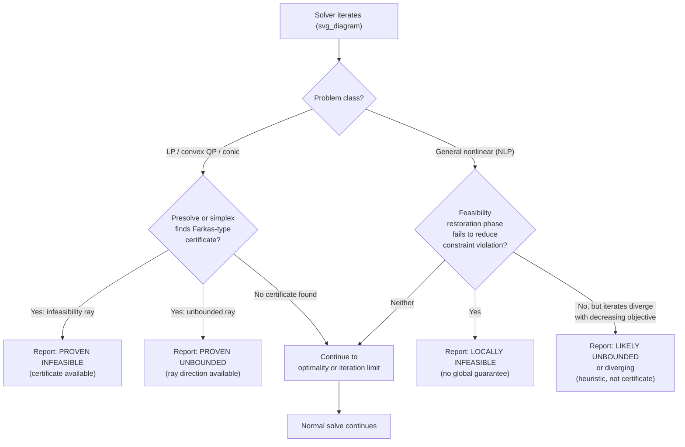
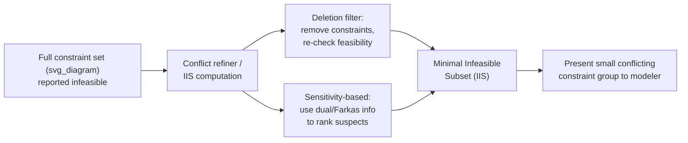

## Handling Infeasible and Unbounded Problems Numerically

### Overview

Infeasibility and unboundedness are two distinct failure modes a solver must detect, distinguish, and report reliably. Infeasibility means no point satisfies all constraints; unboundedness means the objective can be improved without limit within the feasible region. Numerically, both are harder to certify than to suspect — a solver rarely "knows" a problem is infeasible or unbounded from a single iterate, and must instead accumulate evidence through certificates, ray detection, or controlled divergence of internal quantities. Robust handling requires distinguishing true infeasibility/unboundedness from numerical artifacts caused by poor scaling, tight tolerances, or an unlucky starting point.

### Key Points

- Infeasibility and unboundedness are properties of the *problem*, not the *algorithm*, but detecting them reliably is an algorithmic and numerical challenge.
- Most solvers cannot definitively prove infeasibility for general nonlinear problems — they instead report *local* infeasibility (no feasible point found near where the algorithm searched) unless the problem has convex structure supporting a rigorous certificate.
- Unboundedness detection typically relies on watching for a direction of unbounded improvement (a ray) rather than watching the objective value grow without bound, since the latter can also result from divergence due to a bug or bad scaling.
- False positives (reporting infeasible/unbounded when the problem is not) and false negatives (failing to detect a genuine infeasibility/unboundedness) both have real costs in practice, and solver tolerance settings trade off between them.

### Feasibility Certificates in Linear and Convex Programming

For linear programs, infeasibility and unboundedness have clean, verifiable certificates via LP duality.

**Farkas' Lemma (infeasibility certificate).** For the system $Ax \le b$, exactly one of the following holds:
1. There exists $x$ with $Ax \le b$.
2. There exists $y \ge 0$ with $A^T y = 0$ and $b^T y < 0$.

If a solver's presolve or simplex phase produces a vector $y$ satisfying condition 2, this is a rigorous, checkable proof of infeasibility — not a heuristic judgment. Modern LP solvers (Gurobi, CPLEX, HiGHS) report this as an "infeasibility ray" or "Farkas certificate" and can output the certifying vector on request.

**Unbounded ray certificate.** For $\min c^Tx$ s.t. $Ax \le b, x \ge 0$, if there exists a direction $d \ge 0$ with $Ad \le 0$ and $c^Td < 0$, then moving from any feasible point along $d$ stays feasible while decreasing the objective without bound. Solvers detect this during simplex (a pivot step that would increase a variable indefinitely without hitting a blocking constraint) or via a ray returned by an interior-point method's iterates diverging in a consistent direction.

For **convex QPs and conic programs**, analogous certificates exist via conic duality, though they can be less numerically crisp for degenerate or poorly scaled instances.

**[Fact vs. Inference note]** The existence of these certificates for LPs is a mathematical fact (Farkas' Lemma is a proven theorem); whether a specific solver run *successfully computes and reports* a clean certificate on a given numerically difficult instance is implementation-dependent and can fail near degeneracy.

### Infeasibility/Unboundedness Detection Flow

### Numerical Infeasibility Detection in Nonlinear Programming

General NLP solvers cannot rely on duality certificates the way LP solvers can, because nonconvexity breaks the strong-duality guarantees that make Farkas-type reasoning exact. Instead, they use a **feasibility restoration** approach:

- When the main algorithm (e.g., an SQP or interior-point step) cannot make progress and constraint violation is not decreasing, the solver switches to a subproblem that **minimizes constraint violation directly**, ignoring the objective — commonly formulated as minimizing $\|c(x)\|$ or a similar measure, possibly regularized to stay near the current iterate.
- If this restoration phase itself converges to a **local minimum of the constraint violation measure that is strictly positive**, this is treated as strong evidence of (at least local) infeasibility — the algorithm has found a point that is a local minimizer of "how infeasible can I be," and it cannot get to zero.
- This is fundamentally a **local** result: it certifies that no feasible point exists *near the region explored*, not that the feasible set is empty globally. A nonconvex problem can be locally infeasible from one starting point and feasible from another.

**IPOPT's approach**, as a representative example: its restoration phase minimizes a combination of constraint violation and proximity to the original iterate, and reports "Restoration Phase Failed" when this sub-solve itself cannot find a point with sufficiently small constraint violation — signaling likely infeasibility of the original NLP, though IPOPT documentation is explicit that this is not a mathematical proof for general nonconvex problems.

### Distinguishing True Infeasibility from Numerical Artifacts

Before accepting an infeasibility report at face value, standard diagnostic practice includes:

- **Check constraint tolerance settings.** A constraint reported as "violated by $10^{-6}$" against a tolerance of $10^{-8}$ may be a scaling issue (see prior scaling discussion), not true infeasibility — tightening scaling or loosening tolerance appropriately can resolve it.
- **Re-solve from multiple starting points.** Since NLP infeasibility detection is local, a different starting point can behave very differently on a nonconvex feasible region with disconnected components or narrow feasible "corridors."
- **Isolate a minimal infeasible subset (IIS).** For LPs/MIPs, most commercial solvers (Gurobi's `computeIIS`, CPLEX's conflict refiner) can identify a minimal subset of constraints that is itself infeasible, which is far more diagnostically useful than "the model is infeasible" — it points directly at the conflicting constraints.
- **Relax constraints incrementally.** Introduce slack variables with a penalty on a subset of suspected constraints and re-solve; constraints that pick up large slack values in the relaxed solution are strong candidates for the source of infeasibility.
- **Check for unintentional bound conflicts.** A common real-world source of "infeasible" reports is a variable bound (e.g., $x \ge 0$ from a default) conflicting with a derived constraint the modeler didn't realize implied $x < 0$ — often the result of a sign error or unit mismatch rather than a genuine model conflict.

### Minimal Infeasible Subset Isolation

### Numerical Unboundedness Detection

Unboundedness detection faces a related but distinct challenge: distinguishing "the objective is genuinely unbounded below on the feasible region" from "the algorithm is diverging due to a bug, bad scaling, or an unbounded *iterate sequence* that isn't actually following a feasible unbounded ray."

- **Ray-based detection (LP/QP).** As discussed under certificates, the cleanest detection is algorithmic: during simplex, a pivot rule that would allow a variable to increase without ever hitting a blocking ratio test constraint is itself the proof of unboundedness — no separate check is needed beyond the pivot logic.
- **Trust-region and step-size divergence (NLP).** In trust-region methods, if the trust region radius keeps *growing* because every step is highly successful (large predicted-vs-actual improvement ratio) over many consecutive iterations without ever encountering an active constraint, this is a heuristic signal of possible unboundedness, though most implementations cap the trust region radius and treat sustained growth past a threshold as suspicious rather than definitive.
- **Barrier/penalty parameter behavior.** In interior-point and augmented Lagrangian methods, if the objective keeps decreasing while the penalty or barrier parameter is not being driven toward feasibility restoration, this can indicate the algorithm has found (or is following) a direction that improves the objective without needing to approach any constraint boundary — consistent with unboundedness.
- **Iteration and function-value caps.** In practice, most solvers combine heuristic detection with hard caps: if the objective value exceeds a large threshold (e.g., $10^{20}$) or the iteration count exceeds a limit while the objective continues to decrease monotonically, the solver reports "problem appears unbounded" as a *diagnosis*, distinct from a proven certificate.

[Inference] The specific numerical thresholds used for these heuristic caps (objective magnitude, iteration counts, trust-region growth factors) are solver-specific implementation choices rather than universal constants, and are typically documented as tunable options rather than fixed algorithmic requirements.

### Common Numerical Pitfalls

- **Confusing "solver failed to converge" with "problem is infeasible/unbounded."** An iteration-limit termination is not the same diagnosis as a certified infeasibility/unboundedness report; conflating the two in downstream reporting misleads users about what the solver actually established.
- **Scaling-induced false infeasibility.** As discussed in the scaling context, absolute constraint tolerances applied to badly scaled constraints can make a genuinely feasible point appear to violate a constraint by more than the tolerance allows.
- **Numerically unbounded but practically meaningless.** A model missing an upper bound on a variable that should realistically be bounded (e.g., forgetting to cap a production quantity) will report unboundedness correctly, but the "fix" is a modeling correction, not a numerical one — an easy trap is to treat this as a solver bug.
- **Big-M formulations masking true unboundedness or infeasibility.** Overly large "Big-M" constants used to encode logical/disjunctive constraints in MIP formulations can create severe numerical ill-conditioning that produces spurious infeasibility or near-unboundedness reports unrelated to the true model structure — a well-known practical issue in MIP modeling.
- **Presolve reductions hiding the true cause.** Aggressive presolve in commercial MIP/LP solvers can transform the problem substantially before an infeasibility is detected, so the "conflicting constraints" reported may correspond to presolved, not original, constraint indices unless the solver maps them back — most modern solvers do provide this mapping, but it is worth confirming.
- **Degenerate feasible regions near numerical infeasibility.** A feasible region that is technically nonempty but has zero (or near-zero) volume/measure — e.g., a single point or a lower-dimensional manifold in a higher-dimensional space — can behave numerically almost indistinguishably from infeasible, since any floating-point perturbation pushes iterates outside it.

### Example

Consider an LP with constraints:

$$x_1 + x_2 \le 10, \quad x_1 \ge 8, \quad x_2 \ge 5, \quad x_1, x_2 \ge 0$$

Here $x_1 \ge 8$ and $x_2 \ge 5$ force $x_1 + x_2 \ge 13$, contradicting $x_1 + x_2 \le 10$. A solver's presolve phase would typically detect this directly via bound propagation (summing the lower bounds and comparing to the upper bound of the linking constraint) without needing a full simplex run, and would report infeasibility along with the three implicated constraints as the minimal infeasible subset. This is a case where the conflict is small and presolve-detectable; larger models often require the full IIS/conflict-refiner machinery described above because the conflict may span dozens of constraints with no single obviously contradictory pair.

**Example (unbounded case).** Consider $\min -x_1$ s.t. $x_1 - x_2 \le 5$, $x_1, x_2 \ge 0$, with no upper bound on $x_1$. Increasing $x_1$ and $x_2$ together along the direction $(1,1)$ keeps $x_1 - x_2 \le 5$ satisfied indefinitely while $-x_1 \to -\infty$. Simplex detects this as a ray during the ratio test: attempting to pivot $x_1$ into the basis, no constraint ever becomes binding to limit its increase, and the solver returns the direction $(1,1)$ as the certifying unbounded ray.

### Solver-Reported Status Codes (Representative)

- **Gurobi:** `INFEASIBLE`, `UNBOUNDED`, `INF_OR_UNBD` (ambiguous status requiring a follow-up solve with a bounding objective to disambiguate, since some presolve reductions cannot distinguish the two without further work), `SUBOPTIMAL`.
- **CPLEX:** Similar infeasible/unbounded/`INForUNBD` status structure, with a conflict refiner available for infeasible LPs/MIPs.
- **IPOPT:** `Infeasible_Problem_Detected` (from restoration phase failure), `Diverging_Iterates` (heuristic unboundedness-like signal), distinct from `Maximum_Iterations_Exceeded`.
- **HiGHS:** Reports LP infeasibility/unboundedness with duality-based certificates consistent with the open-source solver's simplex and interior-point implementations.

[Unverified] Exact status code names, the specific conditions triggering `INF_OR_UNBD`-type ambiguous statuses, and default behaviors for disambiguation vary across solver versions; consult current solver documentation for the precise semantics in a given release.

### Practical Recommendations

- Treat LP/convex-QP infeasibility and unboundedness reports as reliable when a certificate (Farkas ray, unbounded ray) is available and returned by the solver; treat NLP reports as strong heuristic evidence requiring corroboration (multiple starts, restoration-phase diagnostics) rather than mathematical proof.
- Always check scaling and tolerances before concluding a genuine modeling infeasibility exists, especially when the reported violation is small relative to the constraint's natural magnitude.
- Use IIS/conflict-refiner tools proactively during model development rather than only after an unexpected infeasibility report — running them on a known-good model occasionally can reveal fragile constraint sets before they cause production failures.
- For unboundedness, first check for missing or incorrectly signed bounds — this is disproportionately the actual root cause relative to genuinely unbounded intended models.

### Related Topics

- Farkas' Lemma and LP duality theory
- Presolve and bound-propagation techniques in MIP/LP solvers
- Big-M formulation pitfalls in mixed-integer programming
- Feasibility restoration phases in interior-point NLP solvers
- Sensitivity analysis using dual values and reduced costs
- Robust optimization approaches for handling model uncertainty that produces spurious infeasibility
- Warm-starting and multi-start strategies for nonconvex NLP feasibility detection