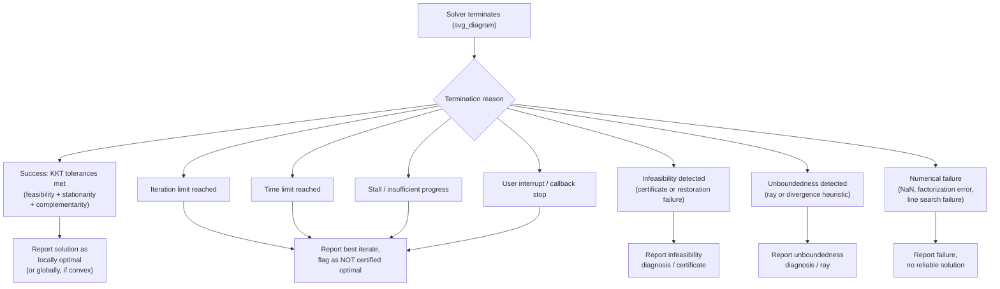

## Termination Criteria for Constrained Solvers

### Overview

A constrained optimization solver must decide, at every iteration, whether to stop — and if so, why. Termination criteria formalize this decision: they translate the abstract notion of "found a solution" into concrete, checkable numerical conditions involving optimality, feasibility, and progress. Because exact satisfaction of first-order conditions is generically unreachable in finite precision, all practical termination criteria are tolerance-based approximations to theoretical stopping conditions, and understanding the gap between the theory and the checkable test is essential to interpreting solver output correctly.

### Key Points

- Termination criteria for constrained problems must jointly assess **optimality** (is this a good point given the constraints) and **feasibility** (does this point satisfy the constraints), since a point can be arbitrarily close to satisfying one while badly failing the other.
- Most practical solvers terminate on a **composite test**: primal feasibility, dual feasibility (stationarity), and complementarity, each checked against a tolerance — collectively approximating the KKT conditions.
- Termination is not the same as convergence to a global optimum; for nonconvex problems, satisfying termination criteria certifies (approximate) local optimality at best.
- Multiple termination *paths* exist beyond "successful optimality": iteration limits, time limits, infeasibility detection, unboundedness detection, and stall detection all represent distinct termination reasons that a well-designed solver reports distinctly rather than conflating.

### The KKT Conditions as the Theoretical Target

For a problem $\min f(x)$ s.t. $g(x) \le 0$, $h(x) = 0$, the Karush-Kuhn-Tucker (KKT) conditions at a candidate solution $(x^*, \lambda^*, \mu^*)$ require:

$$\nabla f(x^*) + \sum_i \lambda_i^* \nabla g_i(x^*) + \sum_j \mu_j^* \nabla h_j(x^*) = 0 \quad \text{(stationarity)}$$

$$g(x^*) \le 0, \quad h(x^*) = 0 \quad \text{(primal feasibility)}$$

$$\lambda^* \ge 0 \quad \text{(dual feasibility)}$$

$$\lambda_i^* g_i(x^*) = 0 \ \ \forall i \quad \text{(complementary slackness)}$$

These conditions are necessary for local optimality under a constraint qualification (e.g., LICQ, MFCQ), and are also sufficient in the convex case. No finite-precision algorithm satisfies these exactly (the equalities would require infinite precision arithmetic to hit exactly), so every solver instead checks whether each condition is satisfied **within a tolerance**.

### Composite Termination Test Structure

```mermaid
flowchart TD
    A["Current iterate (svg_diagram)<br/>x_k, lambda_k, mu_k"] --> B{Primal feasibility:<br/>||g(x)+|| , ||h(x)|| <= tol_feas?}
    B -- No --> Z1["Continue iterating<br/>(not yet feasible)"]
    B -- Yes --> C{Dual feasibility /<br/>stationarity:<br/>||grad L|| <= tol_opt?}
    C -- No --> Z2["Continue iterating<br/>(not yet stationary)"]
    C -- Yes --> D{Complementarity:<br/>|lambda_i * g_i(x)| <= tol_comp<br/>for all i?}
    D -- No --> Z3["Continue iterating<br/>(complementarity not met)"]
    D -- Yes --> E{Multiplier sign:<br/>lambda >= -tol_sign?}
    E -- No --> Z4["Continue iterating<br/>(dual infeasible)"]
    E -- Yes --> F["TERMINATE:<br/>Optimal (approximate KKT point)"]
```

### Scaled vs. Unscaled Termination Tests

A recurring practical subtlety is whether tolerance checks are applied to **raw** or **scaled** quantities.

- **Unscaled absolute tolerance:** check $\|\nabla_x L(x,\lambda,\mu)\| \le \epsilon$ directly. This is simple but sensitive to problem scaling — as discussed in scaling/preconditioning practice, a poorly scaled problem can have a gradient norm that never drops below a fixed $\epsilon$ even at the true solution, or conversely, drops below $\epsilon$ prematurely.
- **Relative/scaled tolerance:** normalize by a reference quantity, e.g., $\|\nabla_x L\| \le \epsilon \cdot (1 + \|\nabla f(x_0)\|)$, or divide by the current objective/gradient scale. IPOPT, for instance, uses scaled versions of the KKT error by default, dividing by factors related to the magnitude of the multipliers and gradient to make the tolerance more scale-invariant.
- **Solvers commonly expose both.** Many professional solvers allow the user to choose between absolute and scaled/relative stopping tests, and some (e.g., IPOPT's `tol` combined with internal scaling) apply scaling internally by default specifically so that a single default tolerance behaves reasonably across a wide range of problem scales.

[Inference] Whether a specific solver's default tolerance behavior is "scaled" or "absolute" for a given release should be confirmed in that solver's documentation, since defaults and the precise normalization formulas differ across solvers and can change between versions.

### Feasibility Tolerance

Primal feasibility termination checks constraint satisfaction within a tolerance:

$$\max(0, g_i(x)) \le \epsilon_{\text{feas}} \quad \forall i, \qquad |h_j(x)| \le \epsilon_{\text{feas}} \quad \forall j$$

Typical default values are in the range $10^{-6}$ to $10^{-8}$ for well-scaled problems, though this is solver- and precision-dependent (double precision floating point has roughly 15-16 significant decimal digits, which caps how tight a tolerance can be meaningfully requested). A tolerance tighter than the numerical noise floor of the problem's evaluation (e.g., if $f$ or $c$ are computed via an iterative sub-solve, simulation, or finite-difference derivatives) cannot be reliably achieved and may cause the solver to iterate indefinitely without reaching the requested tolerance — a common cause of apparent non-convergence that is actually a tolerance set below the achievable noise floor.

### Optimality (Stationarity) Tolerance

Dual feasibility / stationarity termination checks that the gradient of the Lagrangian is small:

$$\|\nabla f(x) + J_g(x)^T \lambda + J_h(x)^T \mu\|_\infty \le \epsilon_{\text{opt}}$$

using the infinity norm in many implementations (worst single component) rather than a Euclidean norm, since the infinity norm gives a more direct per-component guarantee and is less sensitive to problem dimension. Some solvers instead normalize by problem dimension or by the norm of the multipliers to reduce dimension-dependence of a fixed absolute tolerance.

### Complementarity Tolerance

For inequality constraints, complementary slackness $\lambda_i g_i(x) = 0$ is checked as:

$$|\lambda_i \cdot g_i(x)| \le \epsilon_{\text{comp}} \quad \forall i$$

In interior-point methods, this is closely tied to the barrier parameter $\mu$: as $\mu \to 0$, complementarity is driven to zero by construction, and many interior-point solvers use $\mu$ itself (or a measure derived from it, like the duality gap $s^T\lambda / m$ for $m$ inequality constraints) as a proxy for how close complementarity is to being satisfied, terminating when this measure falls below a threshold.

### Termination Criteria by Algorithm Class

**Interior-point methods.** Terminate based on a combined KKT error measure (primal feasibility, dual feasibility, complementarity gap all folded into one scalar or checked as a vector of tolerances) alongside the barrier parameter $\mu$ shrinking below a threshold. IPOPT's default termination, for example, checks a scaled maximum of the primal infeasibility, dual infeasibility, and complementarity error against a single `tol` parameter.

**Active-set / SQP methods.** Terminate when the working set stabilizes (no further constraints are added or dropped) *and* the KKT conditions restricted to the active set are satisfied within tolerance — since the working-set identification itself is a discrete decision, termination here has both a continuous (KKT residual) and combinatorial (working-set stability) component.

**Augmented Lagrangian methods.** Terminate on a combination of primal feasibility (constraint violation below tolerance) and the inner unconstrained subproblem's stationarity, often with the penalty parameter $\rho$ growing or the multiplier estimates stabilizing between outer iterations as an additional signal of convergence.

**Trust-region methods (constrained variants).** Terminate on stationarity of a KKT-type measure combined with the trust-region radius; a shrinking trust-region radius combined with small predicted improvement is often used as a secondary stall-detection signal even before the primary KKT tolerance is met.

### Non-Optimal Termination Reasons

Beyond successful KKT-based termination, solvers report several distinct non-success termination reasons, and conflating these with "converged" is a common source of misinterpreted results:

- **Iteration limit reached.** The algorithm made progress but did not satisfy tolerances within the allotted iterations — the returned point may be close to optimal or arbitrarily far, and should not be treated as a certified solution without further checking (e.g., examining how close the KKT residuals actually got).
- **Time limit reached.** Similar to iteration limit but bounded by wall-clock or CPU time rather than iteration count; common in MIP solvers with a best-known feasible solution ("incumbent") reported alongside an optimality gap.
- **Infeasibility detected.** As covered previously, this is itself a form of termination distinct from optimal convergence.
- **Unboundedness detected.** Likewise a distinct termination path.
- **Stall / no progress.** Some solvers terminate early if successive iterates show negligible improvement in objective and/or feasibility over a window of iterations, even if formal tolerances are not met — this guards against wasting computation on a sequence that has effectively converged to numerical precision limits but technically hasn't crossed the tolerance threshold, or against a genuine algorithmic stagnation.
- **Numerical failure.** Factorization failure, NaN/Inf encountered in function or derivative evaluation, or line search failure to find an acceptable step — these are implementation-level failures distinct from any of the above mathematically meaningful termination reasons.
- **User interrupt / callback-triggered stop.** Many solvers support user-supplied callback functions that can request early termination based on application-specific logic (e.g., "stop if objective is good enough for my purposes," used in real-time or time-budgeted applications).

### Termination Reason Taxonomy



### Example

Suppose IPOPT is run with default tolerance `tol = 1e-8` on a poorly scaled NLP where constraint residuals naturally live around $O(10^{-3})$ due to unit choices (e.g., constraints measured in kilometers where a millimeter-level absolute tolerance is inappropriately tight relative to the problem's natural scale). The solver may report `Maximum_Iterations_Exceeded` or fail to converge, even though the true underlying solution accuracy achieved (in a relative sense) is entirely adequate for the application. Correct diagnosis here involves checking the *actual* KKT residual values reported in the solver log against the requested tolerance — if the primal/dual infeasibility is, say, $10^{-3}$ against a requested $10^{-8}$, and the problem's natural units explain that gap, the appropriate fix is to rescale the problem (per the scaling and preconditioning practices discussed earlier) rather than to interpret the run as a genuine optimization failure.

**Example (successful termination log, illustrative).**

```
Iter    objective    inf_pr    inf_du    ||d||    lg(mu)
  0     1.234e+02    3.1e+00   5.2e+01   -        -
  5     8.912e+01    2.4e-02   1.1e+00   3.2e-01  -1.2
 12     8.734e+01    1.8e-05   3.4e-03   4.1e-04  -4.8
 18     8.731e+01    9.7e-09   2.1e-06   6.3e-08  -8.0

EXIT: Optimal Solution Found.
  Primal infeasibility: 9.7e-09  (tol: 1e-8)  -> PASS
  Dual infeasibility:   2.1e-06  (tol: 1e-6)  -> PASS
  Complementarity:      1.4e-07  (tol: 1e-6)  -> PASS
```

This illustrates the composite nature of termination: all three error measures must simultaneously fall below their respective tolerances before the solver reports success.

### Practical Recommendations

- Always check the *reported termination reason*, not just whether the solver "finished" — a returned solution object with no error thrown can still correspond to an iteration-limit or stall termination rather than certified optimality.
- When tolerances seem unreasonably hard to satisfy, first suspect scaling before loosening the tolerance blindly; loosening tolerance treats the symptom, rescaling treats the cause.
- For applications requiring certified solutions (e.g., safety-critical engineering design), prefer solvers and settings that expose the actual achieved KKT residuals in the output, not just a boolean success/failure flag, so the achieved accuracy can be independently assessed against application requirements.
- When comparing solver performance across benchmark problems, ensure termination tolerances are set consistently (ideally to comparable *scaled* tolerances) — otherwise apparent differences in solver speed or robustness can simply reflect different effective stopping criteria.
- For nonconvex problems, remember that KKT-based termination certifies only local optimality; multi-start or global optimization techniques are needed if a global guarantee is required.

### Related Topics

- KKT conditions and constraint qualifications (LICQ, MFCQ)
- Scaling and preconditioning constrained problems (tolerance/scaling interaction)
- Feasibility restoration and infeasibility detection in NLP
- Duality gap and complementarity in interior-point methods
- Convergence rate analysis for constrained optimization algorithms
- Benchmarking methodology for constrained solvers
- Global optimization and multi-start strategies for nonconvex problems