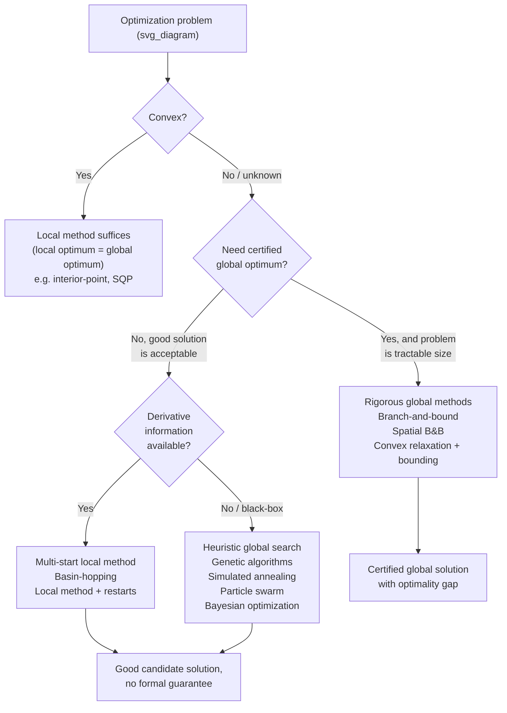
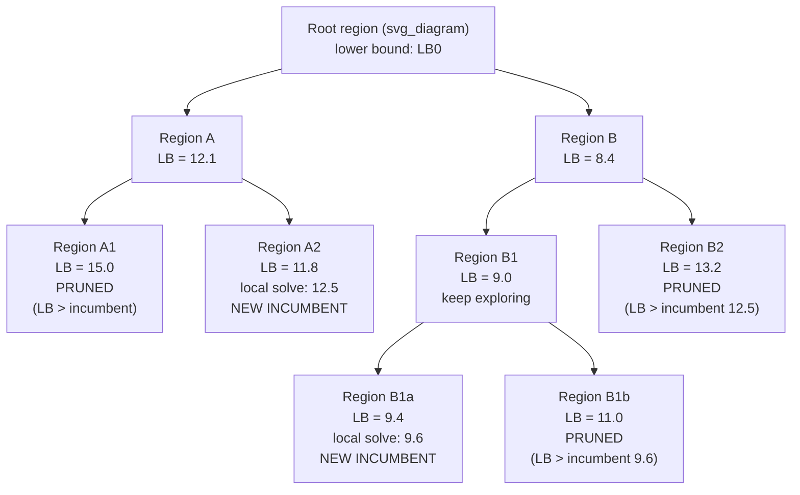

## Local Versus Global Search Strategies

### Overview

Local search strategies converge to a point satisfying local optimality conditions (typically KKT conditions) from a given starting point, with no guarantee — outside of convexity — that this point is the best solution over the entire feasible region. Global search strategies aim to find or certify the globally best solution, either through exhaustive/systematic exploration, probabilistic sampling, or mathematically rigorous bounding techniques. The choice between them is not merely a preference but a structural decision driven by problem convexity, dimensionality, and the cost of function evaluations, and most practical large-scale optimization workflows use local methods as a component within a broader global strategy rather than treating the two as mutually exclusive.

### Key Points

- **Local optimality is a necessary but not sufficient condition for global optimality** in nonconvex problems; a local method has no intrinsic mechanism for distinguishing a poor local optimum from the global one.
- **Convexity collapses the distinction:** for convex problems (convex objective, convex feasible region), any local optimum is also global, which is why local methods (Newton-type, interior-point, SQP) are the default and sufficient choice for convex optimization.
- **Global methods trade guarantees for cost.** Rigorous global optimization (branch-and-bound, spatial branch-and-bound) provides provable global optimality but scales poorly with dimension; heuristic global methods (multi-start, genetic algorithms, simulated annealing) provide no guarantee but scale to much larger problems.
- **The two are complementary in practice:** global heuristics are frequently used to generate promising starting points, and local methods are then used to rapidly polish each candidate to high-precision local optimality — combining global breadth with local convergence speed.

### Local Search: Characteristics

Local search methods — gradient descent, Newton's method, quasi-Newton (BFGS/L-BFGS), SQP, interior-point methods, active-set methods — share a common structure: starting from $x_0$, generate a sequence $x_k$ that converges to a point satisfying first-order (and ideally second-order) local optimality conditions, using only local information (gradients, Hessians, or approximations thereof) at each iterate.

**Strengths:**
- Fast convergence near a solution — Newton-type methods achieve quadratic convergence under standard smoothness assumptions, and even first-order methods achieve linear convergence on well-conditioned problems.
- Well-developed theory with precise convergence guarantees (rate, conditions for convergence) under standard assumptions (smoothness, constraint qualifications).
- Scale well to high-dimensional problems (thousands to millions of variables), particularly with sparse-aware or matrix-free linear algebra.
- Directly exploit problem structure (sparsity, convexity, separability) that global methods often cannot use as efficiently.

**Limitations:**
- No mechanism to escape a local optimum once converged, without external intervention (restart, perturbation).
- Convergence to a *specific* local optimum is generally sensitive to the starting point, meaning different starts can yield qualitatively different answers on nonconvex problems.
- Provides no information about the *quality* of the local optimum relative to the global one — a local method alone cannot report an optimality gap for nonconvex problems.

### Global Search: Characteristics

Global methods fall into two broad families with fundamentally different guarantees.

**Rigorous (deterministic) global optimization.** Methods such as branch-and-bound and spatial branch-and-bound systematically partition the search space, compute provable bounds on the objective within each partition (using convex relaxations, interval arithmetic, or other bounding techniques), and prune regions that provably cannot contain the global optimum. When the algorithm terminates, it returns a solution with a **certified optimality gap** (often driven to zero or below a specified tolerance).

**Heuristic (stochastic) global optimization.** Methods such as multi-start, simulated annealing, genetic/evolutionary algorithms, particle swarm optimization, and basin-hopping explore the search space using randomized or population-based strategies designed to escape local optima with some probability, without offering a mathematical guarantee of having found the global optimum. These methods trade certainty for the ability to handle much larger, less structured, or black-box (derivative-free) problems.

### Local vs. Global Method Landscape

### Rigorous Global Optimization: Branch-and-Bound Mechanics

Branch-and-bound for continuous global optimization (spatial branch-and-bound) operates by:

1. **Bounding.** Compute a valid lower bound (for minimization) on the objective over the current region, typically via a convex relaxation of the original nonconvex problem (e.g., replacing bilinear terms $xy$ with McCormick envelope relaxations, or replacing nonconvex univariate functions with piecewise-linear convex/concave under- and over-estimators).
2. **Branching.** If the bound is not tight enough to prune, split the current region into two or more sub-regions (e.g., bisecting the domain of one variable) and recurse.
3. **Pruning.** Discard any sub-region whose lower bound exceeds the best-known feasible solution's objective value (the incumbent) — since no point in that region can improve on the incumbent.
4. **Incumbent update.** Whenever a sub-region yields a locally optimal feasible point better than the current incumbent (often found by running a local solver within the sub-region), update the incumbent and its associated optimality gap.

The algorithm terminates when the gap between the best lower bound (over all remaining active regions) and the incumbent objective falls below a specified tolerance, providing a certified $\epsilon$-global optimality guarantee.

**[Fact vs. Inference note]** The correctness of branch-and-bound as a globally convergent algorithm (given valid bounding and exhaustive branching) is a proven mathematical property under stated conditions; the *practical runtime* required to reach a tight gap on a specific nonconvex instance is highly problem-dependent and can be exponential in the worst case, consistent with the NP-hardness of general nonconvex global optimization.

### Branch-and-Bound Search Tree

### Heuristic Global Optimization: Common Strategies

- **Multi-start.** Run a local solver from many different, typically randomized or space-filling (e.g., Latin hypercube, Sobol sequence) starting points, and take the best resulting local optimum. Simple to implement and easy to parallelize, but offers no coverage guarantee for high-dimensional spaces where the number of starts needed to adequately sample the space grows quickly.
- **Basin-hopping.** Alternates local optimization with random perturbation ("hop") of the current best point, accepting or rejecting the new basin's local optimum according to a criterion (often similar to simulated annealing's acceptance rule), effectively combining local refinement with a randomized global exploration step.
- **Simulated annealing.** Inspired by metallurgical annealing; accepts worsening moves with a probability that decreases over time (governed by a decreasing "temperature" parameter), allowing early-stage exploration and late-stage convergence-like refinement. Well-suited to combinatorial and discrete-continuous mixed problems, though convergence to the global optimum is only guaranteed under an idealized, often impractically slow, cooling schedule.
- **Genetic / evolutionary algorithms.** Maintain a population of candidate solutions, applying selection, crossover, and mutation operators inspired by biological evolution to iteratively improve the population. Naturally handle non-differentiable, discontinuous, or mixed-integer objectives, at the cost of typically requiring many more function evaluations than gradient-based local methods.
- **Particle swarm optimization.** Maintains a population ("swarm") of candidate points that move through the search space influenced by their own best-known position and the swarm's collective best-known position, balancing exploration and exploitation through velocity update rules.
- **Bayesian optimization.** Builds a probabilistic surrogate model (commonly a Gaussian process) of the objective function from observed evaluations, and uses an acquisition function (expected improvement, upper confidence bound) to select the next point to evaluate, explicitly balancing exploration of uncertain regions against exploitation of promising ones. Particularly well suited to expensive black-box objectives where each function evaluation is costly (e.g., requiring a physical experiment or expensive simulation), since it is designed to find good solutions in relatively few evaluations.

### Choosing Between Strategies: Practical Factors

- **Convexity (known or verifiable).** If the problem is provably convex, invest in confirming convexity and use a local method — global methods would waste computation solving an already-easy problem the hard way.
- **Problem size / dimensionality.** Rigorous global methods scale poorly with dimension due to the combinatorial growth of the branching tree; problems beyond roughly a few hundred variables (very rough, highly problem-dependent guideline) commonly become impractical for certified global optimization with current general-purpose methods, though special structure (sparsity, separability) can extend this substantially.
- **Cost of function/gradient evaluation.** Expensive evaluations (e.g., requiring a PDE solve, simulation, or physical experiment) favor sample-efficient methods like Bayesian optimization over methods requiring many evaluations (genetic algorithms, dense multi-start).
- **Availability of derivatives.** Gradient-based local methods and gradient-informed multi-start require derivative information (or reliable automatic differentiation / adjoint methods); black-box or non-differentiable objectives push toward derivative-free heuristic global methods.
- **Need for a certified gap vs. a "good enough" answer.** Safety-critical or contractually-bound design problems may require the certified optimality gap that only rigorous global methods provide; exploratory or time-constrained industrial applications often accept a heuristically-found good solution.
- **Problem structure exploitable by relaxation.** Problems with known nonconvex structure (bilinear terms, fixed-charge/complementarity constraints, polynomial nonlinearities) often have well-developed convex relaxation techniques (McCormick envelopes, piecewise-linear approximations, semidefinite relaxations) that make rigorous global methods far more tractable than for unstructured nonconvexity.

### Hybrid Strategies in Practice

Most production optimization workflows for genuinely nonconvex problems use hybrids rather than a pure local or pure global approach:

- **Multi-start + local polish.** A global heuristic (or simple randomized multi-start) generates diverse candidate regions; a fast local method (SQP, interior-point) is run from each to rapidly reach high-precision local optimality; the best result across all local solves is reported. This is by far the most common practical pattern for moderate-dimensional nonconvex NLPs.
- **Global relaxation bound + local refinement.** In branch-and-bound frameworks, local solvers are typically embedded *inside* the bounding/incumbent-generation steps — the "global" algorithm's rigor comes from the bounding logic, while local solvers do the heavy lifting of finding good feasible points within each region.
- **Surrogate-assisted global search.** Bayesian optimization or similar surrogate-based approaches identify promising regions cheaply using the surrogate model, then a local method refines the best candidate(s) using the true (expensive) objective and its derivatives if available.
- **Decomposition combined with global search.** For large structured problems (e.g., separable or block-structured), global search may be applied only to a small set of coupling/complicating variables, with local methods (or even exact solves) handling the remaining subproblems conditional on the coupling variables — reducing the effective dimensionality the global search must cover.

### Example

Consider a nonconvex NLP arising from process design with several bilinear terms (products of two decision variables), where the feasible region is known to have multiple disconnected local optima. A practical workflow:

1. Generate 50 starting points via Latin hypercube sampling over the variable bounds.
2. Run a fast local SQP solver from each starting point, discarding runs that terminate with an infeasibility or numerical failure status (per the termination-criteria discussion).
3. Collect the objective values of all successful local solves; suppose 41 succeed, yielding a spread of objective values with a clear best cluster around one value and several worse clusters.
4. Treat the best result as the practical solution, but — because the problem contains bilinear terms with known McCormick relaxation techniques — additionally run a spatial branch-and-bound global solver (e.g., BARON, Couenne, SCIP with global extensions) with a time limit, to obtain a certified lower bound.
5. If the branch-and-bound lower bound is close to the best multi-start result (small optimality gap), this provides strong practical confidence the multi-start solution is at or very near global; if there is a large unresolved gap, this signals either a difficult relaxation (loose bounds) or a potentially better solution not yet found by the local searches.

[Inference] Specific tool choices (BARON, Couenne, SCIP) and the appropriate number of multi-start points are illustrative and workload-dependent; selecting them for a real problem should be based on the specific nonconvex structure present, licensing/availability constraints, and empirical testing rather than this example alone.

### Common Pitfalls

- **Treating a local optimum as global without justification.** Reporting a single local-solver run's result as "the optimal solution" for a known-nonconvex problem overstates the guarantee actually obtained.
- **Assuming more multi-starts always helps proportionally.** Coverage of a high-dimensional space via random or space-filling multi-start degrades with dimensionality (curse of dimensionality), so simply increasing the start count is not a substitute for exploiting problem structure when dimension is large.
- **Ignoring available convexity structure.** Applying an expensive heuristic global method to a problem that is actually convex (or convex after a known reformulation) wastes computational effort that a local method would resolve directly and provably.
- **Misinterpreting heuristic "convergence" as a guarantee.** Simulated annealing, genetic algorithms, and similar methods "converging" (population stabilizing, temperature reaching a floor) indicates the *algorithm* has stopped improving, not that the *global* optimum has been certified reached.
- **Underestimating rigorous global optimization runtime.** Spatial branch-and-bound runtime can grow extremely quickly with problem size and looseness of relaxations; setting an unrealistic time budget for a certified solution on a large nonconvex problem often yields no useful gap improvement over the initial bound.

### Related Topics

- Convex relaxation techniques (McCormick envelopes, piecewise-linear approximation, semidefinite relaxation)
- Branch-and-bound for mixed-integer nonlinear programming (MINLP)
- Derivative-free and black-box optimization methods
- Bayesian optimization and Gaussian process surrogate modeling
- Multi-start strategies and space-filling design of experiments
- Decomposition methods for large-scale structured optimization
- Termination criteria for constrained solvers (KKT-based vs. gap-based stopping)