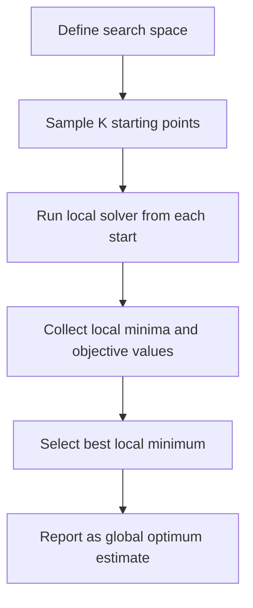

## Multi-Start Methods

### Overview

Multi-start methods are a class of global optimization strategies that address nonconvexity by running local optimization procedures from many different initial points and retaining the best result found. The underlying premise is simple: a local optimizer (gradient descent, Newton's method, BFGS, trust-region methods, etc.) converges to whichever local minimum lies within the basin of attraction of its starting point. In a nonconvex landscape with multiple local minima, a single run offers no guarantee of finding the global minimum. By sampling the starting points broadly across the search space and aggregating many local runs, multi-start methods convert a purely local optimizer into a heuristic global one.

Formally, given an objective $f: \mathbb{R}^n \to \mathbb{R}$ that may be nonconvex, and a local solver $\mathcal{L}$ that maps a starting point $x_0$ to a local minimizer $\mathcal{L}(x_0)$, a multi-start method generates a set of starting points $\{x_0^{(1)}, x_0^{(2)}, \ldots, x_0^{(K)}\}$, computes $\{\mathcal{L}(x_0^{(k)})\}_{k=1}^K$, and reports:

$$\hat{x}^* = \arg\min_{k \in \{1,\ldots,K\}} f\left(\mathcal{L}(x_0^{(k)})\right)$$

### Motivation

**Key Points**

- Local optimizers only certify local optimality; they have no mechanism to "see" other basins of attraction.
- The probability of locating the global minimum from a single random start depends on the relative volume (measure) of its basin of attraction compared to the full search space.
- As the number of starts $K$ increases, the probability that at least one start lands in the global optimum's basin of attraction increases, though not necessarily linearly — small basins remain hard to hit even with many starts.
- Multi-start is embarrassingly parallel: each local run is independent, so it scales naturally across cores or machines.

### Basic Algorithm

1. Define a sampling distribution over the feasible region (commonly uniform, but can be informed by problem structure).
2. Draw $K$ starting points from that distribution.
3. Run a local solver from each starting point until convergence (or a stopping criterion).
4. Record each local minimum and its objective value.
5. Return the best (lowest objective, for minimization) among all local minima found.

### Basins of Attraction

The concept of a basin of attraction is central to understanding why multi-start works and why it can fail. For a local solver $\mathcal{L}$, the basin of attraction of a local minimizer $x^*$ is:

$$B(x^*) = \{x_0 \in \mathbb{R}^n : \mathcal{L}(x_0) = x^*\}$$

The feasible region is partitioned (approximately, ignoring measure-zero boundary sets) into basins corresponding to each local minimum. A global minimum with a small basin relative to the total search volume is statistically unlikely to be discovered unless $K$ is very large, or unless sampling is biased toward promising regions.

<svg xmlns="http://www.w3.org/2000/svg" viewBox="0 0 640 380">
<text x="320" y="24" text-anchor="middle" font-size="16" font-weight="bold" fill="#222">Basins of Attraction (svg_diagram)</text>
<line x1="40" y1="320" x2="600" y2="320" stroke="#333" stroke-width="2" />
<path d="M 40 300 Q 100 100 160 300 Q 220 260 280 300 Q 320 60 380 300 Q 440 280 500 300 Q 540 150 600 300" stroke="#1f77b4" stroke-width="3" fill="none" />
<circle cx="160" cy="300" r="5" fill="#d62728" />
<circle cx="280" cy="300" r="5" fill="#d62728" />
<circle cx="380" cy="300" r="5" fill="#2ca02c" />
<circle cx="500" cy="300" r="5" fill="#d62728" />
<text x="160" y="335" text-anchor="middle" font-size="11" fill="#333">local min</text>
<text x="280" y="335" text-anchor="middle" font-size="11" fill="#333">local min</text>
<text x="380" y="335" text-anchor="middle" font-size="11" fill="#2ca02c" font-weight="bold">global min</text>
<text x="500" y="335" text-anchor="middle" font-size="11" fill="#333">local min</text>
<rect x="60" y="345" width="140" height="14" fill="#f4cccc" opacity="0.6" />
<rect x="200" y="345" width="140" height="14" fill="#cce5ff" opacity="0.6" />
<rect x="340" y="345" width="80" height="14" fill="#d9ead3" opacity="0.6" />
<rect x="420" y="345" width="160" height="14" fill="#f4cccc" opacity="0.6" />
<text x="130" y="356" text-anchor="middle" font-size="9" fill="#555" />
<text x="270" y="356" text-anchor="middle" font-size="9" fill="#555" />
<text x="380" y="356" text-anchor="middle" font-size="9" fill="#555" />
<text x="500" y="356" text-anchor="middle" font-size="9" fill="#555" />
<text x="320" y="375" text-anchor="middle" font-size="10" fill="#555">Colored bands along the x-axis denote basins of attraction; the narrow green band is harder to sample into.</text>
</svg>

### Sampling Strategies for Starting Points

**Uniform Random Sampling**

Points are drawn uniformly across the bounded feasible region. Simple, unbiased, but inefficient in high dimensions since volume grows exponentially with dimensionality (the curse of dimensionality), diluting the density of samples per unit volume.

**Quasi-Random / Low-Discrepancy Sequences**

Sequences such as Sobol', Halton, or Latin Hypercube Sampling (LHS) spread points more evenly than pure random sampling, reducing clustering and gaps. This generally improves coverage efficiency for a fixed budget $K$.

**Clustering-Based Sampling**

Techniques like Multi Level Single Linkage (MLSL) use clustering to avoid redundant local searches: if a new starting point is close (in some distance metric) to a point already known to lead toward a previously found local minimum, the local search is skipped, saving computation.

**Space-Filling Design**

For expensive objective evaluations, starting points may be chosen via space-filling designs (e.g., Latin Hypercube combined with maximin distance criteria) to maximize information gained per costly local search.

### Multi Level Single Linkage (MLSL)

MLSL is a widely cited refinement of naive multi-start. Its core idea:

1. Sample a batch of candidate points.
2. For each candidate, check whether any other sampled point lies within a critical distance $r_k$ (a threshold that shrinks as more points are sampled) and has a lower objective value.
3. If such a point exists, skip local optimization from the candidate (assume it would converge to the same basin).
4. Otherwise, run the local solver from the candidate.

The distance threshold is typically set using a formula derived from asymptotic clustering theory, of the form:

$$r_k = \frac{1}{\sqrt{\pi}} \left( \Gamma\left(1 + \frac{n}{2}\right) \, \text{vol}(S) \, \frac{\sigma \log(k)}{k} \right)^{1/n}$$

where $n$ is the dimension, $\text{vol}(S)$ is the volume of the search space, $k$ is the number of samples so far, and $\sigma$ is a tunable parameter. [Inference: exact constants and formulations vary across MLSL implementations and papers; treat this as representative rather than canonical.]

MLSL has a theoretical property that, under mild conditions, it identifies every local minimum with probability 1 as sampling continues indefinitely, while performing only a finite number of local searches almost surely — a notable efficiency guarantee compared to naive multi-start.

### Naive Multi-Start vs. Clustering-Based Multi-Start

| Aspect | Naive Multi-Start | Clustering-Based (e.g., MLSL) |
| --- | --- | --- |
| Redundant local searches | Common, especially with large $K$ | Reduced via distance/clustering filters |
| Computational cost | Scales linearly with $K$ | Sub-linear growth in local searches as sampling proceeds |
| Implementation complexity | Simple | Moderate — requires distance threshold tuning |
| Theoretical guarantees | Weak (heuristic coverage) | Stronger asymptotic convergence properties |
| Best suited for | Cheap objective evaluations, low dimensions | Expensive evaluations, moderate dimensions |

### Practical Considerations

**Number of Starts**

Choosing $K$ trades off computational cost against confidence in finding the global optimum. A common heuristic is to increase $K$ until the best-found objective value stabilizes across successive batches (a form of empirical convergence diagnostic), though this offers no formal guarantee. [Inference: stabilization heuristics are widely used in practice but are not a proof of global optimality.]

**Local Solver Choice**

The efficiency of multi-start depends heavily on the local solver's speed and robustness. Fast, robust local solvers (e.g., L-BFGS for smooth unconstrained problems, interior-point or SQP methods for constrained problems) make it feasible to afford larger $K$.

**Parallelization**

Because each local run from a distinct starting point is independent, multi-start parallelizes near-perfectly across CPU cores, GPUs, or distributed compute clusters, subject only to synchronization at the final aggregation step.

**Handling Constraints**

For constrained problems, starting points must be feasible or must be mapped into the feasible region (e.g., via projection) before local optimization begins, since many local solvers assume or require a feasible starting iterate.

**Diminishing Returns**

Empirically, the marginal benefit of each additional start decreases as $K$ grows, since already-discovered basins are re-visited with increasing frequency (a coupon-collector-like effect). This underlies why clustering methods like MLSL improve efficiency — they explicitly detect and skip such redundant re-visits.

### Worked Example

Consider minimizing a 1-D nonconvex function with multiple local minima:

$$f(x) = \sin(3x) + 0.5x^2, \quad x \in [-5, 5]$$

This function has several local minima and one global minimum near $x \approx -1.5$ (illustrative; exact location depends on numerical solving). A multi-start procedure would:

1. Sample, say, $K = 20$ starting points uniformly in $[-5, 5]$.
2. Run a local solver (e.g., gradient descent or Newton's method) from each.
3. Observe that different starting points converge to different local minima — for instance, starts near $x = 3$ might converge to a local minimum around $x \approx 2.8$, while starts near $x = -2$ converge toward the global minimum near $x \approx -1.5$.
4. Compare all 20 resulting objective values and select the lowest.

**Output**

With enough well-distributed starts, the global minimum near $x \approx -1.5$ is very likely to be identified, since its basin of attraction occupies a non-trivial fraction of $[-5, 5]$. Narrower basins elsewhere would require proportionally more starts to be reliably found.

### Strengths and Limitations

**Key Points**

- *Strength:* Conceptually simple and easy to implement on top of any existing local solver.
- *Strength:* Naturally parallel, making it attractive for modern multi-core and distributed environments.
- *Strength:* Requires no assumptions about convexity, smoothness beyond what the local solver itself needs, or problem structure.
- *Limitation:* No finite-sample guarantee of finding the global optimum; success is probabilistic and depends on basin geometry.
- *Limitation:* Inefficient in high dimensions, where the number of starts needed to adequately cover the space grows rapidly. [Inference: the severity of this effect is problem-dependent and does not follow a single universal rate across all objective classes.]
- *Limitation:* Expensive objective/gradient evaluations make naive multi-start costly; clustering-based variants (MLSL) mitigate but do not eliminate this.
- *Limitation:* Performance is sensitive to the sampling distribution's alignment with where good basins actually lie.

### Relation to Other Global Optimization Methods

Multi-start is often used as a baseline or as a building block within more sophisticated global methods:

- **Basin hopping** combines multi-start ideas with perturbation steps and an acceptance criterion (similar in spirit to simulated annealing) to move between basins more intelligently than pure random restart.
- **Simulated annealing** and **genetic algorithms** explore the search space using probabilistic acceptance or population-based recombination rather than discrete independent restarts, but can be hybridized with multi-start (e.g., using multi-start to generate a diverse initial population).
- **Bayesian optimization** can be viewed as a more sample-efficient alternative for expensive black-box objectives, using a surrogate model to guide where to sample next rather than sampling starting points independently.

### Conclusion

Multi-start methods provide a straightforform, robust, and highly parallelizable heuristic for tackling nonconvex global optimization problems by leveraging repeated local searches from diverse starting points. While they offer no formal optimality guarantees in finite time, refinements such as Multi Level Single Linkage substantially improve efficiency by avoiding redundant local searches and provide stronger asymptotic convergence properties. In practice, multi-start remains a widely used first-line strategy, particularly when a fast and reliable local solver is available and computational resources permit parallel execution.

**Related Topics**

- Basin hopping and perturbation-based global search
- Simulated annealing
- Genetic algorithms and evolutionary strategies
- Bayesian optimization for expensive black-box objectives
- Multi Level Single Linkage (MLSL) — theoretical convergence analysis
- Trust-region and line-search methods as local solvers within multi-start frameworks
- Latin Hypercube Sampling and space-filling designs
- Clustering algorithms for basin identification